# 📚 Sommaire du Cahier des Charges

## 📋 Vue d'ensemble du projet

Ce cahier des charges présente l'ensemble du processus de migration automatisée assistée par IA, organisé selon les phases logiques du projet.

## 🗂️ Structure des chapitres

### I. Introduction et fondamentaux
1. [🧭 Introduction à la migration PHP → NestJS + Remix](./01-introduction-migration.md) - La migration d'une application PHP vers une architecture moderne utilisant **NestJS** pour le backend et **Remix** pour le frontend nécessite une approche **méthodique et stratégique**.
1. [Introduction et Vision Globale](./01-introduction.md) - Voir le document pour plus d'informations.
1. [Matrice des interdépendances](./36-interdependances.md) - Voir le document pour plus d'informations.
1. [Synchronisation dynamique du cahier des charges](./36-synchronisation-dynamique.md) - Voir le document pour plus d'informations.
1. [37-command-center-remix](./37-command-center-remix.md) - Voir le document pour plus d'informations.

### II. Phase de préparation
1. [✅ 2. Vérification et validation de l'environnement de test](./10b-verification-env-test.md) - 🎯 Objectif : S'assurer que tous les outils critiques de migration sont opérationnels, interconnectés, et correctement configurés avant le lancement du pipeline.
1. [✅ 3. Finaliser le profil du monorepo (profil de référence)](./10c-finaliser-profil-monorepo.md) - Voir le document pour plus d'informations.
1. [10d-backlog-par-modules](./10d-backlog-par-modules.md) - Voir le document pour plus d'informations.
1. [41-evolution-intelligence-dynamique](./41-evolution-intelligence-dynamique.md) - Voir le document pour plus d'informations.
1. [Procédure d'installation du pipeline IA de migration](./42-procedure-installation.md) - Voir le document pour plus d'informations.
1. [Synchronisation entre besoins métier et implémentation technique](./44-synchronisation-metier-technique.md) - Voir le document pour plus d'informations.
1. [Technologies, outils et services – état actuel et perspectives d'évolution](./44-technologies-outils-services.md) - Voir le document pour plus d'informations.
1. [Procédure d'installation du pipeline IA de migration](./45-procedure-installation.md) - Voir le document pour plus d'informations.

### III. Infrastructure IA et automatisation
1. [Journal automatique des évolutions](./43-journal-automatique.md) - Voir le document pour plus d'informations.
1. [Méthodologie d'amélioration continue](./39-methodologie-amelioration.md) - Voir le document pour plus d'informations.
1. [Suivi automatisé par agents IA & orchestration documentaire](./34-suivi-automatise-orchestration.md) - Voir le document pour plus d'informations.

### IV. Organisation et planification du travail
1. [47-backlog-modules-fonctionnels](./47-backlog-modules-fonctionnels.md) - Voir le document pour plus d'informations.
1. [KPI & Indicateurs projet](./47-kpi-indicateurs.md) - Voir le document pour plus d'informations.
1. [35-audit-pr-automatiques](./35-audit-pr-automatiques.md) - Voir le document pour plus d'informations.

### V. Qualité et validation
1. [20-controle-qualite](./20-controle-qualite.md) - Voir le document pour plus d'informations.
1. [30-procedure-installation-pipeline](./30-procedure-installation-pipeline.md) - Voir le document pour plus d'informations.
1. [33-mismatch-tracker](./33-mismatch-tracker.md) - Voir le document pour plus d'informations.

### VI. Sécurité et déploiement
1. [40-checklist-avant-lancement](./40-checklist-avant-lancement.md) - Voir le document pour plus d'informations.
1. [40-versioning-intelligent](./40-versioning-intelligent.md) - Voir le document pour plus d'informations.
1. [Réalité technique du pipeline IA de migration](./46-realite-technique-pipeline.md) - Voir le document pour plus d'informations.

### VII. Documentation et suivi
1. [Historique des modifications](./38-changelog.md) - Voir le document pour plus d'informations.
1. [Fiabilité du processus pour le cahier des charges](./38-fiabilite-processus.md) - Voir le document pour plus d'informations.
1. [Journal des modifications](./38-journal-modifications.md) - Voir le document pour plus d'informations.

## 📈 Progression du projet

```mermaid
graph LR
    A[Préparation] --> B[Infrastructure]
    B --> C[Planification]
    C --> D[Migration]
    D --> E[Validation]
    E --> F[Déploiement]
    F --> G[Maintenance]
    
    style A fill:#d4f1f9,stroke:#05a,stroke-width:2px
    style B fill:#d4f1f9,stroke:#05a,stroke-width:2px
    style C fill:#d4f1f9,stroke:#05a,stroke-width:2px
    style D fill:#ffe6cc,stroke:#d79b00,stroke-width:2px
    style E fill:#ffe6cc,stroke:#d79b00,stroke-width:2px
    style F fill:#d5e8d4,stroke:#82b366,stroke-width:2px
    style G fill:#f8cecc,stroke:#b85450,stroke-width:2px
```

## 🔄 Comment utiliser ce cahier des charges

1. **Pour les décideurs**: Commencez par la section I pour comprendre les fondamentaux
2. **Pour les architectes**: Concentrez-vous sur les sections II et III pour la mise en place
3. **Pour les développeurs**: Utilisez les sections IV et V pour le travail quotidien
4. **Pour les responsables qualité**: Référez-vous aux sections V et VI
5. **Pour le suivi du projet**: Consultez la section VII

Ce sommaire suit le cycle de vie du projet de migration, permettant à chaque partie prenante de se repérer facilement et d'accéder rapidement aux informations pertinentes selon son rôle.

