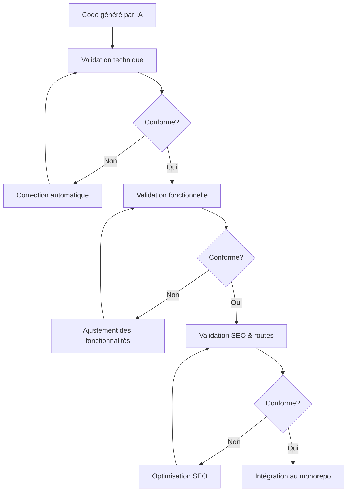

# Chaîne de validation IA / Dev / SEO

## 🔄 Vue d'ensemble

Chaque module généré ou migré passe par 3 couches de validation automatisée pour garantir sa qualité technique, fonctionnelle et son optimisation pour le référencement.

## 🔄 Processus de validation en cascade

Chaque action (analyse, génération, insertion) est soumise à 3 niveaux de vérification successifs et complémentaires, garantissant la fiabilité, la conformité et l'optimisation de chaque module migré.



## 🔧 Validation technique

- Vérification des types TypeScript (`tsc`)
- Conformité aux conventions ESLint/Tailwind/DTO
- Détection d'erreurs de build ou d'intégration dans Turbo monorepo

La validation technique vérifie la qualité du code et sa conformité aux standards établis.

### Aspects vérifiés

- **Conventions de code** : respect des règles ESLint/Prettier configurées
- **Typage strict** : vérification statique des types TypeScript 
- **Erreurs potentielles** : détection des bugs possibles ou des vulnérabilités
- **Structure architecturale** : conformité aux patterns Remix et NestJS
- **Optimisation des performances** : détection des anti-patterns

### Outils utilisés

```typescript
// Exemple de configuration de validation technique
const techValidationConfig = {
  lintRules: './config/eslint/.eslintrc.json',
  tsConfig: './config/typescript/tsconfig.strict.json',
  securityChecks: [
    'sql-injection',
    'xss-vulnerabilities',
    'dependency-issues',
    'authentication-flows'
  ],
  performanceThresholds: {
    maxNestedLoops: 2,
    maxMethodLength: 30,
    maxCyclomaticComplexity: 10
  }
};
```

### Processus de correction

Si des problèmes techniques sont détectés, l'agent `tech-fixer.ts` tente de les résoudre automatiquement avant de soumettre le code à une nouvelle validation.

## 🧩 Validation fonctionnelle

La validation fonctionnelle vérifie l'alignement avec les besoins décrits dans la Section 2 du cahier des charges.

### Aspects vérifiés

- **Couverture des cas d'usage** : vérification que tous les scénarios sont implémentés
- **Logique métier** : conformité aux règles fonctionnelles spécifiées
- **Gestion des erreurs** : traitement approprié des cas exceptionnels
- **Intégration** : connexion correcte avec les autres modules dépendants
- **Expérience utilisateur** : fluidité des parcours définis

### Méthodes d'évaluation

- Tests automatisés (unitaires, d'intégration, e2e)
- Validation par snapshots de l'interface utilisateur
- Simulation des parcours utilisateurs
- Vérification des contrats d'API

```typescript
// Exemple de test de validation fonctionnelle pour un panier d'achat
describe('Panier module', () => {
  test('Ajoute correctement un produit au panier', async () => {
    // ...test code...
  });
  
  test('Calcule correctement le prix total avec promotions', async () => {
    // ...test code...
  });
  
  test('Vérifie la disponibilité du stock avant ajout', async () => {
    // ...test code...
  });
  
  test('Préserve le panier entre les sessions', async () => {
    // ...test code...
  });
});
```

## 🔍 Validation SEO & routes

La validation SEO et des routes assure la préservation du référencement et la cohérence de la navigation.

### Aspects vérifiés

- **Métadonnées** : titre, description, mots-clés, données structurées
- **URLs** : correspondance avec les anciennes routes, format SEO-friendly
- **Redirections** : mise en place des redirections 301 pour les anciennes URLs
- **Balises canoniques** : implémentation correcte
- **Performance** : temps de chargement, score Core Web Vitals

### Outils et méthodes

- Cartographie des anciennes/nouvelles URLs
- Tests automatisés des redirections
- Validation des balises meta et des données structurées
- Vérification des règles robots.txt

```typescript
// Exemple de validation SEO pour une page produit
const seoValidation = {
  url: {
    oldPattern: '/produit/{id}/{slug}',
    newPattern: '/products/$id/$slug',
    redirectionType: 301
  },
  metadata: {
    title: {
      required: true,
      pattern: '{{productName}} - {{category}} | {{siteName}}'
    },
    description: {
      required: true,
      minLength: 120,
      maxLength: 160
    },
    canonical: {
      required: true,
      format: 'absolute-url'
    },
    structuredData: {
      type: 'Product',
      required: ['name', 'price', 'image', 'description']
    }
  }
};
```

## 🔐 Garanties apportées

Ce système de validation en cascade assure que chaque module migré est :

- **Fiable** : code solide, sans erreur technique et performant
- **Conforme** : respecte les exigences fonctionnelles et les cas d'usage
- **Optimisé** : préserve ou améliore le référencement et l'expérience utilisateur
- **Documenté** : chaque étape de validation génère des rapports explicites
- **Traçable** : historique complet des validations et corrections

## 🤝 Collaboration IA/Humain

Bien que largement automatisé, ce processus inclut des points de contrôle humain :

- Les cas complexes ou ambigus sont signalés pour revue manuelle
- Un tableau de bord centralise les éléments nécessitant une intervention
- Les développeurs peuvent ajuster les critères de validation par module
- Les décisions prises sont documentées et alimentent l'amélioration continue du système

## 📊 Métriques de qualité

Le processus génère des métriques permettant de suivre la qualité globale :

| Métrique | Cible | Méthode de calcul |
|----------|-------|-------------------|
| Taux de validation technique | >95% | Modules validés / total des modules |
| Taux de couverture fonctionnelle | >90% | Cas d'usage couverts / total des cas |
| Score SEO | >90/100 | Basé sur les critères Lighthouse |
| Temps moyen de correction | <4h | Délai entre détection et résolution |
