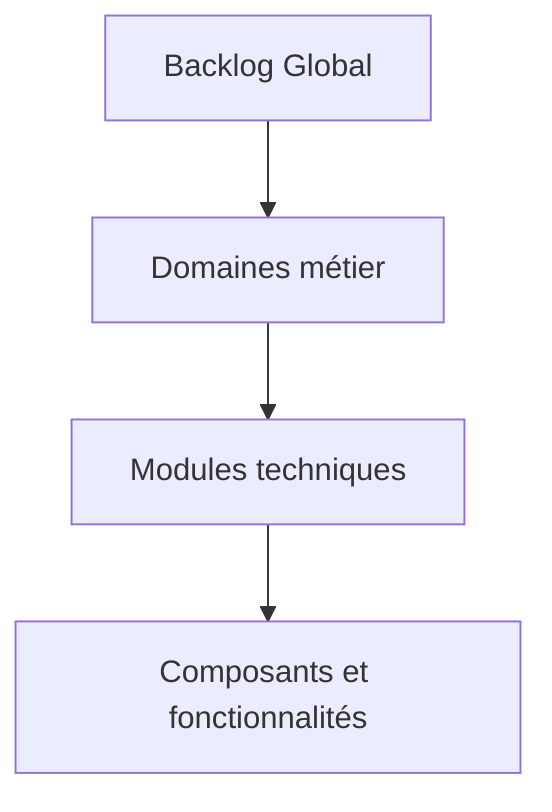
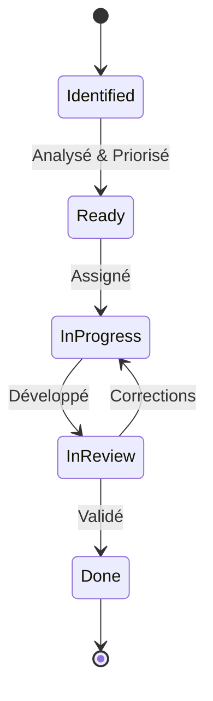

# Backlog structuré et priorisé

## 🧭 Vue d'ensemble

Le backlog structuré représente l'inventaire complet et organisé des éléments restant à migrer, avec une priorisation claire qui guide l'ordre d'exécution du travail.

## 📋 Structure du backlog

### Organisation hiérarchique

Le backlog est organisé selon une structure à trois niveaux:



### Composition d'un élément de backlog

Chaque élément du backlog contient ces informations standardisées:

```json
{
  "id": "BKL-2023-0042",
  "type": "module",
  "title": "Gestion des profils utilisateurs",
  "domain": "authentification",
  "description": "Migration du système de profils utilisateurs",
  "source_files": [
    "/legacy/users/profile.php",
    "/legacy/users/preferences.php"
  ],
  "target_components": [
    "apps/api/src/users/profile",
    "apps/web/app/routes/account/profile"
  ],
  "dependencies": ["BKL-2023-0036", "BKL-2023-0038"],
  "blocked_by": [],
  "complexity": "medium",
  "business_value": "high",
  "priority_score": 85,
  "status": "ready",
  "assigned_to": null,
  "estimated_effort": "5d",
  "created_at": "2023-11-10T14:23:45Z",
  "updated_at": "2023-11-28T09:15:22Z",
  "tags": ["user-facing", "data-intensive", "critical-path"]
}
```

## 🔢 Méthode de priorisation

### Calcul du score de priorité

La priorisation utilise un modèle quantitatif:

```typescript
type BacklogItem = {
  // ...autres propriétés
  business_value: 'low' | 'medium' | 'high' | 'critical';
  technical_risk: 'low' | 'medium' | 'high' | 'critical';
  dependencies: string[];
  blocked_by: string[];
  user_impact: 'low' | 'medium' | 'high' | 'critical';
  effort: 'xs' | 's' | 'm' | 'l' | 'xl';
  seo_impact: 'none' | 'low' | 'medium' | 'high';
};

function calculatePriorityScore(item: BacklogItem): number {
  const businessValue = valueMap[item.business_value]; // 1-10
  const userImpact = valueMap[item.user_impact];       // 1-10
  const seoImpact = seoValueMap[item.seo_impact];      // 0-8
  const technicalRisk = riskMap[item.technical_risk];  // 1-8
  const effortScore = effortMap[item.effort];          // 1-5
  const dependencyFactor = 1 + (item.dependencies.length * 0.1);
  const blockedFactor = item.blocked_by.length === 0 ? 1 : 0.5;
  
  // Formule de calcul du score
  return Math.round(
    ((businessValue * 2) + userImpact + seoImpact + technicalRisk) 
    * dependencyFactor 
    * blockedFactor 
    / effortScore
  );
}
```

### Catégories de priorité

Le backlog est divisé en quatre catégories basées sur le score:

| Catégorie | Score | Description | Action |
|-----------|-------|-------------|--------|
| Critique | 85-100 | Bloquant ou haute valeur métier | À traiter immédiatement |
| Haute | 70-84 | Important pour la valeur métier | À planifier dans le sprint actuel/suivant |
| Moyenne | 50-69 | Valeur significative | À planifier dans les 2-3 sprints |
| Basse | <50 | Valeur limitée ou effort important | À réévaluer régulièrement |

## 📊 Visualisation et suivi

### Tableau de bord du backlog

Un tableau de bord interactif accessible à `/admin/backlog` présente:

- **Vue d'ensemble**: Statistiques globales de progression
- **Vue par domaine**: Progression par domaine métier
- **Vue détaillée**: Liste filtrée et triable des éléments
- **Vue dépendances**: Graphe de dépendances entre éléments
- **Vue planning**: Projection temporelle basée sur la vélocité

### Exemples de visualisations

#### Progression globale
```
Backlog total: 142 éléments
[██████████████░░░░░░░░] 56% (80/142)

Par priorité:
Critique: [████████████████░░] 78% (28/36)
Haute:    [████████████░░░░░░] 62% (31/50)
Moyenne:  [██████░░░░░░░░░░░░] 30% (12/40)
Basse:    [████░░░░░░░░░░░░░░] 21% (5/24)
```

#### Heatmap des domaines
```
             Progression    Risque    Complexité
Auth:        [████████░░]   🟡        🟠
Produits:    [██████████]   🟢        🟢
Panier:      [███░░░░░░░]   🔴        🔴
Commandes:   [██░░░░░░░░]   🟠        🟠
Admin:       [████░░░░░░]   🟡        🟡
Search:      [███████░░░]   🟢        🟠
```

## 🔄 Processus de mise à jour

### Cycle de vie d'un élément de backlog



### Automatisation des mises à jour

Le backlog est mis à jour automatiquement:

1. **Analyse du code legacy**: Détection automatique des fichiers à migrer
2. **Analyse des dépendances**: Identification des relations techniques
3. **Analyse de valeur**: Métriques d'utilisation pour évaluer l'impact
4. **Suivi de progression**: Mise à jour automatique via le CI/CD

## 📱 Accessibilité multi-plateforme

Le backlog est accessible via:

- **Interface web**: Dashboard complet dans l'admin
- **API REST**: Endpoint `/api/backlog` pour intégrations
- **CLI**: Commande `migrate backlog` pour opérations rapides
- **Notifications**: Alertes Slack/Teams sur changements critiques

## 🔐 Gouvernance du backlog

### Rôles et responsabilités

| Rôle | Permissions | Responsabilités |
|------|-------------|-----------------|
| Product Owner | Modifier priorités, Approuver | Priorisation métier |
| Tech Lead | Gérer dépendances, Estimer effort | Cohérence technique |
| Scrum Master | Visualiser, Générer rapports | Facilitation |
| Développeur | Visualiser, Mettre à jour statut | Exécution |

### Rituels associés

- **Backlog Refinement**: Bi-hebdomadaire, priorisation collaborative
- **Sprint Planning**: Sélection depuis les éléments prêts
- **Daily Standup**: Mise à jour des statuts
- **Retrospective**: Ajustement du processus

## 📝 Exemple d'extrait de backlog actuel

| ID | Module | Priorité | Statut | Dépendances | ETA |
|----|--------|----------|--------|-------------|-----|
| BKL-2023-0067 | Authentification 2FA | Critique | En cours | - | Sprint 4 |
| BKL-2023-0068 | Panier multi-devise | Haute | Prêt | BKL-2023-0072 | Sprint 5 |
| BKL-2023-0069 | Recherche produits | Critique | En revue | - | Sprint 4 |
| BKL-2023-0070 | Gestion stock | Moyenne | Prêt | BKL-2023-0075 | Sprint 6 |
| BKL-2023-0071 | Historique commandes | Basse | Identifié | BKL-2023-0073 | Sprint 7 |

Ce backlog structuré et priorisé constitue le guide central pour l'équipe, assurant que chaque élément à migrer est correctement identifié, priorisé et suivi tout au long du processus de migration.
