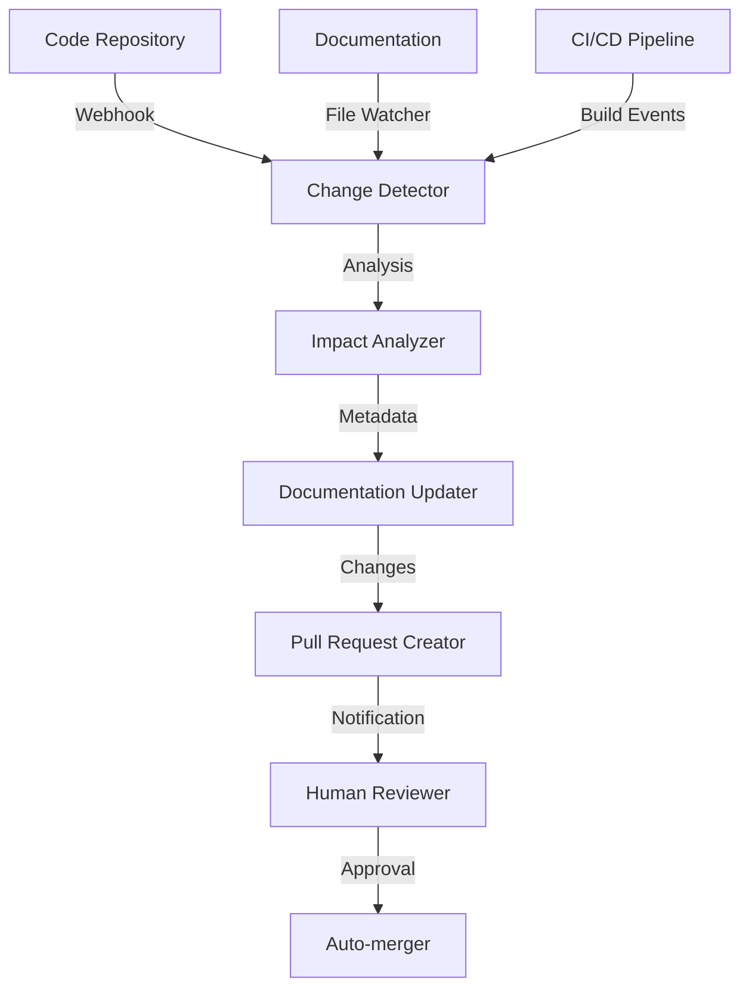

# Suivi automatisé et agents IA dans la procédure

## 🤖 Vue d'ensemble

Le cahier des charges bénéficie d'un système sophistiqué de suivi automatisé et d'agents IA qui surveillent, analysent et enrichissent continuellement sa qualité et sa pertinence.

## 🔄 Système de suivi automatisé

### Détection des changements



### Métriques surveillées en temps réel

| Métrique | Source | Fréquence | Alertes |
|----------|--------|-----------|---------|
| Cohérence code/doc | Analyse statique | Chaque commit | Si divergence >10% |
| Complétude | Couverture fonctionnelle | Quotidienne | Si <95% |
| Fraîcheur | Date dernière mise à jour | Hebdomadaire | Si >14 jours |
| Qualité | Linting/validation | Chaque PR | Si erreurs |

## 🧠 Agents IA intégrés

### Types d'agents déployés

1. **AnalyzerAgent** - Analyse le contenu pour la complétude et la cohérence
   ```typescript
   class AnalyzerAgent {
     async analyzeDoc(filePath: string): Promise<AnalysisReport> {
       // Analyse sémantique du contenu
       // Détection des sections faibles ou incomplètes
       // Identification des incohérences
       return report;
     }
   }
   ```

2. **SuggesterAgent** - Propose des améliorations contextuelles
   ```typescript
   class SuggesterAgent {
     async generateSuggestions(analysisReport: AnalysisReport): Promise<Suggestion[]> {
       // Génération de suggestions d'amélioration
       // Contextualisation basée sur l'historique
       // Priorisation des suggestions
       return suggestions;
     }
   }
   ```

3. **SynchronizerAgent** - Maintient l'alignement code/documentation
   ```typescript
   class SynchronizerAgent {
     async detectDiscrepancies(codebase: CodeAnalysis, docs: DocsAnalysis): Promise<Discrepancy[]> {
       // Comparaison des fonctionnalités implémentées vs documentées
       // Détection des changements techniques non reflétés
       // Validation des interfaces et contrats
       return discrepancies;
     }
   }
   ```

4. **ValidatorAgent** - Vérifie la conformité aux standards et exigences
   ```typescript
   class ValidatorAgent {
     async validate(document: Document, standards: Standards): Promise<ValidationResult> {
       // Vérification des exigences de format
       // Validation de la structure
       // Contrôle de qualité
       return result;
     }
   }
   ```

### Orchestration des agents

Les agents sont orchestrés via n8n avec des workflows dédiés:

- **Workflow quotidien** - Analyse complète et rapport de santé
- **Workflow sur événement** - Déclenché par changements de code/doc
- **Workflow planifié** - Révisions périodiques et suggestions d'amélioration
- **Workflow à la demande** - Analyses spécifiques demandées par l'équipe

## 📊 Tableau de bord de suivi

### Visualisation en temps réel

Le tableau de bord `/admin/documentation-health` présente:

- **État de santé global** - Score de qualité documentaire
- **Zones nécessitant attention** - Sections obsolètes ou incomplètes
- **Activité récente** - Modifications et mises à jour
- **Suggestions en attente** - Propositions d'amélioration non traitées

### Alertes intelligentes

Le système génère des alertes contextuelles:

```json
{
  "alert_type": "documentation_drift",
  "severity": "medium",
  "description": "Le module d'authentification a subi 7 changements techniques non reflétés dans la documentation",
  "affected_docs": ["/auth/authentication.md", "/security/permissions.md"],
  "suggestion": "Mettre à jour la section sur l'authentification à deux facteurs",
  "context": {
    "recent_changes": ["commit_123", "pr_456"],
    "last_doc_update": "2023-10-15"
  }
}
```

## 🔄 Processus d'intervention automatisée

### Cycle de vie des modifications suggérées

1. **Détection** - Changement de code ou incohérence identifiée
2. **Analyse** - Évaluation de l'impact sur la documentation
3. **Génération** - Création de mises à jour suggérées
4. **Proposition** - Soumission via PR avec contexte
5. **Revue** - Validation humaine des suggestions
6. **Intégration** - Fusion des modifications approuvées
7. **Apprentissage** - Feedback pour amélioration continue

### Équilibrage intervention humaine/IA

- **Modifications mineures** - Processus entièrement automatisé avec notification
- **Modifications moyennes** - Suggestion IA avec approbation humaine
- **Modifications majeures** - Cadre IA avec contenu principalement humain

## 🛠️ Intégration technique

### Points d'intégration système

- **Webhooks GitHub** - Déclenchement sur commits et PRs
- **API Documentation** - Interface pour les outils de documentation
- **CLI Tools** - Commandes pour interactions manuelles
- **Metrics Collector** - Agrégation des données de qualité

### Configuration système

```yaml
agents:
  analyzer:
    model: gpt-4
    context_window: 16000
    schedule: "0 */4 * * *"
  suggester:
    model: gpt-4
    max_suggestions_per_file: 5
    confidence_threshold: 0.85
  synchronizer:
    enabled: true
    watch_paths: ["src/**/*.ts", "docs/**/*.md"]
    ignore_patterns: ["**/tests/**"]
  validator:
    standards_file: "./doc-standards.json"
    strict_mode: false

workflows:
  auto_update:
    approval_required: true
    notify_channels: ["#docs-team", "#tech-leads"]
    update_changelog: true
  scheduled_review:
    frequency: "weekly"
    depth: "full"
    generate_report: true
```

## 📈 Amélioration continue du système

### Mécanisme d'apprentissage

- **Feedback humain** sur les suggestions intégré au système
- **Analyse des patterns** d'acceptation/rejet
- **Amélioration des prompts** et des heuristiques
- **Expansion progressive** des capacités automatisées

### Métriques d'efficacité

| Métrique | Cible | Actuelle |
|----------|-------|----------|
| Précision des suggestions | >90% | 87% |
| Temps économisé (estimation) | 15h/semaine | 12h/semaine |
| Réactivité aux changements | <24h | <36h |
| Taux d'acceptation | >75% | 72% |

Ce système de suivi automatisé et d'agents IA constitue un pilier fondamental de la fiabilité et de l'évolution du cahier des charges, garantissant qu'il reste un document vivant, précis et aligné avec le code réel à tout moment.
