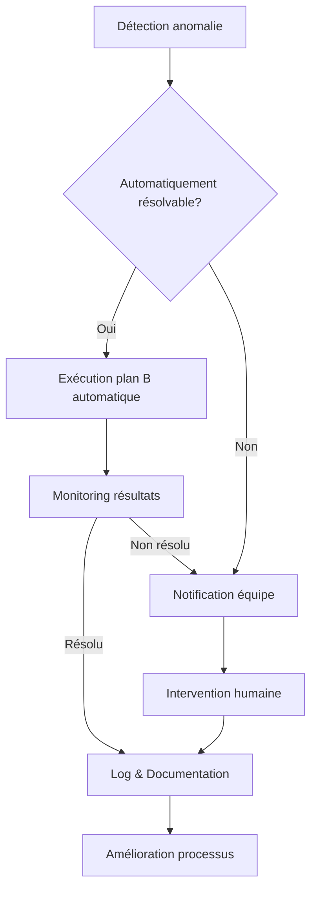

# Gestion des risques et plans B

## 🛡️ Vue d'ensemble

La gestion proactive des risques et la définition de plans B robustes sont essentielles pour garantir la continuité et la fiabilité du projet, particulièrement dans un contexte d'automatisation IA où des échecs ou divergences peuvent survenir.

## 🔍 Matrice des risques identifiés

### Risques liés aux agents IA

| Risque | Probabilité | Impact | Indice de criticité |
|--------|-------------|--------|---------------------|
| Échec d'un agent d'analyse | Moyenne | Élevé | 🟠 |
| Génération de code non-fonctionnel | Moyenne | Élevé | 🟠 |
| Divergence de compréhension des exigences | Élevée | Moyen | 🟠 |
| Blocage sur pattern de code complexe | Élevée | Moyen | 🟠 |
| Consommation excessive de tokens | Élevée | Faible | 🟡 |
| Fuite de données sensibles | Faible | Très élevé | 🟠 |

### Risques liés à la migration

| Risque | Probabilité | Impact | Indice de criticité |
|--------|-------------|--------|---------------------|
| Incompatibilité SQL entre MySQL et PostgreSQL | Moyenne | Élevé | 🟠 |
| Régression fonctionnelle non détectée | Moyenne | Très élevé | 🔴 |
| Dégradation des performances | Moyenne | Élevé | 🟠 |
| Perte de données pendant la migration | Faible | Très élevé | 🟠 |
| Impact SEO négatif | Moyenne | Élevé | 🟠 |
| Dépassement significatif du calendrier | Élevée | Moyen | 🟠 |

## 🛠️ Stratégies de mitigation et plans B

### Pour les agents IA

#### 1. Échec d'un agent d'analyse
- **Mitigation**: Modularisation des agents, limites de timeout étendues
- **Plan B**: 
  - Procédure manuelle d'analyse documentée en détail
  - Agent de secours avec modèle alternatif
  - Bibliothèque de patterns pré-analysés pour les cas fréquents

```typescript
// Exemple d'implémentation de fallback pour agent d'analyse
class AnalysisAgent {
  async analyze(code: string): Promise<AnalysisResult> {
    try {
      // Tentative avec l'agent principal
      return await this.primaryAgent.analyze(code, { timeout: 30000 });
    } catch (error) {
      logger.warn(`Agent principal échoué: ${error.message}`);
      
      try {
        // Premier fallback: agent secondaire
        return await this.secondaryAgent.analyze(code, { timeout: 45000 });
      } catch (secondError) {
        logger.error(`Agent secondaire échoué: ${secondError.message}`);
        
        // Deuxième fallback: analyse basée sur patterns
        return this.patternBasedAnalysis.analyze(code);
      }
    }
  }
}
```

#### 2. Génération de code non-fonctionnel
- **Mitigation**: Validation syntaxique et sémantique automatisée post-génération
- **Plan B**:
  - Bibliothèque de templates pré-validés
  - Régénération avec contexte enrichi des erreurs
  - Intervention humaine guidée avec diagnostic précis

#### 3. Divergence de compréhension des exigences
- **Mitigation**: Formalisation stricte des exigences, validation précoce
- **Plan B**:
  - Protocole de clarification avec escalade humaine
  - Génération multi-approches et comparaison
  - Matrice de validation exigences/implémentation

### Pour la migration technique

#### 1. Incompatibilité SQL
- **Mitigation**: Audit préalable complet, conversion progressive
- **Plan B**:
  - Couche d'abstraction temporaire
  - Mappings personnalisés pour les cas spécifiques
  - Service de conversion à la volée

```sql
-- Exemple de mapping personnalisé pour fonctions incompatibles
-- Au lieu de GROUP_CONCAT (MySQL) -> utilisation de string_agg (PostgreSQL)
-- Migration Plan B:
CREATE OR REPLACE FUNCTION group_concat(text, text)
RETURNS text AS $$
  SELECT string_agg($2, $1);
$$ LANGUAGE SQL IMMUTABLE;
```

#### 2. Régression fonctionnelle
- **Mitigation**: Tests automatisés exhaustifs, A/B testing
- **Plan B**:
  - Système de feature flags pour activation/désactivation rapide
  - Rollback automatisé sur détection d'anomalie
  - Système dual-run (ancien + nouveau) avec comparaison des résultats

#### 3. Impact SEO négatif
- **Mitigation**: Préservation stricte des URLs, redirections 301
- **Plan B**:
  - Plan de récupération SEO détaillé
  - Système de fallback automatique vers l'ancienne URL
  - Monitoring SEO avancé avec alertes précoces

## 📋 Procédures de déclenchement des plans B

### Critères de déclenchement

Des seuils clairs déclenchent automatiquement les plans B:

| Scénario | Métrique | Seuil | Action |
|----------|----------|-------|--------|
| Échec IA | Tentatives | >3 échecs consécutifs | Fallback manuel |
| Génération | Taux d'erreur | >20% | Template mode |
| Performance | Temps réponse | >300% baseline | Rollback feature |
| SEO | Traffic organique | -15% sur 3 jours | Restauration URLs |
| Données | Anomalies | >0.5% incohérences | Mode synchronisation |

### Processus d'escalade



## 🔄 Simulation et préparation

### Exercices de simulation

Des exercices réguliers sont planifiés:

- **Fire Drill IA**: Simulation d'échec total du système IA
- **Migration Rehearsal**: Répétition complète sur environnement clone
- **Chaos Engineering**: Défaillances aléatoires injectées

### Kit de secours prêt à l'emploi

Disponible à tout moment:

- **Documentation d'urgence**: Procédures détaillées étape par étape
- **Scripts de récupération**: Prêts à être exécutés
- **Environnement de secours**: Pré-configuré et testé régulièrement

## 📊 Surveillance et détection précoce

### Système de monitoring proactif

Un système de surveillance multi-niveaux détecte les problèmes avant qu'ils n'impactent les utilisateurs:

- **Heartbeat des agents**: Vérification continue de la disponibilité
- **Qualité des outputs**: Évaluation automatique de la cohérence
- **Tendances de performance**: Détection de dégradations progressives
- **Comportement utilisateur**: Analyse des patterns d'interaction anormaux

### Alertes intelligentes

```json
{
  "alert_type": "agent_degradation",
  "severity": "warning",
  "timestamp": "2023-12-05T14:23:45Z",
  "details": {
    "agent": "code-analyzer",
    "symptom": "increased_error_rate",
    "current_rate": "18%",
    "baseline": "3%",
    "trend": "rising",
    "first_detected": "2023-12-05T12:15:30Z"
  },
  "recommended_actions": [
    "Verify API access",
    "Check input complexity",
    "Review recent prompts"
  ],
  "fallback_plan": "manual_analysis",
  "escalation_path": "tech-team",
  "auto_remediation": "in_progress"
}
```

## 🧪 Apprentissage et amélioration continue

### Analyse post-mortem

Après chaque déclenchement d'un plan B:

1. **Documentation détaillée** de l'incident
2. **Analyse des causes racines**
3. **Identification des améliorations** possibles
4. **Mise à jour des procédures** et seuils

### Boucle d'amélioration

Les plans B évoluent constamment grâce à:

- **Retours d'expérience** des incidents réels
- **Benchmarking** avec d'autres projets similaires
- **Avancées technologiques** incorporées régulièrement
- **Tests et simulations** de plus en plus sophistiqués

Ce système robuste de gestion des risques et plans B garantit que même face aux inévitables défis d'un projet complexe de migration automatisée par IA, la continuité et la fiabilité du projet restent assurées.
