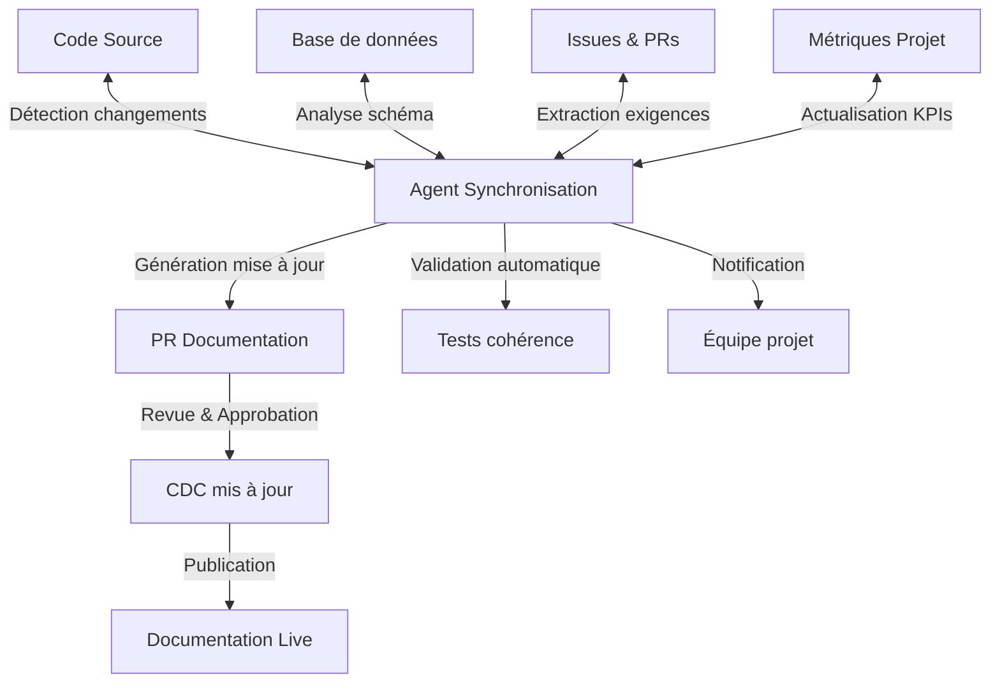

# Synchronisation dynamique du cahier des charges

## 🔄 Vue d'ensemble

La synchronisation dynamique garantit que le cahier des charges reste constamment aligné avec l'état réel du projet, en automatisant les mises à jour et en assurant la cohérence entre documentation et implémentation.

## 🧩 Architecture de synchronisation

### Mécanisme de synchronisation bidirectionnelle



### Composants du système

1. **Agent de surveillance** - Monitore les sources de vérité
2. **Moteur d'analyse de diff** - Identifie les changements significatifs
3. **Générateur de contenu** - Traduit les changements en documentation
4. **Système de validation** - Vérifie la cohérence des mises à jour
5. **Interface d'approbation** - Dashboard pour gérer les mises à jour

## 📱 Sources de synchronisation

### Code source et architecture

- **Structure du code** - Arborescence des modules et composants
- **Interfaces publiques** - Signatures de fonctions et API exposées
- **Dépendances** - Relations entre composants
- **Documentation inline** - JSDoc, TSDoc et commentaires structurés

### Base de données et modèles

- **Schéma Prisma** - Structure des données
- **Migrations** - Évolution du modèle de données
- **Seeds et fixtures** - Exemples et données de référence

### Suivi de projet 

- **Issues GitHub** - Backlog et fonctionnalités
- **Pull Requests** - Changements implémentés
- **Project boards** - Organisation et priorisation
- **Discussions techniques** - Décisions d'implémentation

## ⚙️ Processus de synchronisation

### Déclencheurs de synchronisation

| Source | Événement | Critère | Action |
|--------|-----------|---------|--------|
| GitHub | Push | Modification fichiers clés | Analyse diff |
| GitHub | PR merged | Label `update-docs` | Maj immédiate |
| Prisma | Migration | Changement schema | Maj modèle données |
| CI/CD | Pipeline | Changement métriques | Maj KPIs |
| Cron | Planifié | Quotidien | Vérification complète |

### Workflow de mise à jour

```typescript
// Agent de synchronisation dynamique
async function syncDocumentation() {
  // 1. Collecter les changements depuis la dernière synchronisation
  const changes = await collectChanges();
  
  if (changes.length === 0) {
    logger.info('Aucun changement significatif détecté');
    return;
  }
  
  // 2. Analyser l'impact sur la documentation
  const docImpact = await analyzeDocumentationImpact(changes);
  
  // 3. Filtrer les changements nécessitant mise à jour
  const significantChanges = docImpact.filter(i => i.significance > THRESHOLD);
  
  if (significantChanges.length === 0) {
    logger.info('Changements détectés mais non significatifs pour la documentation');
    return;
  }
  
  // 4. Générer les mises à jour de documentation
  const updates = await generateDocumentationUpdates(significantChanges);
  
  // 5. Valider la cohérence des mises à jour
  const validationResults = await validateDocumentationUpdates(updates);
  
  if (!validationResults.valid) {
    logger.warn('Validation échouée pour certaines mises à jour', validationResults.issues);
    await notifyTeam('validation-issues', validationResults);
    return;
  }
  
  // 6. Créer une PR pour les mises à jour
  const pr = await createDocumentationPR(updates);
  
  // 7. Notifier l'équipe
  await notifyTeam('documentation-update', { pr, changes: significantChanges });
}
```

## 📄 Types de mises à jour

### Mises à jour automatiques

Ces mises à jour sont appliquées sans intervention humaine:

- **Métriques et KPIs** - Actualisation des indicateurs chiffrés
- **Listes de modules** - Inventaire des composants
- **Versions et dépendances** - Mise à jour des références techniques
- **État d'avancement** - Progression des migrations

### Mises à jour semi-automatiques

Ces mises à jour nécessitent une validation humaine:

- **Spécifications techniques** - Évolutions architecturales
- **Processus métier** - Changements fonctionnels
- **Règles de validation** - Modifications des critères de qualité
- **Plans stratégiques** - Ajustements du backlog et roadmap

## 🔍 Détection des incohérences

### Alertes automatiques

Le système détecte les incohérences potentielles:

```json
{
  "alert_type": "doc_code_mismatch",
  "severity": "medium",
  "timestamp": "2023-12-10T15:42:33Z",
  "details": {
    "doc_section": "05-plan-migration.md",
    "doc_statement": "La migration utilise la stratégie blue-green",
    "code_evidence": "Implémentation utilisant canary releases",
    "files": ["deployment/strategy.ts", "ci/pipeline.yml"],
    "confidence": 0.92
  },
  "suggested_actions": [
    "Mettre à jour la documentation pour refléter la stratégie canary",
    "OU modifier l'implémentation pour utiliser blue-green"
  ]
}
```

### Résolution des incohérences

Le processus de résolution suit ces étapes:

1. **Détection** - Identification automatique
2. **Classification** - Par type et sévérité
3. **Notification** - Alerte aux personnes responsables
4. **Arbitrage** - Décision sur la source de vérité
5. **Correction** - Mise à jour de la documentation ou du code
6. **Vérification** - Confirmation de la cohérence

## 🖥️ Interface utilisateur de synchronisation

### Dashboard de synchronisation

Une interface `/admin/doc-sync` permet de:

- **Visualiser** les changements détectés
- **Approuver** les mises à jour proposées
- **Planifier** des synchronisations complètes
- **Analyser** l'historique des synchronisations

### Aperçu du dashboard

```
[Dernier sync: 10 Dec 2023 15:42] [État: 98% cohérent] [3 mises à jour en attente]

MODIFICATIONS DÉTECTÉES
- [Haute] Structure API authentification modifiée
  Source: api/auth/controller.ts (modifié il y a 2h)
  Section CDC: 04-architecture-ia.md
  Action: [Voir détails] [Approuver] [Ignorer]

- [Moyenne] Nouvelle métrique performance ajoutée
  Source: monitoring/kpi.ts (ajouté il y a 5h)
  Section CDC: 18-kpi-indicateurs.md
  Action: [Voir détails] [Approuver] [Ignorer]

- [Basse] Documentation inline modifiée
  Source: libs/core/models/user.ts (modifié il y a 1j)
  Section CDC: Aucun impact direct
  Action: [Voir détails] [Ignorer]

STATISTIQUES
- Cohérence Code/Doc: 98%
- Délai moyen de mise à jour: 6h
- Mises à jour automatiques: 87%
- Interventions humaines: 13%
```

## 📈 Métriques de synchronisation

| Métrique | Description | Cible | Visualisation |
|----------|-------------|-------|---------------|
| Taux de cohérence | % documentation alignée avec code | >95% | Jauge |
| Délai de synchronisation | Temps entre changement et mise à jour doc | <12h | Graphe temporel |
| Exhaustivité | % fonctionnalités documentées | 100% | Progression |
| Interventions humaines | % mises à jour nécessitant validation | <20% | Tendance |

Ce système de synchronisation dynamique garantit que le cahier des charges reste constamment une source de vérité fiable et à jour, reflétant avec précision l'état réel du projet et ses évolutions.
