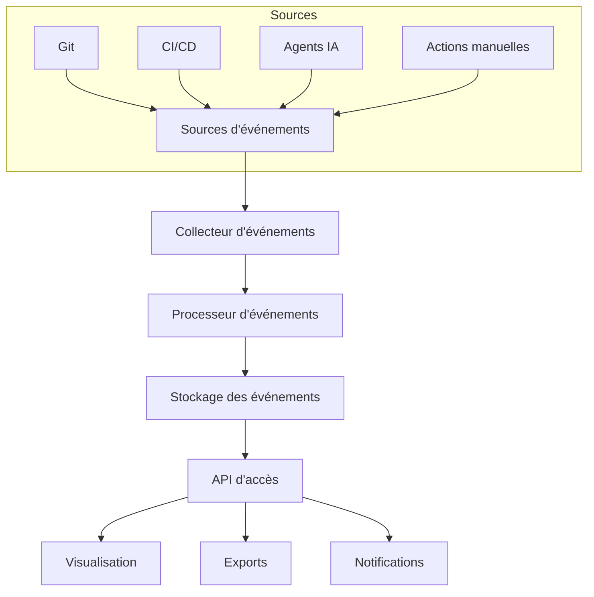
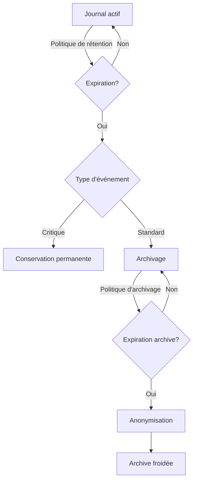

# Journal automatique des évolutions

## 📜 Vue d'ensemble

Le journal automatique des évolutions constitue une pièce maîtresse du système de traçabilité, permettant de suivre de façon structurée et exhaustive toutes les modifications apportées au projet, qu'elles soient techniques, fonctionnelles ou documentaires.

## 🔄 Fonctionnement du journal

### Architecture du système de journalisation



### Structure d'une entrée de journal

Chaque action (analyse, génération, test, insertion) crée une entrée standardisée:

```json
{
  "id": "evt-2023121115429372",
  "timestamp": "2023-12-11T15:42:23.937Z",
  "actionType": "generation",
  "category": "code",
  "source": {
    "agent": "dev-generator.ts",
    "version": "2.3.4",
    "trigger": "workflow-135"
  },
  "target": {
    "module": "Shopping_Cart",
    "files": ["apps/api/src/cart/cart.service.ts", "apps/api/src/cart/cart.controller.ts"]
  },
  "context": {
    "relatedTo": "evt-2023121115384215",
    "workflow": "code-generation",
    "initiatedBy": "analyze-legacy-code"
  },
  "result": {
    "status": "success",
    "duration": 4328,
    "metrics": {
      "linesGenerated": 342,
      "coveragePercent": 94,
      "complexityScore": 12
    }
  },
  "metadata": {
    "environmentInfo": {
      "environment": "production",
      "node": "v20.2.0",
      "memory": "4.2GB used / 8GB total"
    },
    "tags": ["cart", "e-commerce", "core-module"]
  }
}
```

## 📊 Tableaux de suivi

### Journal des actions

Le système génère automatiquement un tableau chronologique des actions:

| Date       | Action         | Module            | Agent           | Résultat  | Détails |
|------------|----------------|-------------------|-----------------|-----------|---------|
| 2023-12-11 | Génération     | Shopping_Cart     | dev-generator.ts | Succès    | [🔍](#) |
| 2023-12-11 | Analyse SQL    | AUTO_MARQUE       | sql-analyzer     | Succès    | [🔍](#) |
| 2023-12-11 | Relecture SEO  | fiche.php         | seo-verifier     | À valider | [🔍](#) |
| 2023-12-10 | Tests          | Authentification  | test-runner      | Échec     | [🔍](#) |
| 2023-12-10 | Refactoring    | API_Produits      | code-improver    | Succès    | [🔍](#) |

### Agrégations et visualisations

Les données du journal alimentent automatiquement diverses visualisations:

- **Timeline d'activité** - Représentation chronologique des événements
- **Heatmap de modules** - Concentration d'activité par module
- **Graphe de performance** - Évolution des métriques au fil du temps
- **Diagramme de flux** - Enchaînement des actions dans un workflow

## 🔍 Exploitation du journal

### Recherche et filtrage

L'interface `/admin/journal` permet une recherche avancée:

- **Par période** - Plage temporelle configurable
- **Par type d'action** - Filtrage par catégorie
- **Par module** - Focus sur un composant spécifique
- **Par agent** - Activités d'un agent particulier
- **Par résultat** - Succès, échecs, en attente

### Analytique et insights

Le système génère automatiquement des insights à partir du journal:

```typescript
// Exemple d'analyse automatique du journal
interface JournalInsight {
  type: 'bottleneck' | 'trend' | 'anomaly' | 'success_pattern';
  confidence: number;
  description: string;
  evidence: {
    eventIds: string[];
    metrics: Record<string, number>;
  };
  recommendation?: string;
}

function analyzeJournal(timeframe: TimeRange): JournalInsight[] {
  const events = fetchEventsInTimeframe(timeframe);
  const insights: JournalInsight[] = [];
  
  // Détection de goulots d'étranglement
  const pipelineStages = groupEventsByStage(events);
  const slowestStages = findSlowestStages(pipelineStages);
  
  if (slowestStages.length > 0) {
    insights.push({
      type: 'bottleneck',
      confidence: calculateConfidence(slowestStages),
      description: `Goulot d'étranglement identifié dans ${slowestStages[0].name}`,
      evidence: {
        eventIds: slowestStages[0].eventIds,
        metrics: { 
          avgDuration: slowestStages[0].avgDuration,
          throughput: slowestStages[0].throughput
        }
      },
      recommendation: `Considérer l'ajout de ressources ou l'optimisation de ${slowestStages[0].name}`
    });
  }
  
  // Autres analyses: tendances, anomalies, patterns de succès...
  
  return insights;
}
```

## 📱 Intégration avec les outils externes

### Notifications et alertes

Le journal envoie des notifications contextuelles:

- **Slack/Teams** - Alertes temps réel sur évènements importants
- **Email** - Digests quotidiens d'activité
- **Webhooks** - Intégration avec d'autres systèmes
- **RSS** - Flux d'activité pour abonnement

### Export et reporting

Les données du journal sont disponibles en plusieurs formats:

- **CSV/Excel** - Pour analyse externe
- **PDF** - Rapports formatés pour présentation
- **JSON** - Intégration avec d'autres systèmes
- **GraphQL API** - Requêtes personnalisées

## 🔒 Conservation et archivage

### Politique de rétention

Les entrées du journal suivent une politique de rétention intelligente:

| Type d'événement | Rétention active | Archivage | Anonymisation |
|------------------|------------------|-----------|---------------|
| Événements critiques | Illimitée | Jamais | Jamais |
| Actions réussies | 1 an | 5 ans | Après 2 ans |
| Tentatives échouées | 3 mois | 1 an | Après 6 mois |
| Données diagnostiques | 1 mois | 6 mois | Après 3 mois |

### Mécanisme d'archivage



## 🔐 Sécurité et auditabilité

### Intégrité des données

Pour garantir l'authenticité des entrées:

- **Signature numérique** - Chaque entrée est signée
- **Chaînage** - Références aux entrées précédentes
- **Stockage immuable** - Prévention des modifications après écriture
- **Validation** - Vérification à l'accès

### Contrôle d'accès

Un système de permissions granulaires contrôle l'accès:

- **Lecture seule** - Consultation sans modification
- **Annotation** - Ajout de commentaires
- **Exportation** - Capacité d'extraire des données
- **Administration** - Configuration du système

Ce journal automatique constitue une source de vérité indispensable pour la traçabilité du projet, offrant une vision claire de l'historique des évolutions et facilitant l'analyse des tendances et des performances.
