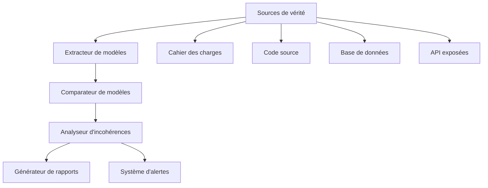
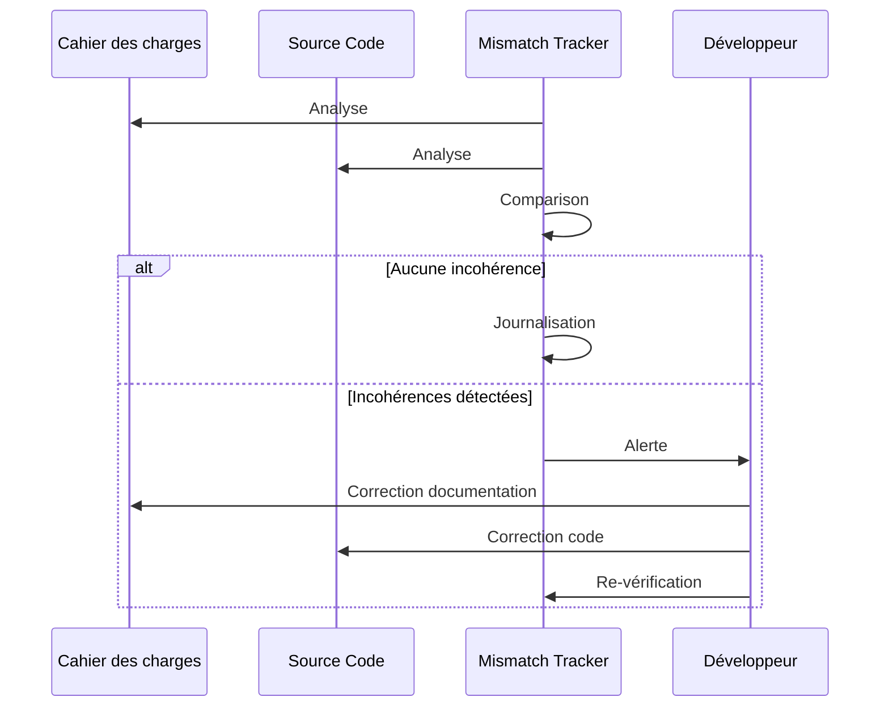

# Mismatch Tracker : Détection automatique des incohérences

## 🎯 Vue d'ensemble

Le Mismatch Tracker est un système de détection automatique des incohérences qui garantit l'alignement parfait entre le cahier des charges, le code source, et l'implémentation réelle du projet.

## 🔍 Types d'incohérences détectées

### Incohérences documentaires

| Type d'incohérence | Description | Niveau de gravité |
|-------------------|-------------|-------------------|
| Terminologie contradictoire | Utilisation de termes différents pour le même concept | Moyen |
| Spécifications conflictuelles | Exigences mutuellement incompatibles | Élevé |
| Structure obsolète | Sections ne reflétant plus l'architecture actuelle | Moyen |
| Exemples de code obsolètes | Exemples de code ne correspondant plus à l'implémentation | Faible |

### Incohérences code-documentation

| Type d'incohérence | Description | Niveau de gravité |
|-------------------|-------------|-------------------|
| Schéma de données divergent | Modèles de données différents entre doc et code | Critique |
| API divergente | Signatures de fonctions/endpoints différentes | Critique |
| Flux de travail non-conformes | Processus implémentés différemment | Élevé |
| Configuration divergente | Paramètres différents entre doc et code | Moyen |

### Incohérences architecturales

| Type d'incohérence | Description | Niveau de gravité |
|-------------------|-------------|-------------------|
| Violation de couches | Non-respect de l'architecture en couches | Élevé |
| Dépendances non-documentées | Dépendances réelles non mentionnées | Moyen |
| Pattern erroné | Utilisation d'un pattern différent de celui spécifié | Élevé |
| Communication non-conforme | Flux de données différent du design | Critique |

## ⚙️ Mécanisme de détection

### Architecture du Mismatch Tracker



### Techniques d'analyse

1. **Analyse statique de code**
   - Extraction des structures de données
   - Identification des patterns d'implémentation
   - Analyse des dépendances
   - Vérification des signatures d'API

2. **Analyse sémantique de documentation**
   - Extraction de modèles conceptuels
   - Identification des règles métier
   - Reconnaissance des patterns architecturaux
   - Extraction des flux de travail

3. **Comparaison structurelle**
   - Correspondance de graphes entre modèles
   - Calcul des distances sémantiques
   - Détection des divergences de structures
   - Analyse temporelle des modifications

## 📊 Processus de détection et correction

### Workflow de détection



### Seuils de détection configurables

Configuration personnalisable des seuils de sensibilité:

```yaml
# Configuration du Mismatch Tracker
sensitivity:
  terminological: 0.8  # Tolérance aux variations terminologiques (0-1)
  structural: 0.9      # Exigence de correspondance structurelle (0-1)
  temporal: 7d         # Délai accepté avant considération comme incohérence

severity_thresholds:
  critical: 90         # Score minimum pour classification critique
  high: 70             # Score minimum pour classification élevée
  medium: 50           # Score minimum pour classification moyenne
  low: 30              # Score minimum pour classification faible

notifications:
  critical: ["slack", "email", "dashboard"]
  high: ["slack", "dashboard"]
  medium: ["dashboard"]
  low: ["log"]
```

## 🛠️ Implémentation technique

### Composants du système

1. **DocumentAnalyzer**: Analyse le cahier des charges et en extrait les modèles
   ```typescript
   class DocumentAnalyzer {
     async extractModels(documentPaths: string[]): Promise<DocumentModel[]> {
       const models: DocumentModel[] = [];
       
       for (const path of documentPaths) {
         const content = await fs.promises.readFile(path, 'utf8');
         
         // Analyser la structure du document
         const structure = this.parseDocumentStructure(content);
         
         // Extraire les descriptions d'API
         const apis = this.extractAPIDefinitions(content);
         
         // Extraire les modèles de données
         const dataModels = this.extractDataModels(content);
         
         // Extraire l'architecture décrite
         const architecture = this.extractArchitectureDescription(content);
         
         models.push({
           path,
           structure,
           apis,
           dataModels,
           architecture
         });
       }
       
       return models;
     }
     
     // Autres méthodes d'analyse...
   }
   ```

2. **CodeAnalyzer**: Analyse le code source et en extrait les modèles
   ```typescript
   class CodeAnalyzer {
     async extractModels(sourcePaths: string[]): Promise<CodeModel[]> {
       // Création d'un AST, analyse de structure, etc.
     }
   }
   ```

3. **ModelComparator**: Compare les modèles extraits
   ```typescript
   class ModelComparator {
     compare(docModels: DocumentModel[], codeModels: CodeModel[]): MismatchResult[] {
       // Algorithmes de comparaison
     }
   }
   ```

4. **MismatchReporter**: Génère des rapports d'incohérences
   ```typescript
   class MismatchReporter {
     generateReport(mismatches: MismatchResult[]): MismatchReport {
       // Génération de rapport
     }
   }
   ```

### Intégration dans le CI/CD

Intégration dans le pipeline CI/CD pour une détection continue:

```yaml
# Étape dans le pipeline CI/CD
mismatch-detection:
  stage: validate
  script:
    - npm run mismatch-tracker
  artifacts:
    paths:
      - reports/mismatches.json
      - reports/mismatches.html
  rules:
    - if: '$CI_PIPELINE_SOURCE == "schedule"'
    - if: '$CI_COMMIT_BRANCH == "main"'
    - if: '$CI_COMMIT_BRANCH == "develop"'
```

## 📱 Interface utilisateur

### Tableau de bord des incohérences

Le tableau de bord `/admin/mismatches` présente:

- Vue d'ensemble des incohérences détectées
- Filtrage par type, gravité, composant
- Historique des détections et résolutions
- Tendances et métriques de qualité

### Exemple de rapport d'incohérence

```json
{
  "id": "MISM-2023-0042",
  "type": "api_signature_mismatch",
  "severity": "critical",
  "description": "Signature d'API incompatible entre la documentation et l'implémentation",
  "details": {
    "documentPath": "cahier-des-charges/04-architecture-ia.md",
    "documentLocation": {
      "line": 156,
      "context": "L'API d'analyse accepte un objet avec les propriétés 'text' et 'options'"
    },
    "codePath": "src/services/analyzer.service.ts",
    "codeLocation": {
      "line": 42,
      "context": "analyze(text: string, language: string, config?: AnalyzeConfig)"
    },
    "diff": {
      "missing": ["options"],
      "extra": ["language", "config"],
      "renamed": []
    }
  },
  "suggestedFix": {
    "documentation": "Mettre à jour la signature de l'API pour inclure le paramètre 'language'",
    "code": "Modifier l'implémentation pour accepter un objet structuré conforme à la doc, ou mettre à jour la documentation"
  },
  "detectedAt": "2023-12-15T10:23:45Z",
  "status": "open"
}
```

## 🔄 Approche de résolution

### Classification des résolutions

| Stratégie | Application | Exemple |
|-----------|-------------|---------|
| Documentation-prime | Lorsque la documentation est la source de vérité | Mettre à jour le code pour se conformer à la documentation |
| Code-prime | Lorsque le code reflète les besoins réels | Mettre à jour la documentation pour refléter le code |
| Hybride | Quand les deux sources sont partiellement correctes | Harmoniser les deux en créant une source unifiée |

### Workflow de résolution

1. **Détection** - Le système identifie une incohérence
2. **Classification** - Catégorisation par type et gravité
3. **Attribution** - Assignation à l'équipe responsable
4. **Décision** - Détermination de la stratégie de résolution
5. **Implémentation** - Mise en œuvre des corrections
6. **Vérification** - Confirmation de la résolution

## 📈 Métriques de cohérence

### Indicateurs clés

| Métrique | Description | Cible |
|----------|-------------|-------|
| Taux de cohérence | % de la base de code alignée avec la documentation | >95% |
| Temps moyen de résolution | Durée moyenne de correction d'incohérences | <3 jours |
| Incohérences critiques | Nombre d'incohérences critiques actives | 0 |
| Dette documentaire | Volume de documentation à mettre à jour | <5% |

### Tableau de cohérence

Chaque équipe reçoit un score de cohérence dans le dashboard principal:

