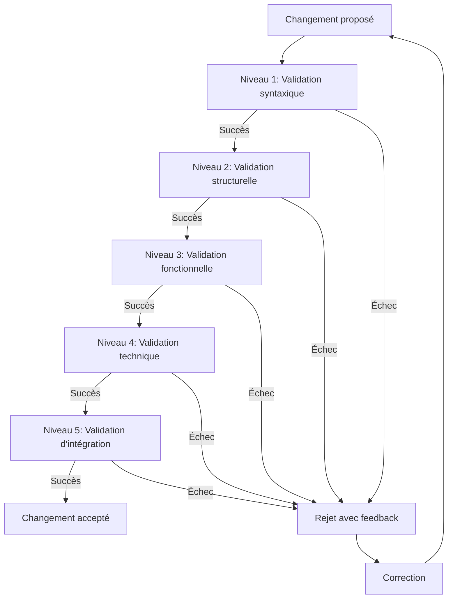
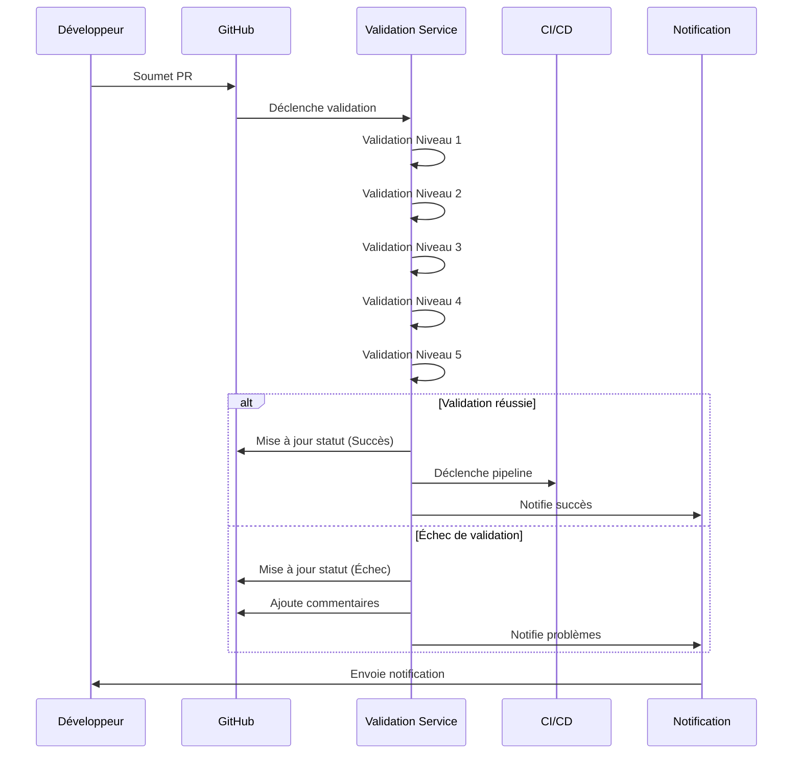

# Système de validation automatique en cascade

## 🔄 Vue d'ensemble

Le système de validation automatique en cascade assure la qualité, la cohérence et la fiabilité de toutes les modifications et migrations en appliquant une série de vérifications progressives, chacune conditionnant le passage à l'étape suivante.

## 🏗️ Architecture de validation

### Concept de validation en cascade



### Niveaux de validation

Le système implémente une approche hiérarchique à 5 niveaux:

| Niveau | Type de validation | Focus | Automatisation |
|--------|-------------------|-------|---------------|
| 1 | Syntaxique | Format, syntaxe, conventions | 100% |
| 2 | Structurelle | Architecture, patterns, organisation | 95% |
| 3 | Fonctionnelle | Comportement, exigences, cas d'usage | 80% |
| 4 | Technique | Performance, sécurité, qualité | 90% |
| 5 | Intégration | Compatibilité, cohérence système | 75% |

## 📋 Processus de validation détaillé

### Niveau 1: Validation syntaxique

**Objectif**: S'assurer que le code ou la documentation respecte les règles syntaxiques et les conventions.

**Validateurs**:

- **CodeLinter**: Applique ESLint/TSLint avec la configuration du projet
- **FormattingValidator**: Vérifie la conformité avec Prettier
- **NamingConventionChecker**: Assure le respect des conventions de nommage
- **ImportOrderValidator**: Valide l'ordre des imports

**Exemple de règle**:
```typescript
// Validateur de conventions de nommage
export class NamingConventionChecker implements Validator {
  async validate(files: CodeFile[]): Promise<ValidationResult> {
    const violations: ValidationViolation[] = [];
    
    for (const file of files) {
      // Vérifier les noms de classes (PascalCase)
      const classMatches = file.content.matchAll(/class\s+(\w+)/g);
      for (const match of classMatches) {
        const className = match[1];
        if (!this.isPascalCase(className)) {
          violations.push({
            file: file.path,
            line: this.getLineNumber(file.content, match.index),
            severity: 'error',
            message: `Le nom de classe "${className}" doit être en PascalCase`,
            rule: 'naming.class.pascal-case'
          });
        }
      }
      
      // Autres vérifications...
    }
    
    return {
      valid: violations.length === 0,
      violations
    };
  }
  
  private isPascalCase(name: string): boolean {
    return /^[A-Z][a-zA-Z0-9]*$/.test(name);
  }
  
  // Autres méthodes d'aide...
}
```

### Niveau 2: Validation structurelle

**Objectif**: Vérifier que le code ou la documentation respecte l'architecture et les patterns définis.

**Validateurs**:

- **ArchitectureValidator**: Assure le respect de l'architecture en couches
- **DependencyValidator**: Vérifie les règles de dépendances entre modules
- **ModuleStructureValidator**: Valide la structure interne des modules
- **ComponentPatternValidator**: Vérifie les patterns de composants

**Exemple de règle**:
```typescript
// Validateur de dépendances
export class DependencyValidator implements Validator {
  constructor(private readonly architectureRules: ArchitectureRules) {}
  
  async validate(files: CodeFile[]): Promise<ValidationResult> {
    const violations: ValidationViolation[] = [];
    const moduleImports = this.extractModuleImports(files);
    
    for (const [moduleName, imports] of Object.entries(moduleImports)) {
      const allowedDependencies = this.architectureRules.getAllowedDependencies(moduleName);
      
      for (const importedModule of imports) {
        if (!allowedDependencies.includes(importedModule)) {
          violations.push({
            file: this.findFileForModule(moduleName, files),
            severity: 'error',
            message: `Le module "${moduleName}" ne devrait pas dépendre de "${importedModule}"`,
            rule: 'architecture.forbidden-dependency'
          });
        }
      }
    }
    
    return {
      valid: violations.length === 0,
      violations
    };
  }
  
  // Méthodes d'extraction des imports...
}
```

### Niveau 3: Validation fonctionnelle

**Objectif**: S'assurer que le changement répond aux exigences fonctionnelles et aux cas d'utilisation.

**Validateurs**:

- **RequirementsCoverageValidator**: Vérifie la couverture des exigences
- **BehaviorSpecValidator**: Valide les spécifications de comportement
- **UseCaseValidator**: Assure que tous les cas d'utilisation sont couverts
- **RegressionDetector**: Détecte les régressions fonctionnelles

**Exemple de règle**:
```typescript
// Validateur de couverture des exigences
export class RequirementsCoverageValidator implements Validator {
  constructor(
    private readonly requirementsRepository: RequirementsRepository,
    private readonly codeToRequirementMapper: CodeToRequirementMapper
  ) {}
  
  async validate(files: CodeFile[]): Promise<ValidationResult> {
    const violations: ValidationViolation[] = [];
    
    // Obtenir les exigences liées au code modifié
    const affectedRequirements = await this.codeToRequirementMapper.mapFilesToRequirements(files);
    
    // Vérifier si toutes les exigences sont couvertes par des tests
    for (const requirement of affectedRequirements) {
      const testCoverage = await this.requirementsRepository.getTestCoverage(requirement.id);
      
      if (!testCoverage || testCoverage.percentage < 85) {
        violations.push({
          severity: 'warning',
          message: `L'exigence "${requirement.name}" (${requirement.id}) a une couverture de test insuffisante (${testCoverage?.percentage || 0}%)`,
          rule: 'functional.test-coverage'
        });
      }
    }
    
    return {
      valid: violations.length === 0,
      violations
    };
  }
}
```

### Niveau 4: Validation technique

**Objectif**: Évaluer les aspects techniques comme la performance, la sécurité et la qualité du code.

**Validateurs**:

- **PerformanceValidator**: Analyse les performances et la complexité
- **SecurityValidator**: Vérifie les vulnérabilités de sécurité
- **CodeQualityValidator**: Évalue la qualité du code (dette technique)
- **AccessibilityValidator**: Vérifie la conformité aux normes d'accessibilité

**Exemple de règle**:
```typescript
// Validateur de performance
export class PerformanceValidator implements Validator {
  async validate(files: CodeFile[]): Promise<ValidationResult> {
    const violations: ValidationViolation[] = [];
    
    for (const file of files) {
      // Analyse de complexité cyclomatique
      const complexity = this.calculateCyclomaticComplexity(file);
      for (const [functionName, value] of Object.entries(complexity)) {
        if (value > 15) {
          violations.push({
            file: file.path,
            severity: value > 25 ? 'error' : 'warning',
            message: `La fonction "${functionName}" a une complexité cyclomatique trop élevée (${value})`,
            rule: 'technical.cyclomatic-complexity',
            metadata: { complexity: value }
          });
        }
      }
      
      // Détection des boucles imbriquées profondes
      const nestedLoops = this.detectNestedLoops(file);
      for (const loop of nestedLoops) {
        if (loop.depth > 2) {
          violations.push({
            file: file.path,
            line: loop.line,
            severity: 'warning',
            message: `Boucles imbriquées de profondeur ${loop.depth} détectées`,
            rule: 'technical.nested-loops'
          });
        }
      }
    }
    
    return {
      valid: violations.filter(v => v.severity === 'error').length === 0,
      violations
    };
  }
  
  // Méthodes d'analyse...
}
```

### Niveau 5: Validation d'intégration

**Objectif**: Vérifier que le changement s'intègre harmonieusement dans le système global.

**Validateurs**:

- **SystemIntegrationValidator**: Teste l'intégration avec le système complet
- **APICohesionValidator**: Vérifie la cohésion des API
- **BackwardCompatibilityValidator**: Assure la compatibilité ascendante
- **DatabaseSchemaValidator**: Valide les modifications de schéma de données

**Exemple de règle**:
```typescript
// Validateur de compatibilité ascendante
export class BackwardCompatibilityValidator implements Validator {
  constructor(
    private readonly apiRegistry: APIRegistry,
    private readonly schemaComparator: SchemaComparator
  ) {}
  
  async validate(files: CodeFile[]): Promise<ValidationResult> {
    const violations: ValidationViolation[] = [];
    
    // Identifier les API modifiées
    const modifiedAPIs = await this.apiRegistry.findModifiedAPIs(files);
    
    for (const api of modifiedAPIs) {
      // Comparer le schéma ancien et nouveau
      const { oldSchema, newSchema } = await this.apiRegistry.getSchemaVersions(api.id);
      const breakingChanges = this.schemaComparator.findBreakingChanges(oldSchema, newSchema);
      
      for (const change of breakingChanges) {
        violations.push({
          file: change.file,
          severity: 'error',
          message: `Changement non rétrocompatible détecté: ${change.description}`,
          rule: 'integration.breaking-change'
        });
      }
    }
    
    return {
      valid: violations.length === 0,
      violations
    };
  }
}
```

## 🔄 Intégration dans le workflow

### Workflow de validation automatisée



### Points de déclenchement

| Événement | Niveaux déclenchés | Description |
|-----------|-------------------|-------------|
| Push sur feature branch | 1, 2 | Validation rapide pour feedback immédiat |
| Création/mise à jour PR | 1, 2, 3, 4 | Validation complète avant revue |
| Merge vers develop | 1, 2, 3, 4, 5 | Validation exhaustive avant intégration |
| Build de nuit | Tous | Validation approfondie avec tests longs |

### Configuration par module

Chaque module peut spécifier sa propre configuration de validation:

```yaml
# validation-config.yml pour un module
module: "auth-service"
validations:
  level1:
    rules:
      - id: naming.class.pascal-case
        severity: error
      - id: formatting.indent
        severity: warning
        config:
          size: 2
  level2:
    rules:
      - id: architecture.forbidden-dependency
        severity: error
        config:
          allowed-imports: ["common", "utils"]
  # Autres niveaux...
```

## 📊 Reporting et métriques

### Tableau de bord de validation

Un tableau de bord dédié présente:

- **Taux de succès**: Pourcentage de validations réussies
- **Violations fréquentes**: Top 10 des règles les plus souvent enfreintes
- **Tendances**: Évolution de la qualité dans le temps
- **Heatmap de modules**: Identification des modules problématiques

### Métriques de qualité

| Métrique | Description | Cible |
|----------|-------------|-------|
| Validation Success Rate | % de validations réussies | >95% |
| First-Pass Success | % de PR validées sans corrections | >80% |
| Time to Fix | Temps moyen pour corriger les violations | <1 jour |
| Critical Issues | Nombre de problèmes critiques | 0 |

## 🧠 Intelligence du système

### Apprentissage continu

Le système affine ses règles et seuils en fonction de:

- L'historique des validations passées
- Les patterns de correction des développeurs
- La fréquence et la gravité des problèmes en production
- Les retours directs des équipes

### Détection contextuelle

```typescript
// Ajustement contextuel de la sévérité
export class ContextualSeverityAdjuster {
  constructor(private readonly projectContext: ProjectContextService) {}
  
  adjustSeverity(violation: ValidationViolation): ValidationViolation {
    // Près d'une release importante?
    if (this.projectContext.isNearMajorRelease()) {
      if (violation.rule.startsWith('integration.') || 
          violation.rule.startsWith('functional.')) {
        return {
          ...violation,
          severity: 'error',  // Élever la sévérité
          message: `[CRITIQUE PRÉ-RELEASE] ${violation.message}`
        };
      }
    }
    
    // Module critique pour la sécurité?
    if (this.projectContext.isCriticalSecurityModule(violation.file)) {
      if (violation.rule.startsWith('security.')) {
        return {
          ...violation,
          severity: 'error',
          message: `[RISQUE SÉCURITÉ] ${violation.message}`
        };
      }
    }
    
    return violation;
  }
}
```

## 🔧 Extension et personnalisation

### API de plugins

Le système prend en charge des plugins personnalisés:

```typescript
// Interface pour les plugins de validation
export interface ValidationPlugin {
  id: string;
  name: string;
  description: string;
  levels: number[];  // Niveaux de validation applicables
  
  initialize(config: any): Promise<void>;
  getValidators(): Validator[];
}

// Exemple d'enregistrement de plugin
validationSystem.registerPlugin(new AccessibilityValidationPlugin({
  wcagLevel: 'AA',
  includeARIA: true
}));
```

### Règles personnalisées

Les équipes peuvent définir leurs propres règles de validation:

```typescript
// Règle personnalisée
export class DomainSpecificTerminologyValidator implements Validator {
  constructor(private readonly terminologyDictionary: Record<string, string>) {}
  
  async validate(files: CodeFile[]): Promise<ValidationResult> {
    const violations: ValidationViolation[] = [];
    
    for (const file of files) {
      for (const [term, preferred] of Object.entries(this.terminologyDictionary)) {
        const regex = new RegExp(`\\b${term}\\b`, 'gi');
        let match;
        
        while ((match = regex.exec(file.content)) !== null) {
          violations.push({
            file: file.path,
            line: this.getLineNumber(file.content, match.index),
            severity: 'warning',
            message: `Terminologie non conforme: "${term}" - utilisez "${preferred}" à la place`,
            rule: 'custom.terminology'
          });
        }
      }
    }
    
    return {
      valid: true, // Ne bloque pas la validation
      violations
    };
  }
}
```

Ce système de validation automatique en cascade assure que chaque changement dans le projet respecte progressivement tous les niveaux de qualité requis, depuis la simple syntaxe jusqu'à l'intégration complète avec le système.
