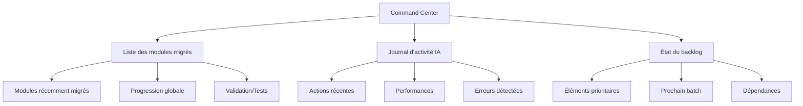

# Interface Remix "Command Center"

## 🎛️ Vue d'ensemble

Le "Command Center" est une interface centralisée basée sur Remix qui permet de surveiller et de gérer l'ensemble du processus de migration. Ce tableau de bord offre une visibilité complète sur l'état d'avancement, les activités récentes et les prochaines priorités.

## 📊 Tableau de bord principal

Accessible via `/admin/dashboard`, cette interface centralise les informations essentielles:

## 🧩 Composants principaux

### Liste des modules migrés

Ce composant affiche:
- Les modules récemment migrés avec leur statut
- Un indicateur de couverture de tests
- Les métriques de qualité du code généré
- Un lien vers le fichier d'audit correspondant

### Journal d'activité IA

Cette section présente:
- Un flux chronologique des actions effectuées par les agents IA
- Les performances et métriques d'utilisation des ressources
- Les problèmes détectés et les résolutions proposées
- Les améliorations suggérées par les agents

### État du backlog

Ce panneau offre:
- Une vue d'ensemble des éléments restants à migrer
- Une hiérarchisation des prochains modules selon leur priorité
- Un graphique des dépendances entre modules
- Des KPIs sur la vitesse de migration et le temps estimé restant

## 🔄 Intégration avec l'écosystème

Le "Command Center" s'intègre avec:
- Les systèmes CI/CD pour déclencher des migrations
- Les outils de gestion de projet pour synchroniser les priorités
- Les systèmes de notifications pour alerter en cas d'anomalies
- Les outils d'analyse pour suivre les tendances de qualité

Cette interface centralisée facilite la prise de décision et optimise la gestion du projet de migration en temps réel.
