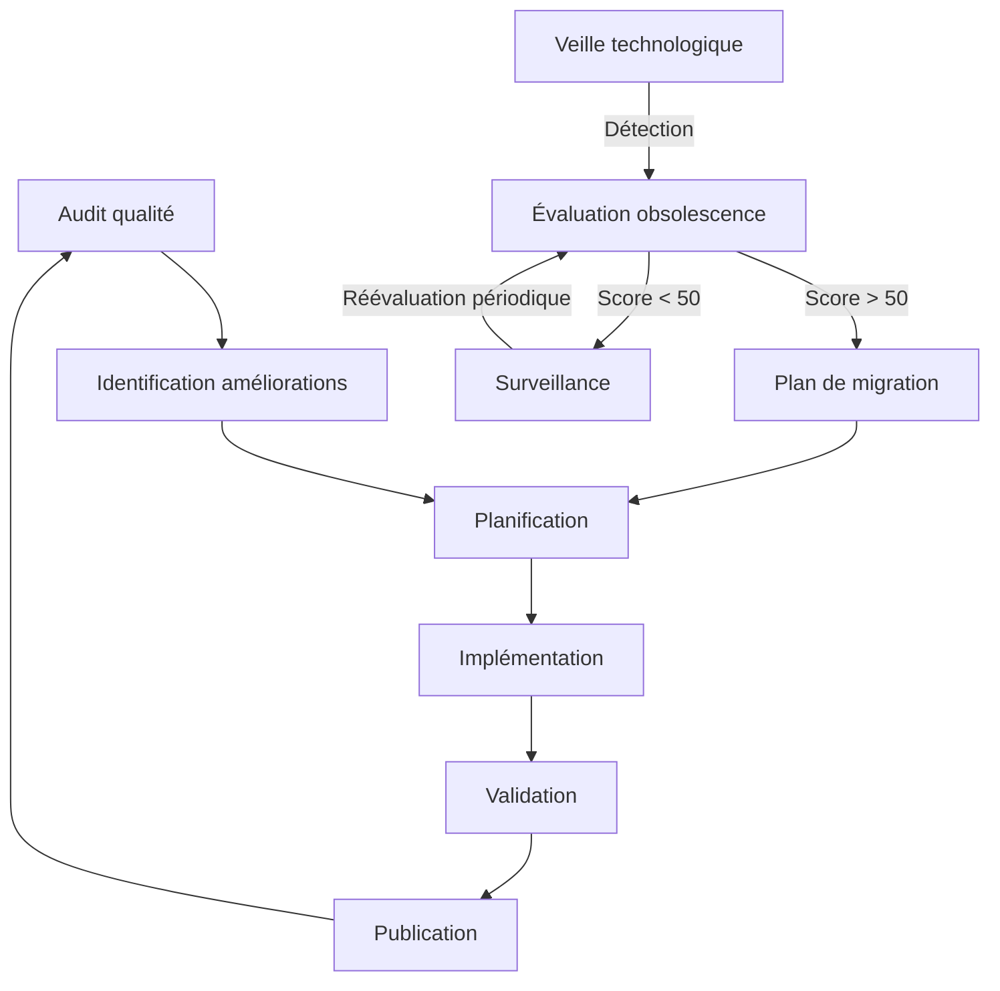

# Méthodologie d'amélioration continue

## 🔄 Processus continu d'amélioration

### Cycle d'évolution documentaire et technologique

### Gouvernance documentaire et technologique

- **Comité de qualité** : Revue trimestrielle des standards et technologies
- **Responsable documentation** : Garant de l'excellence continue
- **Responsable veille technologique** : Suivi des évolutions et alertes
- **Contributeurs** : Formation aux bonnes pratiques
- **Automation** : Amélioration constante des outils d'assistance

### Intégration du processus d'évolution technologique

Le processus d'amélioration continue intègre désormais un mécanisme de veille technologique qui:

1. **Détecte** automatiquement les technologies obsolètes dans le cahier des charges
2. **Évalue** leur niveau d'obsolescence selon des critères objectifs
3. **Planifie** leur migration vers des alternatives modernes
4. **Met à jour** la documentation de façon cohérente

Cette approche garantit que le cahier des charges reste non seulement structurellement robuste, mais aussi technologiquement pertinent à tout moment.