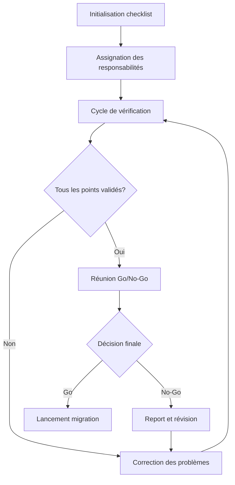

# Checklist d'avant lancement – Migration IA sécurisée

## 🛡️ Vue d'ensemble

Cette checklist complète garantit que toutes les mesures nécessaires sont prises avant le lancement d'une migration IA, afin d'assurer un processus sécurisé, conforme et efficace. Elle couvre les aspects de sécurité, qualité, performance, gouvernance et préparation opérationnelle.

## 📋 Checklist principale

### Préparation des données et du code source

| # | Vérification | Statut | Responsable | Notes |
|---|--------------|--------|-------------|-------|
| 1.1 | Code source disponible et complet | ⬜ | Tech Lead | |
| 1.2 | Permissions d'accès au code confirmées | ⬜ | Sécurité | |
| 1.3 | Inventaire des modules à migrer finalisé | ⬜ | Architecte | |
| 1.4 | Dépendances externes identifiées | ⬜ | Tech Lead | |
| 1.5 | Données sensibles identifiées et masquées | ⬜ | DPO | |
| 1.6 | Commentaires contenant des informations sensibles retirés | ⬜ | Dev Team | |
| 1.7 | Code source nettoyé des éléments non pertinents | ⬜ | Dev Team | |
| 1.8 | Base de connaissances à jour pour les contextes spécifiques | ⬜ | IA Lead | |

### Configuration du pipeline IA

| # | Vérification | Statut | Responsable | Notes |
|---|--------------|--------|-------------|-------|
| 2.1 | Version de production des agents IA déployée | ⬜ | DevOps | |
| 2.2 | Limites de tokens et quotas vérifiés | ⬜ | IA Lead | |
| 2.3 | Modèles IA à jour avec les versions stables | ⬜ | IA Lead | |
| 2.4 | Paramètres de température et de génération optimisés | ⬜ | IA Lead | |
| 2.5 | Prompts de migration validés et verrouillés | ⬜ | IA Lead | |
| 2.6 | Règles de transformation spécifiques configurées | ⬜ | Architecte | |
| 2.7 | Système de file d'attente configuré et testé | ⬜ | DevOps | |
| 2.8 | Mécanismes de reprise sur erreur en place | ⬜ | DevOps | |

### Tests et validation

| # | Vérification | Statut | Responsable | Notes |
|---|--------------|--------|-------------|-------|
| 3.1 | Tests sur échantillons représentatifs effectués | ⬜ | QA | |
| 3.2 | Taux de réussite des migrations supérieur à 90% | ⬜ | QA | |
| 3.3 | Tests unitaires générés validés | ⬜ | Dev Team | |
| 3.4 | Tests d'intégration réussis | ⬜ | QA | |
| 3.5 | Performances des modules migrés validées | ⬜ | Performance | |
| 3.6 | Exactitude fonctionnelle vérifiée | ⬜ | Business Analyst | |
| 3.7 | Validation par échantillonnage manuel effectuée | ⬜ | Tech Lead | |
| 3.8 | Résultats des tests automatisés documentés | ⬜ | QA | |

### Sécurité et conformité

| # | Vérification | Statut | Responsable | Notes |
|---|--------------|--------|-------------|-------|
| 4.1 | Analyse de code statique sur résultats réussie | ⬜ | Sécurité | |
| 4.2 | Tests de vulnérabilité effectués | ⬜ | Sécurité | |
| 4.3 | Conformité RGPD vérifiée | ⬜ | DPO | |
| 4.4 | Licences logicielles vérifiées | ⬜ | Juridique | |
| 4.5 | Politiques de stockage des données respectées | ⬜ | Sécurité | |
| 4.6 | Accès aux API IA sécurisé | ⬜ | Sécurité | |
| 4.7 | Chiffrement des données sensibles vérifié | ⬜ | Sécurité | |
| 4.8 | Audit de sécurité complet documenté | ⬜ | RSSI | |

### Préparation opérationnelle

| # | Vérification | Statut | Responsable | Notes |
|---|--------------|--------|-------------|-------|
| 5.1 | Ressources infrastructure disponibles | ⬜ | Infra | |
| 5.2 | Surveillance et alertes configurées | ⬜ | DevOps | |
| 5.3 | Procédure de rollback testée | ⬜ | Tech Lead | |
| 5.4 | Documentation du code généré validée | ⬜ | Tech Writer | |
| 5.5 | Équipes support formées | ⬜ | Formation | |
| 5.6 | Plan de communication déployé | ⬜ | Communication | |
| 5.7 | Périodes de maintenance planifiées | ⬜ | Product Owner | |
| 5.8 | Processus de gestion des incidents prêt | ⬜ | Support | |

### Gouvernance et approbations

| # | Vérification | Statut | Responsable | Notes |
|---|--------------|--------|-------------|-------|
| 6.1 | Rapport d'évaluation des risques complété | ⬜ | Risk Manager | |
| 6.2 | Approbation technique obtenue | ⬜ | CTO | |
| 6.3 | Approbation métier obtenue | ⬜ | Business Owner | |
| 6.4 | Approbation sécurité obtenue | ⬜ | RSSI | |
| 6.5 | Critères de succès définis et approuvés | ⬜ | Project Manager | |
| 6.6 | ROI et métriques de suivi en place | ⬜ | Product Owner | |
| 6.7 | Rétroaction des premières migrations intégrée | ⬜ | Tech Lead | |
| 6.8 | Go/No-Go final documenté | ⬜ | Steering Committee | |

## 🔄 Processus de vérification

### Étapes du processus

### Niveaux de criticité

| Niveau | Description | Action requise |
|--------|-------------|----------------|
| Critique | Bloquant pour le lancement | Résolution obligatoire |
| Élevé | Risque significatif | Résolution recommandée ou plan d'atténuation |
| Moyen | Impact potentiel | Évaluation et décision cas par cas |
| Faible | Impact mineur | Documentation et surveillance |

## 🚨 Plan de réponse aux incidents

### Types d'incidents potentiels

| Type d'incident | Signes précurseurs | Réponse immédiate | Équipe d'intervention |
|-----------------|-------------------|-------------------|----------------------|
| Fuite de données | Données sensibles détectées dans le code migré | Arrêt immédiat, isolation des résultats | Sécurité, DPO, Juridique |
| Régression fonctionnelle | Échecs de tests, comportement inattendu | Rollback des modules affectés | QA, Dev, Support |
| Défaillance technique | Erreurs, timeouts, saturation ressources | Suspension des migrations en cours | DevOps, Infra, Tech Lead |
| Problème de conformité | Alerte outil compliance, audit externe | Arrêt contrôlé, évaluation | Juridique, Compliance, DPO |

### Procédure de rollback

1. **Activation** : Décision prise par Tech Lead ou supérieur
2. **Exécution** : Restauration version précédente via script automatisé
3. **Vérification** : Tests de non-régression
4. **Communication** : Notification des parties prenantes
5. **Analyse** : Investigation post-incident
6. **Documentation** : Mise à jour du registre des incidents

## 📝 Documentation et suivi

### Registre de vérification

Un registre de vérification sera maintenu avec:
- Horodatage de chaque vérification
- Responsable ayant effectué la vérification
- Preuves/artefacts associés
- Commentaires et observations

### Rapport final

Le rapport final avant lancement inclura:
- Résumé de la checklist complétée
- Métriques clés (taux de succès tests, couverture, etc.)
- Risques résiduels et stratégies d'atténuation
- Recommandations pour les futures migrations

### Cycle d'amélioration continue

Après chaque migration, cette checklist sera revue et améliorée pour intégrer les leçons apprises et optimiser les futures migrations.

## 👥 Rôles et responsabilités

| Rôle | Responsabilités principales | Points checklist |
|------|------------------------------|------------------|
| Tech Lead | Supervision technique, validation code | 1.1, 1.4, 3.7, 5.3, 6.7 |
| IA Lead | Supervision agents IA, modèles, prompts | 1.8, 2.2, 2.3, 2.4, 2.5 |
| QA | Tests, validation qualité | 3.1, 3.2, 3.4, 3.8 |
| Sécurité | Audits sécurité, vulnérabilités | 1.2, 4.1, 4.2, 4.5, 4.6 |
| DevOps | Infrastructure, déploiement, monitoring | 2.1, 2.7, 2.8, 5.2 |
| Architecte | Structure, patterns, règles transformation | 1.3, 2.6 |
| RSSI | Approbation sécurité finale | 4.8, 6.4 |
| DPO | Conformité données personnelles | 1.5, 4.3 |

Cette checklist garantit une approche méthodique et sécurisée pour les migrations IA, minimisant les risques et maximisant les chances de succès dès le premier déploiement.
