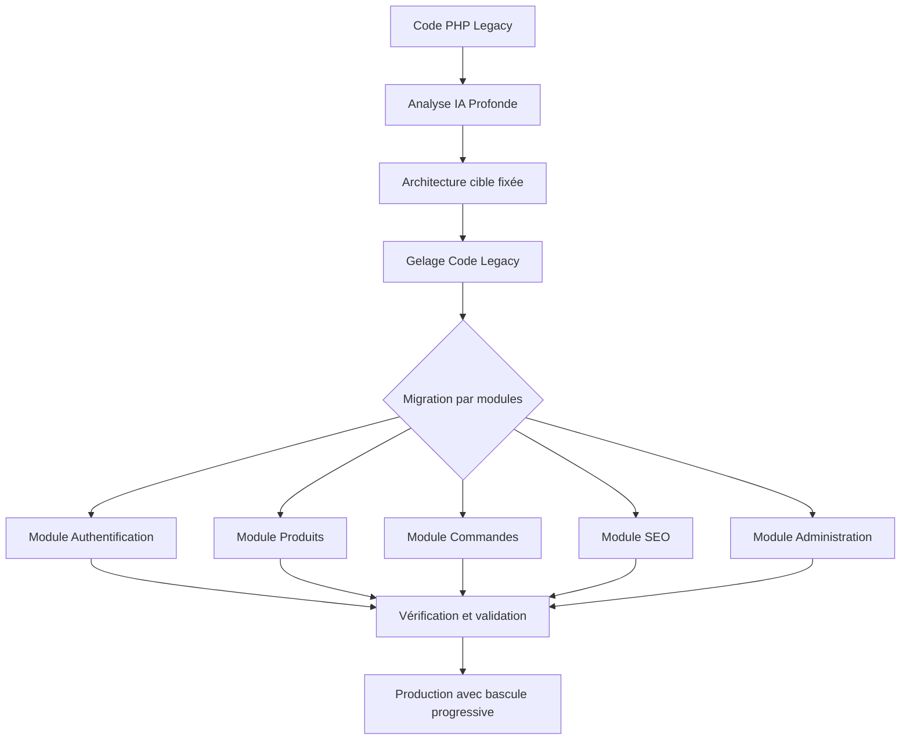
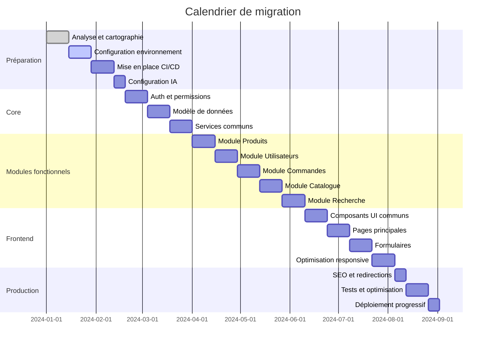

# 📝 Feuille de Route Complète – Migration PHP vers NestJS + Remix

## 🎯 Objectif global

Migrer progressivement **240 fichiers PHP** et **1 base MySQL (28M lignes)** vers une architecture moderne :
- 🧠 **Backend :** NestJS + Prisma + PostgreSQL
- 🎨 **Frontend :** Remix (2.15+), composants TSX, Tailwind
- 🔗 **Interopérabilité :** maintien des URLs indexées + logique SEO
- ⚙️ **Orchestration :** n8n + MCP (Model Context Protocol)
- 📦 **Méthodologie :** migration modulaire, versionnée, rollbackable

## 📊 Profil du projet à migrer

| Métrique | Valeur | Détails |
|----------|--------|---------|
| **Fichiers PHP** | 240 | Backend + Vue + Controllers |
| **Base de données** | MySQL | 28M lignes, 42 tables |
| **Complexité** | Moyenne | Logique métier distribuée |
| **Dépendances** | Modérées | 14 bibliothèques PHP externes |
| **Tests existants** | Limités | Couverture < 30% |
| **SEO** | Critique | ~12K URLs indexées, trafic organique important |

## 🔄 Approche de migration progressive

## ⏱️ Phases de migration

### Phase 1: Préparation et configuration (4 semaines)

| Semaine | Activité | Livrable | Responsable |
|---------|----------|----------|-------------|
| 1 | Analyse du code legacy et cartographie des dépendances | Rapport d'analyse, graphe de dépendances | Architecte + IA |
| 2 | Configuration de l'environnement cible | Infrastructure NestJS+Remix opérationnelle | DevOps |
| 3 | Mise en place des pipelines CI/CD | Workflows GitHub Actions fonctionnels | DevOps |
| 4 | Configuration des agents IA et des prompts | Agents IA configurés et testés | Lead IA |

**Points de contrôle:**
- ✅ Environnement de développement complet configuré
- ✅ Mécanismes de versioning et rollback validés
- ✅ Agents IA calibrés sur échantillons représentatifs

### Phase 2: Migration du noyau et des services communs (6 semaines)

| Semaine | Activité | Livrable | Responsable |
|---------|----------|----------|-------------|
| 5-6 | Migration de l'authentification et des permissions | Module Auth NestJS fonctionnel | Team Backend |
| 7-8 | Migration du modèle de données et relations Prisma | Schéma Prisma + migrations | Data Engineer |
| 9-10 | Migration des services utilitaires communs | Services partagés NestJS | Team Backend |

**Points de contrôle:**
- ✅ Système d'authentification complètement migré et testé
- ✅ Validation de la performance du schéma Prisma
- ✅ Tests d'intégration des services communs réussis

### Phase 3: Migration des modules fonctionnels (10 semaines)

| Semaine | Module | Complexité | Priorité |
|---------|--------|------------|----------|
| 11-12 | Module Produits | Élevée | Critique |
| 13-14 | Module Utilisateurs | Moyenne | Haute |
| 15-16 | Module Commandes | Élevée | Critique |
| 17-18 | Module Catalogue | Moyenne | Moyenne |
| 19-20 | Module Recherche | Élevée | Haute |

**Approche pour chaque module:**
1. Analyse IA spécifique au module
2. Migration du modèle de données
3. Migration des services backend
4. Migration des composants frontend
5. Tests automatisés
6. Revue manuelle et validation

### Phase 4: Migration de l'interface utilisateur (8 semaines)

| Semaine | Activité | Livrable | Responsable |
|---------|----------|----------|-------------|
| 21-22 | Migration des composants UI communs | Bibliothèque de composants Remix/TSX | Team Frontend |
| 23-24 | Migration des pages principales | Routes Remix prioritaires | Team Frontend |
| 25-26 | Migration des formulaires et validations | Formulaires et validations | Team Frontend |
| 27-28 | Optimisation responsive et desktop | UI responsive complète | Team Frontend |

**Points de contrôle:**
- ✅ Bibliothèque de composants UI complète et documentée
- ✅ Tests E2E des parcours utilisateurs critiques
- ✅ Validation des performances frontend (Core Web Vitals)

### Phase 5: Optimisation, SEO et mise en production (4 semaines)

| Semaine | Activité | Livrable | Responsable |
|---------|----------|----------|-------------|
| 29 | Configuration SEO et redirections | Plan de redirections 301, méta-tags | SEO Specialist |
| 30 | Tests de charge et optimisations | Rapport de performance | Performance Engineer |
| 31 | Tests utilisateurs et corrections | Rapport de tests, corrections | QA + UX |
| 32 | Déploiement progressif (canary) | Application en production | DevOps |

**Points de contrôle:**
- ✅ Validation des performances sur environnement de staging
- ✅ Vérification de l'indexation et des URLs critiques
- ✅ Rollback automatisé testé et fonctionnel

## 📈 Stratégie de versionnement

| Version | Contenu | Rollback Strategy |
|---------|---------|-------------------|
| 1.0.0-alpha | Migration backend core + authentification | Git revert + DB rollback script |
| 1.0.0-beta | + Modules produits et utilisateurs | Dual-write DB + feature flags |
| 1.1.0-beta | + Modules commandes et catalogue | Shadow mode + feature flags |
| 1.2.0-beta | + Interface utilisateur complète | A/B testing graduel |
| 1.0.0 | Version stable complète | Basculement complet |

## 🔍 Risques et stratégies d'atténuation

| Risque | Probabilité | Impact | Stratégie d'atténuation |
|--------|-------------|--------|-------------------------|
| Incompatibilité de données legacy | Moyenne | Élevé | Migration progressive avec validation |
| Régression de performance | Moyenne | Élevé | Benchmarks continus et monitoring |
| Perte de SEO | Faible | Critique | Préservation des URLs et plan 301 |
| Défaillance des agents IA | Moyenne | Moyen | Supervision humaine et validation manuelle |
| Complexité imprévue | Élevée | Moyen | Marge temporelle + expertise ponctuelle |

## 📊 Métriques de succès

| Métrique | Cible | Méthode de mesure |
|----------|-------|-------------------|
| Taux de réussite de migration | > 98% | % de fonctionnalités migrées sans bug |
| Performance frontend | < 2s FCP, < 4s LCP | Lighthouse + RUM |
| Performance backend | < 200ms p95 | Monitoring APM |
| Précision fonctionnelle | 100% | Tests automatisés + validation manuelle |
| Trafic SEO | Maintien à 95%+ | Google Search Console, Analytics |
| Dette technique | Réduction de 80% | SonarQube, audits de code |

## 📅 Calendrier et jalons

## 🧩 Ressources et équipe

| Rôle | Responsabilités | Allocation |
|------|-----------------|------------|
| Lead Architecte | Architecture globale, décisions techniques | 100% |
| DevOps Engineer | Infrastructure, CI/CD, déploiement | 75% |
| Lead IA | Configuration et supervision des agents IA | 100% |
| Backend Developers | Migration des services NestJS | 3x 100% |
| Frontend Developers | Migration UI vers Remix | 2x 100% |
| Data Engineer | Migration de schéma et optimisation | 100% |
| QA Engineer | Tests et validation | 100% |
| SEO Specialist | Optimisation SEO et redirections | 50% |

## 🔄 Processus de contrôle et validation

1. **Validation quotidienne**:
   - Standup synchronisé
   - Revue des migrations automatisées
   - Ajustement des prompts et configurations IA

2. **Validation hebdomadaire**:
   - Démo des fonctionnalités migrées
   - Test de régression automatisé
   - Revue de code collective

3. **Validation de phase**:
   - Tests d'acceptation complets
   - Audit de performance et sécurité
   - Go/No-Go pour passage à la phase suivante

## 📣 Communication et reporting

- **Dashboard temps réel**: Métriques de progression, couverture, performances
- **Rapport hebdomadaire**: Progression, blocages, risques
- **Documentation continue**: Mise à jour des choix techniques et patterns
- **Matrice RACI**: Clarification des rôles et responsabilités

Cette feuille de route servira de guide principal pour le projet de migration, permettant de suivre la progression, d'anticiper les risques et d'assurer la coordination entre les différentes équipes impliquées.
