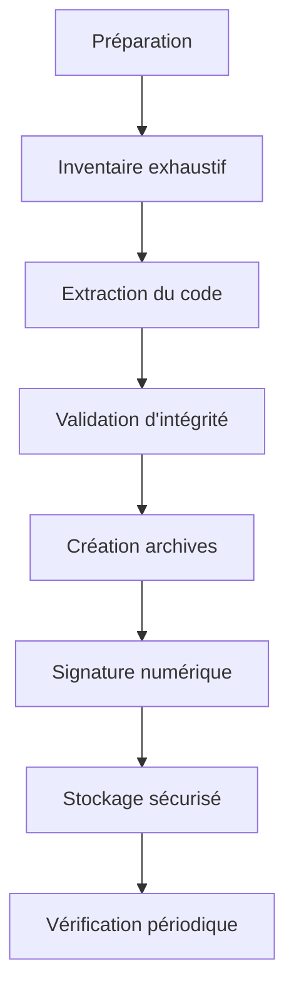
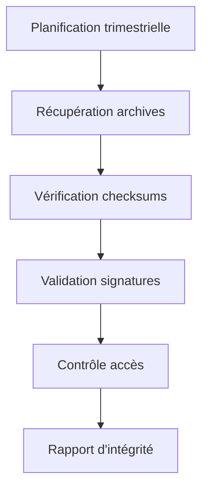

# 🔒 Gel du code legacy PHP et SQL

## 🎯 Objectif

Créer une copie immuable (gelée) du code legacy PHP et SQL avant toute intervention de migration pour garantir:
- Une préservation intégrale de l'état initial du code
- Une référence non altérable pour la validation des migrations
- Une possibilité de rollback ultime en cas de nécessité
- Une traçabilité complète du patrimoine applicatif

## 📋 Processus de gel du code

### Étapes du processus



### 1. Préparation et planification

- **Identification de la portée**: Définir précisément le périmètre du code à geler
- **Coordination**: Planifier une fenêtre de gel en coordination avec les équipes de développement
- **Notification**: Informer toutes les parties prenantes du gel imminent

### 2. Inventaire exhaustif

- **Recensement des éléments de code**:
  - Scripts PHP
  - Classes et libraries
  - Modules et plugins
  - Scripts SQL (schémas, procédures stockées, fonctions)
  - Assets liés (configurations, dépendances)
  - Documentation technique associée

- **Cartographie des dépendances**:
  - Dépendances internes entre modules
  - Bibliothèques tierces
  - Services externes consommés

### 3. Extraction et gel du code

| Type | Méthode d'extraction | Informations à conserver |
|------|----------------------|--------------------------|
| Code PHP | Export du système de contrôle de version | Structure complète, historique, métadonnées |
| Schémas SQL | Dump complet avec `mysqldump` ou équivalent | Structure, données référentielles, contraintes |
| Procédures stockées | Export dédié des routines | Signatures, paramètres, corps |
| Configuration | Copie des fichiers de configuration | Paramètres d'environnement, fichiers .env, .ini |
| Documentation | Export des wikis, guides techniques | Versions PDF/HTML statiques |

### 4. Validation d'intégrité

- **Vérification structurelle**:
  - Compilation de contrôle pour détecter les erreurs syntaxiques
  - Analyse statique pour garantir la complétude
  - Validation des imports/includes/requires

- **Vérification de complétude**:
  - Exécution de scripts pour vérifier les dépendances manquantes
  - Validation croisée avec l'inventaire

## 🔐 Mécanismes d'immuabilité

### Création d'archives scellées

1. **Génération d'archives**:
   ```bash
   # Exemple pour une archive tar avec compression gzip
   tar -czf legacy-code-YYYYMMDD.tar.gz /path/to/source/code
   
   # Exemple pour une archive ZIP avec mot de passe
   zip -er legacy-code-YYYYMMDD.zip /path/to/source/code
   ```

2. **Calcul d'empreintes numériques**:
   ```bash
   # Générer des checksums pour chaque fichier
   find /path/to/source/code -type f -exec md5sum {} \; > checksums.md5
   
   # Générer un hash SHA-256 de l'archive complète
   sha256sum legacy-code-YYYYMMDD.tar.gz > legacy-code-YYYYMMDD.tar.gz.sha256
   ```

3. **Horodatage certifié**:
   - Utiliser un service d'horodatage de confiance pour certifier la date du gel
   - Consigner l'horodatage dans un registre sécurisé

### Signature numérique

1. **Création de signature GPG**:
   ```bash
   # Signer l'archive avec la clé GPG du responsable technique
   gpg --armor --detach-sign legacy-code-YYYYMMDD.tar.gz
   ```

2. **Certification multi-parties**:
   - Signature par le responsable technique
   - Contre-signature par le responsable sécurité
   - Validation par un représentant métier

## 📦 Stockage sécurisé

### Solution de stockage

| Type de stockage | Avantages | Inconvénients | Usage |
|------------------|-----------|---------------|-------|
| Archivage légal numérique | Valeur probatoire, horodatage | Coût, complexité | Contexte d'audit ou légal |
| Stockage immuable (WORM) | Immuabilité technique garantie | Infrastructure dédiée | Standard recommandé |
| Dépôt Git avec branches protégées | Familier, diffusion contrôlée | Protection softwaré | Usage quotidien |
| Stockage cloud avec versioning | Accessibilité, disponibilité | Dépendance externe | Backup secondaire |
| Support physique sanctuarisé | Isolation réseau complète | Accès difficile | Archive ultime |

### Configuration recommandée

1. **Stockage principal**: Système WORM (Write Once Read Many) dédié
   - Règles de rétention strictes (minimum 5 ans)
   - Gestion des accès basée sur les rôles
   - Journalisation des consultations

2. **Copies redondantes**:
   - Stockage cloud sécurisé avec verrouillagé d'objets (AWS S3 Glacier avec lock légal)
   - Dépôt Git interne avec branches protégées par signature
   - Support physique offline sécurisé (disque WORM)

3. **Métadonnées et documentation**:
   - Registre des archives avec empreintes numériques
   - Procédures d'accès documentées
   - Journal d'accès

## 🔄 Processus de vérification périodique

### Vérification d'intégrité programmée



1. **Fréquence**: Trimestrielle
2. **Responsable**: Équipe sécurité IT
3. **Procédure**:
   - Extraction des archives de référence
   - Vérification des signatures numériques
   - Validation des checksums
   - Test de restauration sur environnement isolé
   - Documentation des résultats

## 📋 Procédure d'accès

### Processus de consultation

1. **Demande formelle** avec justification documentée
2. **Approbation** par le propriétaire des données et responsable sécurité
3. **Accès en lecture seule** dans un environnement contrôlé
4. **Journalisation** de toute consultation
5. **Nettoyage** post-consultation de tous les environnements temporaires

### Restauration d'urgence

En cas de besoin de restauration d'urgence:

1. **Décision de rollback** documentée et approuvée par le comité de crise
2. **Vérification préalable** de l'intégrité des archives
3. **Restauration en environnement isolé** pour validation
4. **Plan de bascule** documenté avec points de non-retour
5. **Activation** selon procédure de gestion de crise

## 🧐 Audit et conformité

- **Journal d'audit**: Historique complet des accès, vérifications et tentatives de manipulation
- **Processus de revue**: Audit trimestriel des mécanismes de protection
- **Conformité réglementaire**: Documentation pour satisfaire aux exigences légales et normatives

## 📝 Documentation associée

- **Inventaire des composants gelés**: Liste exhaustive avec métadonnées
- **Empreintes numériques**: Fichier de checksums contresigné
- **Procédures de vérification**: Scripts et outils pour validation d'intégrité
- **Contacts d'urgence**: Personnes habilitées pour la gestion des archives
