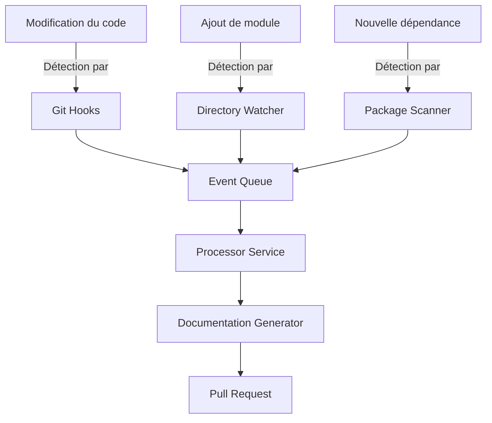

# Mise à jour automatique du cahier des charges

## 🔄 Principe de synchronisation automatique

Le cahier des charges reste parfaitement à jour, versionné et opérationnel grâce à un système de mise à jour automatique qui s'active à chaque modification ou ajout d'un module, d'une stratégie ou d'une dépendance technique.

## 📦 Mécanisme de détection des changements

### Surveillance des modifications



### Types de changements surveillés

| Type de changement | Méthode de détection | Déclencheur |
|-------------------|---------------------|-------------|
| Modifications de code | Git pre-commit hook | `git commit` |
| Ajout de module | Directory watcher | Nouveau répertoire |
| Modification de module | File checksum monitor | Fichier modifié |
| Nouvelle dépendance | package.json diff | `npm install` |
| Mise à jour dépendance | package-lock.json diff | `npm update` |
| Nouvelle stratégie | Strategy registry | Classe implémentant IStrategy |

## 📝 Processus de mise à jour documentaire

### Flux de travail complet

1. **Détection du changement**
   - Les hooks Git et watchers détectent toute modification
   - Un événement est publié dans la file d'attente

2. **Analyse d'impact**
   - Le service ProcessorService analyse le changement
   - Il détermine les sections du cahier des charges impactées

3. **Génération de contenu**
   - Le DocumentationGenerator crée ou met à jour le contenu nécessaire
   - Utilisation d'agents IA pour générer du texte contextuel

4. **Validation et formatage**
   - Vérification de cohérence avec les standards du projet
   - Formatage selon les modèles établis

5. **Intégration**
   - Création d'une Pull Request (changements majeurs)
   - Ou commit direct (changements mineurs)

### Exemple d'intégration côté code

```typescript
// Hook de détection ajouté au système de modules
@Injectable()
export class ModuleChangeDetector implements OnModuleInit {
  constructor(
    private readonly documentationService: DocumentationService,
    private readonly eventBus: EventBus
  ) {}

  onModuleInit() {
    // Enregistrer les observateurs pour détecter les changements
    this.watchForModuleChanges();
  }

  private watchForModuleChanges() {
    const watcher = fs.watch('./src/modules', { recursive: true }, async (eventType, filename) => {
      if (eventType === 'change' || eventType === 'rename') {
        const moduleInfo = this.extractModuleInfo(filename);
        
        // Publier l'événement de changement de module
        this.eventBus.publish(new ModuleChangedEvent({
          moduleName: moduleInfo.name,
          type: eventType,
          timestamp: new Date(),
          filePath: filename
        }));
      }
    });
  }
}

// Gestionnaire pour mettre à jour la documentation
@EventsHandler(ModuleChangedEvent)
export class ModuleChangeHandler implements IEventHandler<ModuleChangedEvent> {
  constructor(private readonly documentationService: DocumentationService) {}

  async handle(event: ModuleChangedEvent) {
    // Analyser l'impact du changement
    const impactAnalysis = await this.documentationService.analyzeModuleChange(event);
    
    // Mettre à jour la documentation si nécessaire
    if (impactAnalysis.requiresDocUpdate) {
      await this.documentationService.updateDocumentation({
        section: impactAnalysis.affectedSections,
        content: impactAnalysis.generatedContent,
        changeType: impactAnalysis.changeType,
        module: event.moduleName
      });
      
      // Notifier de la mise à jour
      console.log(`📚 Documentation mise à jour pour le module: ${event.moduleName}`);
    }
  }
}
```

## 🔄 Versionnement automatique

### Stratégie de versionnement

Le versionnement du cahier des charges suit une approche sémantique automatisée:

| Type de changement | Impact sur version | Exemple |
|-------------------|-------------------|---------|
| Nouvelle fonctionnalité | Incrémente MINOR | 1.4.0 → 1.5.0 |
| Correctif ou clarification | Incrémente PATCH | 1.4.2 → 1.4.3 |
| Changement structurel | Incrémente MAJOR | 1.4.2 → 2.0.0 |

### Gestion des versions

```typescript
// Extrait du service de versionnement
export class DocumentVersionManager {
  async updateVersion(changeContext: ChangeContext): Promise<Version> {
    const currentVersion = await this.getCurrentVersion();
    const newVersion = this.calculateNewVersion(currentVersion, changeContext);
    
    await this.saveNewVersion(newVersion);
    
    // Créer une release Git
    if (changeContext.importance >= ImportanceLevel.MEDIUM) {
      await this.gitService.createRelease(
        `v${newVersion.major}.${newVersion.minor}.${newVersion.patch}`,
        `Documentation version ${newVersion.major}.${newVersion.minor}.${newVersion.patch}`,
        changeContext.changelog
      );
    }
    
    return newVersion;
  }
  
  private calculateNewVersion(currentVersion: Version, context: ChangeContext): Version {
    // Logique de détermination du type de changement
    switch (context.changeType) {
      case ChangeType.NEW_FEATURE:
      case ChangeType.NEW_MODULE:
        return { ...currentVersion, minor: currentVersion.minor + 1, patch: 0 };
        
      case ChangeType.BREAKING_CHANGE:
      case ChangeType.ARCHITECTURE_CHANGE:
        return { major: currentVersion.major + 1, minor: 0, patch: 0 };
        
      case ChangeType.FIX:
      case ChangeType.CLARIFICATION:
      default:
        return { ...currentVersion, patch: currentVersion.patch + 1 };
    }
  }
}
```

## 📋 Validation opérationnelle

### Tests automatisés

Chaque mise à jour du cahier des charges déclenche automatiquement:

1. **Vérifications structurelles**
   - Validation des liens internes
   - Vérification de la structure des titres
   - Validation des formats de code

2. **Tests de contenu**
   - Vérification de cohérence terminologique
   - Détection des contradictions
   - Validation de couverture fonctionnelle

3. **Tests d'intégration**
   - Génération d'aperçu HTML/PDF
   - Vérification de l'intégration avec le dashboard

### Maintenance proactive

Le système effectue régulièrement des opérations de maintenance:

- **Analyse de qualité** - Évaluation style/clarté
- **Détection de redondances** - Identification du contenu dupliqué
- **Optimisation des exemples** - Mise à jour des extraits de code
- **Vérification des références externes** - Validation des liens

## 🔔 Notifications et alertes

### Système de notification

Les parties prenantes sont notifiées des mises à jour selon leurs préférences:

```yaml
# Configuration des notifications (extrait)
notifications:
  channels:
    - type: "slack"
      webhook: "https://hooks.slack.com/services/XXX/YYY/ZZZ"
      events: ["major_update", "new_module"]
    - type: "email"
      recipients: ["team@example.com"]
      events: ["weekly_summary"]
    - type: "dashboard"
      events: ["all"]
  
  rules:
    - role: "product_owner"
      receive: ["major_update", "new_module", "weekly_summary"]
    - role: "developer"
      receive: ["technical_dependency", "api_change"]
    - role: "architect"
      receive: ["all"]
```

### Tableau de bord de suivi

Un tableau de bord accessible via `/admin/documentation/updates` fournit:

- Historique des mises à jour récentes
- Aperçu des modifications en attente
- Statistiques de couverture documentaire
- Alertes pour sections nécessitant révision

Ce mécanisme de mise à jour automatique garantit que le cahier des charges reste toujours synchronisé avec l'état réel du projet, sans nécessiter d'intervention manuelle pour chaque évolution.
