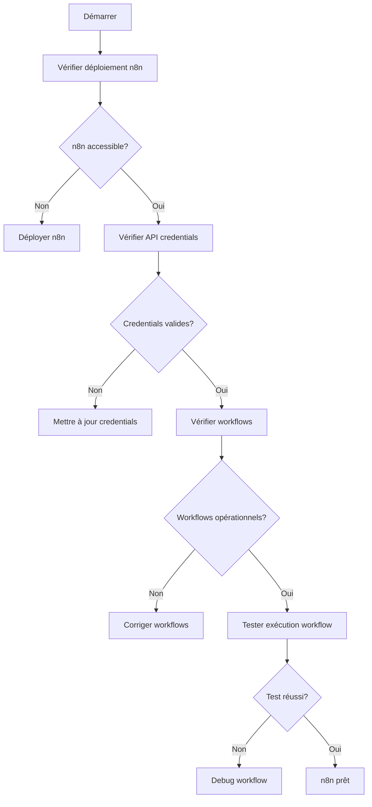

# ✅ 2. Vérification et validation de l'environnement de test

🎯 Objectif : S'assurer que tous les outils critiques de migration sont opérationnels, interconnectés, et correctement configurés avant le lancement du pipeline.

---

## 🔍 Vérification de l'environnement

| Outil                      | Objectif |
|----------------------------|----------|
| **n8n**                    | Orchestrateur d'agents IA. Doit être déployé avec accès au filesystem pour lecture/écriture. |
| **Docker / Code Server**  | Nécessaires pour l'exécution des agents, tâches automatisées, scripts de conversion et analyse. |
| **MCP**                    | Doit être configuré avec un token GitHub valide pour créer/valider des PR automatisées. |
| **Supabase** ou **CSV centralisé** | Base de données ou fichier de suivi des fichiers PHP migrés (statut, date, responsable, delta). |

## 🛠️ Liste de contrôle des composants

### 1. Vérification de n8n



#### Étapes de validation:
1. **Accessibilité**: Confirmer que l'instance n8n est accessible à `http://<n8n-host>:5678`
2. **Authentication**: Vérifier les identifiants d'accès à l'interface
3. **Permissions**: Confirmer les droits d'accès au système de fichiers
   ```bash
   # Vérifier les permissions du conteneur n8n
   docker exec n8n ls -la /data/shared
   ```
4. **Workflows**: Valider la présence et le statut des workflows requis:
   - Workflow d'analyse de code PHP
   - Workflow de transformation PHP → TypeScript
   - Workflow de validation du code généré
   - Workflow d'intégration continue

5. **Connexions**: Vérifier les credentials pour:
   - OpenAI API
   - GitHub API
   - Système de fichiers local
   - Base de données de suivi

### 2. Validation de Docker / Code Server

#### Configuration Docker:
- **Version Docker**: `docker --version` (min v20.10+)
- **Docker Compose**: `docker-compose --version` (min v2.0+)
- **Images requises**:
  ```bash
  # Vérifier la disponibilité des images
  docker images | grep -E 'node|php|n8n|code-server'
  
  # Vérifier l'état des conteneurs
  docker ps -a | grep -E 'n8n|code-server'
  ```

#### Validation Code Server:
- **Accessibilité**: Confirmer que Code Server est accessible à `http://<code-server-host>:8080`
- **Extensions installées**:
  - PHP IntelliSense
  - TypeScript Language Features
  - ESLint
  - Prettier
  - Git Integration
- **Configuration serveur**:
  ```json
  // Vérifier la présence de ce fichier
  // /config/code-server/config.yaml
  {
    "bind-addr": "0.0.0.0:8080",
    "auth": "password",
    "password": "********",
    "cert": false
  }
  ```

### 3. Configuration MCP (Migration Control Panel)

#### Vérifications MCP:
- **Installation**: Confirmer que MCP est installé et accessible
  ```bash
  # Vérifier le statut du service MCP
  systemctl status mcp-service || pm2 status mcp
  ```
- **Token GitHub**: Vérifier la validité du token GitHub
  ```bash
  # Test du token via API
  curl -H "Authorization: token ${GITHUB_TOKEN}" https://api.github.com/user
  ```
- **Permissions GitHub**: Confirmer les permissions du token:
  - [x] `repo` - Accès complet aux dépôts
  - [x] `workflow` - Capacité de déclencher des workflows
  - [x] `pull_request` - Création/modification de PR

- **Configuration MCP**:
  ```yaml
  # /etc/mcp/config.yml
  github:
    token: "ghp_**********************"
    owner: "organisation"
    repo: "migration-target"
    base_branch: "main"
  
  migration:
    batch_size: 10
    auto_approve: false
    require_reviews: 1
  ```

### 4. Base de données de suivi

#### Option Supabase:
- **Connexion**: Vérifier la connexion à l'instance Supabase
  ```bash
  curl -X GET 'https://<supabase-project>.supabase.co/rest/v1/migration_status' \
    -H "apikey: <supabase-key>" \
    -H "Authorization: Bearer <supabase-key>"
  ```
- **Structure de table**: Confirmer la structure de la table de suivi
  ```sql
  -- Structure attendue
  CREATE TABLE migration_status (
    file_path TEXT PRIMARY KEY,
    status TEXT NOT NULL,
    migration_date TIMESTAMP,
    assigned_to TEXT,
    quality_score FLOAT,
    commit_id TEXT,
    pr_number INTEGER,
    notes TEXT
  );
  ```

#### Option CSV:
- **Emplacement**: Vérifier l'existence et les permissions du fichier CSV
  ```bash
  ls -la /shared/migration-tracking.csv
  ```
- **Structure**: Confirmer la structure du CSV
  ```bash
  head -1 /shared/migration-tracking.csv
  # Doit contenir: file_path,status,migration_date,assigned_to,quality_score,commit_id,pr_number,notes
  ```
- **Permissions**: Vérifier les droits d'accès en lecture/écriture
  ```bash
  # Test d'écriture
  echo "test,pending,$(date -I),system,0,,,test" >> /shared/migration-tracking.csv.test && \
  rm /shared/migration-tracking.csv.test
  