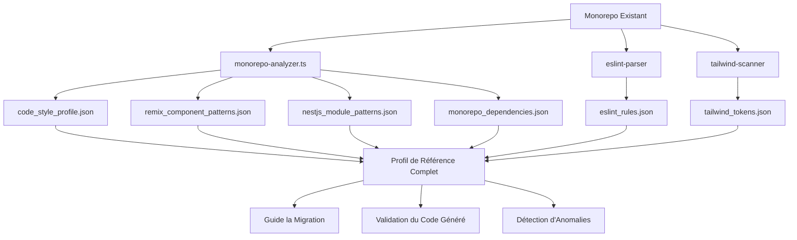

# 🔍 Analyse Structurelle du Monorepo Existant

## 🎯 Objectif

Détecter automatiquement la structure actuelle du projet (Remix + NestJS + packages) pour générer des profils de référence qui guideront la migration, la génération de code et la validation. Cette analyse permettra de:

- Assurer la cohérence stylistique entre le code existant et le code migré
- Respecter les conventions de nommage et d'organisation du projet
- Garantir la compatibilité des interfaces et des dépendances
- Faciliter l'intégration progressive des modules migrés

## 🤖 Agents d'analyse automatisée

| Agent | Rôle | Sorties générées |
|-------|------|------------------|
| `monorepo-analyzer.ts` | Scanner `/apps`, `/packages`, Remix, NestJS, DTOs, Prisma, routes, structure de layout | `code_style_profile.json`, `remix_component_patterns.json`, `nestjs_module_patterns.json`, `monorepo_dependencies.json` |
| `eslint-parser` | Extraire les règles personnalisées, alias, conventions, import paths | `eslint_rules.json` |
| `tailwind-scanner` | Extraire les design tokens et la config `tailwind.config.js` | `tailwind_tokens.json` |

## 📊 Architecture de l'analyse



## 📑 Description des profils générés

### 1. `code_style_profile.json`

Ce fichier capture les conventions générales de codage dans le projet.

```json
{
  "indentation": {
    "type": "spaces",
    "size": 2
  },
  "quotes": "single",
  "semicolons": true,
  "lineLength": 100,
  "componentNaming": "PascalCase",
  "functionNaming": "camelCase",
  "importOrder": [
    "react",
    "^@core/(.*)$",
    "^@server/(.*)$",
    "^@ui/(.*)$",
    "^[./]"
  ],
  "importSeparation": true,
  "lineBreaks": "LF"
}
```

### 2. `remix_component_patterns.json`

Ce fichier capture les structures standardisées des composants Remix.

```json
{
  "routePatterns": {
    "naming": "kebab-case",
    "structure": "flat|nested",
    "indexRoutes": true
  },
  "loaderPattern": {
    "errorHandling": "throw|return",
    "dataFetching": "direct|service"
  },
  "actionPattern": {
    "validation": "zod|manual",
    "errorHandling": "throw|redirect"
  },
  "componentTypes": {
    "ui": "apps/web/app/components/ui",
    "layout": "apps/web/app/components/layout",
    "shared": "packages/ui/src/components"
  },
  "examples": {
    "loader": "...",
    "action": "...",
    "component": "..."
  }
}
```

### 3. `nestjs_module_patterns.json`

Ce fichier capture l'organisation et les conventions des modules NestJS.

```json
{
  "moduleStructure": {
    "controllers": "products.controller.ts",
    "services": "products.service.ts",
    "entities": "entities/product.entity.ts",
    "dto": "dto/create-product.dto.ts"
  },
  "decoratorUsage": {
    "controller": "@Controller('products')",
    "method": "@Get(':id')",
    "param": "@Param('id')",
    "body": "@Body()"
  },
  "dependencyInjection": {
    "pattern": "constructor-based",
    "providerRegistration": "module-providers"
  },
  "errorHandling": {
    "exceptions": "nest-exceptions",
    "filters": "global|local"
  },
  "examples": {
    "module": "...",
    "controller": "...",
    "service": "..."
  }
}
```

### 4. `monorepo_dependencies.json`

Ce fichier capture l'ensemble des dépendances et leur utilisation dans le monorepo.

```json
{
  "rootDependencies": {
    "typescript": "^4.9.5",
    "turbo": "^1.10.0"
  },
  "apps": {
    "web": {
      "dependencies": {
        "@remix-run/node": "^1.19.1",
        "@remix-run/react": "^1.19.1"
      },
      "devDependencies": {
        "@types/react": "^18.2.20"
      }
    },
    "api": {
      "dependencies": {
        "@nestjs/core": "^10.0.0",
        "@nestjs/common": "^10.0.0"
      }
    }
  },
  "packages": {
    "ui": {
      "dependencies": {
        "react": "^18.2.0",
        "tailwindcss": "^3.3.3"
      }
    },
    "database": {
      "dependencies": {
        "@prisma/client": "^5.1.1"
      },
      "devDependencies": {
        "prisma": "^5.1.1"
      }
    }
  }
}
```

### 5. `eslint_rules.json`

Ce fichier capture les règles ESLint personnalisées utilisées dans le projet.

```json
{
  "extends": [
    "eslint:recommended",
    "plugin:@typescript-eslint/recommended"
  ],
  "customRules": {
    "@typescript-eslint/no-unused-vars": ["error", { "argsIgnorePattern": "^_" }],
    "import/order": ["error", { "groups": ["builtin", "external", "internal"] }]
  },
  "ignorePatterns": [
    "**/*.js",
    "node_modules",
    ".turbo",
    "dist",
    "build"
  ],
  "importAliases": {
    "~/*": "./app/*",
    "@app/*": "./src/*"
  }
}
```

### 6. `tailwind_tokens.json`

Ce fichier capture les tokens et configurations Tailwind personnalisés.

```json
{
  "colors": {
    "primary": {
      "50": "#f0f9ff",
      "500": "#0ea5e9",
      "900": "#0c4a6e"
    },
    "secondary": {
      "500": "#8b5cf6"
    }
  },
  "fontSize": {
    "xs": ["0.75rem", { "lineHeight": "1rem" }],
    "sm": ["0.875rem", { "lineHeight": "1.25rem" }]
  },
  "spacing": {
    "xs": "0.25rem",
    "sm": "0.5rem",
    "md": "1rem"
  },
  "borderRadius": {
    "sm": "0.125rem",
    "md": "0.375rem",
    "lg": "0.5rem"
  },
  "customUtilities": [
    "btn-primary",
    "card",
    "form-input"
  ]
}
```

## 🛠️ Implémentation des agents d'analyse

### Agent 1: `monorepo-analyzer.ts`

```typescript
// Exemple simplifié - L'implémentation complète est dans le répertoire scripts/analysis
import * as fs from 'fs';
import * as path from 'path';
import { glob } from 'glob';

async function analyzeMonorepo(repoPath: string) {
  // Détection de la structure des répertoires
  const appsDir = path.join(repoPath, 'apps');
  const packagesDir = path.join(repoPath, 'packages');
  
  // Détecter les applications Remix et NestJS
  const remixApps = await findRemixApps(appsDir);
  const nestApps = await findNestApps(appsDir);
  
  // Analyser les structures de composants et modules
  const remixPatterns = await analyzeRemixPatterns(remixApps);
  const nestPatterns = await analyzeNestPatterns(nestApps);
  
  // Analyser les dépendances
  const dependencies = await analyzeDependencies(repoPath);
  
  // Détecter le style de code
  const codeStyle = await analyzeCodeStyle(repoPath);
  
  // Générer les fichiers de profil
  writeJsonFile(path.join(repoPath, 'profil/code_style_profile.json'), codeStyle);
  writeJsonFile(path.join(repoPath, 'profil/remix_component_patterns.json'), remixPatterns);
  writeJsonFile(path.join(repoPath, 'profil/nestjs_module_patterns.json'), nestPatterns);
  writeJsonFile(path.join(repoPath, 'profil/monorepo_dependencies.json'), dependencies);
  
  console.log('✅ Analyse du monorepo terminée avec succès.');
}
```

### Agent 2: `eslint-parser.ts`

```typescript
// Exemple simplifié - L'implémentation complète est dans le répertoire scripts/analysis
import * as fs from 'fs';
import * as path from 'path';

async function parseEslintConfig(repoPath: string) {
  const eslintFiles = [
    '.eslintrc.js',
    '.eslintrc.json',
    '.eslintrc.yml',
    'packages/eslint-config/index.js'
  ];
  
  let eslintConfig = {};
  
  // Rechercher les fichiers de configuration ESLint
  for (const file of eslintFiles) {
    const filePath = path.join(repoPath, file);
    if (fs.existsSync(filePath)) {
      const config = await extractEslintConfig(filePath);
      eslintConfig = { ...eslintConfig, ...config };
    }
  }
  
  // Extraire les règles personnalisées
  const customRules = extractCustomRules(eslintConfig);
  
  // Extraire les alias d'importation
  const importAliases = extractImportAliases(eslintConfig);
  
  // Générer le fichier de profil
  const eslintRules = {
    extends: eslintConfig.extends || [],
    customRules,
    ignorePatterns: eslintConfig.ignorePatterns || [],
    importAliases
  };
  
  writeJsonFile(path.join(repoPath, 'profil/eslint_rules.json'), eslintRules);
  
  console.log('✅ Analyse des règles ESLint terminée avec succès.');
}
```

### Agent 3: `tailwind-scanner.ts`

```typescript
// Exemple simplifié - L'implémentation complète est dans le répertoire scripts/analysis
import * as fs from 'fs';
import * as path from 'path';

async function scanTailwindConfig(repoPath: string) {
  // Rechercher les fichiers de configuration Tailwind
  const tailwindFiles = await glob('**/tailwind.config.{js,ts}', { cwd: repoPath });
  
  if (tailwindFiles.length === 0) {
    console.warn('⚠️ Aucun fichier de configuration Tailwind trouvé.');
    return;
  }
  
  const primaryConfig = path.join(repoPath, tailwindFiles[0]);
  const tailwindConfig = await extractTailwindConfig(primaryConfig);
  
  // Extraire les tokens
  const tokens = {
    colors: tailwindConfig.theme?.colors || {},
    fontSize: tailwindConfig.theme?.fontSize || {},
    spacing: tailwindConfig.theme?.spacing || {},
    borderRadius: tailwindConfig.theme?.borderRadius || {},
    customUtilities: await extractCustomUtilities(repoPath)
  };
  
  writeJsonFile(path.join(repoPath, 'profil/tailwind_tokens.json'), tokens);
  
  console.log('✅ Analyse des tokens Tailwind terminée avec succès.');
}
```

## 📌 Validation des résultats

Pour garantir la fiabilité des profils générés, les validations suivantes sont effectuées:

1. **Validation syntaxique**:
   - Tous les fichiers `.json` générés sont validés pour s'assurer qu'ils sont correctement formés
   - Utilisation du schéma JSON approprié pour chaque type de profil

2. **Validation structurelle**:
   - Les chemins détectés (`apps`, `packages`, `routes`) correspondent au projet réel
   - Les modules détectés existent et sont accessibles
   - Les dépendances listées correspondent aux entrées des fichiers `package.json`

3. **Validation sémantique**:
   - Les tokens Tailwind sont cohérents avec les classes utilisées dans les fichiers `.tsx`
   - Les patterns NestJS détectés correspondent aux meilleures pratiques
   - Les conventions de nommage sont cohérentes dans tout le projet

## 🏃‍♂️ Exécution de l'analyse

Pour exécuter l'analyse complète du monorepo:

```bash
# Installer les dépendances nécessaires
npm install glob fs-extra typescript ts-node

# Créer le répertoire de profil si nécessaire
mkdir -p profil

# Exécuter les agents d'analyse
npx ts-node scripts/analysis/monorepo-analyzer.ts
npx ts-node scripts/analysis/eslint-parser.ts
npx ts-node scripts/analysis/tailwind-scanner.ts

# Valider les résultats
npx ts-node scripts/analysis/validate-profiles.ts
```

## 🔄 Utilisation continue

Cette analyse n'est pas une opération ponctuelle, mais un processus continu:

1. **Exécution périodique**: Programmée après chaque mise à jour majeure du monorepo
2. **Intégration CI/CD**: Exécutée dans les pipelines CI pour détecter les dérives
3. **Mise à jour des profils**: Les profils sont mis à jour automatiquement et versionnés
4. **Notification des changements**: Alertes sur les modifications significatives

L'analyse structurelle du monorepo fournit une base solide pour la migration progressive et cohérente du code PHP legacy vers l'architecture NestJS + Remix.
