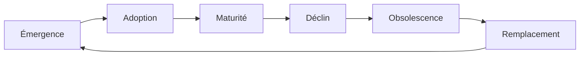
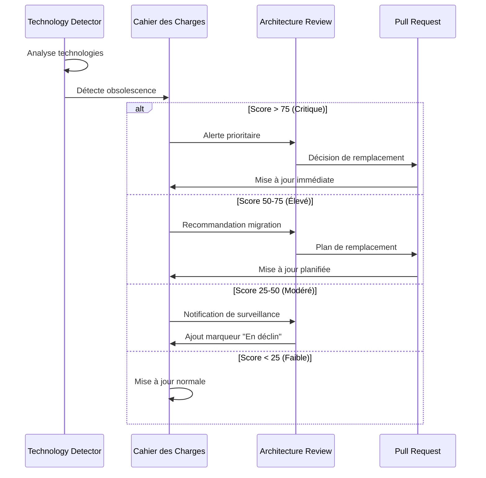

# Évolution technologique du cahier des charges

## 🔄 Principe d'adaptation continue

Le cahier des charges évolue automatiquement en fonction des avancées technologiques. Il intègre un mécanisme de gestion du cycle de vie qui détecte les technologies obsolètes et les remplace par des alternatives modernes, garantissant ainsi sa pertinence constante.

## 📊 Cycle de vie des technologies

### Phases du cycle de vie



### Statuts technologiques

| Statut | Description | Action dans le cahier des charges |
|--------|-------------|----------------------------------|
| Émergent | Technologie nouvelle et prometteuse | Section "Technologies de veille" |
| Adopté | Intégré dans le projet à l'essai | Documentation complète avec marqueur "Technologie récente" |
| Mature | Utilisé de façon stable et éprouvée | Documentation standard avec mises à jour régulières |
| Déclin | Usage réduit, remplacé progressivement | Marqueur "En migration" et documentation des alternatives |
| Obsolète | N'est plus maintenu ou sécurisé | Déplacement vers "Historique technique" et plan de remplacement |
| Remplacé | Complètement remplacé par alternative | Suppression ou archivage avec référence vers la nouvelle solution |

## 🔍 Mécanisme de détection d'obsolescence

### Sources de détection

Le système surveille automatiquement les indicateurs d'obsolescence:

1. **Analyse des dépôts npm/GitHub**
   - Fréquence des mises à jour
   - Nombre de contributeurs actifs
   - Issues ouvertes sans résolution
   - Tendance des étoiles et forks

2. **Veille technologique**
   - Flux RSS des blogs technologiques
   - Annonces officielles d'end-of-life
   - Benchmarks et comparatifs récents

3. **Feedback interne**
   - Rapports de maintenance
   - Incidents de sécurité
   - Difficultés de recrutement sur la technologie

### Algorithme de détection

```typescript
interface TechnologyAssessment {
  name: string;
  category: 'framework' | 'library' | 'language' | 'infrastructure';
  currentVersion: string;
  lastUpdate: Date;
  communityActivity: number; // 0-100
  securityScore: number; // 0-100
  alternatives: string[];
  obsolescenceScore: number; // 0-100
}

function calculateObsolescenceScore(tech: Technology): TechnologyAssessment {
  // Facteur 1: Durée depuis la dernière mise à jour
  const daysSinceUpdate = calculateDaysSince(tech.lastReleaseDate);
  const updateScore = Math.min(daysSinceUpdate / 365 * 25, 25);
  
  // Facteur 2: Activité communautaire
  const communityActivity = assessCommunityActivity(tech.repository);
  const communityScore = (100 - communityActivity) / 4;
  
  // Facteur 3: Vulnérabilités non corrigées
  const securityIssues = countUnresolvedSecurityIssues(tech.name);
  const securityScore = Math.min(securityIssues * 5, 25);
  
  // Facteur 4: Alternatives viables
  const alternatives = findViableAlternatives(tech.name, tech.category);
  const alternativeScore = alternatives.length > 0 ? 25 : 0;
  
  // Score global d'obsolescence (0-100)
  const obsolescenceScore = updateScore + communityScore + securityScore + alternativeScore;
  
  return {
    name: tech.name,
    category: tech.category,
    currentVersion: tech.currentVersion,
    lastUpdate: tech.lastReleaseDate,
    communityActivity,
    securityScore: 100 - securityScore * 4,
    alternatives,
    obsolescenceScore
  };
}
```

## 📝 Processus de mise à jour technologique

### Workflow d'évolution



### Exemple de gestion de remplacement

Lorsqu'une technologie est identifiée comme obsolète:

1. **Documentation du contexte**
   ```markdown
   > [!OBSOLESCENCE]
   > **Express.js v4** est considéré comme en fin de vie.
   > 
   > **Score d'obsolescence:** 78/100
   > **Dernière mise à jour majeure:** 2 ans
   > **Risques identifiés:**
   > - Vulnérabilités de sécurité non corrigées depuis +180 jours
   > - Support officiel réduit
   > 
   > **Alternative recommandée:** Fastify v4
   > **Plan de migration:** Voir section 5.3
   ```

2. **Création du plan de migration**
   - Ajout d'une section dans le cahier des charges
   - Documentation des différences clés
   - Exemples de conversion de code
   - Calendrier de migration

3. **Mise à jour des sections impactées**
   - Remplacement des références à la technologie obsolète
   - Mise à jour des diagrammes d'architecture
   - Adaptation des exemples de code

## 🔄 Automatisation des mises à jour

### Assistants de migration

Des agents IA spécialisés facilitent la migration technologique:

1. **TechMigrationPlanner**: Génère le plan de migration initial
2. **CodeMigrationAssistant**: Propose des conversions de code
3. **DocumentationUpdater**: Met à jour le cahier des charges

### Génération de contenu de remplacement

```typescript
async function generateReplacementContent(
  oldTechnology: string, 
  newTechnology: string, 
  context: DocumentContext
): Promise<string> {
  const prompt = `
    Transformez ce contenu de documentation technique qui utilise ${oldTechnology} 
    pour utiliser ${newTechnology} à la place.
    
    Conservez la même structure et le même niveau de détail.
    Adaptez tous les exemples de code.
    Ajoutez un encadré en début de section indiquant la migration.
    
    Ancien contenu:
    ${context.currentContent}
  `;
  
  try {
    const response = await llmService.generateContent(prompt, {
      temperature: 0.2,
      maxTokens: 2000
    });
    
    return response.text;
  } catch (error) {
    logger.error(`Erreur lors de la génération du contenu de remplacement: ${error.message}`);
    throw new Error(`Impossible de générer le contenu de remplacement: ${error.message}`);
  }
}
```

## 🧪 Tests de compatibilité

Avant de remplacer définitivement une technologie dans le cahier des charges:

1. **Validation fonctionnelle**
   - Vérification que l'alternative couvre toutes les fonctionnalités
   - Tests des cas d'utilisation clés

2. **Évaluation de migration**
   - Estimation de l'effort de migration
   - Impact sur les performances
   - Compatibilité avec l'écosystème existant

3. **Preuve de concept**
   - Implémentation de référence avec la nouvelle technologie
   - Tests de charge comparatifs
   - Évaluation par l'équipe technique

## 📚 Gestion de l'historique

### Conservation du contexte

Les technologies remplacées ne sont pas totalement supprimées:

1. **Archivage sélectif**
   - Déplacement vers une section "Historique technique"
   - Conservation des choix architecturaux initiaux
   - Documentation du raisonnement original

2. **Traçabilité des évolutions**
   - Références croisées entre anciennes et nouvelles technologies
   - Journal des migrations technologiques
   - Leçons apprises lors des transitions

### Journal d'évolution technologique

```json
{
  "migrations": [
    {
      "date": "2023-11-05",
      "oldTechnology": "Express.js v4",
      "newTechnology": "Fastify v4",
      "sections": [
        "03-specifications-techniques.md",
        "05-plan-migration.md"
      ],
      "justification": "Performance améliorée et meilleure sécurité",
      "impactLevel": "medium",
      "migrationDuration": "4 semaines"
    },
    {
      "date": "2023-09-15",
      "oldTechnology": "Moment.js",
      "newTechnology": "Day.js",
      "sections": ["03-specifications-techniques.md"],
      "justification": "Réduction de la taille du bundle et meilleure maintenabilité",
      "impactLevel": "low",
      "migrationDuration": "1 semaine"
    }
  ]
}
```

Cette approche dynamique garantit que le cahier des charges reste techniquement pertinent, reflète fidèlement l'état de l'art en matière de développement, et s'adapte proactivement aux évolutions technologiques.
