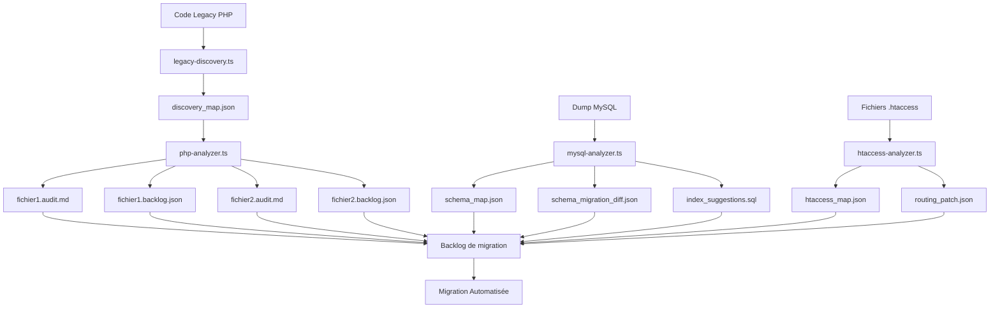

# 🔍 Audit Legacy PHP, MySQL et .htaccess

## 🎯 Objectif

Cette phase permet de cartographier le code source PHP, la structure SQL et les règles de réécriture. Elle est fondamentale pour planifier la migration automatique, préserver le SEO et construire un backlog priorisé.

## 📊 Agents d'audit automatisés

| Agent | Rôle | Sorties générées |
|-------|------|------------------|
| `legacy-discovery.ts` | Scanner les fichiers PHP, détecter les doublons, complexité et priorité | `discovery_map.json` |
| `php-analyzer.ts` | Analyser chaque fichier PHP : logique métier, routes, dépendances, SQL | `*.audit.md`, `*.backlog.json` |
| `mysql-analyzer.ts` | Analyser le dump MySQL (`mysql.sql`) pour structure, indexes, mapping | `schema_map.json`, `schema_migration_diff.json`, `index_suggestions.sql` |
| `htaccess-analyzer.ts` | Extraire les routes, redirections 301/302, erreurs 404/410/412, SEO | `htaccess_map.json`, `routing_patch.json` |

## 🔄 Flux d'audit complet



## 📑 Description détaillée des agents

### 1. Agent `legacy-discovery.ts`

#### Fonctionnalités
- Indexation complète des fichiers PHP legacy
- Détection des doublons et du code mort
- Analyse de complexité (cyclomatic complexity)
- Évaluation de priorité basée sur critères métier

#### Configuration
```json
{
  "scanPaths": [
    "/var/www/html/legacy/",
    "/var/www/html/includes/"
  ],
  "excludePaths": [
    "vendor/",
    "node_modules/"
  ],
  "priorityFactors": {
    "traffic": 0.4,
    "complexity": 0.3,
    "dependencies": 0.2,
    "lastModified": 0.1
  }
}
```

#### Sorties produites
- `discovery_map.json`: Cartographie complète des fichiers PHP avec métadonnées:
  - Chemin et nom du fichier
  - Statistiques (lignes de code, complexité)
  - Score de priorité pour la migration
  - Dépendances externes détectées
  - Signaux de duplication avec d'autres fichiers

### 2. Agent `php-analyzer.ts`

#### Fonctionnalités
- Analyse syntaxique et sémantique de chaque fichier PHP
- Extraction de la logique métier et patterns
- Détection des requêtes SQL imbriquées
- Identification des routes et endpoints
- Analyse des dépendances entre fichiers

#### Configuration
```json
{
  "analysisDepth": "full",
  "outputFormat": ["markdown", "json"],
  "extractSQL": true,
  "detectRoutes": true,
  "analyzeBusinessLogic": true
}
```

#### Sorties produites
- `*.audit.md`: Document d'audit par fichier avec:
  - Structure du fichier décortiquée
  - Logique métier identifiée
  - Points d'attention particuliers
  - Recommandations de migration
  
- `*.backlog.json`: Entrée de backlog automatisée avec:
  - Estimation de complexité
  - Liste des tâches spécifiques de migration
  - Dépendances à résoudre avant migration
  - Risques identifiés

### 3. Agent `mysql-analyzer.ts`

#### Fonctionnalités
- Parsing complet du dump SQL
- Analyse des structures de tables, vues, procédures
- Détection des contraintes et relations
- Optimisation des index et suggestions
- Comparaison avec le schéma Prisma cible

#### Configuration
```json
{
  "sqlDumpPath": "/path/to/dump.sql",
  "targetDialect": "postgresql",
  "prismaSchemaPath": "/path/to/schema.prisma",
  "analyzePerformance": true
}
```

#### Sorties produites
- `schema_map.json`: Cartographie complète de la BDD source:
  - Tables et colonnes avec types
  - Relations et contraintes
  - Procédures stockées et triggers
  - Statistiques d'utilisation

- `schema_migration_diff.json`: Différences avec le schéma cible:
  - Types incompatibles
  - Relations manquantes
  - Conversions nécessaires
  - Risques de perte de données

- `index_suggestions.sql`: Scripts d'optimisation:
  - Suggestions d'index manquants
  - Recommandations d'optimisation
  - Corrections de contraintes

### 4. Agent `htaccess-analyzer.ts`

#### Fonctionnalités
- Extraction complète des règles .htaccess
- Analyse des redirections et leur impact SEO
- Cartographie des pages d'erreur personnalisées
- Détection des configurations de sécurité
- Conversion vers format compatible NestJS/Express

#### Configuration
```json
{
  "htaccessPaths": [
    "/var/www/html/.htaccess",
    "/var/www/html/admin/.htaccess"
  ],
  "targetFramework": "nestjs",
  "seoPreservation": "strict"
}
```

#### Sorties produites
- `htaccess_map.json`: Cartographie des règles .htaccess:
  - Redirections 301/302
  - Configurations de pages d'erreur
  - Règles de réécriture d'URL
  - Paramètres de sécurité

- `routing_patch.json`: Instructions pour NestJS/Express:
  - Middleware de redirection
  - Configuration des gardes de route
  - Gestionnaires d'exceptions

## 📈 Méthodologie d'exécution

1. **Préparation**:
   - Créer une copie de l'environnement legacy pour analyse
   - Configurer les agents avec les chemins et paramètres adaptés
   - Préparer l'espace de stockage pour les résultats

2. **Exécution séquentielle**:
   - Lancer `legacy-discovery.ts` en premier pour cartographier le terrain
   - Exécuter `mysql-analyzer.ts` indépendamment pour la BDD
   - Lancer `htaccess-analyzer.ts` pour les règles de routage
   - Exécuter `php-analyzer.ts` sur chaque fichier priorisé

3. **Consolidation**:
   - Agréger les résultats dans une base de connaissances unifiée
   - Générer le backlog de migration avec priorités
   - Créer des visualisations des dépendances et complexités

4. **Validation manuelle**:
   - Révision des cas complexes par un expert
   - Ajustement des priorités selon les besoins métier
   - Validation finale du backlog avant démarrage

## 🧪 Métriques d'audit

| Métrique | Objectif | Méthode de mesure |
|----------|----------|-------------------|
| **Couverture d'audit** | 100% des fichiers PHP | Nombre de fichiers analysés / Nombre total |
| **Précision d'analyse** | > 95% | Validation manuelle d'échantillons |
| **Taux de détection des anomalies** | > 90% | Comparaison avec audit manuel |
| **Pertinence des priorités** | > 85% | Validation par experts métier |

## ⚙️ Intégration dans le pipeline de migration

L'audit legacy est la première étape critique de la migration, ses résultats:

1. **Alimentent le backlog** par ordre de priorité
2. **Guident les agents IA** pendant la phase de migration
3. **Fournissent des références** pour la validation post-migration
4. **Documentent l'existant** pour la traçabilité et la maintenance

Ce processus d'audit approfondi garantit une migration méthodique, priorisée et exhaustive du code legacy vers l'architecture NestJS + Remix ciblée.
