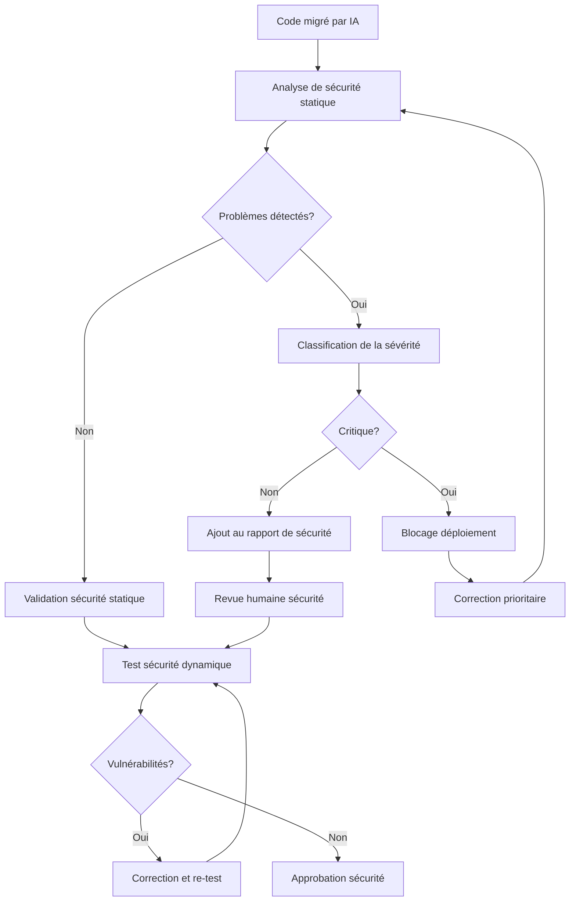

# 🔐 Checklist Bonus Sécurité

## 🎯 Vue d'ensemble

Cette checklist bonus renforce les mesures de sécurité tout au long du processus de migration IA. Elle complète la checklist d'avant lancement standard avec des vérifications de sécurité approfondies pour garantir que les migrations automatisées respectent les plus hauts standards de sécurité et de protection des données.

## 📋 Vérifications supplémentaires de sécurité

### Analyse du code source legacy

| # | Vérification | Priorité | Responsable | Outils |
|---|--------------|----------|-------------|--------|
| 1.1 | Scan de secrets dans le code source | Critique | Équipe Sécurité | GitGuardian, TruffleHog |
| 1.2 | Détection des vulnérabilités connues | Élevée | Équipe Sécurité | SonarQube, OWASP Dependency Check |
| 1.3 | Évaluation des dépendances obsolètes | Moyenne | DevSecOps | Retire.js, Dependency-Track |
| 1.4 | Cartographie des points d'entrée sensibles | Élevée | Architecte Sécurité | Threat Modeling Tool |
| 1.5 | Analyse des contrôles d'accès legacy | Moyenne | IAM Team | Custom Scripts |

### Processus de migration sécurisé

| # | Vérification | Priorité | Responsable | Outils |
|---|--------------|----------|-------------|--------|
| 2.1 | Isolation des environnements de migration | Critique | DevSecOps | Containerization, Network Policies |
| 2.2 | Protection des données sensibles pendant le traitement | Critique | DPO | Data Tokenization, Masking |
| 2.3 | Chiffrement des communications avec les API IA | Élevée | Réseau | TLS 1.3, Certificate Pinning |
| 2.4 | Journalisation sécurisée des opérations IA | Moyenne | SIEM Team | Log Forwarding, SIEM Integration |
| 2.5 | Rotation des credentials d'accès aux services IA | Élevée | IAM Team | Secret Rotation Service |

### Validation sécuritaire du code généré

| # | Vérification | Priorité | Responsable | Outils |
|---|--------------|----------|-------------|--------|
| 3.1 | Analyse statique du code généré | Critique | DevSecOps | SonarQube, ESLint Security |
| 3.2 | Tests de pénétration automatisés | Élevée | Red Team | OWASP ZAP, Burp Suite |
| 3.3 | Vérification des patterns de sécurité | Élevée | Architecte Sécurité | Security Code Scan |
| 3.4 | Examen des dépendances tierces introduites | Moyenne | DevSecOps | npm audit, OWASP Dependency Check |
| 3.5 | Test d'injection de code malveillant | Critique | Red Team | Custom Fuzzing Tools |

### Gouvernance et conformité

| # | Vérification | Priorité | Responsable | Outils |
|---|--------------|----------|-------------|--------|
| 4.1 | Vérification RGPD/CCPA du code migré | Élevée | DPO | Compliance Scanning Tools |
| 4.2 | Analyse des risques de sécurité post-migration | Élevée | RSSI | Risk Assessment Framework |
| 4.3 | Validation des mécanismes de journalisation d'audit | Moyenne | Compliance | Audit Log Checker |
| 4.4 | Évaluation des contrôles d'accès implémentés | Élevée | IAM Team | Access Control Scanner |
| 4.5 | Validation des mécanismes de chiffrement | Critique | Cryptographie | Crypto Validator |

## 🔍 Processus de vérification approfondie

### Analyse de sécurité du code généré



### Validation des accès et authentification

Les mécanismes d'authentification générés par l'IA doivent faire l'objet d'un examen approfondi:

1. **Analyse du flux d'authentification**
   - Vérification des mécanismes de token (JWT, etc.)
   - Validation des délais d'expiration appropriés
   - Analyse du stockage sécurisé des credentials

2. **Vérification des autorisations**
   - Test des contrôles d'accès basés sur les rôles
   - Analyse des vérifications d'autorisation
   - Test de contournement des permissions

3. **Sécurité des sessions**
   - Validation de la gestion sécurisée des sessions
   - Vérification des mécanismes anti-CSRF
   - Test de fixation de session

## 🛡️ Protection contre les vulnérabilités IA spécifiques

### Injection de prompts

Vérifications pour protéger contre les attaques par injection de prompts:

- ✅ Validation des limites d'entrée utilisateur traitées par les modèles IA
- ✅ Vérification de l'échappement des caractères spéciaux dans les entrées utilisateur
- ✅ Mise en place de barrières entre entrées utilisateur et systèmes IA
- ✅ Test d'injections de prompts malveillants

### Fuites de données sensibles par l'IA

Contrôles pour éviter que l'IA ne divulgue des informations sensibles:

- ✅ Redaction automatique des données sensibles avant traitement IA
- ✅ Analyse post-génération pour détecter des fuites potentielles
- ✅ Limitation de l'accès aux modèles IA selon la sensibilité des données
- ✅ Journalisation et surveillance des requêtes et réponses IA

## 🔄 Tests de sécurité continus

### Intégration dans le pipeline CI/CD

```yaml
# Exemple d'intégration dans un pipeline GitHub Actions
name: Security Checks

on:
  pull_request:
    types: [opened, synchronize]
    paths:
      - 'src/**'
      - 'packages/**'

jobs:
  security-scan:
    runs-on: ubuntu-latest
    steps:
      - uses: actions/checkout@v3
      
      - name: Static Application Security Testing
        uses: github/codeql-action/analyze@v2
        with:
          languages: javascript, typescript
      
      - name: Dependency Vulnerability Check
        run: |
          npm audit --production
          
      - name: Secret Detection
        uses: gitleaks/gitleaks-action@v2
        
      - name: AI-Generated Code Security Audit
        run: |
          ./scripts/ai-code-security-audit.sh
          
      - name: Security Report
        if: always()
        uses: actions/upload-artifact@v3
        with:
          name: security-report
          path: reports/security-*.json
```

### Validation périodique

Plan de tests de sécurité à exécuter régulièrement après la migration:

| Test | Fréquence | Responsable | 
|------|-----------|-------------|
| Scan de vulnérabilités complet | Hebdomadaire | DevSecOps |
| Test de pénétration | Mensuel | Red Team |
| Revue de sécurité du code | À chaque migration majeure | Architecte Sécurité |
| Fuzzing des API | Bimensuel | QA Sécurité |
| Audit des journaux de sécurité | Quotidien | SOC |

## 📝 Documentation de sécurité requise

### Artefacts de sécurité à produire

Pour chaque module migré, les artefacts suivants doivent être générés et validés:

1. **Rapport d'analyse de risques**
   - Identification des menaces potentielles
   - Évaluation des impacts et probabilités
   - Mesures d'atténuation implémentées

2. **Document d'architecture de sécurité**
   - Flux de données avec contrôles de sécurité
   - Mécanismes de protection implémentés
   - Interactions avec les systèmes d'authentification

3. **Guide de test de sécurité**
   - Procédures de test spécifiques au module
   - Cas de test pour les scénarios à risque
   - Critères de réussite/échec

4. **Plan de réponse aux incidents**
   - Procédures spécifiques au module
   - Contacts et responsabilités
   - Processus d'escalade

## 🚨 Points d'attention spécifiques

### Risques de sécurité particuliers dans la migration IA

| Risque | Description | Mesures d'atténuation |
|--------|-------------|------------------------|
| Backdoors non intentionnelles | Code malveillant généré accidentellement par l'IA | Analyse de code dédiée, revue humaine des parties critiques |
| Degradation des contrôles de sécurité | Affaiblissement des mécanismes de sécurité existants | Mapping des contrôles avant/après, tests de sécurité comparatifs |
| Exploitation des modèles prédictifs | Utilisation de patterns connus pour influencer l'IA | Randomisation des prompts, variation des modèles utilisés |
| Exposition de la logique métier sensible | Révélation de la logique protégée via les API d'IA | Isolation des environnements, restriction d'accès aux API |
| Homogénéisation des défenses | Création de points faibles identiques dans tout le code | Diversification délibérée des implémentations de sécurité |

Cette checklist bonus de sécurité complète la méthodologie de migration pour garantir que les aspects sécuritaires sont traités avec le plus haut niveau d'attention, assurant ainsi non seulement une migration réussie, mais également un code généré plus sécurisé que l'original.
