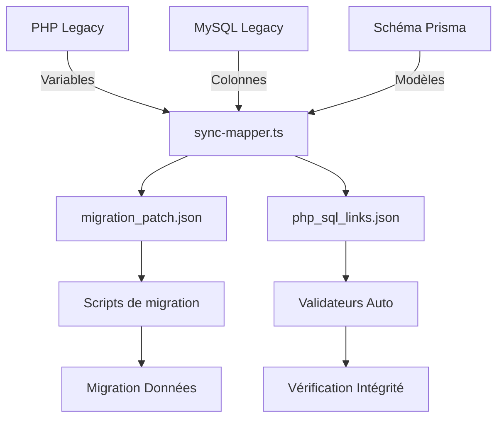

# 🔄 Préparation des Synchronisations (Données, Routes, SEO)

## 🎯 Objectif

Cette phase établit les liens formels entre :
- les anciens fichiers PHP ↔ modèles SQL ↔ Prisma
- les anciennes routes `.htaccess` ↔ nouvelles routes Remix/NestJS

Elle est indispensable pour assurer une **migration cohérente, fidèle et traçable**.

## 📊 Agents de synchronisation

| Agent | Rôle | Sorties générées |
|-------|------|------------------|
| `sync-mapper.ts` | Mapper les champs entre PHP, SQL legacy, Prisma cible | `migration_patch.json`, `php_sql_links.json` |
| `routing-sync.ts` | Synchroniser les routes `.htaccess` avec Remix/NestJS | `url_redirection_map.json`, `canonical_map.json` |

## 🔄 Mécanisme de synchronisation des données



## 📑 Description détaillée des agents

### 1. Agent `sync-mapper.ts`

#### Fonctionnalités
- Identification des correspondances entre variables PHP et colonnes SQL
- Détection des transformations de données effectuées dans le code PHP
- Génération de mappings précis pour la migration de schéma
- Traçabilité des origines et destinations de chaque donnée

#### Configuration
```json
{
  "phpSourcePaths": ["./legacy/models/", "./legacy/includes/"],
  "sqlDumpPath": "./database/legacy_dump.sql",
  "prismaSchemaPath": "./prisma/schema.prisma",
  "transformationDetection": true,
  "validateRelationships": true
}
```

#### Sorties produites

**`migration_patch.json`**
Ce fichier contient les instructions précises pour la migration des données:
- Mappings de champs (source → destination)
- Transformations requises (ex: formats de date, encodages)
- Gestion des valeurs par défaut et nullables
- Instructions spéciales pour cas complexes

Exemple de structure:
```json
{
  "tables": [
    {
      "sourceTable": "users",
      "targetModel": "User",
      "fields": [
        {
          "source": "user_id",
          "target": "id",
          "type": "direct"
        },
        {
          "source": "user_name",
          "target": "name",
          "type": "direct"
        },
        {
          "source": "last_login",
          "target": "lastLoginAt",
          "type": "transform",
          "transformation": "DATE_TO_ISO"
        }
      ]
    }
  ],
  "relationships": [
    {
      "sourceTable": "user_addresses",
      "targetModel": "Address",
      "relation": "belongsTo",
      "sourceField": "user_id",
      "targetField": "userId"
    }
  ]
}
```

**`php_sql_links.json`**
Ce fichier documente les relations entre le code PHP et les structures SQL:
- Variables PHP associées à chaque table/colonne
- Fonctions PHP qui manipulent des données spécifiques
- Points d'accès et de modification des données
- Validations et transformations identifiées

Exemple de structure:
```json
{
  "phpEntities": [
    {
      "file": "user.class.php",
      "variables": [
        {
          "name": "$username",
          "sqlTable": "users",
          "sqlColumn": "user_name",
          "accessPatterns": ["get", "set"],
          "validations": ["notEmpty", "maxLength:255"]
        }
      ],
      "methods": [
        {
          "name": "getUserProfile",
          "sqlTables": ["users", "user_profiles"],
          "dataMutations": true
        }
      ]
    }
  ]
}
```

### 2. Agent `routing-sync.ts`

#### Fonctionnalités
- Analyse complète des règles de routage legacy (.htaccess)
- Conversion en routes compatibles Remix et NestJS
- Préservation des URLs canoniques pour le SEO
- Gestion des redirections temporaires et permanentes
- Détection des paramètres d'URL et leur transformation

#### Configuration
```json
{
  "htaccessPaths": ["./.htaccess", "./admin/.htaccess"],
  "targetFramework": {
    "frontend": "remix",
    "backend": "nestjs"
  },
  "seoPreservation": "strict",
  "parameterMapping": true,
  "generateCanonicals": true
}
```

#### Sorties produites

**`url_redirection_map.json`**
Ce fichier contient les mappings d'URLs pour assurer la continuité:
- Correspondances d'anciennes vers nouvelles URLs
- Règles de redirection (301, 302)
- Transformation des paramètres d'URL
- Gestion des cas spéciaux (URL avec extensions, etc.)

Exemple de structure:
```json
{
  "redirections": [
    {
      "legacyPattern": "/product.php?id={id}",
      "newPattern": "/products/{id}",
      "type": 301,
      "preserveQueryParams": false
    },
    {
      "legacyPattern": "/category/{catName}",
      "newPattern": "/categories/{catName}",
      "type": 301,
      "preserveQueryParams": true
    }
  ],
  "specialCases": [
    {
      "legacyPattern": "/index.php",
      "newPattern": "/",
      "type": 301
    }
  ]
}
```

**`canonical_map.json`**
Ce fichier définit les URLs canoniques pour préserver le référencement:
- URLs canoniques pour chaque ressource
- Équivalence entre anciens et nouveaux chemins
- Métadonnées SEO à préserver
- Structure des balises canoniques

Exemple de structure:
```json
{
  "canonicals": [
    {
      "resource": "Product",
      "pattern": "/products/{id}/{slug}",
      "legacyEquivalent": "/product.php?id={id}",
      "metaTags": {
        "title": "Product: {name} | Store",
        "description": "{shortDescription}"
      }
    },
    {
      "resource": "Category",
      "pattern": "/categories/{slug}",
      "legacyEquivalent": "/category.php?name={slug}",
      "metaTags": {
        "title": "Category: {name} | Store",
        "description": "Browse our {name} products"
      }
    }
  ]
}
```

## 🔍 Méthode de validation des synchronisations

Pour garantir l'exactitude des mappings de synchronisation, un processus en trois étapes est appliqué:

1. **Validation automatique**
   - Tests unitaires sur les mappings générés
   - Vérification de cohérence entre sources et cibles
   - Détection des anomalies ou inconsistances

2. **Vérification par échantillonnage**
   - Sélection de 10% des mappings pour vérification manuelle
   - Focus sur les cas complexes identifiés
   - Documentation des corrections nécessaires

3. **Test en conditions réelles**
   - Exécution des migrations sur un jeu de données de test
   - Comparaison des résultats avec les données d'origine
   - Validation des URLs et comportement SEO

## 📌 Intégration dans le processus de migration

La préparation des synchronisations s'intègre comme suit dans le processus global:

1. **Après** la phase d'audit legacy qui fournit la cartographie complète
2. **Avant** la phase de génération de code qui utilisera ces mappings
3. **En parallèle** de la préparation de l'environnement cible

Elle permet de:
- Garantir la **fidélité des données** pendant la migration
- Préserver le **capital SEO** existant
- Assurer une **traçabilité complète** entre ancien et nouveau système
- Faciliter les **tests de non-régression** après migration

## 📊 Indicateurs de succès

| Indicateur | Cible | Méthode de mesure |
|------------|-------|-------------------|
| Couverture des champs SQL | 100% | Tous les champs SQL sont mappés vers Prisma |
| Préservation des URLs | 100% | Toutes les URLs indexées ont une correspondance |
| Précision des transformations | ≥ 98% | Échantillonnage de données et comparaison |
| Cohérence SEO | ≥ 95% | Comparaison des métadonnées avant/après |

La préparation des synchronisations constitue le pont essentiel entre l'ancien et le nouveau système, garantissant une transition cohérente et fidèle des données et des URLs.
