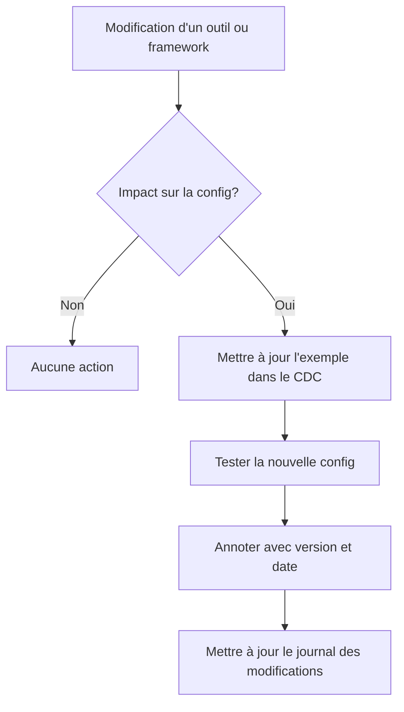

# 📝 Gestion du Code de Configuration dans le Cahier des Charges

## 🎯 Objectif

Définir une stratégie claire pour l'inclusion et la maintenance du code de configuration dans le cahier des charges, afin d'assurer sa pertinence continue et sa valeur pour le projet de migration.

## ⚖️ Analyse des besoins

L'inclusion de code de configuration dans le cahier des charges présente à la fois des avantages et des risques:

### Avantages
- ✅ Concrétise les concepts abstraits par des exemples pratiques
- ✅ Sert de référence directement exploitable par les équipes techniques
- ✅ Accélère la mise en œuvre en fournissant des modèles de base
- ✅ Aide à détecter les incompatibilités potentielles plus tôt

### Risques
- ⚠️ Peut devenir obsolète si les outils ou frameworks évoluent
- ⚠️ Nécessite une maintenance régulière pour rester pertinent
- ⚠️ Risque de créer de la confusion si non synchronisé avec l'implémentation réelle
- ⚠️ Peut donner l'impression que les exemples sont prescriptifs plutôt qu'illustratifs

## 🛠️ Stratégie recommandée

Nous recommandons une approche **hybride et évolutive** pour le code de configuration dans le cahier des charges:

1. **Distinguer clairement les types de code**:
   - 📚 **Code illustratif**: Exemples simplifiés pour la compréhension conceptuelle
   - 🔧 **Code de référence**: Configurations de base recommandées, mais adaptables
   - 🧪 **Code exécutable**: Configurations vérifiées et testées dans l'environnement cible

2. **Format des exemples de code**:
   - Préférer des exemples concis qui illustrent l'essentiel
   - Inclure des commentaires explicatifs pour chaque section clé
   - Utiliser des placeholders explicites pour les valeurs spécifiques au contexte
   - Maintenir une cohérence stylistique entre tous les exemples

3. **Gestion de l'évolution**:
   - Versionner les exemples de code avec le numéro de version des outils correspondants
   - Revoir les exemples lors des mises à jour majeures des frameworks
   - Indiquer clairement la date de dernière validation des exemples

## 📋 Mécanisme de mise à jour

Pour maintenir la pertinence du code dans le cahier des charges:

### Fréquence de révision
- Révision systématique lors des mises à jour majeures des outils (ex: Remix 2.x → 3.x)
- Vérification trimestrielle pour les configurations sensibles (sécurité, performances)
- Synchronisation avec le code source réel lors des jalons du projet

## 🖊️ Format standard pour les exemples de code

### Pour les fichiers de configuration JSON/YAML
