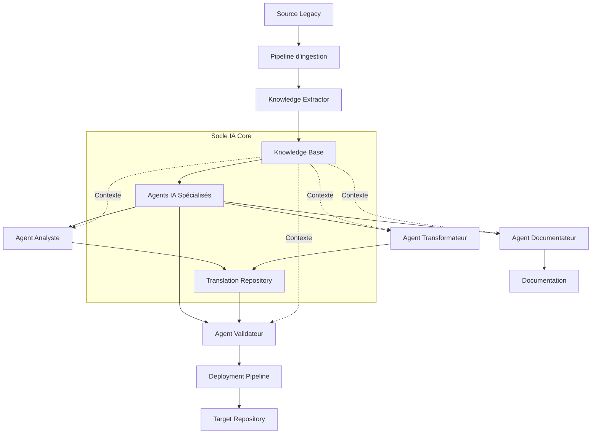
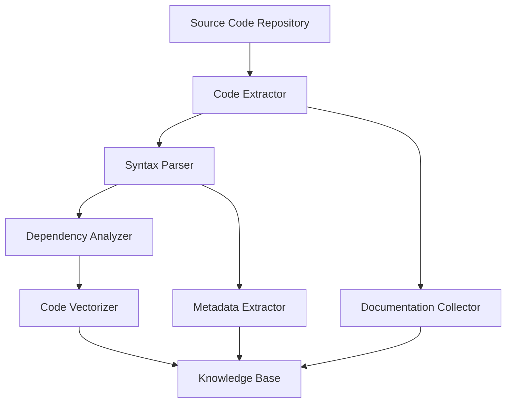
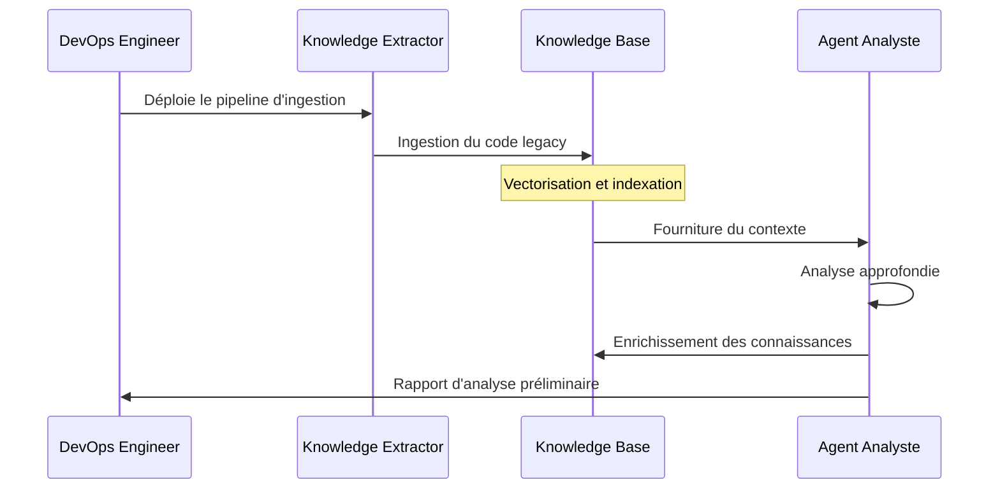
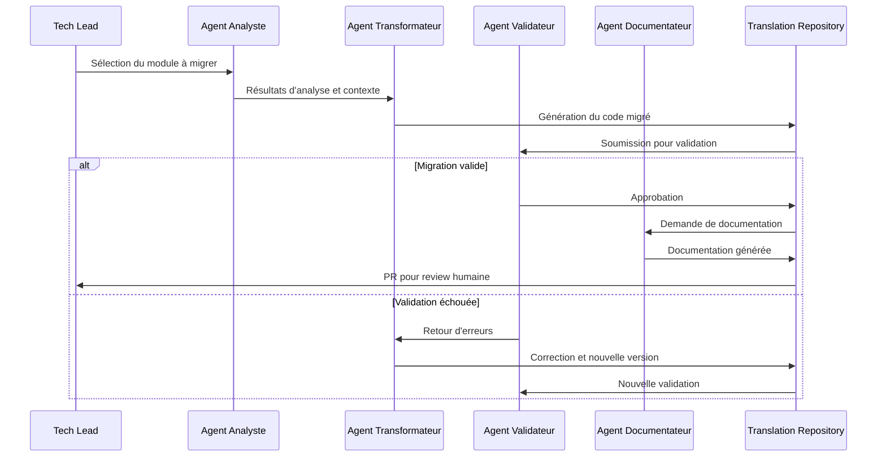
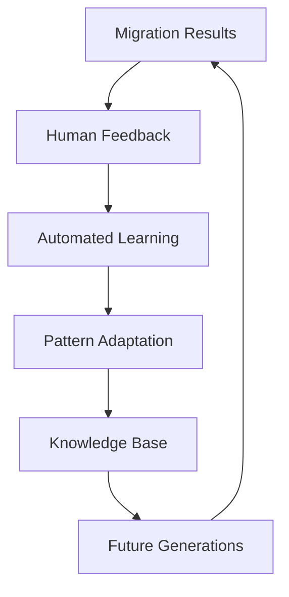

# 🧠 Socle IA d'analyse et de migration

## 🎯 Objectif

Mettre en place un socle d'intelligence artificielle robuste, évolutif et sécurisé qui servira de fondation à l'ensemble des processus d'analyse et de migration automatisée du code legacy vers l'architecture cible. Ce socle permettra:
- Une analyse fine et précise du code source legacy
- La génération de code de haute qualité suivant les standards architecturaux définis
- Un processus de migration incrémental, traçable et contrôlé
- Un écosystème extensible pour l'incorporation de nouveaux modèles et techniques

## 🏗️ Architecture du socle IA

### Vue d'ensemble



### Composants principaux

#### 1. Knowledge Base (Base de connaissances)

Centre névralgique du socle IA qui centralise:
- **Code vectorisé**: Représentations vectorielles du code source
- **Graphes de dépendances**: Relations entre composants et modules
- **Patterns identifiés**: Patterns récurrents et idiomatiques
- **Règles métier**: Logique métier extraite et formalisée
- **Architectures**: Structures et paradigmes architecturaux

#### 2. Agents IA spécialisés

Ensemble d'agents autonomes spécialisés:
- **Agent Analyste**: Compréhension profonde du code legacy
- **Agent Transformateur**: Conversion vers l'architecture cible
- **Agent Validateur**: Contrôle qualité et conformité
- **Agent Documentateur**: Génération de documentation technique

#### 3. Translation Repository (Dépôt de traduction)

Espace de travail intermédiaire contenant:
- **Mapping contextualisé**: Relations entre code source et cible
- **Artefacts intermédiaires**: Représentations transitionnelles
- **Historique de transformation**: Traçabilité des décisions de migration
- **Métadonnées de qualité**: Métriques et indices de confiance

## 🛠️ Préparation du socle IA

### 1. Mise en place de l'infrastructure technique

#### Environnement d'exécution

```yaml
# Spécification de l'environnement
infrastructure:
  compute:
    type: GPU-accelerated
    requirements:
      cpu: 16+ cores
      gpu: NVIDIA A100 ou similaire
      ram: 64+ GB
      storage: 1+ TB SSD
  
  containerization:
    platform: Kubernetes
    namespaces:
      - ia-core
      - knowledge-base
      - agents
      - pipelines
    
  scaling:
    autoscaling: true
    min_replicas: 2
    max_replicas: 10
    scaling_metrics:
      - cpu_utilization: 70%
      - memory_utilization: 75%
```

#### Stockage de la base de connaissances

```yaml
# Configuration du stockage de la base de connaissances
knowledge_store:
  vector_db:
    type: Pinecone
    dimensions: 1536
    metrics: cosine
    storage_capacity: 500GB
    
  graph_db:
    type: Neo4j
    version: 5.9
    storage_capacity: 200GB
    
  document_store:
    type: MongoDB
    collections:
      - code_entities
      - patterns
      - business_rules
      - migration_metadata
```

### 2. Configuration des modèles IA

#### Modèles fondamentaux

| Modèle | Usage | Configuration | 
|--------|-------|---------------|
| GPT-4 | Analyse complexe, génération de code | Temperature: 0.2, Max tokens: 8,000 |
| Code Llama-34B | Analyse de code source, suggestions | Temperature: 0.1, Max tokens: 6,000 |
| BERT spécialisé code | Embeddings structurels de code | Dimensions: 768, Batch size: 64 |
| CodeT5+ | Refactoring, transformation | Beam size: 5, Length penalty: 0.8 |

#### Prompting et adaptation

1. **Technique de prompting structuré**:
   ```python
   def create_analyze_prompt(code_snippet, context, target_framework):
       prompt = f"""
       # Code Analysis Task
       
       ## Source Code (PHP)
       ```php
       {code_snippet}
       ```
       
       ## Context Information
       {context}
       
       ## Target Framework
       {target_framework}
       
       ## Analysis Instructions
       1. Identify the main functionality of this code
       2. Determine key dependencies and external interfaces
       3. Identify business logic and validation rules
       4. Evaluate complexity and potential refactoring needs
       5. Determine equivalent patterns in target framework
       
       ## Output Format
       Provide the analysis in JSON format with the following structure:
       ```
       {{
         "functionality": "",
         "dependencies": [],
         "business_rules": [],
         "complexity_score": 0-10,
         "refactoring_needed": true/false,
         "target_patterns": []
       }}
       ```
       """
       return prompt
   ```

2. **Few-shot learning templates**:
   - Collection de paires exemple-source → exemple-cible
   - Adaptateurs spécifiques par module legacy
   - Exemples graduels de complexité croissante

### 3. Préparation du pipeline d'ingestion

#### Processus d'ingestion de code



#### Configuration du préprocesseur

```python
# Configuration du prétraitement du code
preprocessing_config = {
    'languages': {
        'php': {
            'parser': 'php-parser',
            'version': '7.4',
            'extensions': ['.php', '.phtml'],
            'ignore_patterns': ['vendor/*', 'tests/*']
        },
        'sql': {
            'parser': 'sql-parser',
            'dialect': 'mysql',
            'extensions': ['.sql'],
            'transform': 'normalize_schema'
        }
    },
    'chunking': {
        'method': 'semantic_boundaries',
        'max_chunk_size': 1500,
        'overlap': 150
    },
    'enrichment': {
        'include_comments': True,
        'extract_docblocks': True,
        'resolve_includes': True,
        'track_variables': True
    }
}
```

### 4. Construction des agents spécialisés

#### Agent Analyste

**Capacités**:
- Analyse syntaxique et sémantique
- Identification des patterns de conception
- Reverse engineering de la logique métier
- Cartographie des dépendances
- Détection des vulnérabilités et dette technique

**Configuration**:
```yaml
analyzer_agent:
  models:
    primary: gpt-4
    fallback: code-llama-34b
  
  analyzers:
    - type: static_analyzer
      priority: high
    - type: dependency_graph
      priority: medium
    - type: business_logic_extractor
      priority: high
    - type: security_auditor
      priority: medium
  
  output_formats:
    - structured_json
    - graph_representation
    - documentation_md
  
  performance:
    max_file_size: "5MB"
    timeout: 300
    parallel_analyses: 5
```

#### Agent Transformateur

**Capacités**:
- Translation PHP vers TypeScript/JavaScript
- Mapping de structures de données legacy vers Prisma
- Refactoring vers les patterns modernes
- Génération de tests unitaires
- Intégration avec les bibliothèques cibles

**Configuration**:
```yaml
transformer_agent:
  models:
    primary: gpt-4
    specialized: codet5-plus-770m
  
  transformation_rules:
    - pattern: "php_legacy_patterns.json"
      target: "nestjs_patterns.json"
    - pattern: "mysql_queries.json"
      target: "prisma_queries.json"
  
  quality_settings:
    type_safety: strict
    error_handling: comprehensive
    naming_convention: camelCase
    module_pattern: feature-based
  
  limitations:
    max_transformation_unit: "module"
    complexity_threshold: 8
```

#### Agent Validateur

**Capacités**:
- Vérification de l'équivalence fonctionnelle
- Tests de non-régression automatiques
- Validation structurelle et architecturale
- Détection des anti-patterns
- Mesure de la qualité du code généré

**Configuration**:
```yaml
validator_agent:
  models:
    primary: gpt-4
    fallback: code-llama-34b
  
  validation_steps:
    - type: syntax_validation
      blocking: true
    - type: semantic_equivalence
      blocking: true
    - type: test_generation_and_execution
      blocking: false
    - type: architectural_compliance
      blocking: true
    - type: performance_estimation
      blocking: false
  
  thresholds:
    minimum_confidence: 0.85
    coverage_requirement: 0.75
    architecture_compliance: 0.95
```

#### Agent Documentateur

**Capacités**:
- Génération de documentation technique
- Création de diagrammes architecturaux
- Documentation des APIs
- Génération de guides de migration
- Rapports de transformation

**Configuration**:
```yaml
documentator_agent:
  models:
    primary: gpt-4
  
  documentation_types:
    - type: technical_reference
      format: markdown
    - type: api_documentation
      format: openapi
    - type: architecture_diagrams
      format: mermaid
    - type: migration_report
      format: pdf
  
  templates:
    base_path: "/templates/documentation"
    naming_convention: "${module}_${doctype}.tpl"
```

## 🔗 Workflows de migration

### 1. Workflow d'analyse préliminaire



### 2. Workflow de migration module par module



## 🔧 Mécanismes d'apprentissage et d'amélioration

### 1. Boucle de feedback



### 2. Fine-tuning incrémental

- **Collection de données**: Paires de code source-cible validées
- **Protocole d'entraînement**: Fine-tuning par cohortes mensuelles
- **Validation croisée**: Tests sur modules représentatifs
- **Déploiement graduel**: A/B testing des modèles améliorés

## 🛡️ Sécurité et gouvernance

### 1. Protections des données sensibles

- **Scan pré-ingestion**: Détection de secrets, tokens, informations personnelles
- **Anonymisation**: Remplacement des données sensibles par des placeholders
- **Contrôle d'accès**: RBAC strict sur la base de connaissances
- **Traçabilité**: Journalisation exhaustive des accès et usages

### 2. Gouvernance de la migration

- **Comité de supervision IA**: Validation des modèles et décisions automatiques
- **Politiques d'audit**: Revue régulière des performances et dérives
- **Mécanismes d'intervention**: Circuit breaker automatique en cas d'anomalie
- **Stratégie d'explainabilité**: Documentation des décisions significatives

## 📊 Métriques de réussite

### Indicateurs de performance

| Métrique | Objectif | Méthode de mesure |
|----------|----------|-------------------|
| Taux de réussite de migration | > 90% | % de modules migrés sans intervention manuelle |
| Qualité du code généré | > 85% | SonarQube, CodeClimate scores |
| Équivalence fonctionnelle | 100% | Tests de non-régression |
| Conformité architecturale | > 95% | Validation automatisée patterns |
| Temps de migration | Réduction 80% | Comparaison avec estimation manuelle |
| Précision documentation | > 95% | Revue par échantillonnage |

### Tableau de bord de migration

Un tableau de bord temps réel accessible via le Command Center pour suivre:
- L'avancement global de la migration
- Les performances des agents IA
- La qualité des artefacts générés
- Les alertes et blocages
- Les prédictions et tendances

## 🔄 Processus de déploiement initial

### Étapes de déploiement du socle

1. **Préparation de l'infrastructure**
   - Configuration des environnements Kubernetes
   - Déploiement des bases de données vectorielles et graphes
   - Mise en place du pipeline CI/CD

2. **Déploiement des composants**
   - Installation des modèles IA et leurs dépendances
   - Configuration des agents spécialisés
   - Préparation des entrepôts et espaces de travail

3. **Ingestion initiale**
   - Premier chargement du code legacy
   - Construction de la base de connaissances
   - Validation de la représentation vectorielle

4. **Calibration des agents**
   - Tests sur échantillons représentatifs
   - Ajustement des prompts et paramètres
   - Optimisation des seuils de confiance

5. **Validation système**
   - Test de bout en bout sur un module pilote
   - Vérification des performances et précision
   - Ajustements finaux avant production

Ce socle IA constitue la fondation technologique qui permettra d'automatiser et d'accélérer le processus de migration, tout en garantissant la qualité, la traçabilité et la conformité du code généré.
