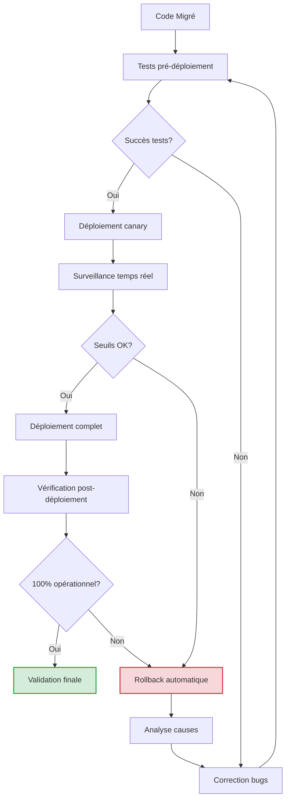

# 🧪 Vérification de Compatibilité SEO et Fonctionnelle (Tests Agents)

## 🎯 Objectif

Assurer la compatibilité SEO et fonctionnelle du code migré via des agents de test automatisés, et mettre en place un système de rollback automatique en cas d'échec d'intégration pour garantir la stabilité du système en production.

## 📊 Agents de vérification

| Agent | Rôle | Métriques analysées |
|-------|------|---------------------|
| `seo-validator.ts` | Vérifier la préservation des URLs, balises méta et canoniques | Correspondance SEO, indexabilité, données structurées |
| `functional-tester.ts` | Valider les fonctionnalités côté client et comportements | Taux de succès des cas de test, parité fonctionnelle |
| `performance-analyzer.ts` | Comparer les performances avant/après migration | Temps de chargement, Core Web Vitals, taille de bundle |
| `rollback-controller.ts` | Orchestrer le rollback automatique en cas d'échec | Critères d'échec, statistiques de déploiement |

## 🔍 Processus de vérification et rollback



## 🛡️ Système de vérification SEO

### Métriques SEO surveillées
- Préservation des URLs canoniques
- Intégrité des balises meta (`title`, `description`, `robots`)
- Données structurées Schema.org
- Statuts HTTP corrects (301, 302, 404, etc.)
- Temps de réponse du serveur

### Agent `seo-validator.ts`

```typescript
// Extrait simplifié
interface SEOValidationConfig {
  originalURLsMap: string;      // Fichier JSON mappant les anciennes/nouvelles URLs
  metaTagsMap: string;         // Fichier JSON des balises méta attendues
  schemaOrgMap: string;        // Modèles de données structurées attendus
  thresholds: {
    metaMatch: number;         // % de correspondance minimale (ex: 95%)
    canonicalMatch: number;    // % d'URLs canoniques préservées (ex: 100%)
    statusCodeMatch: number;   // % de codes HTTP corrects (ex: 98%)
  };
}

// Tests effectués automatiquement
async function validateSEO(config: SEOValidationConfig): Promise<ValidationResult> {
  // 1. Vérification des redirections (anciennes URLs vers nouvelles)
  // 2. Validation des balises méta sur les pages migrées
  // 3. Test des données structurées (schema.org)
  // 4. Vérification des headers HTTP (caching, etc.)
  // 5. Génération d'un rapport de compatibilité
}
```

## 🧪 Système de tests fonctionnels

### Scénarios de test automatisés
- Parcours utilisateur complets (end-to-end)
- Tests d'intégration des composants
- Tests unitaires des fonctions critiques
- Tests de régression sur les formulaires
- Validations des API

### Agent `functional-tester.ts`

```typescript
// Extrait simplifié
interface FunctionalTestConfig {
  testSuites: string[];         // Chemins vers les suites de tests
  snapshotDir: string;          // Répertoire des snapshots de référence
  parallelTests: number;        // Nombre de tests en parallèle
  thresholds: {
    passRate: number;           // % minimum de tests réussis (ex: 100%)
    coverageRate: number;       // % minimum de couverture de code (ex: 85%)
  };
  recordVideo: boolean;         // Enregistrer vidéos des échecs
}

// Tests effectués automatiquement
async function runFunctionalTests(config: FunctionalTestConfig): Promise<TestResults> {
  // 1. Tests UI avec Playwright/Cypress
  // 2. Tests d'API avec Jest/Supertest
  // 3. Comparaison avec comportement legacy
  // 4. Analyse de régression visuelle
  // 5. Génération de rapports détaillés
}
```

## ⚡ Système d'analyse de performance

### Métriques de performance
- Temps de chargement initial (FCP, LCP)
- Temps d'interaction (FID, TBT, CLS)
- Taille des assets JS/CSS
- Requêtes API et temps de réponse
- Utilisation mémoire et CPU

### Agent `performance-analyzer.ts`

```typescript
// Extrait simplifié
interface PerformanceConfig {
  legacyBaselineFile: string;   // Métriques de référence du système legacy
  minImprovementTarget: number; // Amélioration minimale attendue (ex: 20%)
  maxRegressionAllowed: number; // Régression maximale tolérée (ex: 5%)
  environments: string[];       // Environnements à tester (dev, staging)
  devices: string[];            // Profils d'appareils (mobile, desktop)
}

// Analyses effectuées automatiquement
async function analyzePerformance(config: PerformanceConfig): Promise<PerformanceReport> {
  // 1. Mesure des Core Web Vitals
  // 2. Analyse de taille de bundle
  // 3. Profilage des temps de réponse API
  // 4. Comparaison avec baseline legacy
  // 5. Génération de graphes comparatifs
}
```

## 🔄 Règles de rollback automatique

Le système `rollback-controller.ts` assure la stabilité en production en déclenchant un rollback automatique en cas d'anomalies détectées.

### Critères de déclenchement

| Métrique | Seuil critique | Temps d'observation |
|----------|----------------|---------------------|
| Taux d'erreur | > 1% | 5 minutes |
| Temps de réponse | > 300% de la baseline | 10 minutes |
| Score SEO | < 90% du score précédent | Instantané |
| Taux de conversion | < 80% du taux normal | 30 minutes |
| Erreurs critiques | Présence | Instantané |

### Processus de rollback

```typescript
// Extrait simplifié
interface RollbackConfig {
  monitoringInterval: number;   // Intervalle de surveillance en secondes
  deploymentStages: string[];   // Étapes de déploiement (canary, 25%, 50%, 100%)
  thresholds: {                 // Seuils par métrique
    errorRate: number;
    responseTime: number;
    seoScore: number;
    conversionRate: number;
  };
  notificationTargets: string[]; // Destinataires des alertes
  autoRollbackEnabled: boolean;  // Activer/désactiver le rollback auto
}

// Processus d'orchestration du rollback
async function monitorAndRollback(config: RollbackConfig): Promise<DeploymentStatus> {
  // 1. Surveillancer en continu les métriques clés
  // 2. Comparer avec les seuils configurés
  // 3. Déclencher le rollback si nécessaire
  // 4. Notifier l'équipe des problèmes
  // 5. Générer un rapport d'incident
}
```

## 📝 Intégration dans le pipeline CI/CD

Le processus de vérification et rollback s'intègre dans le pipeline CI/CD:

1. **Phase de build**: Exécution des tests unitaires et d'intégration
2. **Phase de pre-deploy**: Vérification SEO et tests fonctionnels
3. **Phase de canary**: Déploiement limité avec surveillance
4. **Phase de rollout**: Déploiement progressif avec seuils d'alerte
5. **Phase post-deploy**: Vérification continue et rollback si nécessaire

### Configuration dans les workflows GitHub Actions

```yaml
# Extrait simplifié du workflow
jobs:
  deploy:
    steps:
      - name: Run SEO validation
        uses: ./.github/actions/seo-validator
        with:
          threshold: 95
          fail-on-error: true
          
      - name: Canary deployment
        uses: ./.github/actions/canary-deploy
        with:
          percentage: 10
          observation-time: 10m
          
      - name: Monitor deployment
        uses: ./.github/actions/monitor-deployment
        with:
          error-threshold: 1
          response-time-threshold: 300
          auto-rollback: true
```

## 📈 Métriques de succès et tableaux de bord

Un tableau de bord unifié permet de suivre:

- **Taux de réussite des migrations**: % de fonctionnalités migrées avec succès
- **Stabilité post-migration**: Nombre d'incidents et rollbacks
- **Impact SEO**: Évolution des positions et trafic organique
- **Performance**: Amélioration des Core Web Vitals
- **Retour utilisateur**: Net Promoter Score, taux de satisfaction

## 🚨 Protocole de gestion des incidents

En cas de rollback automatique:

1. **Notification immédiate**: Alerte aux équipes concernées (Dev, SEO, Ops)
2. **Analyse post-mortem**: Identification des causes racines
3. **Correctifs prioritaires**: Résolution des problèmes identifiés
4. **Test renforcé**: Ajout de tests spécifiques pour prévenir la récurrence
5. **Documentation**: Mise à jour de la base de connaissances

Ce système de vérification et rollback garantit que la migration n'impacte pas négativement l'expérience utilisateur ou le référencement du site, tout en permettant une détection et correction rapide des problèmes.
