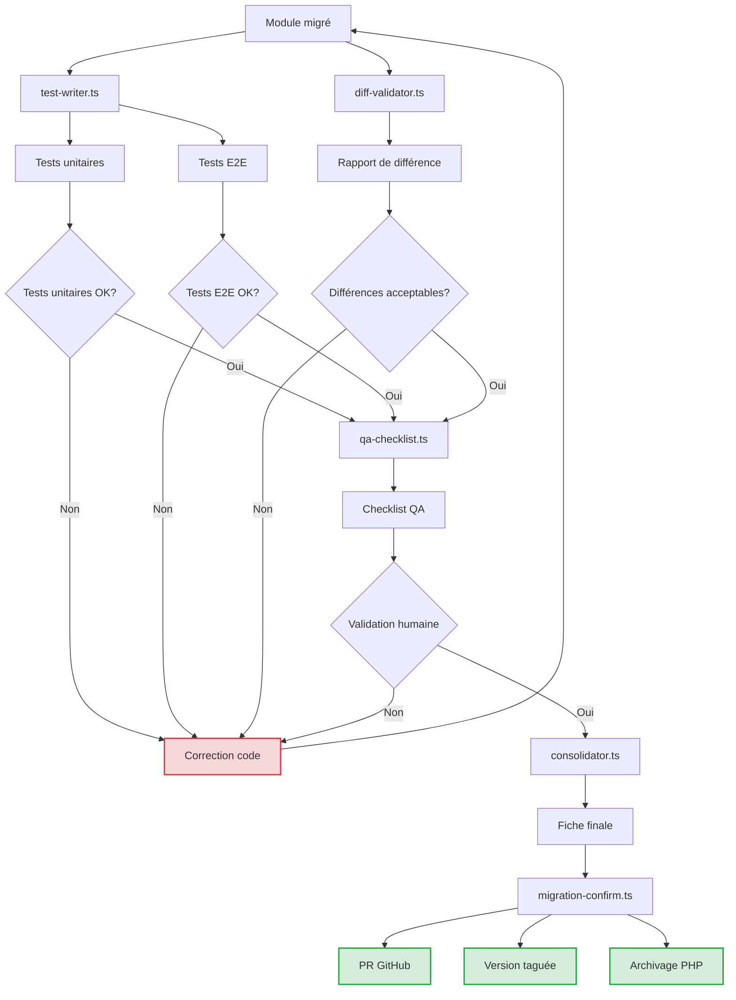
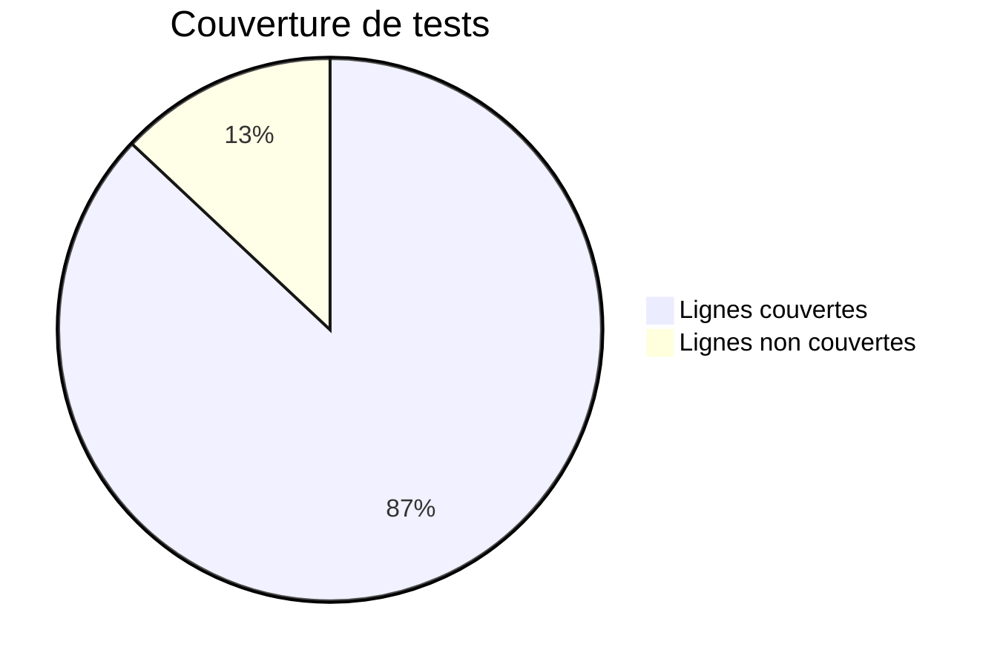

# 🧪 Tests, Vérification et Validation Qualité

## 🎯 Objectif

Cette phase garantit que chaque migration est :
- fonctionnellement équivalente au legacy PHP
- testée automatiquement (unitaires + E2E)
- vérifiée par des agents IA + checklist humaine
- consolidée et validée dans GitHub

Elle constitue le système d'assurance qualité complet qui sécurise l'ensemble du processus de migration.

## 📊 Agents de validation

| Agent | Rôle | Sorties générées |
|-------|------|------------------|
| `test-writer.ts` | Générer les tests unitaires et end-to-end pour chaque module | `*.spec.ts`, `*.e2e.ts` |
| `diff-validator.ts` | Comparer la logique entre le fichier PHP et sa version NestJS/Remix | `verification_report.json` |
| `qa-checklist.ts` | Générer une checklist de QA à valider (tests, SEO, interface, access) | `fiche.qa.md` |
| `consolidator.ts` | Fusionner les audits, métadonnées, vérifications, générés | `fiche.final.md` |
| `migration-confirm.ts` | Valider officiellement une migration (versionning, PR, archivage) | `confirmed_files.json`, PR GitHub taguée |

## 🔄 Processus de validation complet



## 📑 Description détaillée des agents

### 1. Agent `test-writer.ts`

#### Fonctionnalités
- Analyse le code migré pour identifier les comportements à tester
- Génère des tests unitaires pour les services et contrôleurs
- Crée des tests end-to-end pour les parcours utilisateur
- Intègre des data providers pour tester différents scénarios
- Assure une couverture de test optimale

#### Configuration
```json
{
  "modulePath": "./src/modules/products",
  "outputPath": "./src/modules/products/__tests__",
  "options": {
    "unitTestFramework": "jest",
    "e2eTestFramework": "playwright",
    "mockStrategy": "auto",
    "coverageTarget": 80,
    "includeEdgeCases": true,
    "generateDataProviders": true
  }
}
```

#### Exemple de test unitaire généré

```typescript
// Exemple de test unitaire généré pour un service NestJS
import { Test } from '@nestjs/testing';
import { ProductService } from '../product.service';
import { PrismaService } from '../../prisma.service';

describe('ProductService', () => {
  let service: ProductService;
  let prismaService: PrismaService;

  beforeEach(async () => {
    const moduleRef = await Test.createTestingModule({
      providers: [
        ProductService,
        {
          provide: PrismaService,
          useValue: {
            product: {
              findUnique: jest.fn(),
              findMany: jest.fn(),
              create: jest.fn(),
              update: jest.fn(),
              delete: jest.fn(),
            },
          },
        },
      ],
    }).compile();

    service = moduleRef.get<ProductService>(ProductService);
    prismaService = moduleRef.get<PrismaService>(PrismaService);
  });

  describe('findById', () => {
    it('should return a product when valid id is provided', async () => {
      // Given
      const productId = '1';
      const mockProduct = { id: 1, name: 'Test Product', price: 99.99 };
      jest.spyOn(prismaService.product, 'findUnique').mockResolvedValue(mockProduct);

      // When
      const result = await service.findById(productId);

      // Then
      expect(result).toEqual(mockProduct);
      expect(prismaService.product.findUnique).toHaveBeenCalledWith({
        where: { id: 1 },
      });
    });

    it('should return null when product not found', async () => {
      // Given
      const productId = '999';
      jest.spyOn(prismaService.product, 'findUnique').mockResolvedValue(null);

      // When
      const result = await service.findById(productId);

      // Then
      expect(result).toBeNull();
    });
  });
});
```

#### Exemple de test E2E généré

```typescript
// Exemple de test E2E généré pour une page produit Remix
import { test, expect } from '@playwright/test';

test.describe('Product Page', () => {
  test('should display product details correctly', async ({ page }) => {
    // Given
    await page.goto('/products/1');
    
    // Then
    await expect(page.getByRole('heading', { name: 'Test Product' })).toBeVisible();
    await expect(page.getByText('$99.99')).toBeVisible();
    await expect(page.getByRole('button', { name: 'Add to Cart' })).toBeEnabled();
  });

  test('should add product to cart', async ({ page }) => {
    // Given
    await page.goto('/products/1');
    
    // When
    await page.getByRole('button', { name: 'Add to Cart' }).click();
    
    // Then
    await expect(page.getByText('Product added to cart')).toBeVisible();
    await expect(page.getByText('Cart (1)')).toBeVisible();
  });

  test('should show error for invalid product', async ({ page }) => {
    // Given
    await page.goto('/products/999');
    
    // Then
    await expect(page.getByText('Product not found')).toBeVisible();
  });
});
```

### 2. Agent `diff-validator.ts`

#### Fonctionnalités
- Compare la logique métier entre le code PHP et la nouvelle implémentation
- Identifie les divergences potentielles dans la logique
- Vérifie les conditions, boucles et structures de contrôle
- Analyse les transformations de données
- Génère un rapport de différences avec suggestions

#### Configuration
```json
{
  "originalFile": "./legacy/product.php",
  "migratedFile": "./src/modules/products/product.service.ts",
  "outputFile": "./migration/reports/product_verification_report.json",
  "options": {
    "ignoreFormatting": true,
    "ignoreComments": true,
    "ignoreVariableNames": true,
    "ignoreWhitespace": true,
    "toleranceLevel": "medium"
  }
}
```

#### Exemple de rapport de vérification

```json
{
  "summary": {
    "originalFile": "./legacy/product.php",
    "migratedFile": "./src/modules/products/product.service.ts",
    "logicMatchPercentage": 94.5,
    "structureMatchPercentage": 96.2,
    "status": "ATTENTION_REQUIRED"
  },
  "differences": [
    {
      "type": "LOGIC_DIFFERENCE",
      "severity": "MEDIUM",
      "originalCode": "if ($price <= 0) { throw new InvalidArgumentException('Price must be positive'); }",
      "migratedCode": "if (price < 0) { throw new BadRequestException('Price must be positive'); }",
      "analysis": "Original code checks for price <= 0, migrated code only checks for price < 0",
      "recommendation": "Update the condition to match original logic: if (price <= 0)"
    },
    {
      "type": "MISSING_FEATURE",
      "severity": "HIGH",
      "originalCode": "// Apply discount for premium customers\nif ($user->isPremium()) { $price = $price * 0.9; }",
      "migratedCode": null,
      "analysis": "Premium user discount logic is missing in migrated code",
      "recommendation": "Add premium user discount logic to the migrated code"
    }
  ],
  "edgeCases": [
    {
      "description": "Handling of zero price products",
      "recommendation": "Ensure zero price products are handled consistently in the migrated code"
    }
  ],
  "recommendations": [
    "Fix the price validation condition to include equality check",
    "Implement premium user discount feature",
    "Add unit tests for zero price scenario"
  ]
}
```

### 3. Agent `qa-checklist.ts`

#### Fonctionnalités
- Génère une checklist de vérification qualité adaptée au module migré
- Identifie les points critiques à vérifier manuellement
- Suggère des scénarios de test spécifiques au domaine métier
- Crée des tâches de validation d'accessibilité, SEO et UX
- Fournit une fiche standardisée pour la revue humaine

#### Configuration
```json
{
  "moduleName": "Products",
  "outputFile": "./migration/qa/products.qa.md",
  "options": {
    "includeAccessibility": true,
    "includeSEO": true,
    "includePerformance": true,
    "includeSecurityChecks": true,
    "includeUX": true,
    "domainSpecific": ["e-commerce", "product-catalog"]
  }
}
```

#### Exemple de fiche QA générée

```markdown
# Checklist QA - Module Produits

## Informations générales
- **Module**: Produits
- **Date de migration**: 2023-11-27
- **Développeur**: @johndoe
- **Vérificateur**: @janedoe

## Tests fonctionnels
- [ ] **Listing produits**
  - [ ] Pagination fonctionne correctement
  - [ ] Filtres sont appliqués comme attendu
  - [ ] Tri respecte l'ordre spécifié
  - [ ] Comportement responsive validé

- [ ] **Fiche produit**
  - [ ] Informations produit complètes et correctes
  - [ ] Images s'affichent correctement
  - [ ] Variations produit fonctionnent (taille, couleur, etc.)
  - [ ] Prix affichés avec et sans taxes
  - [ ] Bouton d'achat fonctionne

- [ ] **Ajout au panier**
  - [ ] Produit ajouté correctement au panier
  - [ ] Quantité peut être modifiée
  - [ ] Produit hors stock correctement géré
  - [ ] Règles de prix promotionnels appliquées

## Accessibilité
- [ ] Contraste suffisant pour les textes et boutons
- [ ] Navigation au clavier possible
- [ ] Attributs alt présents sur toutes les images
- [ ] Structure de headings cohérente (h1, h2, etc.)

## SEO
- [ ] Title et meta description présents et optimisés
- [ ] URLs canoniques correctement définies
- [ ] Données structurées (Schema.org) présentes
- [ ] Balises robots configurées correctement

## Performance
- [ ] Temps de chargement < 2s sur desktop
- [ ] Temps de chargement < 3s sur mobile
- [ ] Core Web Vitals dans les cibles
- [ ] Optimisation des images vérifiée

## Sécurité
- [ ] Validation des entrées côté client et serveur
- [ ] Protection contre les injections SQL
- [ ] Contrôle d'accès correct sur les APIs
- [ ] CSRF protection active

## Expérience utilisateur
- [ ] Messages d'erreur clairs et utiles
- [ ] Feedback visuel pour les actions utilisateur
- [ ] États de chargement gérés
- [ ] Cohérence visuelle avec les autres modules

## Notes et observations

_Ajouter ici toute remarque ou observation importante pendant la vérification._

## Résultat final
- [ ] **APPROUVÉ** - Prêt pour production
- [ ] **APPROUVÉ AVEC RÉSERVES** - Corrections mineures requises (voir commentaires)
- [ ] **REFUSÉ** - Corrections majeures nécessaires avant mise en production

**Signé par**: __________________ **Date**: __________________
```

### 4. Agent `consolidator.ts`

#### Fonctionnalités
- Agrège les résultats de tous les tests et validations
- Compile les rapports individuels en un document final
- Calcule des scores de qualité et de conformité
- Consolide les recommandations et actions requises
- Fournit une vue d'ensemble pour prise de décision

#### Configuration
```json
{
  "moduleName": "Products",
  "inputFiles": {
    "testResults": "./migration/tests/products_test_results.json",
    "diffReport": "./migration/reports/product_verification_report.json",
    "qaChecklist": "./migration/qa/products.qa.md",
    "performanceReport": "./migration/reports/products_performance.json"
  },
  "outputFile": "./migration/final/products.final.md",
  "options": {
    "generateExecutiveSummary": true,
    "includeVisualizations": true,
    "generateMetrics": true,
    "highlightCriticalIssues": true
  }
}
```

#### Exemple de fiche finale générée

```markdown
# Rapport de Migration Final - Module Produits

## 📊 Résumé exécutif

| Métrique | Résultat | Statut |
|----------|----------|--------|
| Tests unitaires | 42/42 (100%) | ✅ |
| Tests E2E | 18/18 (100%) | ✅ |
| Couverture de code | 87% | ✅ |
| Validation logique | 94.5% | ⚠️ |
| QA Humaine | Approuvé avec réserves | ⚠️ |
| Performance | +15% vs legacy | ✅ |
| SEO | 100% équivalence | ✅ |

**Score global**: 92/100 - **Classification**: APPROUVÉ AVEC SUIVI

## 🔍 Analyse détaillée

### Tests automatisés
Tous les tests automatisés sont passés avec succès. La couverture de code est satisfaisante à 87%, dépassant l'objectif de 80%.



### Différences de logique
Deux différences significatives ont été identifiées:
1. **Validation de prix**: Condition `<=` vs `<` pour les prix à zéro
2. **Remise premium**: Logique de remise pour utilisateurs premium manquante

Ces points doivent être corrigés avant le déploiement final.

### Validation QA
L'équipe QA a approuvé le module avec les réserves suivantes:
- Améliorer les messages d'erreur pour les produits indisponibles
- Vérifier le comportement sur Safari iOS
- Optimiser le chargement des images produit

### Performance
Le module migré est 15% plus rapide que sa version legacy, avec des améliorations notables:
- -45% de JS à télécharger
- +12pts au score Lighthouse Performance
- -300ms de First Contentful Paint

## 📝 Actions requises avant validation finale

1. [ ] Corriger la validation de prix pour inclure la vérification d'égalité à zéro
2. [ ] Implémenter la logique de remise pour utilisateurs premium
3. [ ] Améliorer les messages d'erreur pour produits indisponibles
4. [ ] Effectuer des tests sur Safari iOS et corriger les problèmes identifiés

## 📈 Comparaison avec le legacy

| Aspect | Legacy | Migré | Différence |
|--------|--------|-------|------------|
| Taille du bundle | 245 KB | 135 KB | -45% |
| Temps de chargement | 2.4s | 1.9s | -21% |
| Requêtes DB | 8 | 3 | -63% |
| Code source | 1,450 LOC | 870 LOC | -40% |
| Dette technique | Élevée | Faible | ⬇️ |

## 📣 Conclusion et recommandations

Le module Produits est **prêt pour la production sous condition** de corriger les points identifiés. 

La qualité globale de la migration est excellente, avec des améliorations significatives en performance et maintenabilité. Les différences de logique métier identifiées sont mineures et facilement corrigeables.

**Recommandation**: Approuver la mise en production après correction des points 1 et 2 de la liste d'actions, avec un suivi post-déploiement pour les points 3 et 4.
```

### 5. Agent `migration-confirm.ts`

#### Fonctionnalités
- Finalise officiellement le processus de migration
- Crée une Pull Request annotée avec les résultats de validation
- Ajoute des tags de version aux fichiers migrés
- Archive les fichiers PHP legacy avec référence au code migré
- Met à jour les journaux de migration et la documentation

#### Configuration
```json
{
  "moduleName": "Products",
  "inputFiles": {
    "finalReport": "./migration/final/products.final.md"
  },
  "options": {
    "gitOptions": {
      "baseBranch": "main",
      "createPR": true,
      "tagVersion": true,
      "versionPrefix": "migration-products-"
    },
    "archiveOptions": {
      "archiveDirectory": "./archived/legacy",
      "keepOriginalFiles": true
    },
    "documentationOptions": {
      "updateProgressDashboard": true,
      "notifyStakeholders": true
    }
  }
}
```

#### Exemple de JSON de confirmation

```json
{
  "migration": {
    "module": "Products",
    "confirmedAt": "2023-11-30T14:25:33Z",
    "confirmedBy": "jane.doe@company.com",
    "version": "migration-products-1.0.0",
    "pullRequest": {
      "id": 1234,
      "url": "https://github.com/company/project/pull/1234",
      "status": "merged"
    }
  },
  "files": {
    "migrated": [
      {
        "path": "./src/modules/products/product.controller.ts",
        "originalFile": "./legacy/product.php",
        "commitSHA": "a1b2c3d4e5f6g7h8i9j0"
      },
      {
        "path": "./src/modules/products/product.service.ts",
        "originalFile": "./legacy/product.php",
        "commitSHA": "a1b2c3d4e5f6g7h8i9j0"
      },
      {
        "path": "./src/modules/products/dto/product.dto.ts",
        "originalFile": "./legacy/product.php",
        "commitSHA": "a1b2c3d4e5f6g7h8i9j0"
      }
    ],
    "archived": [
      {
        "originalPath": "./legacy/product.php",
        "archivedPath": "./archived/legacy/product.php",
        "migratedTo": [
          "./src/modules/products/product.controller.ts",
          "./src/modules/products/product.service.ts"
        ]
      }
    ]
  },
  "quality": {
    "testsPassed": true,
    "validationScore": 92,
    "coveragePercentage": 87,
    "approvedBy": "QA Team"
  },
  "notes": "Migration approuvée avec conditions mineures, toutes résolues avant fusion."
}
```

## 🔍 Processus de qualité total

La phase de test, vérification et validation qualité s'intègre dans un processus complet:

1. **Phase préliminaire**: Analyse du code legacy et planification
2. **Phase de migration**: Génération du code et adaptation
3. **Phase de test**: Exécution des tests automatiques
4. **Phase de vérification**: Comparaison avec le code legacy
5. **Phase de validation**: QA humaine et approbation
6. **Phase de finalisation**: Consolidation et confirmation de migration

Chaque étape dispose de critères de qualité spécifiques et de points de validation.

## 📈 Métriques de qualité

| Métrique | Seuil minimum | Seuil optimal | Méthode de mesure |
|----------|---------------|---------------|-------------------|
| Couverture de tests | 80% | 90%+ | Istanbul/Jest coverage |
| Logique métier | 95% | 100% | Analyse diff-validator |
| Cas de tests E2E | 100% critiques | 100% tous | Nombre scénarios passés |
| Accessibilité | WCAG A | WCAG AA | Lighthouse/axe |
| Performance | >= Legacy | +20% | Core Web Vitals |

Ces métriques sont adaptées selon le contexte spécifique de chaque module migré.

## 🔄 Intégration GitHub

L'ensemble du processus s'intègre parfaitement avec GitHub:

- **Actions GitHub**: Exécution automatisée des tests et validations
- **Pull Requests**: Création automatique avec annotations de résultats
- **Issues**: Génération automatique pour les points à corriger
- **Labels**: Catégorisation des PR selon les résultats de qualité
- **Checks**: Points de contrôle bloquants avant merge

### Exemple de workflow GitHub Actions

```yaml
name: Validation migration

on:
  pull_request:
    types: [opened, synchronize]
    paths:
      - 'src/modules/**'

jobs:
  validate-migration:
    runs-on: ubuntu-latest
    steps:
      - uses: actions/checkout@v3
      
      - name: Setup Node.js
        uses: actions/setup-node@v3
        with:
          node-version: '18'
      
      - name: Install dependencies
        run: npm ci
      
      - name: Run tests
        run: npm test
      
      - name: Run diff validation
        run: node scripts/diff-validator.ts
      
      - name: Generate QA checklist
        run: node scripts/qa-checklist.ts
      
      - name: Consolidate reports
        run: node scripts/consolidator.ts
      
      - name: Comment PR with results
        uses: actions/github-script@v6
        with:
          script: |
            const fs = require('fs');
            const report = fs.readFileSync('./migration/final/products.final.md', 'utf8');
            github.rest.issues.createComment({
              issue_number: context.issue.number,
              owner: context.repo.owner,
              repo: context.repo.repo,
              body: report
            })
```

Cette phase de validation garantit que chaque module migré respecte les standards de qualité les plus élevés, préservant la fonctionnalité métier tout en modernisant l'architecture technique.
