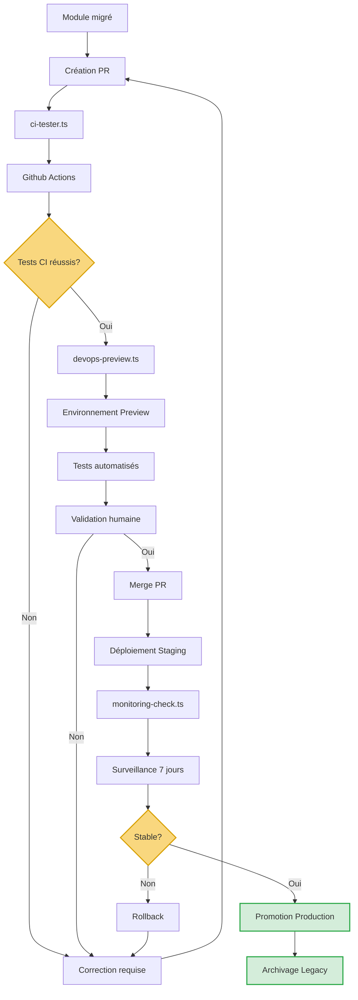

# 🚀 CI/CD & Supervision Post-Migration

## 🎯 Objectif

Cette phase déclenche automatiquement :
- la validation CI via GitHub Actions
- le déploiement preview (Coolify, Netlify, Docker, Render)
- un contrôle SEO, accessibilité, performance
- une trace de supervision post-migration

Elle garantit que chaque module migré est testé, validé et déployé automatiquement, avec une surveillance continue post-déploiement.

## 📊 Agents automatisés

| Agent | Rôle | Sorties générées |
|-------|------|------------------|
| `ci-tester.ts` | Générer et exécuter le workflow GitHub Actions pour chaque PR | `.github/workflows/ci-migration.yml` |
| `devops-preview.ts` | Créer une instance preview (Coolify, Docker, Render, Netlify, etc.) | URL temporaire unique par PR |
| `monitoring-check.ts` | Vérifier les routes actives, SEO, temps de réponse, erreurs 404/410 | `monitoring_report.json` |

## 🔄 Processus d'intégration et déploiement


```mermaid
graph TD
    A[Module migré] --> B[Création PR]
    B --> C[ci-tester.ts]
    C --> D[Github Actions]
    D --> E{Tests CI réussis?}
    
    E -->|Non| F[Correction requise]
    F --> B
    
    E -->|Oui| G[devops-preview.ts]
    G --> H[Environnement Preview]
    H --> I[Tests automatisés]
    I --> J[Validation humaine]
    
    J -->|Non| F
    
    J -->|Oui| K[Merge PR]
    K --> L[Déploiement Staging]
    L --> M[monitoring-check.ts]
    
    M --> N[Surveillance 7 jours]
    N --> O{Stable?}
    
    O -->|Non| P[Rollback]
    P --> F
    
    O -->|Oui| Q[Promotion Production]
    Q --> R[Archivage Legacy]
    
    style E fill:#f9d77e,stroke:#d8a000,stroke-width:2px
    style O fill:#f9d77e,stroke:#d8a000,stroke-width:2px
    style Q fill:#d4edda,stroke:#28a745,stroke-width:2px
    style R fill:#d4edda,stroke:#28a745,stroke-width:2px
```

## 📑 Description détaillée des agents

### 1. Agent `ci-tester.ts`

#### Fonctionnalités
- Génère les workflows GitHub Actions adaptés au module migré
- Configure les étapes de build, test et validation
- Définit les matrices de tests (Node.js, navigateurs, etc.)
- Initialise les caches pour optimiser les performances CI
- Publie les rapports de test et de couverture

#### Configuration
```json
{
  "moduleName": "Products",
  "repositoryPath": "organization/project",
  "outputPath": ".github/workflows/products-migration.yml",
  "buildConfig": {
    "nodeVersions": ["16.x", "18.x"],
    "packageManager": "pnpm",
    "installCommand": "pnpm install --frozen-lockfile",
    "buildCommand": "pnpm build",
    "testCommand": "pnpm test",
    "lintCommand": "pnpm lint"
  },
  "environments": ["ci", "preview"],
  "caching": {
    "dependencies": true,
    "buildArtifacts": true
  },
  "artifacts": {
    "testReports": true,
    "coverageReports": true
  }
}
```

#### Exemple de workflow généré

```yaml
# Workflow GitHub Actions généré par ci-tester.ts
name: Products Migration CI

on:
  pull_request:
    paths:
      - 'src/modules/products/**'
      - 'prisma/schema.prisma'
      - 'app/routes/products/**'
      - '.github/workflows/products-migration.yml'

jobs:
  validate:
    name: Validate (${{ matrix.node-version }})
    runs-on: ubuntu-latest
    strategy:
      matrix:
        node-version: [16.x, 18.x]
      fail-fast: false
    
    steps:
      - uses: actions/checkout@v3
      
      - name: Setup Node.js ${{ matrix.node-version }}
        uses: actions/setup-node@v3
        with:
          node-version: ${{ matrix.node-version }}
          cache: 'pnpm'
      
      - name: Install dependencies
        run: pnpm install --frozen-lockfile
      
      - name: Lint
        run: pnpm lint
      
      - name: Build
        run: pnpm build
      
      - name: Test
        run: pnpm test
      
      - name: Upload coverage reports
        uses: codecov/codecov-action@v3
        with:
          directory: ./coverage/
          flags: products
      
  preview:
    name: Deploy preview
    needs: validate
    runs-on: ubuntu-latest
    
    steps:
      - uses: actions/checkout@v3
      
      - name: Setup Node.js
        uses: actions/setup-node@v3
        with:
          node-version: 18.x
          cache: 'pnpm'
      
      - name: Install dependencies
        run: pnpm install --frozen-lockfile
      
      - name: Build
        run: pnpm build
      
      - name: Deploy preview
        id: deploy-preview
        uses: acme/deploy-preview-action@v1
        with:
          token: ${{ secrets.DEPLOY_TOKEN }}
          project: products-migration
          commit: ${{ github.event.pull_request.head.sha }}
      
      - name: Comment PR
        uses: actions/github-script@v6
        with:
          script: |
            github.rest.issues.createComment({
              issue_number: context.issue.number,
              owner: context.repo.owner,
              repo: context.repo.repo,
              body: `🚀 Preview deployed to: ${process.env.PREVIEW_URL}`
            })
        env:
          PREVIEW_URL: ${{ steps.deploy-preview.outputs.url }}
```

### 2. Agent `devops-preview.ts`

#### Fonctionnalités
- Configure et déploie des environnements éphémères pour chaque PR
- Gère les connexions aux différentes plateformes (Coolify, Netlify, Render, etc.)
- Initialise les bases de données avec données de test
- Configure les variables d'environnement spécifiques
- Fournit des URLs uniques pour visualiser et tester la migration

#### Configuration
```json
{
  "providerType": "coolify",
  "connectionConfig": {
    "apiUrl": "https://api.coolify.example.com",
    "apiToken": "${COOLIFY_API_TOKEN}",
    "projectId": "products-migration"
  },
  "deploymentConfig": {
    "frontend": {
      "framework": "remix",
      "buildCommand": "npm run build",
      "outputDir": "build",
      "envVars": {
        "NODE_ENV": "preview",
        "API_URL": "${PREVIEW_API_URL}"
      }
    },
    "backend": {
      "framework": "nestjs",
      "buildCommand": "npm run build:api",
      "startCommand": "npm run start:api",
      "envVars": {
        "NODE_ENV": "preview",
        "DATABASE_URL": "${PREVIEW_DATABASE_URL}"
      }
    },
    "database": {
      "type": "postgres",
      "version": "14",
      "seedScript": "./scripts/seed-preview-db.js"
    }
  },
  "outputConfig": {
    "urlFormat": "pr-{PR_NUMBER}-{MODULE_NAME}.preview.example.com",
    "expirationDays": 7,
    "notifyChannels": ["github-pr", "slack-devs"]
  }
}
```

#### Exemple de sortie

```json
{
  "preview": {
    "id": "pr-123-products",
    "createdAt": "2023-12-01T14:32:17Z",
    "status": "deployed",
    "pullRequest": 123,
    "module": "Products",
    "deploymentIds": {
      "frontend": "f-ab12c34d",
      "backend": "b-ef56g78h",
      "database": "d-ij90k12l"
    },
    "urls": {
      "frontend": "https://pr-123-products.preview.example.com",
      "backend": "https://api.pr-123-products.preview.example.com",
      "swagger": "https://api.pr-123-products.preview.example.com/docs"
    },
    "resources": {
      "cpu": "0.5",
      "memory": "1Gi",
      "storage": "512Mi"
    },
    "expiresAt": "2023-12-08T14:32:17Z"
  }
}
```

### 3. Agent `monitoring-check.ts`

#### Fonctionnalités
- Surveille l'application déployée pour détecter les anomalies
- Vérifie la disponibilité des routes et les temps de réponse
- Analyse les erreurs et les problèmes SEO
- Compare les métriques avec la version legacy
- Génère des alertes en cas de problèmes post-déploiement

#### Configuration
```json
{
  "targetEnvironment": "staging",
  "baseUrl": "https://staging.example.com",
  "legacyBaseUrl": "https://legacy.example.com",
  "monitoringPeriod": {
    "duration": 7,
    "unit": "days"
  },
  "checkFrequency": {
    "amount": 15,
    "unit": "minutes"
  },
  "routes": [
    {
      "path": "/products",
      "method": "GET",
      "expectedStatus": 200,
      "maxResponseTime": 500
    },
    {
      "path": "/products/1",
      "method": "GET",
      "expectedStatus": 200,
      "maxResponseTime": 300
    },
    {
      "path": "/api/products",
      "method": "GET",
      "expectedStatus": 200,
      "maxResponseTime": 200
    }
  ],
  "seoChecks": {
    "title": true,
    "metaDescription": true,
    "canonicalUrls": true,
    "statusCodes": true,
    "sitemapIntegrity": true
  },
  "performanceChecks": {
    "fcp": {
      "threshold": 1800,
      "regressionTolerance": 0.2
    },
    "lcp": {
      "threshold": 2500,
      "regressionTolerance": 0.2
    },
    "cls": {
      "threshold": 0.1,
      "regressionTolerance": 0.1
    }
  },
  "alertConfig": {
    "channels": ["slack", "email"],
    "thresholds": {
      "error": 1,
      "warning": 3
    },
    "contacts": [
      "devops@example.com",
      "product@example.com"
    ]
  }
}
```

#### Exemple de rapport de surveillance

```json
{
  "monitoringReport": {
    "module": "Products",
    "environment": "staging",
    "startDate": "2023-12-01T00:00:00Z",
    "endDate": "2023-12-08T00:00:00Z",
    "status": "stable",
    "summary": {
      "totalChecks": 672,
      "successRate": 99.85,
      "averageResponseTime": 187,
      "errorCount": 1,
      "warningCount": 3
    },
    "routePerformance": [
      {
        "path": "/products",
        "successRate": 100,
        "avgResponseTime": 213,
        "p95ResponseTime": 278,
        "status": "healthy"
      },
      {
        "path": "/products/1",
        "successRate": 99.4,
        "avgResponseTime": 187,
        "p95ResponseTime": 235,
        "status": "healthy"
      },
      {
        "path": "/api/products",
        "successRate": 100,
        "avgResponseTime": 98,
        "p95ResponseTime": 145,
        "status": "healthy"
      }
    ],
    "seoStatus": {
      "titleMatch": 100,
      "descriptionMatch": 98.5,
      "canonicalMatch": 100,
      "statusCodeMatch": 100,
      "status": "healthy"
    },
    "webVitals": {
      "fcp": {
        "value": 1250,
        "comparisonToLegacy": -0.15,
        "status": "improved"
      },
      "lcp": {
        "value": 1950,
        "comparisonToLegacy": -0.22,
        "status": "improved"
      },
      "cls": {
        "value": 0.05,
        "comparisonToLegacy": -0.03,
        "status": "improved"
      }
    },
    "incidents": [
      {
        "timestamp": "2023-12-03T14:23:45Z",
        "type": "error",
        "description": "High response time on /products/1",
        "duration": 15,
        "resolution": "Automatically resolved"
      }
    ],
    "recommendations": [
      "Add caching for product images to further improve LCP",
      "Monitor traffic patterns during peak hours"
    ]
  }
}
```

## 🔧 Intégration dans le pipeline de migration

Le processus de CI/CD et supervision s'intègre parfaitement dans le pipeline global:

1. **Déclenchement automatique** suite à la création de PR de migration
2. **Validation technique** (tests, lint, build) par l'agent ci-tester
3. **Déploiement preview** par l'agent devops-preview
4. **Validation fonctionnelle** par l'équipe QA sur l'environnement preview
5. **Déploiement staging** après merge de la PR
6. **Surveillance continue** par l'agent monitoring-check pendant 7 jours
7. **Promotion en production** si la surveillance ne révèle pas d'anomalies

## 📈 Tableau de bord de supervision

Un tableau de bord unifié permet de suivre l'état des migrations en temps réel:

- **Statut des PR**: En cours, En validation, Déployé, Échoué
- **Environnements preview**: URLs et état de chaque déploiement
- **Métriques de performance**: Comparaison avec legacy
- **Stabilité post-déploiement**: Tracking des incidents et résolutions

Ce tableau permet aux équipes de développement, QA et produit de suivre l'avancement et la qualité des migrations.

## 🚨 Gestion des incidents

En cas d'anomalie détectée par le monitoring:

1. **Notification automatique** aux équipes concernées
2. **Création d'un ticket** avec contexte et traces détaillées
3. **Analyse immédiate** pour déterminer la cause
4. **Décision**: Fix rapide, rollback partiel ou rollback complet

Pour les problèmes critiques, un rollback automatique peut être déclenché selon des règles prédéfinies (taux d'erreur, indisponibilité, etc.).

## 📊 Métriques de réussite

| Métrique | Objectif | Méthode de mesure |
|----------|----------|-------------------|
| Taux de réussite CI | > 95% | Nombre de builds réussis / Total des builds |
| Vitesse de déploiement | < 10 min | Temps entre commit et déploiement preview |
| Stabilité post-déploiement | > 99.9% | Uptime sur 7 jours de surveillance |
| Régression performance | 0% | Comparaison des Core Web Vitals avec legacy |
| Taux de rollback | < 5% | Nombre de rollbacks / Nombre de déploiements |

Cette phase de CI/CD et supervision constitue le dernier rempart de qualité avant la mise en production définitive des modules migrés, garantissant une transition sans heurts entre l'ancien et le nouveau système.
