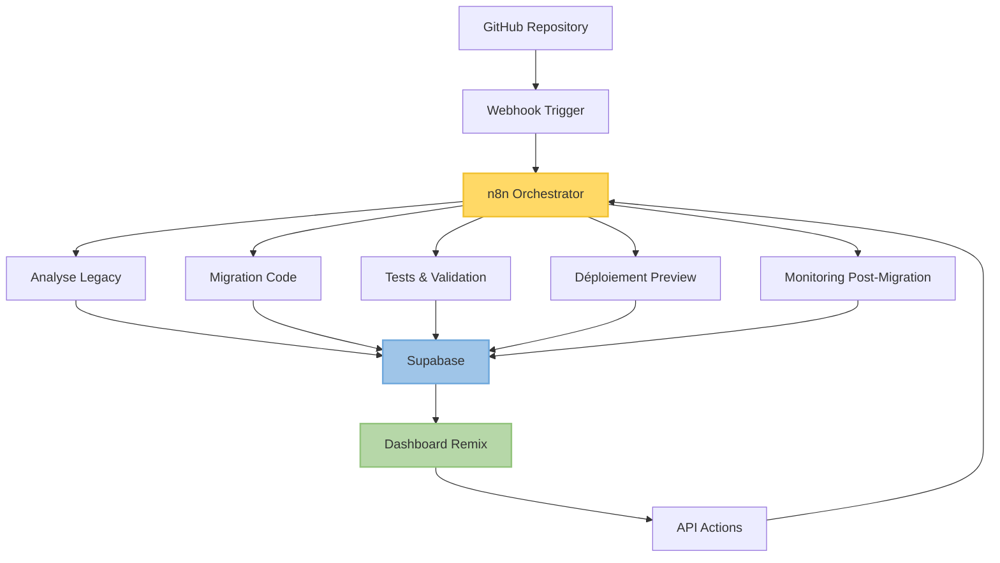

# 🎮 Suivi et Orchestration Globale

## 🎯 Objectif

Cette phase permet de :
- centraliser l'état d'avancement de chaque migration (agent par agent)
- visualiser les résultats, tests, validations
- déclencher des actions automatiques ou manuelles (rollback, relance, PR)

Elle fournit une vision unifiée du projet et facilite la coordination des différentes équipes et composants du système de migration.

## 🛠️ Outils d'orchestration et suivi

| Outil / Agent | Fonction | Notes |
|---------------|----------|-------|
| `n8n` | Orchestration de tous les agents : 1 nœud = 1 agent | Déclenchement séquentiel ou parallèle |
| `Supabase` | Base de suivi des fichiers migrés, état QA, score SEO | Données exportables ou utilisables en dashboard externe |
| `dashboard.tsx (Remix)` | Interface de suivi frontend : par route, par module, par fichier | Visualisation temps réel et historique |

## 🔄 Architecture d'orchestration

## 📊 Plateforme d'orchestration n8n

### Rôle de n8n
n8n sert de moteur d'orchestration central, où chaque agent de migration est représenté comme un nœud dans un workflow. Cette approche offre:

- **Flexibilité**: Configuration visuelle des flux de travail
- **Observabilité**: Suivi en temps réel de l'état d'exécution
- **Résilience**: Gestion des erreurs et des retries
- **Évolutivité**: Ajout facile de nouveaux agents ou étapes

### Structure des workflows n8n

