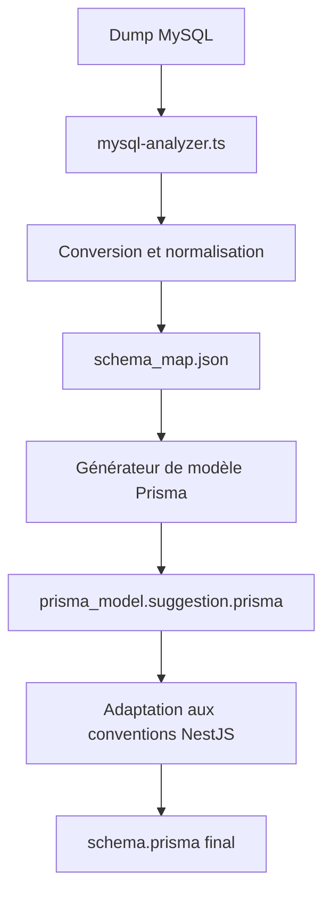
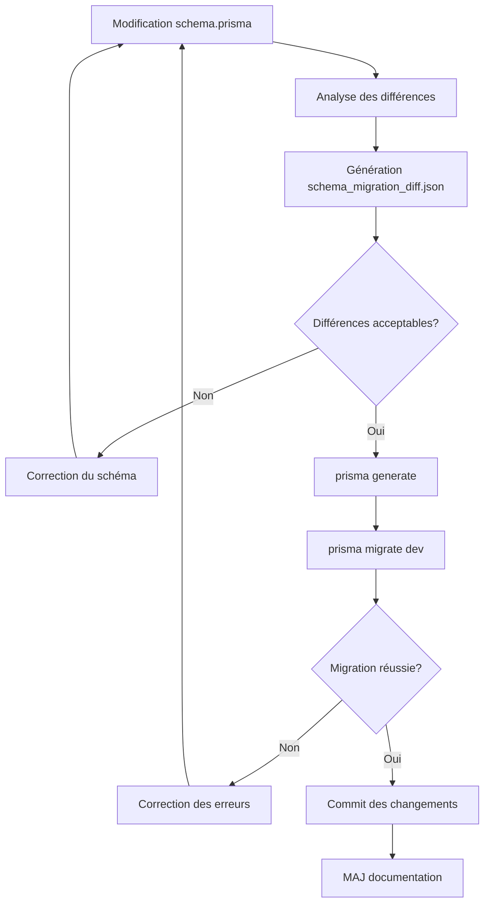

# 🔄 Synchronisation avec Prisma pour la gestion des données

La migration des données de MySQL vers PostgreSQL et l'adoption de Prisma comme ORM constituent une étape fondamentale dans le processus de modernisation. Cette synchronisation garantit que les données restent cohérentes et que les modèles correspondent parfaitement aux besoins métier de l'application.

## 📊 Vue d'ensemble du processus

La synchronisation avec Prisma suit ces étapes principales:
1. Migration de la structure de base de données MySQL vers PostgreSQL
2. Génération automatique des modèles Prisma à partir de la structure PostgreSQL
3. Adaptation des modèles aux conventions NestJS
4. Validation des relations et contraintes d'intégrité
5. Génération de rapports de différence pour maintenir la cohérence

## 🛠️ Génération des modèles Prisma

- Créer les fichiers `schema.prisma` à partir du **dump PostgreSQL** issu de la migration ou restructuration de la base MySQL d'origine.
- Automatiser cette étape avec l'agent `mysql-analyzer.ts` pour générer :
  - `schema_map.json` (structure détectée)
  - `prisma_model.suggestion.prisma` (modèle proposé)
- Adapter les noms de modèles, types, et relations aux conventions NestJS.

### Exemple de processus de génération



### Configuration de l'agent mysql-analyzer.ts

```json
{
  "input": {
    "mysqlDump": "./database/mysql_dump.sql",
    "targetDialect": "postgresql"
  },
  "output": {
    "schemaMap": "./output/schema_map.json",
    "prismaModelSuggestion": "./output/prisma_model.suggestion.prisma"
  },
  "options": {
    "namingConvention": "camelCase",
    "detectRelations": true,
    "inferTypes": true,
    "optimizeIndexes": true,
    "applyNestJSConventions": true
  }
}
```

### Exemple de transformation MySQL vers Prisma

**Table MySQL d'origine:**
```sql
CREATE TABLE `users` (
  `user_id` int(11) NOT NULL AUTO_INCREMENT,
  `username` varchar(255) NOT NULL,
  `email` varchar(255) NOT NULL,
  `password_hash` varchar(255) NOT NULL,
  `created_at` datetime NOT NULL DEFAULT CURRENT_TIMESTAMP,
  `role_id` int(11) DEFAULT NULL,
  PRIMARY KEY (`user_id`),
  UNIQUE KEY `email` (`email`),
  KEY `role_id` (`role_id`),
  CONSTRAINT `users_ibfk_1` FOREIGN KEY (`role_id`) REFERENCES `roles` (`role_id`)
) ENGINE=InnoDB DEFAULT CHARSET=utf8mb4;
```

**Modèle Prisma généré:**
```prisma
model User {
  id        Int      @id @default(autoincrement()) @map("user_id")
  username  String
  email     String   @unique
  password  String   @map("password_hash")
  createdAt DateTime @default(now()) @map("created_at")
  roleId    Int?     @map("role_id")
  
  // Relations
  role      Role?    @relation(fields: [roleId], references: [id])
  posts     Post[]
  comments  Comment[]
  
  @@map("users")
}
```

### Adaptation aux conventions NestJS

L'agent `mysql-analyzer.ts` applique automatiquement plusieurs transformations pour adapter le schéma aux conventions NestJS:

1. **Convention de nommage**:
   - Tables → modèles PascalCase (ex: `users` → `User`)
   - Colonnes → propriétés camelCase (ex: `user_id` → `userId`)
   
2. **Types de données**:
   - Conversion des types MySQL en types Prisma équivalents
   - Optimisation des types numériques (ex: `int` vs `bigint`)
   
3. **Relations**:
   - Détection automatique des relations par clés étrangères
   - Génération des relations bidirectionnelles
   - Support des relations 1:1, 1:N et N:N

4. **Amélioration du schéma**:
   - Ajout des décorateurs pour compatibilité TypeScript
   - Utilisation des attributs et options Prisma avancées

## 🔐 Validation des relations et contraintes

- S'assurer que les **relations entre entités (1:N, M:N)** sont **cohérentes avec le modèle métier initial**.
- Vérifier que les **contraintes d'intégrité (clé étrangère, unique, not null)** sont correctement traduites dans le schéma Prisma.
- Générer un fichier de validation automatique : `schema_migration_diff.json` pour suivre les divergences entre :
  - la base d'origine (MySQL)
  - la base cible (PostgreSQL)
  - le modèle Prisma (`schema.prisma`)

### Processus de validation automatique

Le processus de validation est réalisé par l'agent `mysql-analyzer.ts` qui effectue une analyse comparative:

1. **Analyse de structure**: Comparer les structures des tables MySQL et PostgreSQL
2. **Analyse des contraintes**: Vérifier la préservation des contraintes d'intégrité
3. **Analyse de relations**: Valider la cohérence des relations entre entités
4. **Analyse de types**: Vérifier la correspondance des types de données

### Exemple de rapport de différences

```json
{
  "schemaComparison": {
    "summary": {
      "totalTables": 28,
      "matchingTables": 26,
      "missingTables": 0,
      "modifiedTables": 2
    },
    "tableDifferences": [
      {
        "tableName": "orders",
        "differences": [
          {
            "type": "column_type_change",
            "column": "total_amount",
            "mysqlType": "decimal(10,2)",
            "postgresType": "numeric(10,2)",
            "impact": "compatible",
            "recommendation": "No action needed"
          }
        ]
      },
      {
        "tableName": "products",
        "differences": [
          {
            "type": "constraint_missing",
            "constraint": "unique_sku",
            "impact": "data_integrity",
            "recommendation": "Add unique constraint on 'sku' column in Prisma schema",
            "prismaFix": "@unique on sku field"
          }
        ]
      }
    ]
  },
  "relationValidation": {
    "summary": {
      "totalRelations": 42,
      "validRelations": 40,
      "suspiciousRelations": 2
    },
    "relationIssues": [
      {
        "fromTable": "order_items",
        "toTable": "products",
        "issue": "cascade_delete_missing",
        "impact": "orphaned_records",
        "recommendation": "Add onDelete: Cascade to Prisma relation"
      }
    ]
  }
}
```

### Liste de contrôle pour validation manuelle

En plus de la validation automatique, certains aspects nécessitent une vérification manuelle:

- [x] Vérification de la nomenclature cohérente à travers tous les modèles
- [x] Confirmation des types de données pour les cas sensibles (montants, dates, etc.)
- [x] Validation des règles métier représentées par les contraintes
- [x] Test de création/lecture/mise à jour/suppression (CRUD) avec le schéma généré

## 🔄 Validation des mises à jour du schéma

Chaque mise à jour de `schema.prisma` doit suivre un processus rigoureux de validation et de test avant d'être intégrée:

1. **Génération du rapport de différences**: Chaque modification doit être validée par un diff `schema_migration_diff.json` qui documente l'impact des changements.

2. **Test de migration**: Exécution de la commande `prisma generate && prisma migrate dev --name verify-sync` pour vérifier que:
   - Le schéma est syntaxiquement correct
   - Les migrations générées sont valides
   - Aucune donnée n'est perdue lors de la migration

### Processus de validation post-modification



### Commandes de validation

```bash
# 1. Générer le rapport de différences
node scripts/prisma-diff.js --before ./prisma/backup/schema.prisma --after ./prisma/schema.prisma --output ./prisma/diffs/schema_migration_diff.json

# 2. Générer le client Prisma
npx prisma generate

# 3. Créer et appliquer la migration
npx prisma migrate dev --name verify-sync

# 4. Vérifier que les tests passent avec le nouveau schéma
npm run test:prisma
```

### Bonnes pratiques pour les mises à jour de schéma

- Effectuer des modifications **atomiques** (une fonctionnalité à la fois)
- Documenter chaque changement dans un fichier de migration nommé explicitement
- Conserver des **sauvegardes** des versions précédentes du schéma
- Exécuter les migrations sur un **environnement de test** avant de les appliquer en production
- Utiliser des **scripts de rollback** pour chaque migration

Cette approche systématique garantit la stabilité de la base de données tout au long du processus de migration et permet de détecter rapidement les problèmes potentiels.

## 🔧 Optimisation du schéma Prisma

Suite à la génération et validation, des optimisations peuvent être appliquées:

### Indexation et performance

```prisma
model Article {
  id        Int      @id @default(autoincrement())
  title     String
  slug      String
  content   String   @db.Text
  authorId  Int
  createdAt DateTime @default(now())
  
  author    User     @relation(fields: [authorId], references: [id])
  
  // Amélioration des performances de recherche
  @@index([authorId])
  @@index([createdAt])
  @@unique([slug]) // Pour les recherches par slug
}
```

### Enrichissement du modèle

```prisma
// Utilisation des énumérations pour les valeurs fixes
enum OrderStatus {
  PENDING
  PROCESSING
  SHIPPED
  DELIVERED
  CANCELLED
}

model Order {
  id         Int         @id @default(autoincrement())
  status     OrderStatus @default(PENDING)
  // ...reste du modèle...
}
```

### Suggestion d'optimisations PostgreSQL

L'agent génère également des recommandations pour les optimisations spécifiques à PostgreSQL:

```sql
-- index_suggestions.sql
-- Créer un index GIN pour la recherche full-text sur le contenu des articles
CREATE INDEX articles_content_search_idx ON "articles" USING gin(to_tsvector('french', "content"));

-- Optimiser les requêtes sur les dates avec un index BRIN (plus efficace pour les colonnes ordonnées)
CREATE INDEX orders_created_at_brin_idx ON "orders" USING brin("created_at");
```

## 📊 Intégration avec NestJS

Une fois le schéma Prisma finalisé, il s'intègre parfaitement avec NestJS:

```typescript
// user.service.ts
import { Injectable } from '@nestjs/common';
import { PrismaService } from '../prisma/prisma.service';
import { User, Prisma } from '@prisma/client';

@Injectable()
export class UserService {
  constructor(private prisma: PrismaService) {}

  async findAll(): Promise<User[]> {
    return this.prisma.user.findMany({
      include: {
        role: true,
      },
    });
  }

  async findOne(id: number): Promise<User | null> {
    return this.prisma.user.findUnique({
      where: { id },
      include: {
        role: true,
        posts: true,
      },
    });
  }

  // Autres méthodes CRUD...
}
```

Ce processus de synchronisation avec Prisma établit une fondation solide pour la nouvelle architecture, garantissant que les données sont correctement modélisées et que les contraintes d'intégrité sont préservées tout au long de la migration.
