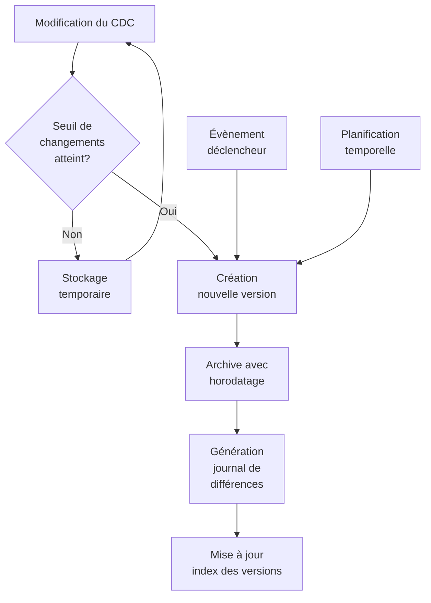

# Versionnement intelligent du cahier des charges

## 🔄 Vue d'ensemble

Le système de versionnement intelligent archive automatiquement le cahier des charges à des moments clés avec horodatage, permettant de tracer l'évolution des spécifications tout en maintenant un accès structuré à l'historique complet.

## 📚 Architecture de versionnement

### Stratégie d'archivage

### Déclencheurs de versionnement

| Type de déclencheur | Description | Configuration |
|---------------------|-------------|---------------|
| Seuil de modifications | Nombre/pourcentage de changements | > 20% ou >100 lignes |
| Évènements clés | Actions spécifiques | Validation CDC, Fin sprint |
| Temporel | Basé sur un calendrier | Quotidien, Hebdomadaire |
| Manuel | Déclenchement explicite | Commande `npm run archive-version` |

## 🔍 Format de versionnement

### Structure des versions

Chaque version est identifiée par un schéma:

