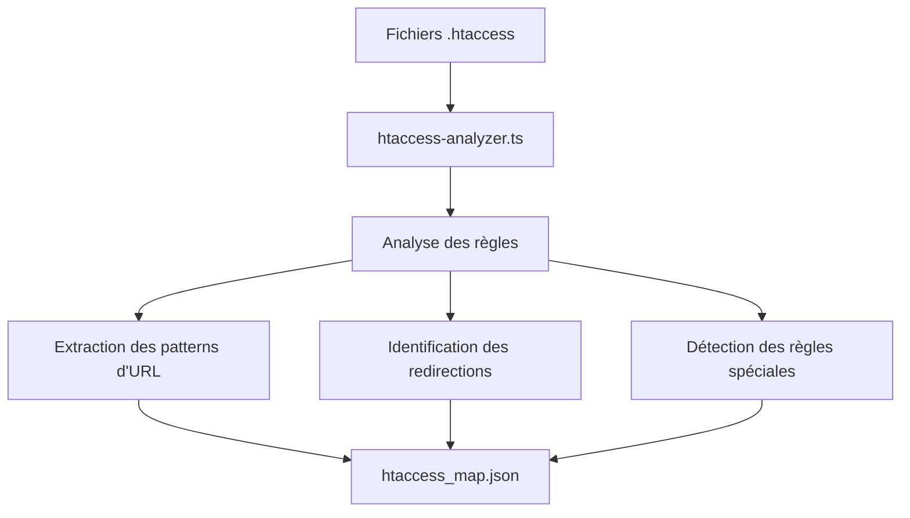

# 🌐 Gestion des anciennes URLs et stratégie SEO

L'objectif est de **préserver intégralement le référencement** de l'ancien site PHP lors de la transition vers Remix/NestJS, en assurant la compatibilité des routes et des métadonnées SEO.

## 📝 Vue d'ensemble

La migration d'une application PHP vers une architecture moderne Remix/NestJS présente un risque significatif pour le référencement si elle n'est pas gérée correctement. Chaque URL indexée par les moteurs de recherche doit être prise en compte pour éviter:

- La perte de classement dans les résultats de recherche
- L'apparition de liens morts (erreurs 404)
- La duplication de contenu
- La perte des backlinks existants

Cette stratégie assure que le capital SEO accumulé est préservé tout au long de la transition.

## 🔗 1. Maintien des URLs existantes

- Répliquer les anciennes routes PHP dans Remix (`flat-routes`) ou NestJS (API ou redirection)
- Utiliser `htaccess_map.json` généré par l'agent `htaccess-analyzer.ts`
- Générer automatiquement les routes via `routing-sync.ts`

### Analyse des patterns d'URL PHP

L'agent `htaccess-analyzer.ts` analyse les fichiers `.htaccess` pour extraire:
- Les règles de réécriture d'URL
- Les redirections (301, 302)
- Les règles d'erreur personnalisées (404, 500)
- Les drapeaux et options spéciales



### Exemple de fichier htaccess_map.json

```json
{
  "baseRules": {
    "rewriteEngine": "On",
    "rewriteBase": "/",
    "defaultCharset": "utf-8"
  },
  "redirections": [
    {
      "type": 301,
      "source": "/ancien-produit-(\\d+)\\.html",
      "target": "/produits/$1",
      "flags": ["L"]
    },
    {
      "type": 302,
      "source": "/promo",
      "target": "/promotions-du-mois",
      "flags": ["L", "R=302"]
    }
  ],
  "rewrites": [
    {
      "source": "/produit/(\\d+)/(.*)\\.html",
      "target": "/product.php?id=$1&name=$2",
      "flags": ["L"]
    },
    {
      "source": "/categorie/(.*)",
      "target": "/category.php?name=$1",
      "flags": ["L"]
    },
    {
      "source": "/recherche",
      "target": "/search.php",
      "flags": ["L", "QSA"]
    }
  ],
  "errorPages": {
    "404": "/errors/not-found.php",
    "500": "/errors/server-error.php"
  }
}
```

### Génération automatique des routes avec routing-sync.ts

L'agent `routing-sync.ts` utilise les données de `htaccess_map.json` pour:
1. Générer les routes Remix équivalentes
2. Créer les redirections nécessaires
3. Assurer que tous les paramètres d'URL sont correctement transmis

```typescript
// Exemple simplifié de routing-sync.ts
import htaccessMap from './htaccess_map.json';
import * as fs from 'fs';
import * as path from 'path';

function generateRemixRoutes() {
  const routes = [];
  
  // Traiter les réécritures pour les transformer en routes Remix
  for (const rewrite of htaccessMap.rewrites) {
    // Transformer les patterns regex .htaccess en routes Remix
    const remixRoutePattern = transformToRemixPattern(rewrite.source);
    const phpTarget = rewrite.target;
    
    // Identifier le type de contenu et le handler approprié
    const routeInfo = analyzePhpTarget(phpTarget);
    
    routes.push({
      pattern: remixRoutePattern,
      routeFile: `routes/${remixRoutePattern}.tsx`,
      loaderSource: routeInfo.phpFile,
      params: routeInfo.params
    });
  }
  
  // Générer les fichiers de route Remix
  for (const route of routes) {
    generateRemixRouteFile(route);
  }
  
  // Générer également un fichier de redirections
  generateRedirectionMiddleware(htaccessMap.redirections);
}

// Transformer un pattern .htaccess en pattern Remix
function transformToRemixPattern(htaccessPattern) {
  // Exemple: '/produit/(\d+)/(.*)\.html' --> 'produit.$id.$name'
  // Logique de transformation...
}

// Générer le fichier de route Remix
function generateRemixRouteFile(route) {
  // Créer le fichier TSX avec loader, etc.
}
```

### Implémentation dans Remix

Voici comment les routes PHP sont répliquées dans Remix:

#### 1. Routes statiques

```tsx
// Exemple: ancienne URL PHP: /a-propos.php
// Nouvelle route Remix: /routes/a-propos.tsx

export default function AboutPage() {
  return (
    <div>
      <h1>À propos de nous</h1>
      {/* Contenu migré depuis la page PHP */}
    </div>
  );
}
```

#### 2. Routes dynamiques avec paramètres

```tsx
// Exemple: ancien pattern PHP: /produit.php?id=123&name=chaise-de-bureau
// Transformé en: /produit/123/chaise-de-bureau.html via .htaccess
// Nouvelle route Remix: /routes/produit.$id.$slug.tsx

import { json, LoaderFunctionArgs } from "@remix-run/node";
import { useLoaderData } from "@remix-run/react";

export async function loader({ params }: LoaderFunctionArgs) {
  // Récupérer les paramètres d'URL
  const { id, slug } = params;
  
  // Appeler l'API NestJS correspondante
  const response = await fetch(`${process.env.API_URL}/products/${id}`);
  if (!response.ok) {
    throw new Response("Produit non trouvé", { status: 404 });
  }
  
  const product = await response.json();
  return json({ product });
}

export default function ProductPage() {
  const { product } = useLoaderData<typeof loader>();
  
  return (
    <div>
      <h1>{product.name}</h1>
      {/* Reste du contenu produit */}
    </div>
  );
}
```

#### 3. Gestion des paramètres de requête

```tsx
// Exemple: /search.php?q=bureau&sort=price
// Nouvelle route Remix: /routes/recherche.tsx

import { json, LoaderFunctionArgs } from "@remix-run/node";
import { useLoaderData, useSearchParams } from "@remix-run/react";

export async function loader({ request }: LoaderFunctionArgs) {
  // Récupérer les paramètres de recherche
  const url = new URL(request.url);
  const query = url.searchParams.get("q") || "";
  const sort = url.searchParams.get("sort") || "relevance";
  
  // Appeler l'API de recherche
  const response = await fetch(
    `${process.env.API_URL}/search?q=${encodeURIComponent(query)}&sort=${sort}`
  );
  
  const results = await response.json();
  return json({ results, query, sort });
}

export default function SearchPage() {
  const { results } = useLoaderData<typeof loader>();
  const [searchParams] = useSearchParams();
  
  return (
    <div>
      <h1>Résultats pour: {searchParams.get("q")}</h1>
      {/* Affichage des résultats de recherche */}
    </div>
  );
}
```

## 🔄 2. Mise en place des redirections

Pour gérer les URLs qui ne peuvent pas être directement mappées à des routes Remix, un système de redirections est mis en place:

### Middleware de redirection Remix

```tsx
// app/root.tsx (ou autre composant racine)
import { redirect } from "@remix-run/node";
import redirectionMap from "~/data/redirection-map";

export async function loader({ request }) {
  const url = new URL(request.url);
  const path = url.pathname;
  
  // Vérifier si le chemin nécessite une redirection
  const redirection = redirectionMap.find(r => {
    // Supporter les expressions régulières
    if (r.isRegex) {
      const regex = new RegExp(r.source);
      return regex.test(path);
    }
    // Redirection exacte
    return r.source === path;
  });
  
  if (redirection) {
    // Construire l'URL de destination (en remplaçant les groupes capturés si nécessaire)
    let destination = redirection.target;
    
    if (redirection.isRegex) {
      const regex = new RegExp(redirection.source);
      destination = path.replace(regex, redirection.target);
    }
    
    // Préserver les paramètres de requête si nécessaire
    if (redirection.preserveQueryString && url.search) {
      destination += url.search;
    }
    
    // Effectuer la redirection avec le bon code HTTP
    return redirect(destination, {
      status: redirection.code || 301
    });
  }
  
  // Continuer le traitement normal de la requête
  return null;
}
```

### Configuration NestJS pour les redirections API

```typescript
// src/redirections/redirections.middleware.ts
import { Injectable, NestMiddleware } from '@nestjs/common';
import { Request, Response, NextFunction } from 'express';
import * as redirectionMap from './redirection-map.json';

@Injectable()
export class RedirectionsMiddleware implements NestMiddleware {
  use(req: Request, res: Response, next: NextFunction) {
    const path = req.path;
    
    // Vérifier si le chemin nécessite une redirection
    const redirection = redirectionMap.find(r => {
      if (r.isRegex) {
        const regex = new RegExp(r.source);
        return regex.test(path);
      }
      return r.source === path;
    });
    
    if (redirection) {
      let destination = redirection.target;
      
      if (redirection.isRegex) {
        const regex = new RegExp(redirection.source);
        destination = path.replace(regex, redirection.target);
      }
      
      if (redirection.preserveQueryString && req.url.includes('?')) {
        const queryString = req.url.split('?')[1];
        destination += `?${queryString}`;
      }
      
      return res.redirect(redirection.code || 301, destination);
    }
    
    next();
  }
}
```

## 🔍 3. Préservation des balises meta et données structurées

La préservation du SEO nécessite également de reproduire fidèlement les balises `<meta>` et données structurées:

### Génération de méta-données SEO

L'agent `seo-meta-generator.ts` extrait les métadonnées des pages PHP existantes:

```typescript
// Exemple simplifié de seo-meta-generator.ts
import * as fs from 'fs';
import * as path from 'path';
import * as cheerio from 'cheerio';

async function extractMetaData(phpFile) {
  const content = fs.readFileSync(phpFile, 'utf-8');
  
  // Utiliser cheerio pour extraire les balises meta
  const $ = cheerio.load(content);
  const metaTags = [];
  
  // Extraire les balises title
  const title = $('title').text();
  if (title) {
    metaTags.push({ type: 'title', content: title });
  }
  
  // Extraire les balises meta
  $('meta').each((i, elem) => {
    const name = $(elem).attr('name');
    const property = $(elem).attr('property');
    const content = $(elem).attr('content');
    
    if ((name || property) && content) {
      metaTags.push({
        type: 'meta',
        name: name || undefined,
        property: property || undefined,
        content
      });
    }
  });
  
  // Extraire les données structurées (JSON-LD)
  $('script[type="application/ld+json"]').each((i, elem) => {
    try {
      const jsonContent = $(elem).html();
      if (jsonContent) {
        const parsedJson = JSON.parse(jsonContent);
        metaTags.push({
          type: 'jsonLd',
          content: parsedJson
        });
      }
    } catch (e) {
      console.error('Failed to parse JSON-LD:', e);
    }
  });
  
  return metaTags;
}
```

### Implémentation dans Remix

Chaque route Remix implémente la fonction `meta` pour reproduire fidèlement les métadonnées de la page PHP d'origine:

```tsx
// routes/produit.$id.$slug.tsx
import { json, LoaderFunctionArgs, MetaFunction } from "@remix-run/node";
import { useLoaderData } from "@remix-run/react";
import { getSeoMetadata } from "~/utils/seo.server";

export const loader = async ({ params }: LoaderFunctionArgs) => {
  const { id } = params;
  const product = await getProduct(id);
  
  // Récupérer les métadonnées SEO associées à ce produit
  const seoMetadata = await getSeoMetadata(`product_${id}`);
  
  return json({ product, seoMetadata });
};

export const meta: MetaFunction<typeof loader> = ({ data }) => {
  if (!data) {
    return [{ title: "Produit non trouvé" }];
  }
  
  const { product, seoMetadata } = data;
  
  // Construire les balises meta dynamiquement
  const metaTags = [
    { title: seoMetadata.title || `${product.name} - Notre boutique` },
    { name: "description", content: seoMetadata.description || product.description.substring(0, 160) }
  ];
  
  // Ajouter les balises Open Graph
  metaTags.push(
    { property: "og:title", content: product.name },
    { property: "og:description", content: product.description.substring(0, 160) },
    { property: "og:image", content: product.imageUrl },
    { property: "og:type", content: "product" }
  );
  
  // Ajouter d'autres balises meta extraites
  return metaTags;
};

// Données structurées JSON-LD
export function links() {
  return [
    {
      rel: "canonical",
      href: `https://example.com/produit/${params.id}/${params.slug}`
    }
  ];
}

export default function ProductPage() {
  const { product } = useLoaderData<typeof loader>();
  
  return (
    <>
      {/* Contenu de la page */}
      
      {/* JSON-LD pour les données structurées */}
      <script
        type="application/ld+json"
        dangerouslySetInnerHTML={{
          __html: JSON.stringify({
            "@context": "https://schema.org",
            "@type": "Product",
            "name": product.name,
            "description": product.description,
            "image": product.imageUrl,
            "sku": product.sku,
            "mpn": product.mpn,
            "brand": {
              "@type": "Brand",
              "name": product.brand
            },
            "offers": {
              "@type": "Offer",
              "url": `https://example.com/produit/${product.id}/${product.slug}`,
              "price": product.price,
              "priceCurrency": "EUR",
              "availability": product.inStock 
                ? "https://schema.org/InStock" 
                : "https://schema.org/OutOfStock"
            }
          })
        }}
      />
    </>
  );
}
```

## 🧪 4. Test et validation de la stratégie SEO

Pour garantir la préservation du référencement, un processus de test rigoureux est nécessaire:

### Tests automatisés des URLs

```typescript
// tests/e2e/url-compatibility.spec.ts
import { test, expect } from '@playwright/test';
import * as urlMap from '../data/url-map.json';

// Tester que toutes les anciennes URLs sont correctement gérées
for (const entry of urlMap) {
  test(`URL legacy: ${entry.legacy} → nouvelle: ${entry.new}`, async ({ page }) => {
    // Tester la redirection
    await page.goto(entry.legacy);
    
    // Vérifier l'URL après redirection
    expect(page.url()).toBe(entry.new);
    
    // Vérifier le statut HTTP (301 pour redirection permanente)
    const response = await page.goto(entry.legacy);
    expect(response.status()).toBe(301);
    
    // Vérifier que la page cible existe et renvoie 200
    const targetResponse = await page.goto(entry.new);
    expect(targetResponse.status()).toBe(200);
  });
}
```

### Validation des balises meta

```typescript
// tests/e2e/meta-validation.spec.ts
import { test, expect } from '@playwright/test';
import * as metaMap from '../data/meta-map.json';

// Tester que toutes les balises meta sont préservées
for (const entry of metaMap) {
  test(`Meta tags pour: ${entry.url}`, async ({ page }) => {
    await page.goto(entry.url);
    
    // Vérifier le titre
    expect(await page.title()).toBe(entry.title);
    
    // Vérifier les balises meta description
    const description = await page.$eval(
      'meta[name="description"]',
      (el) => el.getAttribute('content')
    );
    expect(description).toBe(entry.description);
    
    // Vérifier l'URL canonique
    const canonical = await page.$eval(
      'link[rel="canonical"]',
      (el) => el.getAttribute('href')
    );
    expect(canonical).toBe(entry.canonical);
    
    // Vérifier la présence de JSON-LD
    const hasJsonLd = await page.$('script[type="application/ld+json"]');
    expect(hasJsonLd).not.toBeNull();
  });
}
```

## 📊 5. Surveillance post-migration

Après la migration, une surveillance active des indicateurs SEO est mise en place:

### Métriques à surveiller

- **Trafic organique**: Comparaison avant/après migration
- **Classement des mots-clés**: Suivi des positions dans les SERPs
- **Couverture de l'index**: Vérification via Google Search Console
- **Taux de rebond**: Impact sur l'engagement des utilisateurs
- **Erreurs de crawl**: Détection des problèmes d'accès par les moteurs

### Tableau de bord de suivi SEO

Un tableau de bord dédié est mis en place pour surveiller l'évolution des indicateurs SEO post-migration. Ce tableau de bord est intégré dans le système global de supervision du projet.

Cette approche méthodique garantit que la transition de PHP vers Remix/NestJS préserve intégralement le capital SEO accumulé, sans impact négatif sur la visibilité et le classement du site dans les moteurs de recherche.
