# 🚀 Tests de performance, déploiement progressif et surveillance continue

Cette phase garantit que l'application migrée est **performante, stable, observable** et déployée de manière sécurisée sans interruption de service.

## 📝 Vue d'ensemble

La migration d'une application PHP vers NestJS/Remix ne doit pas seulement préserver les fonctionnalités, mais aussi améliorer les performances et l'expérience utilisateur. Cette phase assure que l'application modernisée offre des performances optimales et est déployée avec un risque minimal.

## ⚡ 1. Tests de performance

- Objectif : détecter les **goulots d'étranglement backend/frontend**
- Outils recommandés :
  - `autocannon`, `k6`, `Artillery` pour l'API NestJS
  - `Lighthouse CI`, `Playwright traces` pour Remix (frontend)
- Tests à intégrer dans GitHub Actions via `ci-tester.ts`

### Méthodologie de test de performance


### Tests de performance backend (NestJS)

#### Configuration k6 pour tester l'API

```javascript
// /workspaces/cahier-des-charge/performance/api-load-test.js
import http from 'k6/http';
import { check, sleep } from 'k6';

export const options = {
  stages: [
    { duration: '30s', target: 50 },  // Montée en charge
    { duration: '1m', target: 50 },   // Charge constante
    { duration: '30s', target: 100 }, // Pic de charge
    { duration: '1m', target: 100 },  // Maintien du pic
    { duration: '30s', target: 0 },   // Réduction progressive
  ],
  thresholds: {
    http_req_duration: ['p(95)<500'], // 95% des requêtes sous 500ms
    http_req_failed: ['rate<0.01'],   // Moins de 1% d'échec
  },
};

const API_BASE_URL = __ENV.API_URL || 'http://localhost:3000/api';

export default function () {
  // Test des endpoints principaux
  
  // 1. Liste des produits
  const productsResponse = http.get(`${API_BASE_URL}/products`);
  check(productsResponse, {
    'products status 200': (r) => r.status === 200,
    'products response time < 300ms': (r) => r.timings.duration < 300,
    'products payload correct': (r) => r.json().length > 0,
  });
  
  // 2. Détail d'un produit (alternance entre plusieurs IDs)
  const productId = Math.floor(Math.random() * 20) + 1;
  const productResponse = http.get(`${API_BASE_URL}/products/${productId}`);
  check(productResponse, {
    'product detail status 200': (r) => r.status === 200,
    'product detail response time < 200ms': (r) => r.timings.duration < 200,
  });
  
  // 3. Recherche de produits (simuler différents termes)
  const searchTerms = ['chair', 'table', 'desk', 'lamp', 'sofa'];
  const term = searchTerms[Math.floor(Math.random() * searchTerms.length)];
  const searchResponse = http.get(`${API_BASE_URL}/products/search?q=${term}`);
  check(searchResponse, {
    'search status 200': (r) => r.status === 200,
    'search response time < 400ms': (r) => r.timings.duration < 400,
  });
  
  // Pause entre les itérations
  sleep(1);
}
```

#### Script Artillery pour tester des scénarios complexes

```yaml
# /workspaces/cahier-des-charge/performance/api-scenarios.yml
config:
  target: "http://localhost:3000/api"
  phases:
    - duration: 60
      arrivalRate: 5
      rampTo: 20
      name: "Montée en charge"
    - duration: 120
      arrivalRate: 20
      name: "Charge soutenue"
  environments:
    production:
      target: "https://api.example.com"
      phases:
        - duration: 300
          arrivalRate: 50
          name: "Test production"
  plugins:
    expect: {}

scenarios:
  - name: "Parcours utilisateur complet"
    flow:
      # Authentification
      - post:
          url: "/auth/login"
          json:
            email: "test@example.com"
            password: "password123"
          capture:
            - json: "$.token"
              as: "userToken"
              
      # Consultation produits
      - get:
          url: "/products"
          headers:
            Authorization: "Bearer {{ userToken }}"
          expect:
            - statusCode: 200
            - contentType: json
            
      # Recherche produit
      - get:
          url: "/products/search?q=office"
          headers:
            Authorization: "Bearer {{ userToken }}"
          capture:
            - json: "$[0].id"
              as: "productId"
              
      # Détail produit
      - get:
          url: "/products/{{ productId }}"
          headers:
            Authorization: "Bearer {{ userToken }}"
          expect:
            - statusCode: 200
            
      # Ajout au panier
      - post:
          url: "/cart"
          headers:
            Authorization: "Bearer {{ userToken }}"
          json:
            productId: "{{ productId }}"
            quantity: 2
          expect:
            - statusCode: 201
            
      # Finalisation commande
      - post:
          url: "/orders"
          headers:
            Authorization: "Bearer {{ userToken }}"
          json:
            shippingAddress: "123 Test Street"
            paymentMethod: "card"
          expect:
            - statusCode: 201
```

### Tests de performance frontend (Remix)

#### Configuration Lighthouse CI

```javascript
// /workspaces/cahier-des-charge/lighthouserc.js
module.exports = {
  ci: {
    collect: {
      url: [
        'http://localhost:3000/',
        'http://localhost:3000/products',
        'http://localhost:3000/products/1',
        'http://localhost:3000/cart',
        'http://localhost:3000/checkout',
      ],
      numberOfRuns: 3,
      settings: {
        onlyCategories: ['performance', 'accessibility', 'best-practices', 'seo'],
        skipAudits: ['uses-http2'],
      },
    },
    upload: {
      target: 'temporary-public-storage',
    },
    assert: {
      preset: 'lighthouse:recommended',
      assertions: {
        'first-contentful-paint': ['warn', { maxNumericValue: 2000 }],
        'largest-contentful-paint': ['error', { maxNumericValue: 2500 }],
        'cumulative-layout-shift': ['error', { maxNumericValue: 0.1 }],
        'total-blocking-time': ['error', { maxNumericValue: 300 }],
      },
    },
    server: {
      command: 'npm run start',
      port: 3000,
      waitUntilReady: true,
    },
  },
};
```

#### Tests Playwright pour les traces de performance

```typescript
// /workspaces/cahier-des-charge/tests/performance/frontend-traces.spec.ts
import { test, expect } from '@playwright/test';

test.describe('Frontend Performance Traces', () => {
  test('Home page loading performance', async ({ page }) => {
    // Démarrer la trace
    await page.tracing.start({ 
      screenshots: true, 
      snapshots: true,
      sources: true 
    });
    
    // Visiter la page d'accueil
    const response = await page.goto('/');
    expect(response.status()).toBe(200);
    
    // Attendre que la page soit complètement chargée
    await page.waitForLoadState('networkidle');
    
    // Stopper et sauvegarder la trace
    await page.tracing.stop({ path: './traces/home-page.zip' });
    
    // Vérifier les métriques clés (approximation)
    const performanceTimingJson = await page.evaluate(() => JSON.stringify(window.performance.timing));
    const timing = JSON.parse(performanceTimingJson);
    
    // Temps de chargement total
    const loadTime = timing.loadEventEnd - timing.navigationStart;
    console.log(`Page load time: ${loadTime}ms`);
    expect(loadTime).toBeLessThan(3000);
    
    // Temps jusqu'au premier rendu
    const firstPaint = timing.responseStart - timing.navigationStart;
    console.log(`First paint time: ${firstPaint}ms`);
    expect(firstPaint).toBeLessThan(1000);
  });
  
  test('Product listing performance', async ({ page }) => {
    await page.tracing.start({ screenshots: true });
    
    await page.goto('/products');
    await page.waitForSelector('.product-card', { timeout: 5000 });
    
    await page.tracing.stop({ path: './traces/product-listing.zip' });
    
    // Mesurer le temps jusqu'à voir le premier produit
    const firstProductTiming = await page.evaluate(() => {
      const entry = performance.getEntriesByType('element')[0];
      return entry ? entry.startTime : null;
    });
    
    console.log(`Time to first product card: ${firstProductTiming}ms`);
    expect(firstProductTiming).toBeLessThan(2000);
  });
});
```

### Intégration dans CI/CD

```yaml
# /.github/workflows/performance.yml
name: Performance Testing

on:
  push:
    branches: [main, develop]
  pull_request:
    branches: [main, develop]
  schedule:
    - cron: '0 2 * * 1' # Tous les lundis à 2h du matin

jobs:
  api-performance:
    runs-on: ubuntu-latest
    steps:
      - uses: actions/checkout@v3
      
      - name: Setup Node.js
        uses: actions/setup-node@v3
        with:
          node-version: '18'
          
      - name: Install dependencies
        run: npm ci
        
      - name: Build API
        run: npm run build:api
        
      - name: Start API server
        run: npm run start:api &
        env:
          DATABASE_URL: ${{ secrets.TEST_DATABASE_URL }}
          
      - name: Wait for API to be ready
        run: npx wait-on http://localhost:3000/api/health
        
      - name: Install k6
        run: |
          curl -L https://github.com/loadimpact/k6/releases/download/v0.38.3/k6-v0.38.3-linux-amd64.tar.gz | tar xzf -
          sudo cp k6-v0.38.3-linux-amd64/k6 /usr/local/bin
          
      - name: Run k6 tests
        run: k6 run performance/api-load-test.js
        
      - name: Upload performance results
        uses: actions/upload-artifact@v3
        with:
          name: api-performance-results
          path: results/
          
  frontend-performance:
    runs-on: ubuntu-latest
    steps:
      - uses: actions/checkout@v3
      
      - name: Setup Node.js
        uses: actions/setup-node@v3
        with:
          node-version: '18'
          
      - name: Install dependencies
        run: npm ci
        
      - name: Build Frontend
        run: npm run build
        
      - name: Lighthouse CI
        uses: treosh/lighthouse-ci-action@v9
        with:
          configPath: './lighthouserc.js'
          uploadArtifacts: true
          temporaryPublicStorage: true
          
      - name: Playwright Performance Traces
        run: |
          npx playwright install --with-deps
          npx playwright test tests/performance/frontend-traces.spec.ts
          
      - name: Upload Playwright traces
        uses: actions/upload-artifact@v3
        with:
          name: playwright-traces
          path: traces/
```

📂 Sorties attendues :
- `performance_report.json`
- `trace.lighthouse.html`

## 🚦 2. Déploiement progressif

- Objectif : limiter les risques lors du passage en production
- Stratégies recommandées :
  - **Preview automatique** sur PR (Coolify, Vercel, Netlify, Render…)
  - **Canary release** : 10% du trafic en premier, montée progressive
  - Intégration dans `ci-migration.yml`

### Stratégie de déploiement progressif

```mermaid
graph TD
    A[Migration complète] --> B[Environnement PR Preview]
    B --> C{Tests réussis?}
    C -->|Non| D[Corrections]
    D --> B
    C -->|Oui| E[Staging]
    E --> F{Validation Staging?}
    F -->|Non| D
    F -->|Oui| G[Canary Release 10%]
    G --> H{Métriques OK?}
    H -->|Non| I[Rollback]
    I --> D
    H -->|Oui| J[Canary 50%]
    J --> K{Métriques OK?}
    K -->|Non| I
    K -->|Oui| L[Déploiement complet]
    L --> M[Surveillance continue]
```



### Configuration de preview automatique (Coolify)

```yaml
# /workspaces/cahier-des-charge/coolify.yml
version: "3.7"
services:
  api:
    build:
      context: .
      dockerfile: apps/api/Dockerfile
    environment:
      - NODE_ENV=preview
      - DATABASE_URL=${DATABASE_URL}
    ports:
      - "3000:3000"
    healthcheck:
      test: ["CMD", "curl", "-f", "http://localhost:3000/api/health"]
      interval: 10s
      timeout: 5s
      retries: 3

  frontend:
    build:
      context: .
      dockerfile: apps/web/Dockerfile
    environment:
      - NODE_ENV=preview
      - API_URL=http://api:3000/api
    ports:
      - "4000:4000"
    depends_on:
      - api
```

### Mise en place de Canary Release

```typescript
// /workspaces/cahier-des-charge/scripts/deployment/canary-deploy.ts
import { DeploymentService } from './services/deployment';
import { MonitoringService } from './services/monitoring';

async function deployCanary(percentage: number) {
  console.log(`Starting canary deployment at ${percentage}% traffic...`);
  
  try {
    // 1. Déployer la nouvelle version en canary
    const deployment = await DeploymentService.deployCanary({
      version: process.env.VERSION || 'latest',
      trafficPercentage: percentage,
      environment: 'production',
      serviceName: 'api'
    });
    
    console.log(`Canary deployment ${deployment.id} initiated`);
    
    // 2. Surveiller les métriques pendant 15 minutes
    const monitoringDuration = 15 * 60 * 1000; // 15 minutes
    const monitoringInterval = 30 * 1000; // 30 secondes
    const startTime = Date.now();
    
    let stable = true;
    
    while (Date.now() - startTime < monitoringDuration) {
      console.log(`Monitoring canary deployment... (${Math.round((Date.now() - startTime) / 60000)}/${monitoringDuration/60000} minutes)`);
      
      // Vérifier les métriques critiques
      const metrics = await MonitoringService.getCanaryMetrics(deployment.id);
      
      // Critères d'échec
      if (
        metrics.errorRate > 1.0 || // Plus de 1% d'erreurs
        metrics.latencyP95 > 500 || // Latence P95 > 500ms
        metrics.cpu > 80 // Utilisation CPU > 80%
      ) {
        stable = false;
        console.error('Canary deployment unstable! Metrics:', metrics);
        break;
      }
      
      // Attendre avant la prochaine vérification
      await new Promise(resolve => setTimeout(resolve, monitoringInterval));
    }
    
    if (stable) {
      console.log('Canary deployment successful!');
      
      if (percentage < 100) {
        console.log('Next step: increase traffic percentage or complete deployment');
      } else {
        console.log('Deployment complete!');
        
        // Nettoyage des anciennes versions
        await DeploymentService.cleanupOldVersions({
          keepCount: 2,
          environment: 'production',
          serviceName: 'api'
        });
      }
      
      return true;
    } else {
      console.error('Canary deployment failed! Rolling back...');
      
      // Rollback automatique
      await DeploymentService.rollback({
        deploymentId: deployment.id,
        environment: 'production',
        serviceName: 'api'
      });
      
      return false;
    }
  } catch (error) {
    console.error('Error during canary deployment:', error);
    return false;
  }
}

// Exécution avec le pourcentage spécifié
const targetPercentage = parseInt(process.argv[2], 10) || 10;
deployCanary(targetPercentage);
```

### Intégration dans le workflow CI/CD

```yaml
# /.github/workflows/ci-migration.yml
name: CI/CD Migration

on:
  push:
    branches: [main]
  pull_request:
    branches: [main]

jobs:
  # Jobs de test et build omis pour concision
  
  preview:
    if: github.event_name == 'pull_request'
    needs: [test, build]
    runs-on: ubuntu-latest
    steps:
      - uses: actions/checkout@v3
      
      - name: Set up Coolify CLI
        run: npm install -g @coolify/cli
        
      - name: Deploy Preview Environment
        run: coolify deploy preview
        env:
          COOLIFY_TOKEN: ${{ secrets.COOLIFY_TOKEN }}
          PR_NUMBER: ${{ github.event.pull_request.number }}
      
      - name: Comment PR with preview URL
        uses: actions/github-script@v6
        with:
          script: |
            const previewUrl = process.env.PREVIEW_URL;
            github.rest.issues.createComment({
              issue_number: context.issue.number,
              owner: context.repo.owner,
              repo: context.repo.repo,
              body: `🚀 Preview environment deployed at: ${previewUrl}`
            });
            
  canary-deploy:
    if: github.event_name == 'push' && github.ref == 'refs/heads/main'
    needs: [test, build]
    runs-on: ubuntu-latest
    steps:
      - uses: actions/checkout@v3
      
      - name: Setup Node.js
        uses: actions/setup-node@v3
        with:
          node-version: '18'
          
      - name: Install dependencies
        run: npm ci
        
      - name: Deploy Canary 10%
        id: canary-10
        run: npx ts-node scripts/deployment/canary-deploy.ts 10
        env:
          VERSION: ${{ github.sha }}
          DEPLOYMENT_TOKEN: ${{ secrets.DEPLOYMENT_TOKEN }}
          
      - name: Wait for stabilization
        if: steps.canary-10.outputs.result == 'true'
        run: sleep 300 # 5 minutes
        
      - name: Deploy Canary 50% 
        if: steps.canary-10.outputs.result == 'true'
        id: canary-50
        run: npx ts-node scripts/deployment/canary-deploy.ts 50
        env:
          VERSION: ${{ github.sha }}
          DEPLOYMENT_TOKEN: ${{ secrets.DEPLOYMENT_TOKEN }}
          
      - name: Wait for stabilization
        if: steps.canary-50.outputs.result == 'true'
        run: sleep 300 # 5 minutes
        
      - name: Complete Deployment
        if: steps.canary-50.outputs.result == 'true'
        run: npx ts-node scripts/deployment/canary-deploy.ts 100
        env:
          VERSION: ${{ github.sha }}
          DEPLOYMENT_TOKEN: ${{ secrets.DEPLOYMENT_TOKEN }}
```

## 📊 3. Surveillance continue

La surveillance post-déploiement est cruciale pour détecter rapidement les problèmes et maintenir la qualité de service.

### Métriques à surveiller

| Catégorie | Métriques | Seuils |
|-----------|-----------|--------|
| **Performance** | Temps de réponse, Latence, Throughput | P95 < 300ms, Throughput > 100 req/s |
| **Stabilité** | Taux d'erreur, Crashs, Disponibilité | Erreurs < 0.1%, Uptime > 99.9% |
| **Ressources** | CPU, Mémoire, Connexions DB | CPU < 70%, Mémoire < 80% |
| **Utilisateurs** | Sessions actives, Taux de conversion | Maintien ou amélioration vs PHP |
| **SEO** | Indexation, Classement | Pas de baisse vs site PHP |

### Mise en place de tableaux de bord Grafana

```yaml
# /workspaces/cahier-des-charge/monitoring/grafana-dashboard.json
{
  "annotations": {
    "list": [
      {
        "builtIn": 1,
        "datasource": "-- Grafana --",
        "enable": true,
        "hide": true,
        "iconColor": "rgba(0, 211, 255, 1)",
        "name": "Annotations & Alerts",
        "type": "dashboard"
      },
      {
        "datasource": "Prometheus",
        "enable": true,
        "expr": "changes(version{service=\"api\"}[1m]) > 0",
        "iconColor": "rgba(255, 96, 96, 1)",
        "name": "Deployments",
        "titleFormat": "Deployment"
      }
    ]
  },
  "editable": true,
  "gnetId": null,
  "graphTooltip": 0,
  "id": 1,
  "links": [],
  "panels": [
    {
      "datasource": null,
      "fieldConfig": {
        "defaults": {
          "color": {
            "mode": "thresholds"
          },
          "mappings": [],
          "thresholds": {
            "mode": "absolute",
            "steps": [
              {
                "color": "green",
                "value": null
              },
              {
                "color": "red",
                "value": 300
              }
            ]
          }
        },
        "overrides": []
      },
      "gridPos": {
        "h": 8,
        "w": 12,
        "x": 0,
        "y": 0
      },
      "id": 2,
      "options": {
        "reduceOptions": {
          "calcs": [
            "lastNotNull"
          ],
          "fields": "",
          "values": false
        },
        "showThresholdLabels": false,
        "showThresholdMarkers": true,
        "text": {}
      },
      "pluginVersion": "7.5.7",
      "targets": [
        {
          "expr": "http_server_requests_seconds{quantile=\"0.95\",uri!=\"/health\"}",
          "interval": "",
          "legendFormat": "",
          "refId": "A"
        }
      ],
      "title": "API P95 Latency",
      "type": "gauge"
    },
    // ... autres panels
  ],
  "refresh": "10s",
  "schemaVersion": 27,
  "style": "dark",
  "tags": [],
  "templating": {
    "list": []
  },
  "time": {
    "from": "now-1h",
    "to": "now"
  },
  "timepicker": {},
  "timezone": "",
  "title": "Migration Monitoring Dashboard",
  "uid": "migration-dashboard",
  "version": 1
}
```

### Alertes automatisées

```yaml
# /workspaces/cahier-des-charge/monitoring/alertmanager.yml
global:
  resolve_timeout: 5m
  slack_api_url: 'https://hooks.slack.com/services/T00000000/B00000000/XXXXXXXXXX'

route:
  group_by: ['alertname', 'job']
  group_wait: 30s
  group_interval: 5m
  repeat_interval: 4h
  receiver: 'slack-notifications'
  routes:
  - match:
      severity: critical
    receiver: 'slack-critical'
    continue: true

receivers:
- name: 'slack-notifications'
  slack_configs:
  - channel: '#monitoring'
    send_resolved: true
    title: "{{ range .Alerts }}{{ .Annotations.summary }}\n{{ end }}"
    text: "{{ range .Alerts }}{{ .Annotations.description }}\n{{ end }}"

- name: 'slack-critical'
  slack_configs:
  - channel: '#incidents'
    send_resolved: true
    title: "🚨 CRITICAL ALERT: {{ range .Alerts }}{{ .Annotations.summary }}{{ end }}"
    text: "{{ range .Alerts }}{{ .Annotations.description }}\n\nLabels:\n{{ range .Labels.SortedPairs }}{{ .Name }}: {{ .Value }}\n{{ end }}\n{{ end }}"
```

### Règles d'alerte Prometheus

```yaml
# /workspaces/cahier-des-charge/monitoring/alert-rules.yml
groups:
- name: api_alerts
  rules:
  - alert: HighErrorRate
    expr: sum(rate(http_server_requests_seconds_count{status=~"5.."}[5m])) / sum(rate(http_server_requests_seconds_count[5m])) * 100 > 1
    for: 5m
    labels:
      severity: critical
    annotations:
      summary: "High error rate"
      description: "Error rate is {{ $value | printf \"%.2f\" }}% (> 1%) for the last 5 minutes"

  - alert: HighLatency
    expr: http_server_requests_seconds{quantile="0.95",uri!="/health"} > 0.5
    for: 5m
    labels:
      severity: warning
    annotations:
      summary: "High API latency"
      description: "P95 latency for {{ $labels.uri }} is {{ $value | printf \"%.2f\" }}s (> 0.5s) for the last 5 minutes"

  - alert: HighCPUUsage
    expr: process_cpu_usage > 0.8
    for: 5m
    labels:
      severity: warning
    annotations:
      summary: "High CPU usage"
      description: "CPU usage is {{ $value | printf \"%.2f\" }}% (> 80%) for the last 5 minutes"

  - alert: HighMemoryUsage
    expr: process_resident_memory_bytes / process_memory_limit_bytes > 0.8
    for: 5m
    labels:
      severity: warning
    annotations:
      summary: "High memory usage"
      description: "Memory usage is {{ $value | printf \"%.2f\" }}% (> 80%) for the last 5 minutes"
```

Cette approche complète garantit que l'application migrée est non seulement fonctionnelle mais aussi performante, stable et observable. Les tests de performance identifient et résolvent les goulots d'étranglement, tandis que le déploiement progressif et la surveillance continue minimisent les risques lors de la mise en production.
