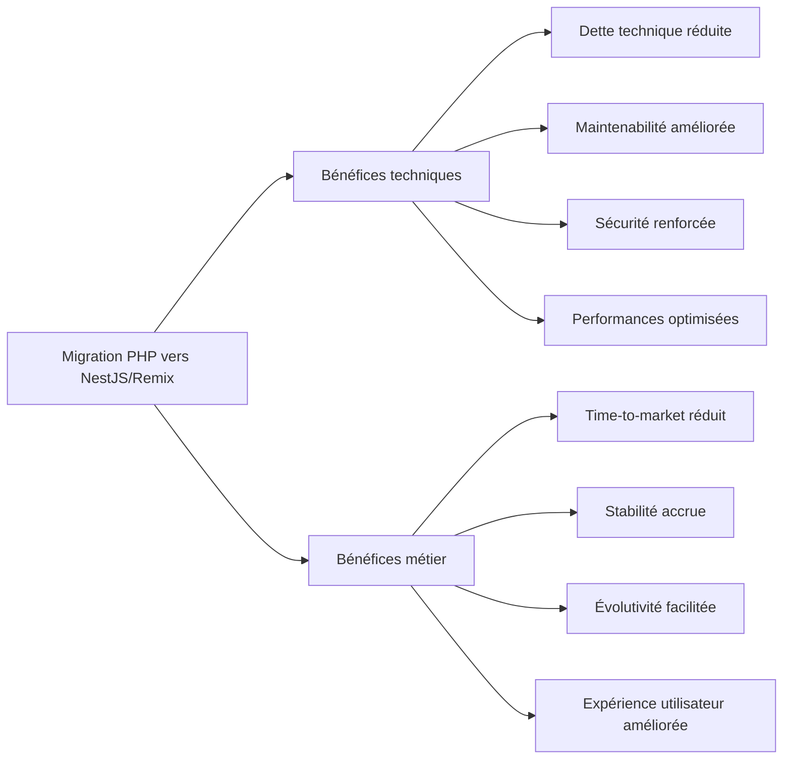

# ✅ Conclusion Stratégique et Recommandations Finales

En suivant les étapes définies, la migration de votre application PHP legacy vers une architecture moderne NestJS (backend) + Remix (frontend) sera :

- 🔁 **Progressive** (par domaine fonctionnel, rollback possible)
- 🧱 **Modulaire** (maintenabilité améliorée)
- ⚡ **Performante** (optimisée pour le SEO, la vitesse, la scalabilité)
- 🔐 **Securisée et traçable** (chaque action documentée, validée)

## 📝 Vue d'ensemble du projet

La migration d'une application PHP legacy vers une architecture moderne basée sur NestJS et Remix représente un projet d'envergure qui transforme non seulement la technologie mais aussi les pratiques de développement et la qualité du produit final. Cette approche méthodique permet de moderniser progressivement l'application tout en minimisant les risques et en préservant le capital acquis (SEO, expérience utilisateur, logique métier).

## 📌 Analyse détaillée par phase

| Phase                              | Objectif clé                                         | Point de vigilance                          |
|-----------------------------------|------------------------------------------------------|---------------------------------------------|
| Phase 0 – Initialisation          | Geler legacy, préparer env sécurisé                  | Sauvegardes immuables, versionnées          |
| Phase 1 – Audit + Analyse         | Scanner PHP, SQL, SEO, patterns                      | Gérer la dette technique                    |
| Phase 2 – Profil monorepo         | Détecter style, dépendances, conventions             | Unifier front + back                        |
| Phase 3 – Mapping et synchronisation | Mapper URLs, modèles Prisma, données PHP ↔ SQL     | Assurer cohérence métier + technique        |
| Phase 4 – Génération automatique  | Créer code, SEO, Prisma, interfaces Remix/NestJS     | Vérification manuelle requise à chaque lot  |
| Phase 5 – Validation              | Tests, comparateurs, QA, confirmation PR             | Critique pour la qualité finale             |
| Phase 6 – CI/CD + Monitoring      | Déploiement progressif, surveillance                 | Détection proactive des anomalies           |

### Détails et livrables par phase

#### Phase 0 – Initialisation
- **Livrables**: Environnement de développement configuré, repository Git avec branches de migration, sauvegardes complètes
- **Agents clés**: Configuration des outils automatisés, préparation des templates
- **Critères de succès**: Environnement prêt, équipe formée, backlog initial défini

#### Phase 1 – Audit + Analyse
- **Livrables**: `discovery_map.json`, rapports d'analyse PHP, MySQL et .htaccess
- **Agents clés**: `legacy-discovery.ts`, `php-analyzer.ts`, `mysql-analyzer.ts`, `htaccess-analyzer.ts`
- **Critères de succès**: Cartographie complète du système legacy, priorisation des modules

#### Phase 2 – Profil monorepo
- **Livrables**: `code_style_profile.json`, `monorepo_dependencies.json`
- **Agents clés**: `monorepo-analyzer.ts`, `eslint-parser`, `tailwind-scanner`
- **Critères de succès**: Conventions documentées, structure monorepo définie, cohérence stylistique

#### Phase 3 – Mapping et synchronisation
- **Livrables**: `migration_patch.json`, `php_sql_links.json`, `schema.prisma`
- **Agents clés**: `sync-mapper.ts`, `routing-sync.ts`, `prisma-adapter.ts`
- **Critères de succès**: Correspondance validée entre structures PHP et cibles, cohérence des données

#### Phase 4 – Génération automatique
- **Livrables**: Code NestJS, composants Remix, DTOs, schémas Zod
- **Agents clés**: `dev-generator.ts`, `seo-meta-generator.ts`, `remix-loader-builder.ts`
- **Critères de succès**: Code généré fonctionnel, conforme aux standards, cohérent avec la logique métier

#### Phase 5 – Validation
- **Livrables**: Tests unitaires, rapport de différences, checklist QA, rapport final
- **Agents clés**: `test-writer.ts`, `diff-validator.ts`, `qa-checklist.ts`, `consolidator.ts`
- **Critères de succès**: Couverture de tests > 85%, validation fonctionnelle complète

#### Phase 6 – CI/CD + Monitoring
- **Livrables**: Workflows CI/CD, rapports de performance, système de monitoring
- **Agents clés**: `ci-tester.ts`, `devops-preview.ts`, `monitoring-check.ts`
- **Critères de succès**: Déploiement automatisé, surveillance continue, métriques stables ou améliorées

## 🧠 Recommandations avancées

1. **Automatiser tout ce qui peut l'être**, mais conserver une validation humaine pour :
   - Les routes critiques
   - Les formulaires (conversion + UX)
   - Les métadonnées SEO sensibles

2. **Exploiter la puissance du monorepo** :
   - Mutualisation des types entre backend (NestJS) et frontend (Remix)
   - Détection automatique des impacts via MCP + n8n
   - Partage des validations (schémas Zod) entre frontend et backend

3. **Mettre en place un dashboard Remix** de suivi :
   - Par fichier migré
   - Par module métier
   - Avec états : audité, généré, validé, confirmé
   - Intégration avec les métriques de performance et SEO

4. **Sécuriser l'indexation Google** :
   - Maintenir les balises canoniques + redirections 301 cohérentes
   - Vérifier `robots.txt` + `sitemap.xml` avec des tests CI
   - Surveillance des métriques d'indexation post-migration

## 📂 Fichiers stratégiques à maintenir à jour

- `schema_migration_diff.json` - Différences entre schémas SQL et Prisma
- `confirmed_files.json` - Liste des fichiers migrés et validés
- `fiche.final.md` - Migration consolidée par fichier
- `monitoring_report.json` - Rapport de surveillance continue
- `fiche.qa.md` - Checklist de qualité par module

Ces fichiers constituent la documentation vivante du projet et permettent de suivre son avancement. Ils doivent être maintenus à jour et accessibles à toute l'équipe.

## 📈 Bénéfices attendus de la migration



## 📊 Dernière astuce

🛠️ Tu peux automatiser la **vérification de cohérence entre les fichiers** (PHP migré, DTO, Prisma, Remix loader) avec un **agent `mismatch-tracker.ts`**, qui alerte en cas de désynchronisation.

Cet agent peut être configuré pour analyser les correspondances entre:
- Les entités Prisma et les DTO NestJS
- Les DTO NestJS et les types Remix
- Les routes PHP et les routes Remix
- Les formulaires PHP et les validations Remix

```typescript
// Exemple conceptuel de l'agent mismatch-tracker.ts
interface EntityMapping {
  prismaModel: string;
  nestjsDto: string;
  remixType: string;
  phpOriginal: string;
}

async function detectMismatches(mappings: EntityMapping[]) {
  const mismatches = [];
  
  for (const mapping of mappings) {
    // Analyser les modèles Prisma
    const prismaFields = await extractPrismaFields(mapping.prismaModel);
    
    // Analyser les DTO NestJS
    const dtoFields = await extractDtoFields(mapping.nestjsDto);
    
    // Analyser les types Remix
    const remixFields = await extractRemixTypes(mapping.remixType);
    
    // Comparer et détecter les différences
    const fieldMismatches = compareFields(prismaFields, dtoFields, remixFields);
    
    if (fieldMismatches.length > 0) {
      mismatches.push({
        entity: mapping.prismaModel,
        mismatches: fieldMismatches
      });
    }
  }
  
  return mismatches;
}
```

## 🏁 Conclusion

Ce projet va au-delà d'une simple migration :  
Il transforme un ancien système en **plateforme moderne, évolutive, industrialisée** — tout en conservant le SEO, la performance et l'intégrité métier.

Les principes fondamentaux qui guident cette approche sont:
- **Progressivité**: migration module par module, sans big bang risqué
- **Automation**: utilisation d'agents IA pour automatiser les tâches répétitives
- **Validation**: tests rigoureux et vérifications à chaque étape
- **Traçabilité**: documentation complète et suivi précis de chaque modification

Cette stratégie de migration représente un investissement significatif, mais les bénéfices à long terme dépassent largement les coûts initiaux:
- Réduction drastique des coûts de maintenance
- Amélioration de la vélocité de développement
- Extension de la durée de vie de l'application
- Amélioration de l'expérience utilisateur et des performances

> **🎯 Tu maîtrises désormais ta roadmap. Prêt à appuyer sur GO, étape par étape.**
