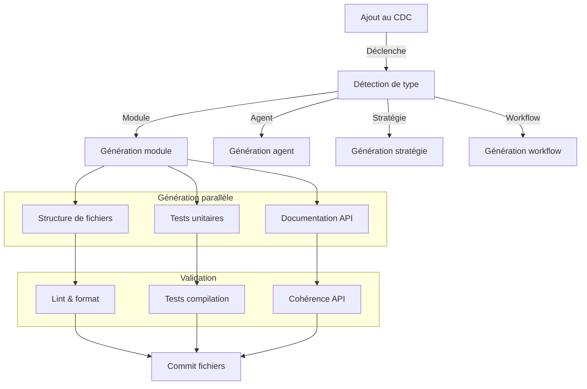

# Génération des fichiers techniques associés

## 🔄 Vue d'ensemble

Pour chaque nouvel élément ajouté au cahier des charges, le système génère automatiquement en parallèle les fichiers techniques associés, garantissant ainsi une synchronisation parfaite entre la documentation et l'implémentation technique.

## 🛠️ Mécanisme de génération

### Processus de génération parallèle

### Types de fichiers générés

Pour chaque type d'élément ajouté au cahier des charges, les fichiers techniques suivants sont générés:

| Type d'ajout | Fichiers générés | Emplacement | Templates utilisés |
|--------------|------------------|-------------|-------------------|
| Module | Structure TypeScript, tests, interfaces | `/src/modules/[nom]` | `templates/module/*` |
| Agent IA | Code de l'agent, prompts, tests | `/src/agents/[nom]` | `templates/agent/*` |
| Stratégie | Interface, classes d'implémentation | `/src/strategies/[nom]` | `templates/strategy/*` |
| Workflow | Définition n8n, documentation | `/workflows/[nom]` | `templates/workflow/*` |
| Dépendance | Configuration, exemples d'usage | `/config/dependencies/[nom]` | `templates/dependency/*` |

## 📝 Exemples de génération

### Exemple: Ajout d'un nouveau module

Lors de l'ajout d'un module "PaymentProcessor" au cahier des charges, les fichiers suivants sont générés:

