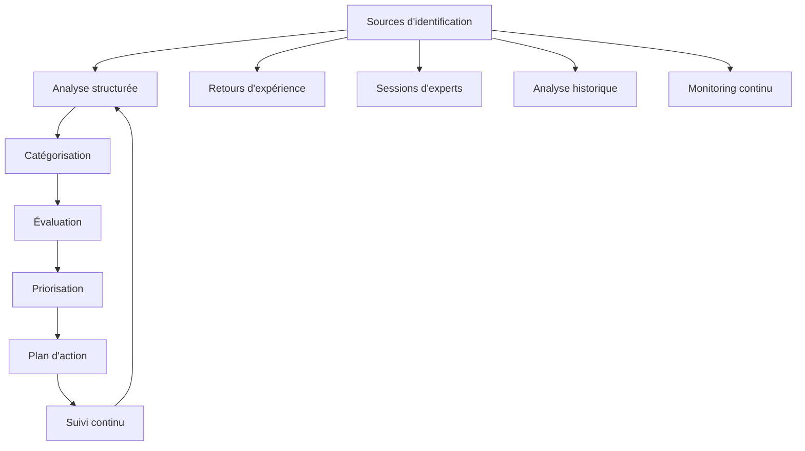
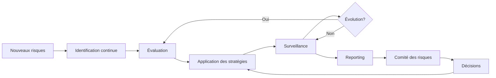
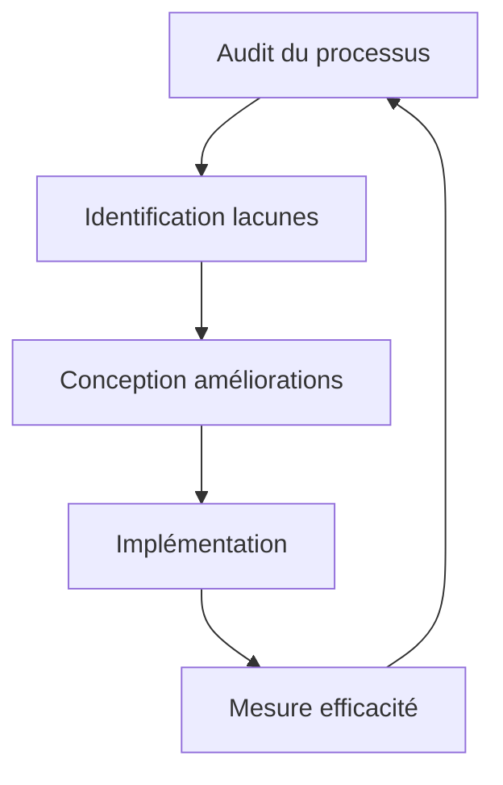

# Gestion des risques

## 🎯 Vue d'ensemble

La gestion des risques est un processus systématique d'identification, d'évaluation et de traitement des incertitudes qui pourraient affecter la réussite du projet de migration IA. Ce document définit notre approche pour anticiper, surveiller et atténuer efficacement les risques tout au long du cycle de vie du projet.

## 🔍 Méthodologie d'identification et d'évaluation

### Processus d'identification

### Matrice d'évaluation

Chaque risque identifié est évalué selon deux dimensions:

| Impact | Description | Score |
|--------|-------------|-------|
| Critique | Menace la viabilité du projet | 5 |
| Majeur | Affecte significativement le coût, le délai ou le périmètre | 4 |
| Modéré | Perturbe le planning ou nécessite des ajustements importants | 3 |
| Mineur | Cause des désagréments mais gérables avec peu d'efforts | 2 |
| Négligeable | Impact minimal sur le projet | 1 |

| Probabilité | Description | Score |
|-------------|-------------|-------|
| Quasi-certaine | >80% de chances de se produire | 5 |
| Probable | 60-80% de chances de se produire | 4 |
| Possible | 40-60% de chances de se produire | 3 |
| Improbable | 20-40% de chances de se produire | 2 |
| Rare | <20% de chances de se produire | 1 |

**Indice de criticité** = Impact × Probabilité

### Seuils de traitement

| Indice de criticité | Niveau de risque | Exigence de traitement |
|---------------------|------------------|------------------------|
| 20-25 | Extrême | Plan d'action urgent requis avec supervision directe |
| 12-19 | Élevé | Plan d'action détaillé et suivi rapproché |
| 6-11 | Modéré | Mesures d'atténuation et surveillance régulière |
| 1-5 | Faible | Surveillance simple, pas d'action immédiate |

## ⚠️ Registre des risques principaux

### Risques techniques

| ID | Risque | Impact | Probabilité | Criticité | Propriétaire |
|----|--------|--------|-------------|-----------|--------------|
| RT-01 | Complexité technique sous-estimée | 4 | 4 | 16 | Architecte Tech |
| RT-02 | Incompatibilité avec les systèmes existants | 5 | 3 | 15 | Responsable Intégration |
| RT-03 | Performance insuffisante des modèles IA | 4 | 3 | 12 | Data Scientist |
| RT-04 | Problèmes d'évolutivité de l'infrastructure | 3 | 4 | 12 | DevOps Lead |
| RT-05 | Failles de sécurité dans le code généré | 5 | 2 | 10 | Responsable Sécurité |

### Risques liés aux données

| ID | Risque | Impact | Probabilité | Criticité | Propriétaire |
|----|--------|--------|-------------|-----------|--------------|
| RD-01 | Qualité insuffisante des données d'entraînement | 4 | 4 | 16 | Data Engineer |
| RD-02 | Perte ou corruption de données | 5 | 2 | 10 | DBA |
| RD-03 | Non-conformité RGPD | 5 | 2 | 10 | DPO |
| RD-04 | Incohérences dans les schémas de données migrés | 3 | 3 | 9 | Architecte Données |
| RD-05 | Biais dans les modèles IA | 4 | 2 | 8 | Éthique IA |

### Risques organisationnels

| ID | Risque | Impact | Probabilité | Criticité | Propriétaire |
|----|--------|--------|-------------|-----------|--------------|
| RO-01 | Résistance au changement | 4 | 4 | 16 | Change Manager |
| RO-02 | Perte de compétences clés (départ d'experts) | 4 | 3 | 12 | RH Tech |
| RO-03 | Communication inefficace entre équipes | 3 | 4 | 12 | Chef de Projet |
| RO-04 | Dépendance excessive à des experts externes | 3 | 3 | 9 | Responsable Sourcing |
| RO-05 | Conflits de priorisation | 3 | 3 | 9 | Product Owner |

### Risques de projet

| ID | Risque | Impact | Probabilité | Criticité | Propriétaire |
|----|--------|--------|-------------|-----------|--------------|
| RP-01 | Dépassement du budget | 4 | 3 | 12 | Contrôleur Projet |
| RP-02 | Non-respect des délais | 4 | 3 | 12 | Chef de Projet |
| RP-03 | Expansion incontrôlée du périmètre | 3 | 4 | 12 | Product Owner |
| RP-04 | Défaillance d'un fournisseur clé | 4 | 2 | 8 | Responsable Achats |
| RP-05 | Disponibilité insuffisante des parties prenantes | 3 | 2 | 6 | Sponsor Projet |

## 🛡️ Stratégies d'atténuation

### Stratégies génériques

| Stratégie | Description | Application |
|-----------|-------------|-------------|
| Évitement | Éliminer la menace en supprimant sa cause | Changer d'approche ou de technologie |
| Transfert | Transférer l'impact à un tiers | Assurance, sous-traitance, contrats |
| Atténuation | Réduire la probabilité ou l'impact | Processus et contrôles préventifs |
| Acceptation | Accepter le risque sans action spécifique | Pour les risques faibles ou inévitables |

### Plans d'atténuation pour risques critiques

#### RT-01: Complexité technique sous-estimée

**Stratégie**: Atténuation

**Actions préventives**:
- Réaliser des POC (Preuves de Concept) pour les composants complexes
- Mettre en place une phase de découverte technique approfondie
- Intégrer des marges techniques dans les estimations (30%)
- Décomposer les tâches en unités plus petites et mesurables

**Actions de contingence**:
- Activer des ressources spécialisées supplémentaires
- Ajuster le périmètre ou les délais du projet
- Revoir l'approche technique si nécessaire

#### RD-01: Qualité insuffisante des données d'entraînement

**Stratégie**: Atténuation/Évitement

**Actions préventives**:
- Mettre en place un processus de validation des données en amont
- Développer des métriques de qualité des données avec seuils d'acceptation
- Réaliser des tests préliminaires avec échantillons représentatifs
- Prévoir des cycles de nettoyage et d'enrichissement des données

**Actions de contingence**:
- Activer le plan de remédiation des données défectueux
- Réduire le périmètre initial pour se concentrer sur les données fiables
- Envisager l'acquisition ou la génération de données synthétiques

#### RO-01: Résistance au changement

**Stratégie**: Atténuation

**Actions préventives**:
- Impliquer les utilisateurs finaux dès le début du projet
- Communiquer régulièrement sur les avantages et le déroulement
- Former les équipes aux nouvelles technologies et méthodes
- Identifier et mobiliser des champions du changement

**Actions de contingence**:
- Intensifier la communication et la formation
- Adapter l'approche de déploiement (progressif vs. big bang)
- Prévoir des incitations pour l'adoption

## 📊 Suivi et contrôle

### Processus de surveillance continue

### Rapports et indicateurs

**Rapport hebdomadaire**:
- Top 5 des risques actifs
- Nouveaux risques identifiés
- Statut des actions d'atténuation
- Tendances d'évolution des risques

**Tableau de bord des risques**:
- Matrice de chaleur des risques
- Nombre de risques par catégorie et sévérité
- Tendance d'évolution du profil de risque
- Efficacité des actions d'atténuation

### Routine de revue des risques

| Activité | Fréquence | Participants | Objectifs |
|----------|-----------|--------------|-----------|
| Revue quotidienne | Quotidien | Équipe projet | Identifier nouveaux risques/blocages |
| Comité des risques | Hebdomadaire | Gestionnaire risques, Propriétaires | Statut des actions, décisions |
| Revue approfondie | Mensuelle | Comité de pilotage | Tendances, risques stratégiques |
| Audit risques | Trimestriel | Auditeurs, Comité pilotage | Efficacité du processus |

## 🚨 Plans de contingence et d'urgence

### Seuils de déclenchement

| Niveau | Déclencheur | Actions |
|--------|-------------|---------|
| Alerte | Premier signe de matérialisation | Communication, surveillance accrue |
| Intervention | Impact limité confirmé | Activation des premières mesures |
| Crise | Impact significatif ou multiple | Plan de crise complet |

### Plan d'urgence générique

1. **Évaluation rapide**
   - Confirmation du problème et de son ampleur
   - Classification selon les niveaux prédéfinis

2. **Communication**
   - Notification aux parties prenantes selon le plan de communication
   - Points de situation réguliers

3. **Mobilisation des ressources**
   - Activation de l'équipe d'intervention
   - Allocation des ressources nécessaires

4. **Mise en œuvre**
   - Exécution des actions de contingence
   - Suivi en temps réel de l'efficacité

5. **Retour à la normale**
   - Vérification de la résolution
   - Transition vers les opérations normales

6. **Analyse post-mortem**
   - Identification des causes racines
   - Amélioration du processus de gestion des risques

### Scénarios d'urgence spécifiques

**Scénario: Défaillance majeure de la plateforme IA**
1. Activation de l'équipe d'intervention technique
2. Basculement vers le système de secours
3. Analyse des causes et corrections
4. Validation du retour à la normale
5. Communication transparente aux utilisateurs

**Scénario: Découverte d'une faille de sécurité critique**
1. Isolation du composant concerné
2. Analyse immédiate par l'équipe de sécurité
3. Déploiement du correctif d'urgence
4. Analyse de l'exploitation potentielle
5. Communication selon le plan d'incident de sécurité

## 🔄 Amélioration continue du processus

### Capitalisation des expériences

Chaque risque matérialisé fait l'objet d'une analyse post-mortem complète:
- Circonstances de survenue
- Efficacité des mesures préventives et curatives
- Leçons apprises et améliorations

### Cycle d'amélioration

Notre approche de gestion des risques est évolutive et s'enrichit continuellement des expériences du projet, permettant une adaptation constante à l'environnement changeant du projet.
