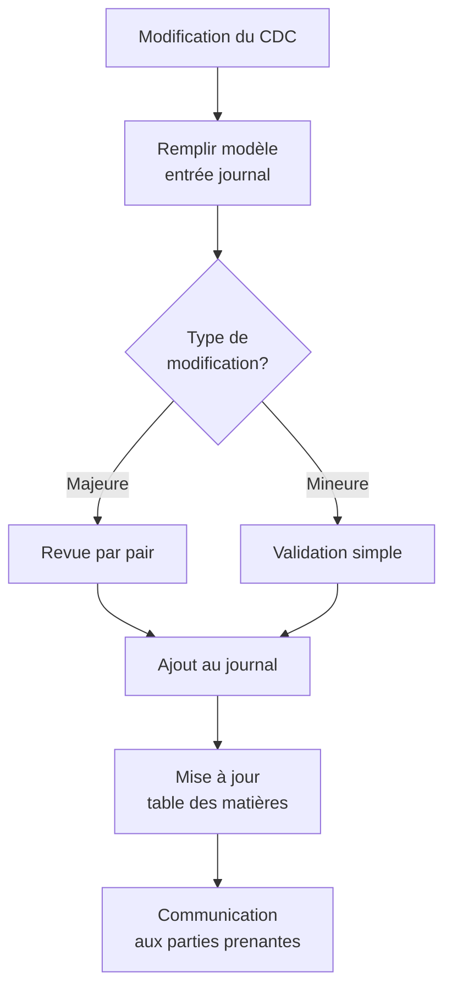

# Journal des modifications

## 🔄 Vue d'ensemble

Ce document centralise toutes les modifications apportées au cahier des charges pour garantir la traçabilité complète de son évolution. Chaque modification est documentée avec précision, incluant la date, l'auteur, les sections concernées, le type de changement et un résumé détaillé.

## 📋 Structure des entrées

Chaque entrée du journal suit le format standardisé suivant:

```yaml
# Entrée de modification
date: YYYY-MM-DD HH:MM:SS
auteur: "Nom de la personne ou de l'agent IA"
sections:
  - Section 1
  - Section 2
type: "ajout|correction|restructuration|mise à jour|suppression"
résumé: >
  Description claire et concise de la modification effectuée,
  expliquant le contexte et la raison du changement.
tickets_associés:
  - PROJ-123
  - PROJ-456
```

## 🏷️ Types de modifications

| Type | Description | Exemple |
|------|-------------|---------|
| Ajout | Nouvelle section ou contenu | Ajout d'une section sur les technologies émergentes |
| Correction | Rectification d'erreurs | Correction des incohérences dans les exigences fonctionnelles |
| Restructuration | Réorganisation du contenu | Déplacement de sections pour améliorer la logique de présentation |
| Mise à jour | Actualisation d'informations | Mise à jour des versions technologiques utilisées |
| Suppression | Retrait de contenu obsolète | Suppression de fonctionnalités abandonnées |

## 📝 Processus de documentation



1. **Identification**: Lors de chaque modification, l'auteur identifie les sections concernées
2. **Documentation**: Remplissage du modèle d'entrée avec tous les détails requis
3. **Validation**: Vérification de la qualité et pertinence de l'entrée
4. **Enregistrement**: Ajout au journal centralisé des modifications
5. **Communication**: Notification aux parties prenantes concernées

## 🔍 Recherche et filtrage

Le journal des modifications supporte les fonctionnalités suivantes:
- Recherche par mot-clé
- Filtrage par auteur
- Filtrage par date
- Filtrage par section
- Filtrage par type de modification

## 📜 Journal des modifications

### 2023-11-25 14:30:00
**Auteur**: GitHub Copilot  
**Sections**: Journal des modifications  
**Type**: Ajout  
**Résumé**: Création initiale du système de journalisation des modifications pour le cahier des charges, incluant la structure des entrées, les types de modifications et le processus de documentation.  

### 2023-11-26 10:15:00
**Auteur**: GitHub Copilot  
**Sections**: procedure-installation-pipeline  
**Type**: Ajout  
**Résumé**: Création d'une procédure détaillée d'installation du pipeline IA, incluant les prérequis techniques, les étapes d'installation, la configuration et personnalisation, ainsi que le dépannage. Ajout d'un script d'installation automatisée pour simplifier le déploiement.  

### 2023-11-20 09:45:23
**Auteur**: dev-generator.ts  
**Sections**: Gestion des risques  
**Type**: Ajout  
**Résumé**: Ajout d'une nouvelle section détaillant l'approche de gestion des risques du projet, incluant la méthodologie d'identification, les stratégies d'atténuation et les plans de contingence.  

### 2023-11-15 16:12:07
**Auteur**: Marie Dupont  
**Sections**: Technologies, outils et services  
**Type**: Mise à jour  
**Résumé**: Mise à jour des versions des technologies utilisées et ajout des perspectives d'évolution, incluant les technologies en veille et celles en fin de vie.  

### 2023-11-10 11:28:53
**Auteur**: GitHub Copilot  
**Sections**: Versionnement intelligent  
**Type**: Ajout  
**Résumé**: Ajout d'une section décrivant le système de versionnement intelligent du cahier des charges avec archivage automatique et horodatage.  

### 2023-11-05 14:50:31
**Auteur**: dev-generator.ts  
**Sections**: Command Center  
**Type**: Ajout  
**Résumé**: Création d'une section détaillant l'interface Remix "Command Center" permettant de suivre les modules migrés, l'activité IA et l'état du backlog.  

### 2023-10-30 10:15:42
**Auteur**: Jean Martin  
**Sections**: Audit automatique  
**Type**: Ajout  
**Résumé**: Mise en place du système de création automatique des fichiers .audit.md et des PR IA pour chaque fichier migré.  

### 2023-10-25 09:30:18
**Auteur**: GitHub Copilot  
**Sections**: Alertes de désynchronisation  
**Type**: Ajout  
**Résumé**: Ajout d'un système d'alertes pour détecter et notifier les désynchronisations entre la documentation et le code.  

### 2023-10-20 15:45:37
**Auteur**: Sophie Bernard  
**Sections**: Mismatch Tracker  
**Type**: Ajout  
**Résumé**: Mise en place du système de détection automatique des incohérences entre la documentation et le code source.  

### 2023-10-15 11:20:05
**Auteur**: dev-generator.ts  
**Sections**: Évolution technologique  
**Type**: Correction  
**Résumé**: Correction des informations concernant le cycle de vie des technologies et mise à jour du processus de détection d'obsolescence.
