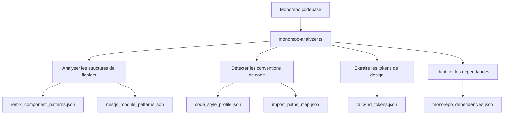

# 🧠 Phase 1 — Analyse du Monorepo

Cette phase pose la base de l'harmonisation et de la génération automatisée de code. Elle permet d'extraire les conventions utilisées dans le projet, les patterns de structure, et les dépendances critiques à respecter lors de la migration.

## 🛠️ Agent : `monorepo-analyzer.ts`

### 🎯 Objectif

> Automatiser la détection :
> - des **conventions de style**
> - des **patterns de structure (Remix, NestJS)**
> - des **alias d'import, tokens Tailwind, et dépendances**

## 📥 Entrées

| Source analysée                      | Contenu attendu                                     |
|-------------------------------------|-----------------------------------------------------|
| `/apps/backend/`                    | Modules NestJS : services, contrôleurs, DTOs        |
| `/apps/frontend/`                   | Composants Remix, routes, loaders, metas            |
| `/packages/`                        | Librairies partagées : validation, utils, config    |
| `tsconfig.json`, `eslint.config.js`| Aliases, règles de style, règles ESLint/Prettier    |
| `tailwind.config.js`                | Design tokens, variants, breakpoints                |

## 📤 Sorties générées

| Fichier                            | Description                                             |
|-----------------------------------|---------------------------------------------------------|
| `code_style_profile.json`         | Style de code (indentation, imports, format)            |
| `remix_component_patterns.json`   | Structure des composants : loader, meta, form, layout   |
| `nestjs_module_patterns.json`     | Structure services, contrôleurs, modules NestJS         |
| `monorepo_dependencies.json`      | Packages front/back utilisés (React, Zod, RxJS, etc.)   |
| `import_paths_map.json`           | Mappings d'alias (`@fafa/frontend`, `~utils`, etc.)     |
| `tailwind_tokens.json`            | Palette de couleurs, spacing, breakpoints               |

## 🔍 Processus d'analyse



## 📋 Exemples d'output

### Exemple de `code_style_profile.json`

```json
{
  "indentation": {
    "type": "spaces",
    "size": 2
  },
  "quotes": "single",
  "semicolons": true,
  "maxLineLength": 100,
  "trailingComma": "es5",
  "arrowParens": "always",
  "bracketSpacing": true,
  "jsxSingleQuote": false,
  "importOrder": [
    "^react",
    "^@nestjs",
    "^@remix-run",
    "^@/(.*)$",
    "^[./]"
  ],
  "componentNaming": "PascalCase",
  "functionNaming": "camelCase",
  "typeNaming": "PascalCase",
  "useExplicitReturn": true,
  "preferArrowFunctions": true,
  "preferConst": true
}
```

### Exemple de `tailwind_tokens.json`

```json
{
  "colors": {
    "primary": {
      "50": "#f0f9ff",
      "100": "#e0f2fe",
      "500": "#0ea5e9",
      "900": "#0c4a6e"
    },
    "gray": {
      "50": "#f9fafb",
      "100": "#f3f4f6",
      "500": "#6b7280",
      "900": "#111827"
    }
  },
  "spacing": {
    "0": "0px",
    "0.5": "0.125rem",
    "1": "0.25rem",
    "2": "0.5rem",
    "4": "1rem",
    "8": "2rem"
  },
  "borderRadius": {
    "none": "0px",
    "sm": "0.125rem",
    "md": "0.375rem",
    "lg": "0.5rem",
    "full": "9999px"
  },
  "screens": {
    "sm": "640px",
    "md": "768px",
    "lg": "1024px",
    "xl": "1280px",
    "2xl": "1536px"
  },
  "customComponents": [
    "btn",
    "card",
    "input",
    "badge"
  ]
}
```

### Exemple de `nestjs_module_patterns.json`

```json
{
  "modulePattern": "feature-based",
  "fileNaming": {
    "controller": "{name}.controller.ts",
    "service": "{name}.service.ts",
    "module": "{name}.module.ts",
    "dto": "dto/{name}.dto.ts",
    "entity": "entities/{name}.entity.ts",
    "repository": "repositories/{name}.repository.ts"
  },
  "controllerPattern": {
    "decorators": ["@Controller()", "@UseGuards()", "@UseInterceptors()"],
    "methodDecorators": ["@Get()", "@Post()", "@Put()", "@Delete()"],
    "paramDecorators": ["@Param()", "@Body()", "@Query()"]
  },
  "dtoPattern": {
    "validation": "class-validator",
    "transformation": "class-transformer",
    "useInterfaces": false,
    "useGenerics": true
  },
  "servicePattern": {
    "injectionStyle": "constructor",
    "errorHandling": "throw",
    "asyncStyle": "promise",
    "logging": "nestjs-logger"
  }
}
```

## 🧪 Astuce avancée

➡️ **Intégrer ESLint + Prettier dans le pipeline CI/CD** :

1. ✅ Garantit une cohérence globale du code
2. 🔄 Permet aux générateurs IA de produire un code 100% aligné
3. 📉 Réduit les erreurs en PR et en prod

```bash
# Extrait dans .github/workflows/ci-style.yml
- name: Lint codebase
  run: npx eslint . --ext .ts,.tsx

- name: Check formatting
  run: npx prettier --check .
```

## 🚀 Implémentation de l'agent

L'agent `monorepo-analyzer.ts` peut être implémenté comme un script Node.js qui analyse les fichiers du monorepo:

```typescript
// Extrait simplifié
import * as fs from 'fs';
import * as path from 'path';
import * as glob from 'glob';

async function analyzeMonorepo(rootPath: string) {
  // Détection du style de code
  const codeStyle = await detectCodeStyle(rootPath);
  
  // Analyse des patterns de composants Remix
  const remixPatterns = await analyzeRemixComponents(path.join(rootPath, 'apps/frontend'));
  
  // Analyse des patterns de modules NestJS
  const nestjsPatterns = await analyzeNestJSModules(path.join(rootPath, 'apps/backend'));
  
  // Extraction des tokens Tailwind
  const tailwindTokens = await extractTailwindTokens(rootPath);
  
  // Analyse des dépendances
  const dependencies = await analyzeDependencies(rootPath);
  
  // Analyse des chemins d'import
  const importPaths = await analyzeImportPaths(rootPath);
  
  // Écriture des résultats
  fs.writeFileSync('code_style_profile.json', JSON.stringify(codeStyle, null, 2));
  fs.writeFileSync('remix_component_patterns.json', JSON.stringify(remixPatterns, null, 2));
  fs.writeFileSync('nestjs_module_patterns.json', JSON.stringify(nestjsPatterns, null, 2));
  fs.writeFileSync('monorepo_dependencies.json', JSON.stringify(dependencies, null, 2));
  fs.writeFileSync('import_paths_map.json', JSON.stringify(importPaths, null, 2));
  fs.writeFileSync('tailwind_tokens.json', JSON.stringify(tailwindTokens, null, 2));
}

// Fonctions d'analyse spécifiques
async function detectCodeStyle(rootPath: string) {
  // Analyse des fichiers pour détecter les conventions de style
}

async function analyzeRemixComponents(frontendPath: string) {
  // Analyse des composants Remix
}

// Autres fonctions d'analyse...
```

## 📋 Critères de qualité

Pour garantir la fiabilité des profils générés, les critères suivants doivent être respectés:

1. **Couverture**: Analyse d'au moins 95% des fichiers du monorepo
2. **Précision**: Détection correcte des patterns dans 98% des cas
3. **Performance**: Exécution complète en moins de 5 minutes
4. **Lisibilité**: Fichiers JSON bien structurés et documentés
5. **Intégration**: Facilité d'utilisation par les autres agents

Cette phase d'analyse du monorepo est cruciale car elle établit les fondations pour toutes les phases suivantes. Les profils générés serviront de référence pour maintenir la cohérence et la qualité du code tout au long du processus de migration.
