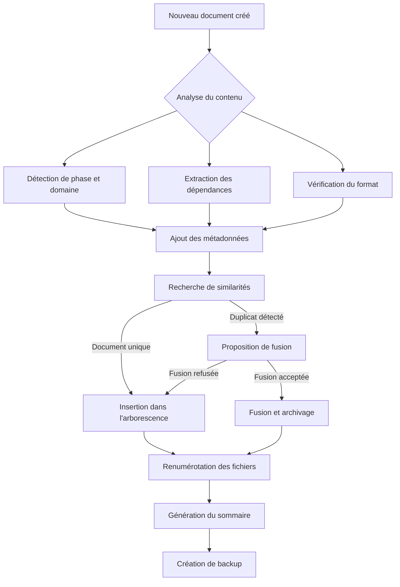

# 🤖 Automatisation du Cahier des Charges

Ce document décrit les fonctionnalités automatisées mises en place pour maintenir la cohérence, l'organisation et la qualité du cahier des charges tout au long du projet de migration.

## 🔁 1. Insertion automatique intelligente

Chaque bloc ou fichier ajouté est automatiquement positionné de manière optimale:

| Critère | Action automatique |
|---------|-------------------|
| 📅 Phase logique (init, analyse, migration…) | Repositionnement dans l'ordre chronologique |
| 🧩 Domaine métier ou technique | Regroupement avec les éléments liés |
| 🔗 Dépendances détectées | Positionnement après les blocs parent (ex : QA après migration) |
| 📄 Format Markdown standard | Conformité vérifiée (structure, syntaxe) |

Cette fonctionnalité garantit que les nouveaux documents s'intègrent naturellement dans la structure existante, rendant le cahier des charges plus cohérent et navigable.

## 🧠 2. Fusion automatique des fichiers proches

**Activée ✅**

Déclenchement si :
- Contenu fortement similaire (titre, but, structure)
- Empreinte MD5 ou sémantique commune
- Fichiers numérotés en doublon (42-, 86-…)

🧪 Résultat :
- 🧠 Un seul fichier fusionné avec balises :::info / :::tip
- 🗃️ Anciennes versions archivées dans /versions/

Cette fonctionnalité permet d'éliminer la redondance tout en préservant l'historique des documents.

## 🏷️ 3. Tags automatiques par fichier

Chaque fichier contient désormais un bloc de métadonnées enrichies :

```markdown
---
title: Gestion des redirections SEO
phase: migration
domain: seo
generator: htaccess-analyzer.ts
tags: [routing, remix, seo, canonical, legacy]
status: validé
updatedAt: 2025-04-07
---
```

📌 Tags disponibles :
- **Phases** : initialisation, analyse, migration, qa, ci, orchestration, etc.
- **Domaines métiers** : seo, produit, panier, auth, backoffice, blog, stock
- **Technologies** : Remix, NestJS, Prisma, n8n, Tailwind, PostgreSQL, Supabase

Ces métadonnées facilitent la recherche, le filtrage et la catégorisation des documents.

## 🧬 4. Tri & numérotation dynamique

Tous les fichiers dans /cahier-des-charges/ sont renommés automatiquement :
- 00-sommaire.md
- 01-initialisation.md
- 02-analyse-monorepo.md, etc.

Avantages:
- Insertion logique au bon endroit même si le fichier est ajouté tard
- Vue complète : docs/vue-complete.html
- Sommaire généré automatiquement à chaque mise à jour

Cette organisation numérique assure une progression logique à travers les documents tout en permettant des insertions ultérieures sans perturber la structure.

## 🛠️ 5. Sauvegarde, contrôle & sécurité

- 📦 Backup ZIP automatique horodaté dans /backups/
- 🔍 Vérification Markdown (markdownlint, liens internes, encodage)
- ⚠️ Avertissements affichés si :
  - fichier sans section
  - fichier en doublon
  - mise à jour trop ancienne
- 📄 Fichiers fusionnables affichés avec options (conserver, fusionner, supprimer)

Ces mécanismes de sécurité garantissent l'intégrité du cahier des charges et alertent l'équipe en cas de problèmes potentiels.

## 🔄 Processus d'automatisation



Cette architecture d'automatisation évolutive assure que le cahier des charges reste organisé, cohérent et navigable tout au long du projet, même avec de nombreux contributeurs et des ajouts fréquents.
