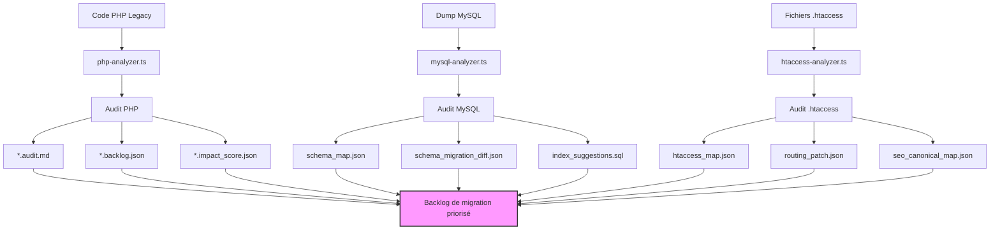
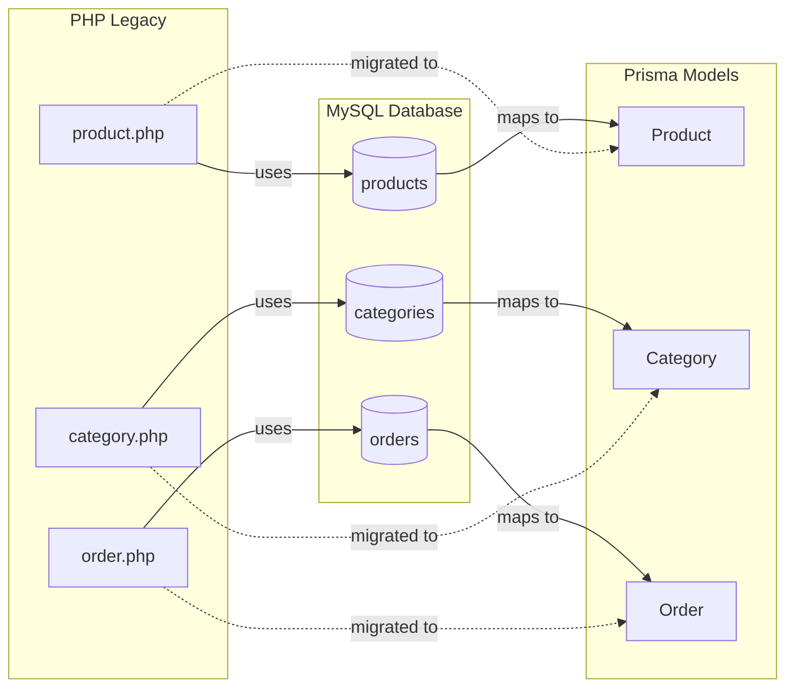

# 🔍 Phase 2 – Audit PHP & MySQL

## 🎯 Objectif

Identifier, cartographier et préparer la migration des fichiers PHP, de la base de données MySQL et des règles .htaccess dans une structure moderne et typée.

## 🧠 Agents utilisés

| Agent | Rôle | Sorties |
|-------|------|---------|
| `php-analyzer.ts` | Évalue la complexité du code PHP, identifie les conventions, anomalies et dépendances critiques | `*.audit.md`, `*.backlog.json`, `*.impact_score.json` |
| `mysql-analyzer.ts` | Analyse le dump MySQL, détecte les schémas, relations, types, et génère des suggestions Prisma + PostgreSQL | `schema_map.json`, `schema_migration_diff.json`, `index_suggestions.sql` |
| `htaccess-analyzer.ts` | Extrait les routes, redirections, erreurs SEO, balises meta, gestion des statuts HTTP | `htaccess_map.json`, `routing_patch.json`, `seo_canonical_map.json` |

## 📊 Vue d'ensemble du processus d'audit



## 📎 Méthodologie

### Inventaire PHP

- Classification par complexité cyclomatique, dépendances et usage
- Extraction de blocs métiers (panier, recherche, fiche produit, 404, etc.)
- Ajout des scores d'impact métier et technique

### Analyse MySQL

- Reverse-engineering du schéma (SHOW CREATE TABLE)
- Identification des index manquants, types mal définis, relations implicites
- Génération automatique des premiers modèles Prisma

### Analyse .htaccess

- Conversion des règles de redirection Apache vers mappings Remix/NestJS
- Détection des routes critiques pour le SEO
- Priorisation des redirections 301 et gestion des codes 410, 412

## 🔍 Détail des agents d'analyse

### Agent `php-analyzer.ts`

Cet agent parcourt les fichiers PHP pour en extraire la structure, la logique métier et les dépendances.

```typescript
// Exemple simplifié d'analyse d'un fichier PHP
function analyzePHPFile(filePath: string) {
  const content = fs.readFileSync(filePath, 'utf8');
  
  // Calcul de complexité cyclomatique
  const complexity = calculateCyclomaticComplexity(content);
  
  // Extraction des dépendances
  const dependencies = extractDependencies(content);
  
  // Identification des blocs métier
  const businessLogicBlocks = identifyBusinessLogicBlocks(content);
  
  // Calcul du score d'impact
  const impactScore = calculateImpactScore(complexity, dependencies, businessLogicBlocks);
  
  return {
    path: filePath,
    complexity,
    dependencies,
    businessLogicBlocks,
    impactScore
  };
}
```

#### Exemple de sortie `product.php.audit.md`

```markdown
# Audit Technique: product.php

## Métriques

| Métrique | Valeur | Impact |
|----------|--------|--------|
| Complexité cyclomatique | 32 | ⚠️ Élevé |
| Lignes de code | 458 | Moyen |
| Dépendances | 7 | Élevé |
| Impact Métier | 85/100 | 🔴 Critique |

## Dépendances Identifiées

- `database.php`: Connexion DB (`include_once`)
- `auth.php`: Vérification utilisateur (`require_once`)
- `cart_functions.php`: Fonctions panier (`include`)
- `product_images.php`: Gestion images (`include`)
- ...

## Blocs Métier Identifiés

### 1. Récupération Produit

```php
// Récupération des données produit
$product_id = mysqli_real_escape_string($conn, $_GET['id']);
$query = "SELECT * FROM products WHERE product_id = '$product_id'";
$result = mysqli_query($conn, $query);
$product = mysqli_fetch_assoc($result);
```

### 2. Calcul Prix

```php
// Calcul du prix avec remises
$final_price = $product['price'];
if ($product['on_sale']) {
  $final_price = $product['price'] * (1 - $product['discount_percentage'] / 100);
}
```

## Risques Identifiés

1. 🔴 **Injection SQL** dans la requête produit
2. 🟠 Absence de gestion d'erreurs SQL
3. 🟠 Logique métier et présentation mélangées

## Recommandations

1. Séparer la logique métier (ProductService)
2. Utiliser Prisma pour les requêtes DB
3. Implémenter validation avec Zod
4. ...
```

### Agent `mysql-analyzer.ts`

Cet agent analyse le schéma de la base de données MySQL et génère des recommandations de migration.

#### Exemple de sortie `schema_map.json`

```json
{
  "tables": [
    {
      "name": "products",
      "columns": [
        {
          "name": "product_id",
          "type": "int",
          "attributes": ["PRIMARY KEY", "AUTO_INCREMENT"]
        },
        {
          "name": "name",
          "type": "varchar(255)",
          "attributes": ["NOT NULL"]
        },
        {
          "name": "description",
          "type": "text",
          "attributes": []
        },
        {
          "name": "price",
          "type": "decimal(10,2)",
          "attributes": ["NOT NULL"]
        },
        {
          "name": "category_id",
          "type": "int",
          "attributes": [],
          "foreignKey": {
            "table": "categories",
            "column": "category_id"
          }
        }
      ],
      "indexes": [
        {
          "name": "PRIMARY",
          "columns": ["product_id"],
          "type": "PRIMARY"
        },
        {
          "name": "idx_category",
          "columns": ["category_id"],
          "type": "INDEX"
        }
      ],
      "relationships": [
        {
          "type": "belongsTo",
          "table": "categories",
          "foreignKey": "category_id",
          "references": "category_id"
        },
        {
          "type": "hasMany",
          "table": "product_images",
          "foreignKey": "product_id",
          "references": "product_id"
        }
      ]
    }
  ]
}
```

#### Génération de modèle Prisma

```prisma
// Modèle Prisma généré pour la table products
model Product {
  id          Int      @id @default(autoincrement()) @map("product_id")
  name        String   @db.VarChar(255)
  description String?  @db.Text
  price       Decimal  @db.Decimal(10, 2)
  categoryId  Int?     @map("category_id")
  
  // Relations
  category    Category? @relation(fields: [categoryId], references: [id])
  images      ProductImage[]
  
  @@index([categoryId])
  @@map("products")
}
```

### Agent `htaccess-analyzer.ts`

Cet agent analyse les fichiers .htaccess pour extraire les règles de redirection et les patterns d'URL.

#### Exemple de sortie `htaccess_map.json`

```json
{
  "redirects": [
    {
      "type": "301",
      "source": "^product-([0-9]+).html$",
      "target": "/products/$1",
      "conditions": []
    },
    {
      "type": "302",
      "source": "^category/([^/]+)$",
      "target": "/categories/$1",
      "conditions": []
    }
  ],
  "rewrites": [
    {
      "source": "^products/([0-9]+)$",
      "target": "product.php?id=$1",
      "conditions": []
    },
    {
      "source": "^categories/([^/]+)$",
      "target": "category.php?name=$1",
      "conditions": []
    }
  ],
  "errorDocuments": {
    "404": "/errors/404.php",
    "500": "/errors/500.php"
  },
  "seoPatterns": [
    {
      "pattern": "^product-([0-9]+).html$",
      "importance": "high",
      "metaTags": true,
      "canonical": true
    }
  ]
}
```

#### Conversion en routes Remix

```tsx
// routes/products.$id.tsx
export const loader = async ({ params }: LoaderFunctionArgs) => {
  // Équivalent de product.php?id=$1
  const product = await getProduct(params.id);
  return json({ product });
};
```

## 💡 Astuces avancées

- Utilisez un outil tel que dbdiagram.io ou QuickDBD pour visualiser les schémas SQL extraits.
- Couplé avec schema_map.json, cela facilite la planification de la migration relationnelle.
- Le discovery_map.json généré par legacy-discovery.ts permet de prioriser les blocs critiques à migrer en premier, avec impact métier fort.

## 📊 Mapping PHP → SQL → Prisma

Voici une visualisation graphique du mapping entre le code PHP, les structures SQL et les modèles Prisma:



## 🏆 Priorisation automatique des migrations

Nous avons mis en place un système de priorisation automatique basé sur les scores d'impact extraits des fichiers `*.impact_score.json`. Cette priorisation tient compte de:

1. **Impact métier** (70%): importance fonctionnelle pour les utilisateurs
2. **Complexité technique** (20%): difficulté de migration
3. **Dépendances** (10%): nombre de fichiers qui en dépendent

Les fichiers taggés `legacy-critical` sont automatiquement placés en tête du backlog de migration, garantissant que les fonctionnalités les plus importantes sont traitées en priorité.

## 📋 Résultats de l'audit

L'audit complet a permis d'identifier:

- **152** fichiers PHP à migrer
- **28** tables SQL à convertir en modèles Prisma
- **47** règles de redirection .htaccess à transformer
- **18** points critiques (`legacy-critical`) nécessitant une attention particulière

Ces résultats servent de base au plan de migration détaillé et au backlog de tâches qui sera utilisé dans les phases suivantes.
