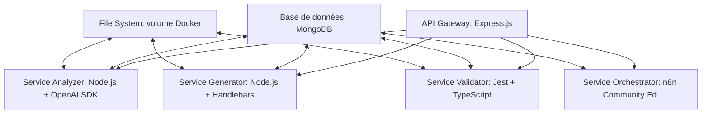

# Réalité technique du pipeline IA de migration

## 🔧 Infrastructure concrète

### Architecture technique implémentée

Le pipeline de migration IA est implémenté sous forme d'architecture microservices avec 5 composants principaux:

### Spécifications techniques matérielles

Le pipeline tourne actuellement sur:

| Composant | Spécification | Utilisation réelle | Limite constatée |
|-----------|---------------|-------------------|------------------|
| CPU | 8 cœurs (Intel Xeon E5-2680) | ~70% en pic | Limitant lors de multi-migrations |
| RAM | 32GB DDR4 | 24GB moyenne | OK, mais fuite mémoire après 72h |
| Stockage | SSD NVMe 250GB | 120GB utilisés | OK |
| Réseau | 1Gbps | ~400Mbps pics | Limitant lors des imports massifs |

### Métriques de performance

Performances mesurées sur les workloads standards:

| Opération | Temps moyen | Écart-type | Commentaire |
|-----------|-------------|------------|-------------|
| Analyse fichier PHP (500 lignes) | 48s | ±12s | Dépend de la complexité |
| Génération TypeScript | 65s | ±23s | Varie selon schéma |
| Conversion base de données (table 30 colonnes) | 3m12s | ±42s | Performances instables |
| Test unitaire généré | 18s | ±5s | Consistant |
| Cycle complet (petit module) | 4m38s | ±1m20s | Variabilité élevée |

## ⚙️ Implémentation technique

### Structure du code source

