# ⚙️ Phase 4 – Génération de modules

## 🎯 Objectif

Automatiser la création de modules NestJS et Remix conformes aux conventions détectées dans le monorepo, en s'appuyant sur les audits sémantiques, les patterns de structure, et les modèles Prisma validés.

## 🧠 Agent utilisé

| Agent | Rôle | Sorties générées |
|-------|------|------------------|
| `dev-generator.ts` | Génère les fichiers standards frontend/backend (structure modulaire) | `*.controller.ts`, `*.service.ts`, `*.dto.ts`, `*.tsx`, `meta.ts`, `loader.ts` |

## 🔍 Vue d'ensemble du processus de génération

```mermaid
graph TD
    A[Audits sémantiques] --> E[dev-generator.ts]
    B[Modèles Prisma] --> E
    C[Profils monorepo] --> E
    D[Liaisons SQL/PHP] --> E
    F[Règles ESLint/Tailwind] --> E
    
    E --> G[Module NestJS]
    E --> H[Composants Remix]
    
    G --> I[Controllers]
    G --> J[Services]
    G --> K[DTOs]
    G --> L[Modules]
    
    H --> M[Routes TSX]
    H --> N[Loaders]
    H --> O[Actions]
    H --> P[Meta]
    
    style E fill:#f9f,stroke:#333,stroke-width:2px
```



## 🧩 Sources utilisées

L'agent `dev-generator.ts` utilise comme base :

- Les audits issus de `php-analyzer.ts` (`*.audit.md`, `*.backlog.json`)
- Les modèles Prisma (`model_map.json`, `patch.prisma`)
- Le profil monorepo (`nestjs_module_patterns.json`, `remix_component_patterns.json`)
- Les liaisons SQL/PHP (`php_sql_links.json`)
- Les règles ESLint/Tailwind détectées (`code_style_profile.json`, `tailwind_tokens.json`) 

## 🧠 Avantages stratégiques

- ✅ **Gain de temps** : Plus besoin de créer chaque fichier manuellement
- ✅ **Uniformité** : Conformité immédiate aux conventions du projet
- ✅ **Modularité** : Chaque domaine métier devient un module réutilisable
- ✅ **Cohérence entre front/back** : Alignement automatique via `php_sql_links.json`

## 📦 Configuration de l'agent

L'agent `dev-generator.ts` est configurable via un fichier JSON qui définit les paramètres de génération:

```json
{
  "moduleName": "products",
  "entityName": "Product",
  "outputPath": {
    "backend": "apps/backend/src/modules/products",
    "frontend": "apps/frontend/app/routes/products"
  },
  "options": {
    "generateTests": true,
    "authRequired": true,
    "crudOperations": ["create", "read", "update", "delete"],
    "pagination": true,
    "filtering": true,
    "sorting": true,
    "validationStyle": "zod",
    "generateDocs": true
  },
  "customTemplates": {
    "controller": "template-overrides/controller.custom.hbs",
    "service": "template-overrides/service.custom.hbs"
  }
}
```

## 🔧 Exemples de fichiers générés

### Backend NestJS

#### Controller généré

```typescript
// Exemple de controller NestJS généré
import { Controller, Get, Post, Put, Delete, Body, Param, Query, UseGuards } from '@nestjs/common';
import { ProductsService } from './products.service';
import { CreateProductDto } from './dto/create-product.dto';
import { UpdateProductDto } from './dto/update-product.dto';
import { JwtAuthGuard } from '../auth/guards/jwt-auth.guard';
import { ApiTags, ApiOperation, ApiResponse } from '@nestjs/swagger';
import { PaginationDto } from '../../common/dto/pagination.dto';

@ApiTags('products')
@Controller('products')
export class ProductsController {
  constructor(private readonly productsService: ProductsService) {}

  @Get()
  @ApiOperation({ summary: 'Get all products' })
  @ApiResponse({ status: 200, description: 'Return all products' })
  async findAll(@Query() paginationDto: PaginationDto) {
    return this.productsService.findAll(paginationDto);
  }

  @Get(':id')
  @ApiOperation({ summary: 'Get product by id' })
  @ApiResponse({ status: 200, description: 'Return a product by id' })
  @ApiResponse({ status: 404, description: 'Product not found' })
  async findOne(@Param('id') id: string) {
    return this.productsService.findOne(id);
  }

  @Post()
  @UseGuards(JwtAuthGuard)
  @ApiOperation({ summary: 'Create a new product' })
  @ApiResponse({ status: 201, description: 'Product successfully created' })
  @ApiResponse({ status: 400, description: 'Invalid input' })
  async create(@Body() createProductDto: CreateProductDto) {
    return this.productsService.create(createProductDto);
  }

  @Put(':id')
  @UseGuards(JwtAuthGuard)
  @ApiOperation({ summary: 'Update a product' })
  @ApiResponse({ status: 200, description: 'Product successfully updated' })
  @ApiResponse({ status: 404, description: 'Product not found' })
  async update(@Param('id') id: string, @Body() updateProductDto: UpdateProductDto) {
    return this.productsService.update(id, updateProductDto);
  }

  @Delete(':id')
  @UseGuards(JwtAuthGuard)
  @ApiOperation({ summary: 'Delete a product' })
  @ApiResponse({ status: 200, description: 'Product successfully deleted' })
  @ApiResponse({ status: 404, description: 'Product not found' })
  async remove(@Param('id') id: string) {
    return this.productsService.remove(id);
  }
}
```

#### Service généré

```typescript
// Exemple de service NestJS généré
import { Injectable, NotFoundException } from '@nestjs/common';
import { PrismaService } from '../../prisma/prisma.service';
import { CreateProductDto } from './dto/create-product.dto';
import { UpdateProductDto } from './dto/update-product.dto';
import { PaginationDto } from '../../common/dto/pagination.dto';

@Injectable()
export class ProductsService {
  constructor(private prisma: PrismaService) {}

  async findAll(paginationDto: PaginationDto) {
    const { page = 1, limit = 10, sort, order } = paginationDto;
    const skip = (page - 1) * limit;
    
    const orderBy = sort ? { [sort]: order || 'asc' } : { id: 'desc' };
    
    const [items, total] = await Promise.all([
      this.prisma.product.findMany({
        skip,
        take: limit,
        orderBy,
        include: {
          category: true
        }
      }),
      this.prisma.product.count()
    ]);
    
    return {
      items,
      meta: {
        total,
        page,
        limit,
        pages: Math.ceil(total / limit)
      }
    };
  }

  async findOne(id: string) {
    const product = await this.prisma.product.findUnique({
      where: { id: parseInt(id) },
      include: {
        category: true
      }
    });
    
    if (!product) {
      throw new NotFoundException(`Product with ID ${id} not found`);
    }
    
    return product;
  }

  async create(createProductDto: CreateProductDto) {
    return this.prisma.product.create({
      data: createProductDto,
    });
  }

  async update(id: string, updateProductDto: UpdateProductDto) {
    try {
      return await this.prisma.product.update({
        where: { id: parseInt(id) },
        data: updateProductDto,
      });
    } catch (error) {
      throw new NotFoundException(`Product with ID ${id} not found`);
    }
  }

  async remove(id: string) {
    try {
      return await this.prisma.product.delete({
        where: { id: parseInt(id) },
      });
    } catch (error) {
      throw new NotFoundException(`Product with ID ${id} not found`);
    }
  }
}
```

#### DTO généré

```typescript
// Exemple de DTO généré avec validation Zod
import { z } from 'zod';
import { createZodDto } from 'nestjs-zod';

// Schéma Zod pour la création
export const CreateProductSchema = z.object({
  name: z.string().min(1, 'Name is required').max(255),
  description: z.string().optional(),
  price: z.number().positive('Price must be positive'),
  stock: z.number().int().min(0, 'Stock cannot be negative'),
  categoryId: z.number().int().optional(),
  isActive: z.boolean().default(true),
  slug: z.string().regex(/^[a-z0-9-]+$/, 'Slug must contain only lowercase letters, numbers and hyphens').optional(),
});

// DTO de création
export class CreateProductDto extends createZodDto(CreateProductSchema) {}

// Schéma Zod pour la mise à jour (tous les champs optionnels)
export const UpdateProductSchema = CreateProductSchema.partial();

// DTO de mise à jour
export class UpdateProductDto extends createZodDto(UpdateProductSchema) {}
```

### Frontend Remix

#### Route principale générée

```tsx
// Exemple de route principale générée
import { json, type LoaderFunctionArgs } from "@remix-run/node";
import { useLoaderData, Link, Outlet } from "@remix-run/react";
import { getProducts } from "~/api/products.server";
import { Button } from "~/components/ui/button";
import { Pagination } from "~/components/ui/pagination";
import { ProductCard } from "~/components/products/product-card";
import { useSearchParams } from "@remix-run/react";

export async function loader({ request }: LoaderFunctionArgs) {
  const url = new URL(request.url);
  const page = parseInt(url.searchParams.get("page") || "1");
  const limit = parseInt(url.searchParams.get("limit") || "10");
  const sort = url.searchParams.get("sort") || undefined;
  const order = url.searchParams.get("order") || undefined;
  
  const productsData = await getProducts({ page, limit, sort, order });
  
  return json({ productsData });
}

export default function ProductsIndex() {
  const { productsData } = useLoaderData<typeof loader>();
  const { items: products, meta } = productsData;
  const [searchParams] = useSearchParams();
  
  return (
    <div className="container mx-auto py-8">
      <div className="flex justify-between items-center mb-6">
        <h1 className="text-3xl font-bold">Products</h1>
        <Link to="/products/new">
          <Button>Add Product</Button>
        </Link>
      </div>
      
      <div className="grid grid-cols-1 md:grid-cols-2 lg:grid-cols-3 gap-6">
        {products.map((product) => (
          <ProductCard key={product.id} product={product} />
        ))}
      </div>
      
      <div className="mt-8 flex justify-center">
        <Pagination 
          currentPage={meta.page} 
          totalPages={meta.pages} 
          baseUrl={`/products?${new URLSearchParams({
            ...Object.fromEntries(searchParams),
            page: ''
          }).toString()}`} 
        />
      </div>
      
      <Outlet />
    </div>
  );
}
```

#### Route détail générée

```tsx
// Exemple de route détail générée
import { json, redirect, type LoaderFunctionArgs, type ActionFunctionArgs } from "@remix-run/node";
import { useLoaderData, useNavigation, Form } from "@remix-run/react";
import { getProduct, deleteProduct } from "~/api/products.server";
import { Button } from "~/components/ui/button";
import { formatPrice } from "~/utils/format";
import { requireAuth } from "~/utils/auth.server";

export async function loader({ params, request }: LoaderFunctionArgs) {
  const productId = params.id;
  if (!productId) {
    throw new Response("Product ID is required", { status: 400 });
  }
  
  const product = await getProduct(productId);
  if (!product) {
    throw new Response("Product not found", { status: 404 });
  }
  
  return json({ product });
}

export async function action({ params, request }: ActionFunctionArgs) {
  // Require authentication for actions
  await requireAuth(request);
  
  const productId = params.id;
  if (!productId) {
    return json({ error: "Product ID is required" }, { status: 400 });
  }
  
  const formData = await request.formData();
  const intent = formData.get("intent");
  
  if (intent === "delete") {
    await deleteProduct(productId);
    return redirect("/products");
  }
  
  return json({ error: "Invalid intent" }, { status: 400 });
}

export default function ProductDetail() {
  const { product } = useLoaderData<typeof loader>();
  const navigation = useNavigation();
  const isDeleting = navigation.state === "submitting" && 
    navigation.formData?.get("intent") === "delete";
  
  return (
    <div className="container mx-auto py-8">
      <div className="bg-white rounded-lg shadow-md overflow-hidden">
        <div className="md:flex">
          <div className="md:flex-shrink-0">
            {product.imageUrl ? (
              
            ) : (
              <div className="h-48 w-full bg-gray-200 md:w-48 flex items-center justify-center">
                <span className="text-gray-500">No image</span>
              </div>
            )}
          </div>
          
          <div className="p-8">
            <div className="flex justify-between items-start">
              <div>
                <h1 className="text-2xl font-bold text-gray-900">{product.name}</h1>
                {product.category && (
                  <p className="text-sm text-gray-600 mt-1">
                    Category: {product.category.name}
                  </p>
                )}
              </div>
              
              <div className="text-2xl font-bold text-primary-600">
                {formatPrice(product.price)}
              </div>
            </div>
            
            <div className="mt-4">
              <h2 className="text-lg font-semibold">Description</h2>
              <p className="mt-2 text-gray-600">{product.description || "No description available."}</p>
            </div>
            
            <div className="mt-6 flex flex-wrap gap-4">
              <Button asChild variant="outline">
                <a href={`/products/${product.id}/edit`}>Edit</a>
              </Button>
              
              <Form method="post">
                <input type="hidden" name="intent" value="delete" />
                <Button 
                  type="submit"
                  variant="destructive"
                  disabled={isDeleting}
                >
                  {isDeleting ? "Deleting..." : "Delete"}
                </Button>
              </Form>
            </div>
          </div>
        </div>
      </div>
    </div>
  );
}
```

#### API utilitaire générée

```typescript
// Exemple d'API utilitaire généré
// api/products.server.ts
import { apiClient } from "~/utils/api.server";

interface PaginationParams {
  page?: number;
  limit?: number;
  sort?: string;
  order?: 'asc' | 'desc';
}

export async function getProducts(params: PaginationParams = {}) {
  const queryParams = new URLSearchParams();
  
  if (params.page) queryParams.set('page', params.page.toString());
  if (params.limit) queryParams.set('limit', params.limit.toString());
  if (params.sort) queryParams.set('sort', params.sort);
  if (params.order) queryParams.set('order', params.order);
  
  const queryString = queryParams.toString();
  const endpoint = `/products${queryString ? `?${queryString}` : ''}`;
  
  return apiClient.get(endpoint);
}

export async function getProduct(id: string) {
  return apiClient.get(`/products/${id}`);
}

export async function createProduct(data: any) {
  return apiClient.post('/products', data);
}

export async function updateProduct(id: string, data: any) {
  return apiClient.put(`/products/${id}`, data);
}

export async function deleteProduct(id: string) {
  return apiClient.delete(`/products/${id}`);
}
```

## 💡 Astuces avancées

- Ajoutez un dossier `template-overrides/` pour permettre de personnaliser les templates générés selon les cas métier (ex : formulaire de login ≠ formulaire produit).

- Intégrez la génération à un CLI custom (npm run generate module <name>) pour en faire un outil de scaffolding local dans Codespaces ou Docker:

```bash
#!/bin/bash
# scripts/generate-module.sh

MODULE_NAME=$1
ENTITY_NAME=$(echo $MODULE_NAME | sed -r 's/(^|-)([a-z])/\U\2/g')

echo "Generating module for $MODULE_NAME (entity: $ENTITY_NAME)"

# Generate config file
cat > .generator-config.json << EOF
{
  "moduleName": "$MODULE_NAME",
  "entityName": "$ENTITY_NAME",
  "outputPath": {
    "backend": "apps/backend/src/modules/$MODULE_NAME",
    "frontend": "apps/frontend/app/routes/$MODULE_NAME"
  },
  "options": {
    "generateTests": true,
    "authRequired": true,
    "crudOperations": ["create", "read", "update", "delete"],
    "pagination": true,
    "filtering": true,
    "sorting": true,
    "validationStyle": "zod",
    "generateDocs": true
  }
}
EOF

# Run the generator
echo "Running dev-generator.ts..."
npx ts-node scripts/generation/dev-generator.ts --config .generator-config.json

echo "Module generation complete!"
```

- Utilisez `tailwind_tokens.json` pour injecter directement les classes CSS dans les fichiers .tsx avec clsx ou tailwind-variants:

```typescript
// Exemple d'utilisation des tokens Tailwind dans un composant généré
import { tv } from 'tailwind-variants';
import tailwindTokens from '~/data/tailwind_tokens.json';

const buttonVariants = tv({
  base: "inline-flex items-center justify-center rounded font-medium transition-colors focus-visible:outline-none disabled:opacity-50",
  variants: {
    variant: {
      primary: `bg-${tailwindTokens.colors.primary[500]} text-white hover:bg-${tailwindTokens.colors.primary[600]}`,
      secondary: `bg-${tailwindTokens.colors.gray[200]} text-${tailwindTokens.colors.gray[900]} hover:bg-${tailwindTokens.colors.gray[300]}`,
      outline: `border border-${tailwindTokens.colors.gray[300]} bg-transparent hover:bg-${tailwindTokens.colors.gray[100]}`,
    },
    size: {
      sm: `px-${tailwindTokens.spacing[2]} py-${tailwindTokens.spacing[1]} text-sm`,
      md: `px-${tailwindTokens.spacing[4]} py-${tailwindTokens.spacing[2]} text-base`,
      lg: `px-${tailwindTokens.spacing[6]} py-${tailwindTokens.spacing[3]} text-lg`,
    },
  },
  defaultVariants: {
    variant: "primary",
    size: "md",
  },
});
```

## 🧪 Tests générés automatiquement

L'agent génère également des tests unitaires et d'intégration pour les composants créés:

```typescript
// Exemple de test pour le controller NestJS
import { Test, TestingModule } from '@nestjs/testing';
import { ProductsController } from './products.controller';
import { ProductsService } from './products.service';
import { PrismaService } from '../../prisma/prisma.service';
import { CreateProductDto } from './dto/create-product.dto';
import { UpdateProductDto } from './dto/update-product.dto';

// Mock des services
const mockProductsService = {
  findAll: jest.fn(),
  findOne: jest.fn(),
  create: jest.fn(),
  update: jest.fn(),
  remove: jest.fn(),
};

describe('ProductsController', () => {
  let controller: ProductsController;
  let service: ProductsService;

  beforeEach(async () => {
    const module: TestingModule = await Test.createTestingModule({
      controllers: [ProductsController],
      providers: [
        {
          provide: ProductsService,
          useValue: mockProductsService,
        },
      ],
    }).compile();

    controller = module.get<ProductsController>(ProductsController);
    service = module.get<ProductsService>(ProductsService);
  });

  it('should be defined', () => {
    expect(controller).toBeDefined();
  });

  describe('findAll', () => {
    it('should return an array of products', async () => {
      const result = {
        items: [{ id: 1, name: 'Test Product' }],
        meta: { total: 1, page: 1, limit: 10, pages: 1 }
      };
      jest.spyOn(service, 'findAll').mockResolvedValue(result);

      expect(await controller.findAll({ page: 1, limit: 10 })).toBe(result);
    });
  });

  // Autres tests pour findOne, create, update, remove...
});
```

Cette phase de génération de modules constitue une étape clé qui accélère considérablement le développement tout en garantissant la cohérence et la qualité du code produit.
