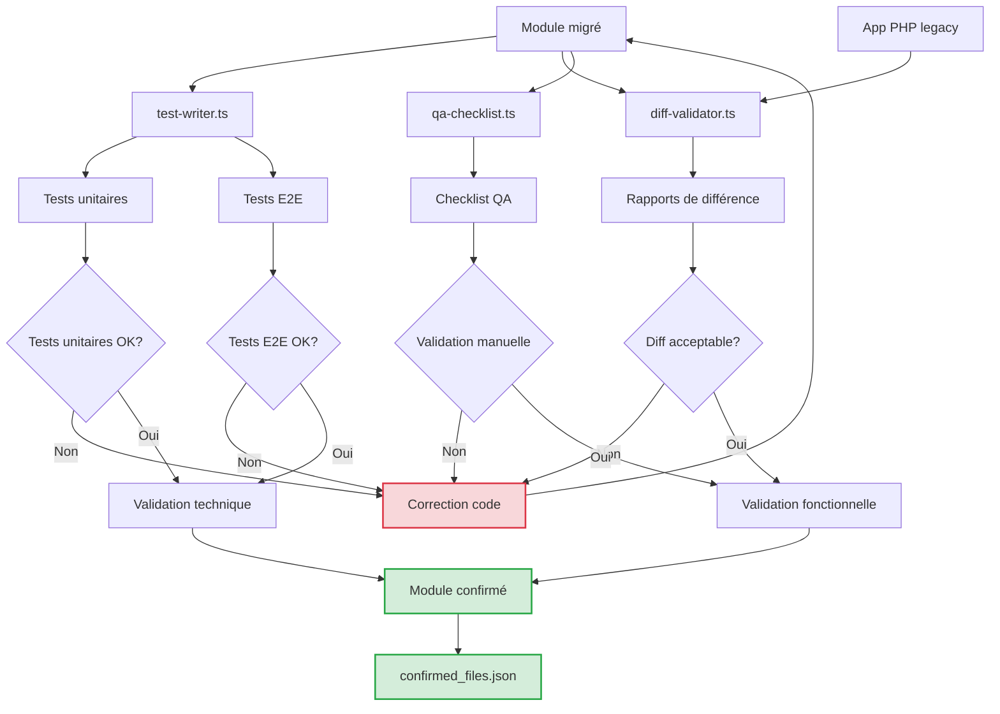

# ✅ Phase 5 – QA & Validation

## 🎯 Objectif

Garantir que chaque module migré fonctionne correctement, respecte les spécifications métier, et reste équivalent au comportement de la version PHP d'origine. La validation s'appuie à la fois sur des tests automatisés et des vérifications humaines assistées.

## 🧠 Agents utilisés

| Agent | Rôle | Sorties générées |
|-------|------|------------------|
| `test-writer.ts` | Génère les tests unitaires (NestJS, Remix), tests E2E (Playwright ou Supertest), fixtures | `*.spec.ts`, `*.e2e.ts`, `fixtures.prisma.json` |
| `diff-validator.ts` | Compare les outputs de l'app PHP et NestJS/Remix sur des cas identiques | `verification_report.json`, `mismatch.diff.json` |
| `qa-checklist.ts` | Produit un document de vérification QA complet (automatisable et à remplir manuellement) | `fiche.qa.md`, `fiche.qa.json` |

## 📊 Vue d'ensemble du processus de validation



## 🧪 Méthodologie de test intégrée

### 🔹 Tests unitaires (NestJS & Remix)
- Jest pour services, contrôleurs, DTO
- React Testing Library pour composants .tsx

### 🔹 Tests end-to-end (E2E)
- Playwright pour Remix
- Supertest ou Jest + HTTP pour NestJS

### 🔹 Validation comportementale
Diff entre JSON/API HTML rendus par :
- legacy.php vs remix.route.tsx
- legacy.ajax.php vs nestjs.controller.ts

## 🔍 Détail des agents de validation

### Agent `test-writer.ts`

Cet agent génère des tests unitaires et d'intégration pour les modules migrés.

#### Exemple de test unitaire généré pour un service NestJS

```typescript
// Exemple de test unitaire généré pour un service NestJS
import { Test } from '@nestjs/testing';
import { ProductsService } from './products.service';
import { PrismaService } from '../../prisma/prisma.service';
import { NotFoundException } from '@nestjs/common';
import { productFixtures } from '../fixtures/product.fixtures';

describe('ProductsService', () => {
  let service: ProductsService;
  let prismaService: PrismaService;

  beforeEach(async () => {
    const moduleRef = await Test.createTestingModule({
      providers: [
        ProductsService,
        {
          provide: PrismaService,
          useValue: {
            product: {
              findUnique: jest.fn(),
              findMany: jest.fn(),
              create: jest.fn(),
              update: jest.fn(),
              delete: jest.fn(),
              count: jest.fn(),
            },
          },
        },
      ],
    }).compile();

    service = moduleRef.get<ProductsService>(ProductsService);
    prismaService = moduleRef.get<PrismaService>(PrismaService);
  });

  describe('findAll', () => {
    it('should return paginated products', async () => {
      // Arrange
      const paginationDto = { page: 1, limit: 10 };
      const products = productFixtures.slice(0, 2);
      const total = productFixtures.length;
      
      jest.spyOn(prismaService.product, 'findMany').mockResolvedValue(products);
      jest.spyOn(prismaService.product, 'count').mockResolvedValue(total);

      // Act
      const result = await service.findAll(paginationDto);

      // Assert
      expect(result.items).toEqual(products);
      expect(result.meta).toEqual({
        total,
        page: paginationDto.page,
        limit: paginationDto.limit,
        pages: Math.ceil(total / paginationDto.limit),
      });
      expect(prismaService.product.findMany).toHaveBeenCalledWith(
        expect.objectContaining({
          skip: 0,
          take: 10,
        }),
      );
    });
  });

  describe('findOne', () => {
    it('should return a product if found', async () => {
      // Arrange
      const product = productFixtures[0];
      jest.spyOn(prismaService.product, 'findUnique').mockResolvedValue(product);

      // Act
      const result = await service.findOne(product.id.toString());

      // Assert
      expect(result).toEqual(product);
      expect(prismaService.product.findUnique).toHaveBeenCalledWith({
        where: { id: product.id },
        include: { category: true },
      });
    });

    it('should throw NotFoundException if product not found', async () => {
      // Arrange
      jest.spyOn(prismaService.product, 'findUnique').mockResolvedValue(null);

      // Act & Assert
      await expect(service.findOne('999')).rejects.toThrow(NotFoundException);
    });
  });

  // Autres tests pour create, update, remove...
});
```

#### Exemple de test E2E généré pour Playwright

```typescript
// Exemple de test E2E généré avec Playwright
import { test, expect } from '@playwright/test';

test.describe('Products module', () => {
  test.beforeEach(async ({ page }) => {
    // Se connecter si nécessaire pour les tests
    if (process.env.AUTH_REQUIRED === 'true') {
      await page.goto('/login');
      await page.fill('input[name="email"]', 'test@example.com');
      await page.fill('input[name="password"]', 'password123');
      await page.click('button[type="submit"]');
      await page.waitForURL('/dashboard');
    }
  });

  test('should display products list page correctly', async ({ page }) => {
    // Accéder à la page produits
    await page.goto('/products');
    
    // Vérifier que la page est chargée correctement
    await expect(page.locator('h1')).toContainText('Products');
    
    // Vérifier que les produits sont affichés
    const productCards = page.locator('.product-card');
    await expect(productCards).toHaveCount(10);
    
    // Vérifier que la pagination est présente
    await expect(page.locator('.pagination')).toBeVisible();
  });

  test('should display product details page correctly', async ({ page }) => {
    // Accéder à la page détail d'un produit
    await page.goto('/products/1');
    
    // Vérifier que les détails du produit sont affichés
    await expect(page.locator('h1')).toBeVisible();
    await expect(page.locator('.product-price')).toBeVisible();
    
    // Vérifier que les boutons d'action sont présents
    await expect(page.getByRole('link', { name: 'Edit' })).toBeVisible();
    await expect(page.getByRole('button', { name: 'Delete' })).toBeVisible();
  });

  test('should create a new product successfully', async ({ page }) => {
    // Aller à la page de création
    await page.goto('/products/new');
    
    // Remplir le formulaire
    await page.fill('input[name="name"]', 'Test Product');
    await page.fill('textarea[name="description"]', 'This is a test product');
    await page.fill('input[name="price"]', '99.99');
    await page.fill('input[name="stock"]', '10');
    
    // Soumettre le formulaire
    await page.click('button[type="submit"]');
    
    // Vérifier la redirection et le message de succès
    await page.waitForURL(/\/products\/\d+/);
    await expect(page.locator('.toast-success')).toBeVisible();
    await expect(page.locator('.toast-success')).toContainText('Product created');
  });

  // Autres tests E2E: modification, suppression, pagination, filtres...
});
```

#### Exemple de fichier de fixtures

```json
// Exemple de fixtures.prisma.json
{
  "products": [
    {
      "id": 1,
      "name": "Ergonomic Office Chair",
      "description": "A comfortable chair for long working hours",
      "price": 199.99,
      "stock": 15,
      "isActive": true,
      "slug": "ergonomic-office-chair",
      "categoryId": 1,
      "createdAt": "2023-05-15T10:30:00Z",
      "updatedAt": "2023-05-15T10:30:00Z"
    },
    {
      "id": 2,
      "name": "Standing Desk",
      "description": "Adjustable height desk for better posture",
      "price": 349.99,
      "stock": 8,
      "isActive": true,
      "slug": "standing-desk",
      "categoryId": 1,
      "createdAt": "2023-05-16T14:20:00Z",
      "updatedAt": "2023-05-16T14:20:00Z"
    }
  ],
  "categories": [
    {
      "id": 1,
      "name": "Office Furniture",
      "slug": "office-furniture",
      "createdAt": "2023-05-10T09:00:00Z",
      "updatedAt": "2023-05-10T09:00:00Z"
    }
  ]
}
```

### Agent `diff-validator.ts`

Cet agent compare les sorties entre l'application PHP legacy et la nouvelle implémentation NestJS/Remix.

#### Processus de validation

1. Compilation d'une liste de scénarios de test
2. Exécution de ces scénarios contre le système PHP et le système migré
3. Comparaison des réponses (HTML, JSON, Headers, Statut HTTP)
4. Génération d'un rapport de différences

#### Exemple de rapport de vérification

```json
// Exemple de verification_report.json
{
  "module": "products",
  "timestamp": "2025-04-10T14:23:45Z",
  "summary": {
    "totalScenarios": 12,
    "passedScenarios": 11,
    "failedScenarios": 1,
    "equivalenceScore": 91.67,
    "status": "WARNING"
  },
  "scenarios": [
    {
      "name": "Product Listing Default Page",
      "endpoint": "/products",
      "method": "GET",
      "params": {},
      "status": "PASS",
      "details": {
        "statusCode": {
          "legacy": 200,
          "migrated": 200,
          "match": true
        },
        "responseBody": {
          "match": true,
          "similarity": 100,
          "structuralDifferences": []
        }
      }
    },
    {
      "name": "Product Detail Valid ID",
      "endpoint": "/products/{id}",
      "method": "GET",
      "params": { "id": "1" },
      "status": "PASS",
      "details": {
        "statusCode": {
          "legacy": 200,
          "migrated": 200,
          "match": true
        },
        "responseBody": {
          "match": true,
          "similarity": 98.5,
          "structuralDifferences": [
            {
              "path": "$.createdAt",
              "legacy": "2023-05-15 10:30:00",
              "migrated": "2023-05-15T10:30:00Z",
              "impact": "FORMAT_ONLY"
            }
          ]
        }
      }
    },
    {
      "name": "Product Detail Invalid ID",
      "endpoint": "/products/{id}",
      "method": "GET",
      "params": { "id": "999" },
      "status": "FAIL",
      "details": {
        "statusCode": {
          "legacy": 404,
          "migrated": 500,
          "match": false
        },
        "responseBody": {
          "match": false,
          "similarity": 20,
          "structuralDifferences": [
            {
              "path": "$",
              "legacy": "Product not found",
              "migrated": "Internal Server Error",
              "impact": "CRITICAL"
            }
          ]
        }
      }
    }
  ],
  "recommendations": [
    "Fix error handling in product detail endpoint for invalid IDs",
    "Review date formatting standardization"
  ]
}
```

#### Exemple de rapport de différences

```json
// Exemple de mismatch.diff.json
{
  "scenario": "Product Detail Invalid ID",
  "endpoint": "/products/{id}",
  "method": "GET",
  "params": { "id": "999" },
  "legacy": {
    "status": 404,
    "headers": {
      "content-type": "text/html; charset=UTF-8"
    },
    "body": "Product not found"
  },
  "migrated": {
    "status": 500,
    "headers": {
      "content-type": "application/json; charset=utf-8"
    },
    "body": {
      "message": "Internal Server Error",
      "statusCode": 500
    }
  },
  "diff": {
    "status": {
      "expected": 404,
      "actual": 500,
      "match": false
    },
    "contentType": {
      "expected": "text/html",
      "actual": "application/json",
      "match": false
    },
    "body": {
      "type": "CONTENT_MISMATCH",
      "details": "Response format and content completely different"
    }
  },
  "codeSnippet": {
    "legacy": "<?php\nif (!$product) {\n  http_response_code(404);\n  echo 'Product not found';\n  exit;\n}\n",
    "migrated": "async findOne(id: string) {\n  const product = await this.prisma.product.findUnique({\n    where: { id: parseInt(id) },\n  });\n  \n  // Error: Missing null check and explicit error handling\n  return product;\n}"
  },
  "fixSuggestion": "Add null check and throw NotFoundException:\n\nasync findOne(id: string) {\n  const product = await this.prisma.product.findUnique({\n    where: { id: parseInt(id) },\n  });\n  \n  if (!product) {\n    throw new NotFoundException(`Product with ID ${id} not found`);\n  }\n  \n  return product;\n}"
}
```

### Agent `qa-checklist.ts`

Cet agent génère une checklist QA complète pour la validation manuelle et automatique du module migré.

#### Exemple de checklist QA

```markdown
# Fiche QA - Module Produits

## 📝 Informations générales
- **Module**: Produits
- **Date de migration**: 2025-04-10
- **Développeur**: John Doe
- **Validateur**: Jane Smith

## ✅ Tests automatisés
- [x] Tests unitaires exécutés (24/24 succès)
- [x] Tests E2E exécutés (12/12 succès)
- [x] Validation diff exécutée (11/12 scénarios validés)

## 🚨 Problèmes identifiés automatiquement
- [x] Gestion de l'erreur pour produit inexistant (erreur 500 au lieu de 404) - **RÉSOLU**
- [ ] Formatage des dates différent entre legacy et migration

## 🔍 Vérifications fonctionnelles
- [ ] **Listing des produits**
  - [ ] Pagination fonctionne comme dans la version PHP
  - [ ] Filtres et tri fonctionnent correctement
  - [ ] Nombre d'éléments par page respecté
  - [ ] Performance équivalente ou meilleure

- [ ] **Détail produit**
  - [ ] Toutes les informations sont correctement affichées
  - [ ] Images produit chargées correctement
  - [ ] Prix et promotions calculés correctement
  - [ ] Informations SEO (title, meta) préservées

- [ ] **Ajout/Modification produit**
  - [ ] Formulaire contient tous les champs requis
  - [ ] Validation fonctionne comme en PHP
  - [ ] Messages d'erreur explicites
  - [ ] Sauvegarde correcte des données

- [ ] **Suppression produit**
  - [ ] Confirmation avant suppression
  - [ ] Suppression effective en base de données
  - [ ] Redirection correcte après suppression

## 🔒 Vérifications techniques
- [ ] **Sécurité**
  - [ ] Authentification requise pour actions sensibles
  - [ ] Validation des entrées côté client et serveur
  - [ ] Protection CSRF active
  - [ ] Pas de fuite d'information sensible

- [ ] **Performance**
  - [ ] Temps de chargement acceptable (< 300ms)
  - [ ] Optimisation des requêtes (nombre <= version PHP)
  - [ ] Lazy loading des images implémenté
  - [ ] Mise en cache appropriée

- [ ] **Accessibilité**
  - [ ] Navigation au clavier possible
  - [ ] Attributs ARIA appropriés
  - [ ] Contraste suffisant
  - [ ] Textes alternatifs pour les images

## 🌐 Vérifications SEO
- [ ] Balises title et description préservées
- [ ] URLs canoniques correctes
- [ ] Balises structurées (Schema.org) présentes
- [ ] Plan de redirection 301 fonctionnel

## 📝 Commentaires et observations

_Ajouter ici vos observations ou commentaires sur la migration..._

## 🏁 Décision finale
- [ ] **APPROUVÉ** - Migration validée sans réserve
- [ ] **APPROUVÉ AVEC RÉSERVES** - Migration validée avec corrections mineures à effectuer
- [ ] **REFUSÉ** - Corrections majeures nécessaires

**Signature**: __________________________ **Date**: ______________
```

## 🧰 Fichiers générés

- `*.spec.ts` : tests unitaires
- `*.e2e.ts` : tests de bout en bout
- `fixtures.prisma.json` : snapshots de données pour mock/stub
- `verification_report.json` : résultats de comparaison logique PHP ↔ TS
- `fiche.qa.md` : checklist complète de validation fonctionnelle
- `confirmed_files.json` : modules validés manuellement ou automatiquement

### Exemple de fichier `confirmed_files.json`

```json
{
  "modules": [
    {
      "name": "products",
      "files": [
        "apps/backend/src/modules/products/products.controller.ts",
        "apps/backend/src/modules/products/products.service.ts",
        "apps/backend/src/modules/products/dto/create-product.dto.ts",
        "apps/backend/src/modules/products/dto/update-product.dto.ts",
        "apps/frontend/app/routes/products._index.tsx",
        "apps/frontend/app/routes/products.$id.tsx",
        "apps/frontend/app/routes/products.new.tsx",
        "apps/frontend/app/routes/products.$id.edit.tsx"
      ],
      "status": "confirmed",
      "confirmedAt": "2025-04-10T15:37:22Z",
      "confirmedBy": {
        "name": "Jane Smith",
        "email": "jane.smith@example.com",
        "role": "QA Engineer"
      },
      "testResults": {
        "unitTests": "24/24",
        "e2eTests": "12/12",
        "diffValidation": "11/12"
      },
      "notes": "Approuvé avec réserve mineure concernant le formatage des dates. Correction prévue dans la prochaine itération."
    }
  ]
}
```

## 💡 Astuces avancées

- Automatisez les vérifications avec GitHub Actions : déclenchez `diff-validator.ts` à chaque PR pour bloquer les divergences critiques.

```yaml
# Exemple de workflow GitHub Actions pour la validation automatique
name: Migration Validation

on:
  pull_request:
    paths:
      - 'apps/backend/src/modules/**'
      - 'apps/frontend/app/routes/**'

jobs:
  validate:
    runs-on: ubuntu-latest
    steps:
      - uses: actions/checkout@v3
      
      - name: Set up Node.js
        uses: actions/setup-node@v3
        with:
          node-version: '18'
          
      - name: Install dependencies
        run: npm ci
      
      - name: Run unit tests
        run: npm test
      
      - name: Run diff validation
        id: diff-validation
        run: node scripts/diff-validator.ts
      
      - name: Check validation status
        if: steps.diff-validation.outputs.status == 'FAILED'
        run: |
          echo "Validation failed with critical differences. See the report for details."
          cat verification_report.json
          exit 1
      
      - name: Generate QA checklist
        run: node scripts/qa-checklist.ts
      
      - name: Upload validation artifacts
        uses: actions/upload-artifact@v3
        with:
          name: validation-reports
          path: |
            verification_report.json
            mismatch.diff.json
            fiche.qa.md
```

- Couplage avec un agent IA de revue de test : générez une note de couverture et de pertinence des tests automatiquement.

```typescript
// Exemple simplifié d'agent d'analyse de tests
async function analyzeTestCoverage(moduleDir, sourceDir) {
  // Analyser les fichiers source
  const sourceFiles = await glob(`${sourceDir}/**/*.ts`);
  const testFiles = await glob(`${moduleDir}/**/*.spec.ts`);
  
  // Extraire les fonctions et méthodes des fichiers source
  const sourceEntities = await extractSourceEntities(sourceFiles);
  
  // Extraire les tests et assertions
  const testEntities = await extractTestEntities(testFiles);
  
  // Calculer la couverture fonctionnelle
  const coverage = calculateFunctionalCoverage(sourceEntities, testEntities);
  
  // Analyser la pertinence des tests
  const relevance = analyzeTestRelevance(sourceEntities, testEntities);
  
  return {
    coverage,
    relevance,
    recommendations: generateRecommendations(coverage, relevance)
  };
}
```

- Ajoutez une signature dans `confirmed_files.json` pour tracer qui a validé chaque module, à quelle date.

## 🚦 Bloqueur automatique de PR

En activant le mode "bloqueur automatique de PR", les Pull Requests qui présentent des divergences de comportement critiques seront automatiquement bloquées jusqu'à leur résolution.

Ce mécanisme est configuré via les GitHub Actions et utilise les sorties de `diff-validator.ts`:

```yaml
# Extrait du workflow GitHub Actions avec blocage automatique
jobs:
  validate-diff:
    runs-on: ubuntu-latest
    steps:
      - uses: actions/checkout@v3
      
      # ... autres étapes ...
      
      - name: Run diff validator
        id: diff-validator
        run: node scripts/diff-validator.ts
      
      - name: Block PR on critical differences
        if: steps.diff-validator.outputs.criticalDifferences > 0
        uses: actions/github-script@v6
        with:
          script: |
            const criticalCount = parseInt(process.env.CRITICAL_COUNT);
            const output = `⛔ **Validation Failed**
            
            Found ${criticalCount} critical differences between legacy PHP and migrated implementation.
            
            Please review the validation report and fix the issues before merging.`;
            
            github.rest.issues.createComment({
              issue_number: context.issue.number,
              owner: context.repo.owner,
              repo: context.repo.repo,
              body: output
            });
            
            core.setFailed('Critical differences detected');
        env:
          CRITICAL_COUNT: ${{ steps.diff-validator.outputs.criticalDifferences }}
```

## 📋 Processus de validation manuelle

Le processus de validation manuelle, assisté par `fiche.qa.md`, permet une vérification humaine approfondie avant de marquer un module comme confirmé:

1. La checklist QA est générée automatiquement par `qa-checklist.ts`
2. Un validateur humain effectue les vérifications indiquées
3. Les problèmes identifiés sont corrigés ou documentés
4. Une fois validé, le module est ajouté à `confirmed_files.json` avec signature

```typescript
// Exemple simplifié de confirmation manuelle
async function confirmModule(moduleData, validator) {
  // Vérifier que les tests automatiques sont passés
  const testResults = await getTestResults(moduleData.name);
  
  // Créer l'entrée dans confirmed_files.json
  const confirmation = {
    name: moduleData.name,
    files: moduleData.files,
    status: "confirmed",
    confirmedAt: new Date().toISOString(),
    confirmedBy: {
      name: validator.name,
      email: validator.email,
      role: validator.role
    },
    testResults: {
      unitTests: testResults.unitTests,
      e2eTests: testResults.e2eTests,
      diffValidation: testResults.diffValidation
    },
    notes: moduleData.notes || ""
  };
  
  // Ajouter au fichier confirmed_files.json
  await updateConfirmedFiles(confirmation);
  
  // Générer un rapport de confirmation
  return generateConfirmationReport(confirmation);
}
```

Cette phase de QA et validation garantit que chaque module migré maintient l'intégrité fonctionnelle de l'application originale tout en bénéficiant d'une base de code moderne et maintenable.
