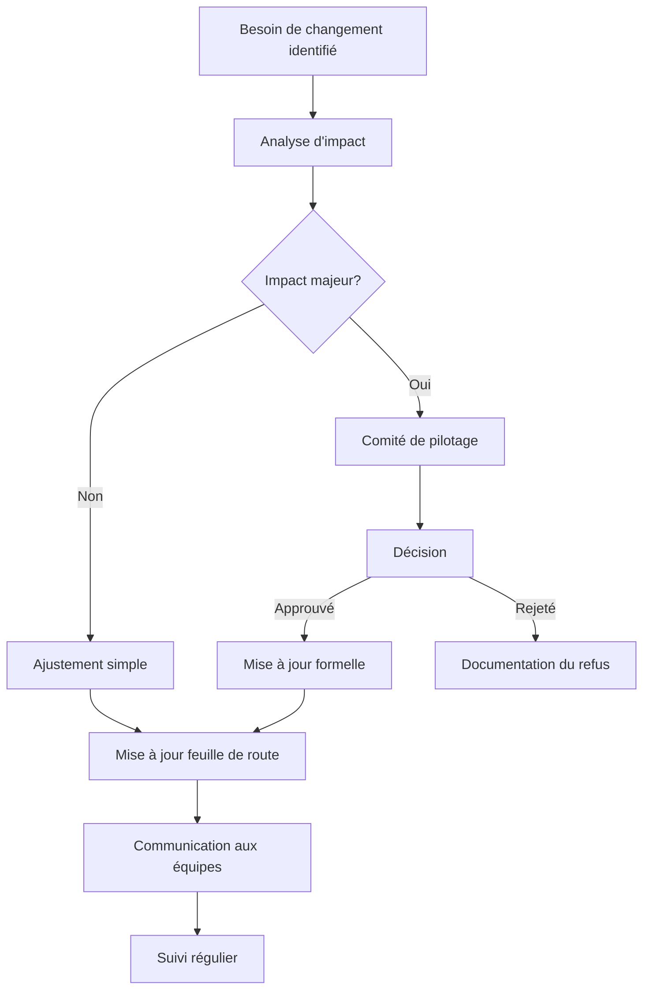

# Feuille de route du projet

## 🧭 Vue d'ensemble

Cette feuille de route présente une vision structurée et fiable de l'avancement du projet, avec une priorisation intelligente des tâches et une garantie de cohérence du système à chaque étape.

## 🏗️ Structure de la feuille de route

### Principes d'organisation

La feuille de route est organisée par phases et jalons, avec trois niveaux de détail:

1. **Phases majeures**: Division temporelle et logique du projet
2. **Jalons clés**: Points de décision et de validation
3. **Blocs de travail**: Groupes de tâches cohérentes et priorisées

Cette approche garantit:
- Une vision complète de bout en bout
- Des points de synchronisation réguliers
- Une flexibilité contrôlée dans l'exécution
- Une gestion claire des interdépendances

## 📋 Phases et jalons du projet

### Phase 1: Préparation et analyse (M1-M2)

**Objectif**: Établir les fondations techniques et cartographier le système existant.

| Jalon | Livrable | Critères de validation | Date |
|-------|----------|------------------------|------|
| 1.1 | Environnement monorepo configuré | CI/CD fonctionnel, tests initiaux | M1 S2 |
| 1.2 | Cartographie du système legacy | Schéma DB complet, dépendances identifiées | M1 S3 |
| 1.3 | Plan détaillé de migration | Validé par toutes les parties prenantes | M2 S1 |
| 1.4 | Prototype de migration | Migration réussie d'un module simple | M2 S3 |

**Blocs de travail priorisés**:
1. Configuration de l'infrastructure (infra-team)
2. Analyse du codebase existant (analyse-team)
3. Définition de l'architecture cible (archi-team)
4. Mise en place des pipelines IA (ai-team)

### Phase 2: Migration fondamentale (M3-M5)

**Objectif**: Migrer les modules critiques et établir les patterns principaux.

| Jalon | Livrable | Critères de validation | Date |
|-------|----------|------------------------|------|
| 2.1 | Schéma de base de données migré | Validation complète par DBA | M3 S2 |
| 2.2 | Migration module Authentification | Tests E2E réussis, compatibilité SSO | M3 S4 |
| 2.3 | Migration module Produits | Catalogue fonctionnel, SEO validé | M4 S2 |
| 2.4 | Migration module Panier | Processus d'achat fonctionnel | M5 S1 |

**Blocs de travail priorisés**:
1. Migration schéma DB (data-team)
2. Moteur d'auth NestJS (auth-team)
3. API produits et composants Remix (product-team)
4. Processus de transaction (transaction-team)

### Phase 3: Migration complète et optimisation (M6-M9)

**Objectif**: Finaliser la migration des modules secondaires et optimiser les performances.

| Jalon | Livrable | Critères de validation | Date |
|-------|----------|------------------------|------|
| 3.1 | Migration dashboard admin | Toutes fonctionnalités administratives | M6 S2 |
| 3.2 | Migration modules secondaires | Complétion 100% | M7 S3 |
| 3.3 | Optimisation des performances | Métriques cibles atteintes | M8 S2 |
| 3.4 | Tests finaux et stabilisation | Zéro régression | M9 S1 |

**Blocs de travail priorisés**:
1. Interface d'administration (admin-team)
2. Modules secondaires (feature-teams)
3. Optimisation et caching (perf-team)
4. Tests automatisés et QA (qa-team)

### Phase 4: Déploiement et transition (M10-M12)

**Objectif**: Mise en production progressive et transfert de connaissance.

| Jalon | Livrable | Critères de validation | Date |
|-------|----------|------------------------|------|
| 4.1 | Plan de déploiement finalisé | Validation DevOps et Business | M10 S1 |
| 4.2 | Mise en production progressive | 20% → 50% → 100% du trafic | M10-M11 |
| 4.3 | Documentation complète | Revue technique complète | M11 S3 |
| 4.4 | Formation équipes maintenance | Évaluation des compétences | M12 S2 |

**Blocs de travail priorisés**:
1. Stratégie de déploiement (devops-team)
2. Monitoring et alerting (ops-team)
3. Documentation technique (doc-team)
4. Formations et transfert (training-team)

## 🧠 Principes de priorisation

La priorisation des tâches suit une méthodologie structurée:

### Matrice de priorisation

```
Haute ┌────────────┬────────────┐
      │            │            │
      │ Importante │  Critique  │
      │ mais non   │    et      │
 V    │  urgente   │  urgente   │
 a    ├────────────┼────────────┤
 l    │            │            │
 e    │  Faible    │ Urgente    │
 u    │ priorité   │ mais moins │
 r    │            │ importante │
Basse └────────────┴────────────┘
        Basse      Urgence    Haute
```

### Facteurs de priorisation

Chaque tâche est évaluée selon ces facteurs:
1. **Dépendances techniques** - Ce qui est pré-requis pour d'autres tâches
2. **Impact utilisateur** - Valeur apportée aux utilisateurs
3. **Risque technique** - Complexité et incertitude
4. **Cohérence du système** - Maintien de l'intégrité globale
5. **Ressources disponibles** - Capacité de l'équipe

## 🔄 Gestion des changements et adaptations

### Processus de mise à jour de la feuille de route



### Règles d'adaptation

1. **Zone de flexibilité** - Chaque jalon inclut une marge de manœuvre définie
2. **Seuils d'escalade** - Critères clairs pour remonter les déviations significatives
3. **Revue périodique** - Évaluation bimensuelle de la pertinence de la feuille de route
4. **Gestion des dépendances** - Ajustement coordonné entre équipes interdépendantes

## 📊 Suivi et visibilité

### Tableau de bord de progression

Un tableau de bord en temps réel présente:
- Progression par phase et par jalon
- Vélocité des équipes
- Risques identifiés et statut de mitigation
- Prévisions basées sur les données historiques

### Métriques de suivi

| Métrique | Cible | Fréquence |
|----------|-------|-----------|
| Adhérence à la feuille de route | >90% | Hebdomadaire |
| Vélocité par équipe | Stable/Croissante | Bimensuelle |
| Dette technique accumulée | <10% | Mensuelle |
| Taux de complétion des jalons | 100% | À chaque jalon |

## 🛠️ Outils supports

Pour garantir la fiabilité de la feuille de route:

1. **Système de gestion de projet** - JIRA avec tableaux personnalisés
2. **Automation** - Génération de rapports et alertes automatiques
3. **Documentation vivante** - Mise à jour automatique via intégration GitHub
4. **Intelligence collective** - Processus de feedback continu des équipes

> [!DECISION]  
> ## Décision: Adoption d'une feuille de route structurée en phases et jalons
> 
> **Date:** 2023-12-01  
> **Statut:** Accepté  
> **Contexte:** Besoin d'une vision claire et fiable pour guider le projet de migration
> 
> **Options considérées:**
> 1. Planning détaillé fixe
> 2. Approche agile sans planification à long terme
> 3. Structure hybride par phases et jalons avec flexibilité contrôlée
> 
> **Décision:** Adopter l'option 3 avec une feuille de route à 4 phases et jalons mesurables
> 
> **Conséquences:** 
> - Définition claire des objectifs par phase
> - Points de synchronisation réguliers via les jalons
> - Flexibilité maintenue dans l'exécution des blocs de travail
> 
> **Métriques de validation:** 
> - Adhérence à la feuille de route >90%
> - Prévisibilité améliorée des livraisons
> - Réduction des conflits de dépendances entre équipes
