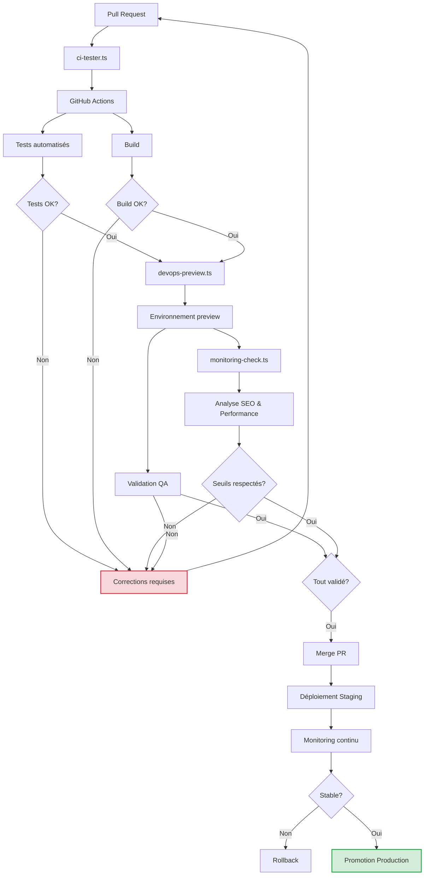

# 🚀 Phase 6 – CI/CD & Monitoring

## 🎯 Objectif

Assurer une intégration continue, un déploiement progressif sécurisé et une surveillance proactive de l'application migrée. Cette phase permet de garantir la qualité, la stabilité et la performance post-déploiement.

## 🧠 Agents utilisés

| Agent | Rôle | Sorties générées |
|-------|------|------------------|
| `ci-tester.ts` | Déclenche les pipelines GitHub Actions pour automatiser les tests, builds et déploiements | `.github/workflows/ci-migration.yml` |
| `devops-preview.ts` | Crée des environnements de prévisualisation Docker/Coolify/Supabase/Caddy pour chaque PR | `preview_url`, `docker-preview.env` |
| `monitoring-check.ts` | Analyse le SEO, les routes critiques, les Core Web Vitals et le temps de réponse | `monitoring_report.json`, `seo_score.md` |

## 📊 Vue d'ensemble du processus CI/CD



## 🔄 Étapes CI/CD intégrées

✅ Build & test automatiques sur chaque PR

✅ Preview auto-déployée pour QA et revue métier

✅ Analyse SEO et monitoring déclenchés post-preview

✅ Vérification différée de disponibilité et erreurs HTTP sur routes migrées

## 🔍 Détail des agents CI/CD

### Agent `ci-tester.ts`

Cet agent configure et déclenche les pipelines GitHub Actions pour automatiser les tests, builds et déploiements.

#### Exemple de workflow GitHub Actions généré

```yaml
# .github/workflows/ci-migration.yml
name: Migration CI/CD Pipeline

on:
  pull_request:
    branches: [main, develop]
    paths:
      - 'apps/**'
      - 'packages/**'
      - 'prisma/**'
      - '.github/workflows/ci-migration.yml'
  push:
    branches: [main, develop]
    tags:
      - 'migration-batch-*'

jobs:
  validate:
    name: Validate
    runs-on: ubuntu-latest
    steps:
      - uses: actions/checkout@v3
      
      - name: Setup Node.js
        uses: actions/setup-node@v3
        with:
          node-version: '18'
          cache: 'npm'
      
      - name: Install dependencies
        run: npm ci
      
      - name: Lint
        run: npm run lint
      
      - name: Type check
        run: npm run typecheck
      
      - name: Run unit tests
        run: npm run test
      
  build:
    name: Build
    needs: validate
    runs-on: ubuntu-latest
    steps:
      - uses: actions/checkout@v3
      
      - name: Setup Node.js
        uses: actions/setup-node@v3
        with:
          node-version: '18'
          cache: 'npm'
      
      - name: Install dependencies
        run: npm ci
      
      - name: Build applications
        run: npm run build
      
      - name: Upload build artifacts
        uses: actions/upload-artifact@v3
        with:
          name: build-artifacts
          path: |
            apps/backend/dist
            apps/frontend/build
  
  preview:
    name: Deploy Preview
    if: github.event_name == 'pull_request'
    needs: build
    runs-on: ubuntu-latest
    outputs:
      preview_url: ${{ steps.deploy_preview.outputs.preview_url }}
    steps:
      - uses: actions/checkout@v3
      
      - name: Download build artifacts
        uses: actions/download-artifact@v3
        with:
          name: build-artifacts
      
      - name: Setup Preview Environment
        id: deploy_preview
        run: node scripts/devops-preview.ts
        env:
          COOLIFY_TOKEN: ${{ secrets.COOLIFY_TOKEN }}
          SUPABASE_URL: ${{ secrets.SUPABASE_URL }}
          SUPABASE_KEY: ${{ secrets.SUPABASE_KEY }}
          PR_NUMBER: ${{ github.event.pull_request.number }}
      
      - name: Comment PR with preview URL
        uses: actions/github-script@v6
        with:
          script: |
            const previewUrl = process.env.PREVIEW_URL;
            github.rest.issues.createComment({
              issue_number: context.issue.number,
              owner: context.repo.owner,
              repo: context.repo.repo,
              body: `🚀 Preview environment deployed at: ${previewUrl}`
            })
        env:
          PREVIEW_URL: ${{ steps.deploy_preview.outputs.preview_url }}

  monitor:
    name: Monitor Preview
    needs: preview
    runs-on: ubuntu-latest
    steps:
      - uses: actions/checkout@v3
      
      - name: Wait for deployment to stabilize
        run: sleep 60
      
      - name: Run monitoring checks
        id: monitoring
        run: node scripts/monitoring-check.ts
        env:
          TARGET_URL: ${{ needs.preview.outputs.preview_url }}
      
      - name: Check SEO and performance thresholds
        if: steps.monitoring.outputs.status == 'failed'
        run: |
          echo "🔴 Monitoring checks failed! See the report for details."
          cat monitoring_report.json
          exit 1
      
      - name: Upload monitoring reports
        uses: actions/upload-artifact@v3
        with:
          name: monitoring-reports
          path: |
            monitoring_report.json
            seo_score.md

  staging:
    name: Deploy to Staging
    if: github.event_name == 'push' && (github.ref == 'refs/heads/main' || github.ref == 'refs/heads/develop')
    needs: [build, monitor]
    runs-on: ubuntu-latest
    steps:
      - uses: actions/checkout@v3
      
      - name: Download build artifacts
        uses: actions/download-artifact@v3
        with:
          name: build-artifacts
      
      - name: Deploy to Staging
        run: node scripts/deploy-staging.js
        env:
          DEPLOY_TOKEN: ${{ secrets.DEPLOY_TOKEN }}
      
      - name: Run post-deployment checks
        run: node scripts/monitoring-check.ts --mode=production
        env:
          TARGET_URL: ${{ secrets.STAGING_URL }}

  # Blocage automatique si seuils non respectés
  quality-gate:
    name: Quality Gate
    needs: monitor
    runs-on: ubuntu-latest
    if: ${{ always() }}
    steps:
      - name: Check if monitoring failed
        if: needs.monitor.result == 'failure'
        uses: actions/github-script@v6
        with:
          script: |
            const message = `⛔ **Quality Gate Failed**
            
            The monitoring checks for this PR have failed. Please review the monitoring report for details.
            
            Common issues:
            - Core Web Vitals degraded
            - 404/500 errors on critical routes
            - SEO score below threshold
            
            This PR cannot be merged until these issues are resolved.`;
            
            github.rest.issues.createComment({
              issue_number: context.issue.number,
              owner: context.repo.owner,
              repo: context.repo.repo,
              body: message
            });
            
            core.setFailed('Quality gate failed');
```

### Agent `devops-preview.ts`

Cet agent crée des environnements de prévisualisation éphémères pour chaque Pull Request.

#### Fonctionnalités

- Création d'instances Docker isolées pour chaque PR
- Configuration automatique de Coolify pour le déploiement
- Provisionnement d'une base de données Supabase temporaire
- Configuration d'un proxy Caddy avec les règles de redirection SEO

#### Exemple de configuration Docker générée

```dotenv
# docker-preview.env
COMPOSE_PROJECT_NAME=preview-pr-123
DATABASE_URL=postgresql://postgres:password@db:5432/preview_db
REDIS_URL=redis://redis:6379
API_URL=http://api:3000
FRONTEND_URL=http://web:4000
PR_NUMBER=123
GIT_COMMIT=a1b2c3d4e5f6g7h8i9j0
PREVIEW_EXPIRY=7d
SUPABASE_URL=https://abcdefghijklm.supabase.co
SUPABASE_KEY=eyJhbGciOiJIUzI1NiIsInR5cCI6IkpXVCJ9...
```

#### Exemple de configuration Caddy

