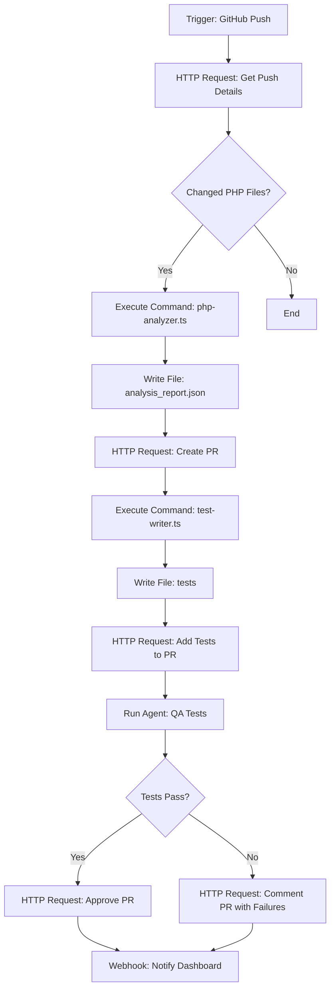
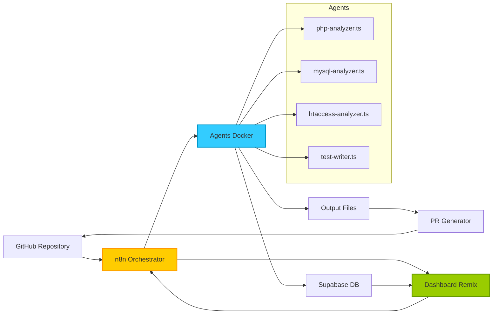

# 🧠 A. Architecture du Pipeline IA

## 🎯 Objectif

Mettre en place un pipeline intelligent, modulaire et déclenchable orchestré par n8n, permettant de piloter la migration PHP vers NestJS/Remix de manière automatisée, traçable et sécurisée.

## 🔁 Étape 1 — Orchestration via n8n

### 🔹 Déclencheurs possibles

| Déclencheur | Utilité |
|-------------|---------|
| Cron Job | Lancer automatiquement les audits à intervalles réguliers |
| Push GitHub | Sur la branche legacy-integration, pour chaque nouveau commit ou PR |
| Action Manuelle | Démarrage à la demande depuis le dashboard ou l'interface Remix |

### 🔸 Nœuds clés dans le workflow n8n

| Nœud n8n | Rôle |
|----------|------|
| Execute Command | Lance des scripts comme php-analyzer.ts, mysql-analyzer.ts, etc. |
| Run Agent | Exécute un agent dans un conteneur Docker dédié |
| HTTP Request | Intéragit avec l'API GitHub via MCP (pull request, tags, diff, etc.) |
| Read File | Lit les fichiers .php, .sql, .htaccess, etc. depuis le FS |
| Write File | Écrit les rapports .audit.md, .json, .patch.prisma dans /output |

## 🔍 Exemple de workflow n8n



## 🧩 Astuces & Optimisations Avancées

- **Isolation via conteneur Docker par agent** : permet de scaler horizontalement chaque analyse.

- **MCP (Model Context Protocol)** : ajoute des métadonnées à chaque appel pour le suivi centralisé.

- **Déclencheur branché sur GitHub App** : pour sécuriser les pushs et avoir un audit par PR.

- **Tags automatiques par module métier** à chaque rapport généré (via Write File).

- **Ajout d'un Webhook audit_report_generated** : permet l'auto-mise à jour du dashboard Notion / Remix.

## 📊 Architecture complète du pipeline



## 🛠️ Configuration exemple de n8n

```json
{
  "name": "PHP to NestJS Migration Pipeline",
  "nodes": [
    {
      "parameters": {
        "rule": {
          "interval": [
            {
              "field": "hours",
              "minutesFixed": 0,
              "hoursInterval": 6
            }
          ]
        }
      },
      "name": "Schedule Trigger",
      "type": "n8n-nodes-base.scheduleTrigger",
      "position": [
        250,
        300
      ]
    },
    {
      "parameters": {
        "options": {
          "ownEvents": true
        },
        "owner": "{{$env.GITHUB_OWNER}}",
        "repository": "{{$env.GITHUB_REPO}}",
        "events": [
          "push"
        ],
        "branchFilter": "legacy-integration"
      },
      "name": "GitHub Trigger",
      "type": "n8n-nodes-base.githubTrigger",
      "position": [
        250,
        500
      ]
    },
    {
      "parameters": {
        "command": "cd {{$env.PROJECT_PATH}} && node scripts/analysis/php-analyzer.ts --dir={{$node[\"GitHub Trigger\"].json[\"head_commit\"][\"modified\"][0]}}"
      },
      "name": "Execute PHP Analyzer",
      "type": "n8n-nodes-base.executeCommand",
      "position": [
        500,
        500
      ]
    },
    {
      "parameters": {
        "filePath": "{{$env.PROJECT_PATH}}/output/{{$json[\"module\"]}}.audit.md",
        "fileName": "{{$json[\"module\"]}}.audit.md",
        "fileContent": "{{$json[\"report\"]}}",
        "options": {
          "encoding": "utf8",
          "append": false
        }
      },
      "name": "Write Analysis Report",
      "type": "n8n-nodes-base.writeFile",
      "position": [
        750,
        500
      ]
    },
    {
      "parameters": {
        "dockerImage": "migration-agents:latest",
        "command": "test-writer.ts",
        "arguments": "--input={{$json[\"module\"]}}.audit.md --output={{$json[\"module\"]}}.spec.ts",
        "environmentVariables": {
          "MCP_CONTEXT_ID": "{{$execution.id}}",
          "MCP_MODULE": "{{$json[\"module\"]}}",
          "MCP_AGENT": "test-writer"
        }
      },
      "name": "Run Test Generator",
      "type": "n8n-nodes-docker.dockerRun",
      "position": [
        1000,
        500
      ]
    }
  ],
  "connections": {
    "GitHub Trigger": {
      "main": [
        [
          {
            "node": "Execute PHP Analyzer",
            "type": "main",
            "index": 0
          }
        ]
      ]
    },
    "Execute PHP Analyzer": {
      "main": [
        [
          {
            "node": "Write Analysis Report",
            "type": "main",
            "index": 0
          }
        ]
      ]
    },
    "Write Analysis Report": {
      "main": [
        [
          {
            "node": "Run Test Generator",
            "type": "main",
            "index": 0
          }
        ]
      ]
    }
  }
}
```

## 🔒 Sécurité et traçabilité

Le pipeline intègre plusieurs fonctionnalités pour garantir la sécurité et la traçabilité:

1. **Authentification GitHub App** pour les opérations Git avec permissions limitées
2. **Traçabilité MCP** avec ID unique pour chaque exécution
3. **Isolation Docker** pour éviter les problèmes de dépendances croisées
4. **Journalisation centralisée** de toutes les actions effectuées
5. **Déclencheurs à validation multiple** pour les opérations critiques

Cette architecture modulaire permet non seulement d'automatiser la migration, mais aussi de garantir sa fiabilité, sa traçabilité et sa réversibilité à chaque étape du processus.
