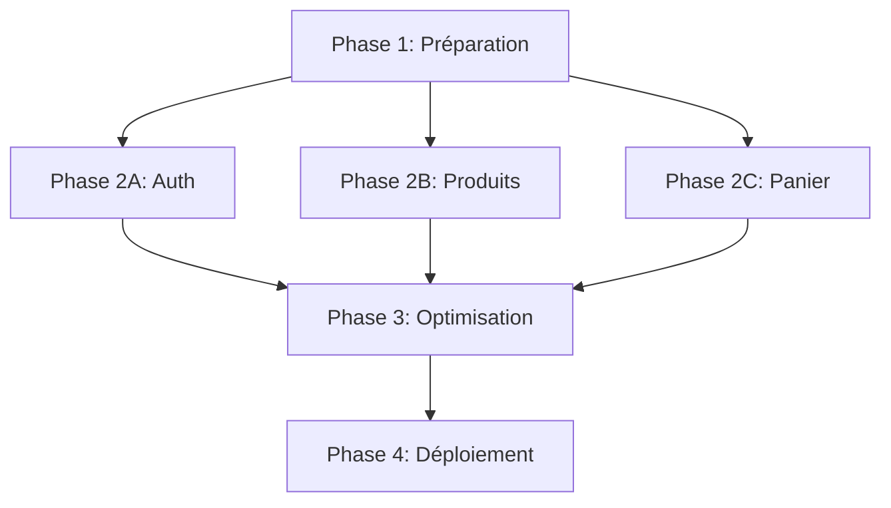
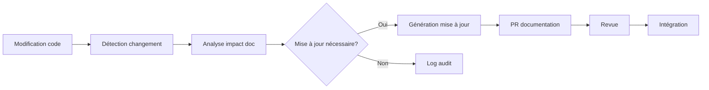

# Principes fondamentaux

## 🎯 Vision générale

Ce cahier des charges est conçu selon trois principes cardinaux - **Lisible**, **Actionnable**, **Traçable** - garantissant que la documentation reste un outil vivant et efficace tout au long du projet.

## 📖 Lisibilité

### Conception pour tous les publics

- **Langage clair** - Termes techniques expliqués, jargon limité
- **Structure progressive** - Du concept général aux détails techniques
- **Multiformat** - Markdown pour développeurs, HTML/PDF pour autres parties prenantes
- **Visualisations** - Diagrammes et schémas pour les concepts complexes

### Navigation intuitive

- **Sommaire dynamique** - Automatiquement mis à jour à chaque changement
- **Liens contextuels** - Références croisées entre sections interdépendantes
- **Recherche avancée** - Indexation complète du contenu
- **Hiérarchie visuelle** - Structure claire avec niveaux de titres cohérents

## 🔧 Actionnabilité

### Orienté implémentation

- **Critères d'acceptation explicites** - Pour chaque exigence
- **Exemples concrets** - Code, configurations, structures de données
- **Checklist d'implémentation** - Étapes claires pour les développeurs
- **Définition technique complète** - Tous les détails nécessaires pour l'implémentation

### Facilitation des décisions

- **Options clairement présentées** - Avantages/inconvénients documentés
- **Métriques de succès** - KPIs et objectifs mesurables
- **Priorisation explicite** - Distinction claire entre must-have et nice-to-have
- **Arbres de décision** - Guide pour les choix techniques conditionnels

## 🔍 Traçabilité

### Historique complet

- **Versionnement sémantique** - Chaque version du cahier des charges
- **Changelog détaillé** - Toutes les modifications avec justifications
- **Attribution** - Qui a proposé, validé et implémenté chaque élément
- **Lien avec le code** - Références directes aux commits et PRs

### Chaîne de validation

- **Signature numérique** - Pour chaque version officielle
- **Processus d'approbation** - Documenté pour chaque section majeure
- **Matrice de conformité** - Vérification de l'implémentation vs spécification
- **Audit trail** - Historique complet des révisions et validations

## 🧩 Indépendance des phases

### Architecture modulaire

- **Chaque phase est indépendante**, ce qui permet d'itérer sans tout bloquer
- **Dépendances clairement identifiées** entre phases et modules
- **Interfaces stables** définies entre les composants
- **Contrats d'API** formalisés pour garantir la compatibilité

### Avancement parallèle

- **Équipes autonomes** sur différentes phases simultanément
- **Points de synchronisation** définis et limités
- **Stratégie de feature flags** pour intégration progressive
- **Tests d'intégration automatisés** entre modules indépendants

## 🔄 Automatisation de la documentation

### Mise à jour continue

- **Chaque ajout dans le projet déclenche automatiquement une mise à jour du cahier des charges**
- **Extractions automatiques** depuis le code (commentaires, types, schémas)
- **Rapports de conformité** générés à chaque intégration continue
- **Alertes d'incohérence** en cas de divergence code/documentation

### Workflow de documentation

- **Agents IA** analysant les changements de code pour suggestions de documentation
- **Génération de templates** pour nouvelles fonctionnalités
- **Vérification de cohérence** entre implémentation et exigences
- **Intégration CI/CD** pour validations constantes

## 🌟 Mise en pratique

Ces principes ne sont pas seulement théoriques, mais implémentés techniquement:

| Principe | Implémentation technique | Vérification |
|----------|--------------------------|--------------|
| Lisibilité | Linters Markdown, diagrammes auto-générés | `verify-readability.sh` |
| Actionnabilité | Templates d'exigences, checklists intégrées | `check-actionability.sh` |
| Traçabilité | Hooks Git, métadonnées JSON | `verify-traceability.sh` |
| Indépendance | Graphes de dépendances, validation d'interfaces | `validate-dependencies.sh` |
| Automatisation | Workflows GitHub, webhooks, scripts n8n | Logs d'exécution |

> [!NOTE]
> Ces scripts de vérification sont exécutés automatiquement à chaque modification du cahier des charges pour garantir l'adhérence continue à ces principes fondamentaux.
