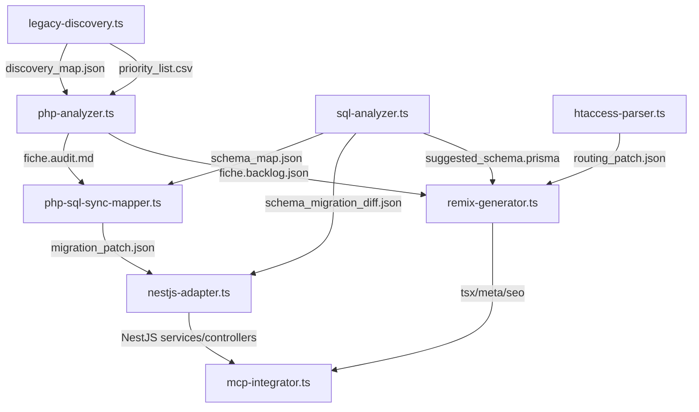

# 🤖 Phase A — Étape 2 : Agents IA du Pipeline

## 🎯 Objectif général

Orchestrer les agents spécialisés IA chargés d'analyser, transformer, synchroniser et migrer le code legacy PHP/MySQL vers une architecture moderne NestJS/Remix + Prisma/PostgreSQL.

## 🧩 Liste des Agents, Rôles & Échanges

| Agent | Objectif | Entrées | Sorties |
|-------|----------|---------|---------|
| `legacy-discovery.ts` | Identifier et prioriser les fichiers à migrer selon : complexité, usage, SEO | `/legacy/src/` | `discovery_map.json`, `priority_list.csv` |
| `php-analyzer.ts` | Auditer la logique métier, dépendances et SQL de chaque fichier PHP | Fichier `.php` | `fiche.audit.md`, `fiche.backlog.json`, `fiche.impact_graph.json` |
| `sql-analyzer.ts` | Extraire et convertir le schéma MySQL vers PostgreSQL/Prisma | `mysql.sql` | `schema_map.json`, `schema_migration_diff.json`, `suggested_schema.prisma` |
| `php-sql-sync-mapper.ts` | Associer les champs SQL à leur usage réel dans le code PHP | `.php`, `schema_map.json` | `migration_patch.json`, mise à jour de `*.audit.md` |
| `htaccess-parser.ts` | Extraire les routes, directives SEO, redirections et restrictions | `.htaccess` | `htaccess_map.json`, `routing_patch.json`, `seo_routes.audit.md` |
| `remix-generator.ts` | Générer les routes Remix (.tsx) + SEO + redirections à partir des audits PHP | `.php`, `*.audit.md`, `*.prisma` | `*.tsx`, `meta.ts`, `301.redirect`, `seo_meta.json` |
| `nestjs-adapter.ts` | Générer services, DTO, controllers NestJS | `fiche.audit.md`, `schema_migration_diff.json` | `*.service.ts`, `*.dto.ts`, `*.controller.ts` |
| `mcp-integrator.ts` | Commits, branches, PRs GitHub via MCP avec métadonnées de migration | Fichiers générés | PR GitHub, commit avec MCP:meta |

## 🗂️ Diagramme de Flux – Dépendances Agents IA



## 🔍 Détail des agents

### Agent `legacy-discovery.ts`

Effectue une analyse initiale du code legacy pour identifier et prioriser les fichiers à migrer.

**Fonctionnalités:**
- Scan récursif des répertoires PHP
- Calcul de métriques de complexité et d'usage
- Identification des points d'entrée critiques (SEO, transactions)
- Priorisation basée sur l'impact métier et la complexité technique

**Exemple de sortie:**

```json
// discovery_map.json (extrait)
{
  "scanInfo": {
    "timestamp": "2025-04-07T10:23:45Z",
    "totalFiles": 327,
    "totalPhpFiles": 284,
    "totalDirectories": 43
  },
  "modules": [
    {
      "name": "catalog",
      "path": "/legacy/src/catalog",
      "files": [
        {
          "path": "/legacy/src/catalog/product.php",
          "sizeBytes": 12480,
          "complexity": {
            "cyclomaticComplexity": 24,
            "cognitiveComplexity": 32,
            "linesOfCode": 457
          },
          "seoImpact": "high",
          "businessImpact": "critical",
          "dependencies": [
            "/legacy/src/database/db_connect.php",
            "/legacy/src/utils/format.php"
          ],
          "usedTables": ["products", "categories", "product_images"],
          "priority": 1
        }
      ]
    }
  ]
}
```

### Agent `php-analyzer.ts`

Analyse en profondeur chaque fichier PHP pour en extraire la logique métier, les dépendances SQL et générer un audit détaillé.

**Fonctionnalités:**
- Extraction des blocs logiques métier
- Identification des requêtes SQL et validation syntaxique
- Détection des vulnérabilités (injection SQL, XSS)
- Cartographie des dépendances internes et externes

**Exemple de sortie:**

```markdown
# Audit Technique: product.php

## Métriques

| Métrique | Valeur | Impact |
|----------|--------|--------|
| Complexité cyclomatique | 24 | ⚠️ Élevé |
| Lignes de code | 457 | Moyen |
| Dépendances | 2 | Faible |
| Vulnérabilités | 3 | 🔴 Critique |

## Vulnérabilités détectées

- 🔴 **Injection SQL** (ligne 45): Utilisation directe de $_GET['id'] sans échappement
- 🟠 **XSS potentiel** (ligne 102): Affichage non échappé de données utilisateur
- 🟠 **Requête non paramétrée** (ligne 78): Concaténation directe dans requête

## Blocs Métier Identifiés

### 1. Récupération données produit

```php
// Récupération des données produit
$product_id = $_GET['id'];
$query = "SELECT * FROM products WHERE product_id = $product_id";
$result = mysqli_query($conn, $query);
$product = mysqli_fetch_assoc($result);
```

### 2. Calcul prix avec promotion

```php
// Calcul du prix avec remises
$final_price = $product['price'];
if ($product['on_sale']) {
  $final_price = $product['price'] * (1 - $product['discount_percentage'] / 100);
}
```
```

### Agent `nestjs-adapter.ts`

Transforme les analyses PHP en composants NestJS (services, contrôleurs, DTOs).

**Exemple de sortie:**

```typescript
// service.ts généré
import { Injectable, NotFoundException } from '@nestjs/common';
import { PrismaService } from '../prisma/prisma.service';
import { CreateProductDto } from './dto/create-product.dto';
import { UpdateProductDto } from './dto/update-product.dto';

@Injectable()
export class ProductsService {
  constructor(private prisma: PrismaService) {}

  async findAll() {
    return this.prisma.product.findMany({
      include: {
        category: true,
        images: true
      }
    });
  }

  async findOne(id: number) {
    const product = await this.prisma.product.findUnique({
      where: { id },
      include: {
        category: true,
        images: true
      }
    });
    
    if (!product) {
      throw new NotFoundException(`Product with ID ${id} not found`);
    }
    
    return product;
  }

  // Logique de calcul de prix avec promotion
  calculateFinalPrice(product: any) {
    if (product.onSale) {
      return product.price * (1 - product.discountPercentage / 100);
    }
    return product.price;
  }
}
```

## 🧠 Recommandations stratégiques

1. **Standardisation des Entrées/Sorties** : Tous les agents doivent produire des fichiers avec un schéma JSON strict, versionné et traçable.

2. **MCP-Ready** : Chaque sortie doit contenir un bloc meta pour être intégrée automatiquement par MCP (identifiants, timestamp, auteur, etc.).

3. **Fallback en CSV/Markdown** : Pour les fichiers critiques (`priority_list.csv`, `*.audit.md`), prévoir une version Markdown lisible humain.

## 📚 Documentation recommandée (structure type)

```yaml
agent: php-analyzer.ts
version: 1.3.0
description: Analyse un fichier PHP et génère un audit structuré
inputs:
  - file: chemin absolu du fichier PHP
outputs:
  - fiche.audit.md
  - fiche.backlog.json
  - fiche.impact_graph.json
dependencies: [legacy-discovery.ts, sql-analyzer.ts]
usage_example: >
  npx tsx agents/php-analyzer.ts legacy/src/cart.php
```

## 🔄 Chaînage des agents et orchestration

Pour optimiser le processus de migration, les agents sont chaînés et orchestrés via n8n:

1. **Déclenchement initial**: L'agent `legacy-discovery.ts` scanne le projet complet
2. **Priorisation**: Les fichiers sont triés par priorité dans `priority_list.csv`
3. **Analyse séquentielle**: Chaque fichier est analysé par `php-analyzer.ts`
4. **Enrichissement**: Les analyses sont enrichies par `sql-analyzer.ts` et `htaccess-parser.ts`
5. **Génération**: Le code NestJS et Remix est généré
6. **Intégration**: Les fichiers sont committés et des PR sont créées

Cette approche modulaire permet:
- Un traitement parallèle des fichiers indépendants
- Une répartition de la charge entre plusieurs machines
- Un suivi précis de l'avancement par module
- Une flexibilité pour ajouter de nouveaux agents sans perturber le flux

## 🧪 Tests des agents

Chaque agent possède une suite de tests automatisés:

```typescript
// Exemple de test unitaire pour php-analyzer.ts
import { expect, test, describe } from 'vitest';
import { analyzePhpFile } from '../agents/php-analyzer';

describe('php-analyzer', () => {
  test('détecte correctement les injections SQL', async () => {
    const result = await analyzePhpFile('./fixtures/vulnerable_query.php');
    expect(result.vulnerabilities).toHaveLength(1);
    expect(result.vulnerabilities[0].type).toBe('sql_injection');
  });

  test('extrait correctement les tables SQL utilisées', async () => {
    const result = await analyzePhpFile('./fixtures/product_query.php');
    expect(result.usedTables).toContain('products');
    expect(result.usedTables).toContain('categories');
  });
});
```

Cette architecture d'agents spécialisés permet une migration progressive, traçable et maintenable du code legacy vers une architecture moderne.
