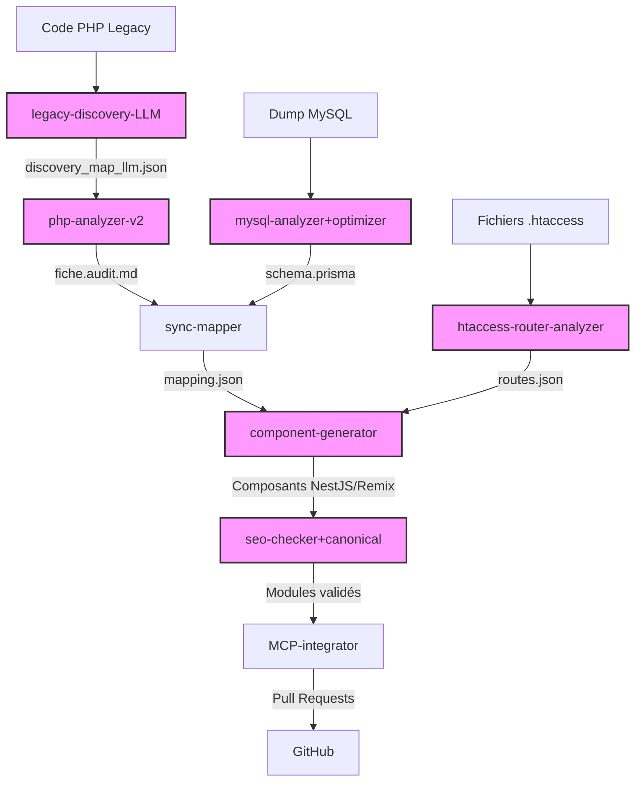

# 🧠 Pipeline IA amélioré pour la migration PHP → NestJS + Remix

## 📝 Vue d'ensemble

Pour optimiser le processus de migration du code PHP legacy vers l'architecture moderne NestJS/Remix, nous avons conçu un pipeline d'agents IA améliorés. Cette version intègre des outils d'analyse plus avancés, des techniques d'apprentissage automatique et une meilleure orchestration.

## 🤖 Agents IA améliorés

| Agent | Objectif | Recommandation avancée |
|-------|----------|------------------------|
| `legacy-discovery-LLM` | Prioriser les fichiers PHP selon complexité, fréquence, SEO | Analyse statique + logs d'accès |
| `php-analyzer-v2` | Audit logique métier + SQL + dépendances | PHPStan, Psalm |
| `mysql-analyzer+optimizer` | Génération + optimisation du schéma Prisma | prisma db pull, typage fort |
| `sync-mapper` | Mapping entre anciens champs PHP et Prisma | Automatisé avec conventions |
| `htaccess-router-analyzer` | Convertir les règles .htaccess vers Remix/NestJS | Parser et générateur TS |
| `component-generator` | Génération standardisée de modules Remix/NestJS | Templates personnalisés |
| `seo-checker+canonical` | Génération de balises SEO, validation SEO | Lighthouse, Canonical auto |
| `MCP-integrator` | Automatiser PRs, branches, CI/CD GitHub | GitHub Actions, PullRequest Auto |

## 🔍 Détail des améliorations

### Agent `legacy-discovery-LLM`

Version améliorée de l'agent de découverte initial intégrant des modèles de langage pour:

- Analyser la sémantique du code au-delà de l'analyse syntaxique
- Identifier les motifs de conception implicites dans le code legacy
- Corréler les fichiers PHP avec leur fréquence d'accès (logs)
- Optimiser la priorisation en fonction de l'impact SEO réel

```json
// Exemple de sortie enrichie: discovery_map_llm.json
{
  "scanInfo": {
    "timestamp": "2025-04-11T09:15:30Z",
    "modelVersion": "gpt-5-turbo",
    "totalFiles": 327,
    "totalPhpFiles": 284
  },
  "modules": [
    {
      "name": "catalog",
      "path": "/legacy/src/catalog",
      "semanticClusters": [
        {
          "name": "Product Management",
          "files": ["product.php", "inventory.php", "price.php"],
          "businessValue": 0.92,
          "accessFrequency": "high",
          "seoImpact": 0.85,
          "migrationComplexity": "medium",
          "recommendedPriority": 1
        }
      ],
      "codeSmells": [
        {
          "type": "duplicate_sql_queries",
          "files": ["product.php", "inventory.php"],
          "recommendation": "Extraire en méthode commune dans service NestJS"
        }
      ]
    }
  ]
}
```

### Agent `php-analyzer-v2`

Version améliorée intégrant des outils professionnels d'analyse de code PHP:

- Intégration de PHPStan et Psalm pour l'analyse statique
- Détection avancée des vulnérabilités de sécurité (OWASP Top 10)
- Reconnaissance des patterns de conception implicites
- Extraction plus précise de la logique métier

```markdown
# Audit Avancé: product.php

## Métriques d'analyse

| Métrique | Valeur | Interprétation |
|----------|--------|----------------|
| Complexité cyclomatique | 24 | ⚠️ Élevé (> 15) |
| Score de maintenabilité | 62/100 | 🟠 Moyen |
| Dette technique | 4.2j | Temps estimé d'optimisation |
| Couverture potentielle | 78% | Estimation testabilité |

## Analyse PHPStan/Psalm

- 🔴 **Niveau 7**: Paramètre `$product_id` utilisé sans validation de type (ligne 45)
- 🟠 **Niveau 5**: Variable `$result` potentiellement null non vérifiée (ligne 46)
- 🟠 **Niveau 3**: Chemin d'exécution où `$product` pourrait être null (ligne 102)

## Patterns de conception détectés

- 🔍 **Active Record implicite**: Le fichier product.php implémente un pattern Active Record non formalisé
- 🔍 **Singleton de connexion**: Utilisation d'un singleton de connexion à la DB
- ⚠️ **Métier/Présentation mélangés**: Logique métier et affichage non séparés

## Suggestions de migration

- ✅ Extraire la logique d'accès aux données dans un `ProductRepository`
- ✅ Séparer la logique de calcul prix dans un `PricingService`
- ✅ Implémenter validation d'entrée via DTO avec class-validator
```

### Agent `mysql-analyzer+optimizer`

Version améliorée pour la génération et l'optimisation du schéma Prisma:

- Utilisation de `prisma db pull` pour la génération initiale
- Optimisation automatique des index et relations
- Application de conventions de nommage cohérentes
- Suggestions d'amélioration des performances

```prisma
// schema.prisma optimisé
model Product {
  id                Int           @id @default(autoincrement()) @map("product_id")
  name              String        @db.VarChar(255)
  slug              String        @unique @db.VarChar(255)
  description       String?       @db.Text
  price             Decimal       @db.Decimal(10, 2)
  discountPercentage Float?        @map("discount_percentage") @db.Float
  onSale            Boolean       @default(false) @map("on_sale")
  stock             Int           @default(0)
  categoryId        Int?          @map("category_id")
  createdAt         DateTime      @default(now()) @map("created_at")
  updatedAt         DateTime      @updatedAt @map("updated_at")

  // Relations optimisées avec onDelete
  category          Category?     @relation(fields: [categoryId], references: [id], onDelete: SetNull)
  images            ProductImage[]
  orderItems        OrderItem[]

  // Indexes optimisés
  @@index([categoryId])
  @@index([onSale, price]) // Index composé pour requêtes de promotion
  @@index([createdAt]) // Pour tri chronologique

  @@map("products")
}

// Suggestions d'optimisation PostgreSQL:
// 1. Ajouter index GIN pour recherche fulltext sur description
// 2. Considérer une indexation partielle pour les produits en promotion
```

### Agent `htaccess-router-analyzer`

Version améliorée pour la conversion des règles Apache vers Remix/NestJS:

- Analyse sémantique des patterns de réécriture complexes
- Génération de route handlers équivalents en TypeScript
- Support des flags spéciaux (QSA, NC, L, etc.)
- Préservation des performances par optimisation des patterns

```tsx
// Exemples de routes Remix générées depuis .htaccess
// Règle source: RewriteRule ^product/([0-9]+)/([a-z0-9-]+)\.html$ product.php?id=$1&slug=$2 [L,QSA]

// Route générée: app/routes/product.$id.$slug.tsx
import { LoaderFunctionArgs, json } from "@remix-run/node";
import { useLoaderData } from "@remix-run/react";
import { getProduct } from "~/models/product.server";

export async function loader({ params, request }: LoaderFunctionArgs) {
  const { id, slug } = params;
  
  // Récupérer tous les paramètres additionnels (QSA flag équivalent)
  const url = new URL(request.url);
  const queryParams = Object.fromEntries(url.searchParams);
  
  const product = await getProduct(parseInt(id), { slug, ...queryParams });
  
  if (!product) {
    throw new Response("Not Found", { status: 404 });
  }
  
  return json({ product });
}

export default function ProductPage() {
  const { product } = useLoaderData<typeof loader>();
  
  return (
    <div>
      <h1>{product.name}</h1>
      {/* Contenu équivalent à la version PHP */}
    </div>
  );
}
```

## 🔄 Flux de travail amélioré



## 🚀 Interface de pilotage

Pour faciliter l'utilisation de ce pipeline, une interface de pilotage est disponible:

1. **Dashboard Remix**: Interface web permettant de:
   - Lancer des migrations spécifiques
   - Consulter l'état d'avancement
   - Visualiser les rapports d'analyse
   - Approuver/rejeter les suggestions

2. **CLI dans Codespaces**:
   ```bash
   # Lancer l'analyse d'un module
   npx migrate analyze --module=catalog
   
   # Générer les composants NestJS/Remix
   npx migrate generate --from=product.php
   
   # Vérifier le statut de migration
   npx migrate status
   ```

3. **GitHub Actions**:
   - Déclenchement automatique sur PR
   - Rapports de progression dans les commentaires
   - Validation avant merge

Cette approche améliorée permet d'automatiser davantage le processus de migration tout en maintenant un contrôle humain sur les décisions importantes, garantissant ainsi une transition fluide et de haute qualité vers l'architecture moderne.
