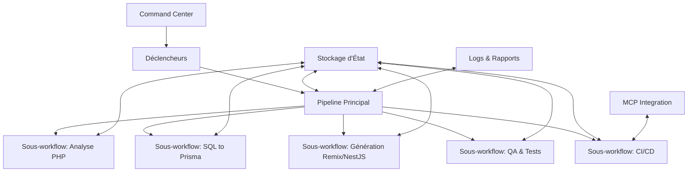
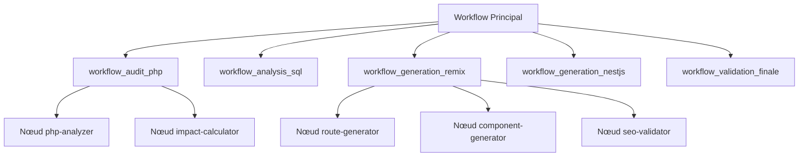
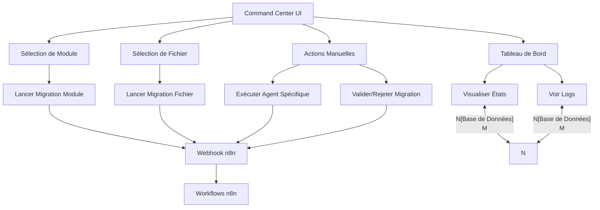

# 🔄 Orchestration avec n8n

## 🎯 Objectif

Automatiser, séquencer et superviser toutes les étapes de la migration (analyse, génération, QA, CI/CD), en déclenchant les agents via un pipeline graphique et traçable.

## 📊 Vue d'ensemble



## 🔧 Recommandations avancées

| Aspect | Bonne pratique | Résultat attendu |
|--------|----------------|-----------------|
| 🧩 Modularité | Décomposer en sous-workflows (ex. php-analysis, sql-to-prisma, seo-check) | Meilleure réutilisabilité, clarté du pipeline |
| 📌 Gestion d'état | Utiliser des noeuds de stockage (ex. Supabase, Notion, JSON File, Key/Value) pour tracer l'état d'un fichier ou d'un module | Suivi granulaire de l'avancement, gestion des erreurs fine |
| 📥 Déclencheurs intelligents | cron, webhook GitHub, bouton manuel, PR label (auto-migrate) | Orchestration souple et contextuelle |
| 📤 Journalisation | Logger les résultats de chaque étape dans un fichier Markdown ou .json horodaté | Auditabilité, reprise facile |
| 💥 Sécurité & isolation | Exécuter les agents critiques dans des conteneurs isolés (Run Command in Docker) | Éviter les effets de bord, sécuriser les traitements lourds |
| ⚙️ Intégration MCP | Utiliser un agent http pour interagir avec MCP (Pull Requests GitHub, commit, branche) | Boucle Git intégrée, zéro intervention manuelle |

## 🧠 Orchestration avec n8n – Stratégie Avancée

### ✅ Recommandation 1 – Modularité

**But**: Simplifier la gestion et la maintenance.

**Action**:
- Créer des sous-workflows dans n8n par phase (audit, génération, QA, validation).
- Isoler chaque agent IA dans un bloc autonome.
- Exemple: `workflow_audit_php`, `workflow_generation_remix`, `workflow_validation_finale`.



### ✅ Recommandation 2 – Gestion des États

**But**: Garantir la traçabilité et l'auto-reprise.

**Action**:
- Utiliser une base Supabase, Notion DB, ou CSV tracké dans Git pour stocker:
  - l'état d'avancement,
  - les erreurs,
  - les agents exécutés.

**Format recommandé**:
```json
{
  "filename": "legacy/shopping_cart.php",
  "status": "analyzed",
  "lastAgent": "php-analyzer",
  "errors": [],
  "linkedPr": "https://github.com/..."
}
```

### Exemple d'intégration dans n8n:

```json
{
  "parameters": {
    "operation": "upsert",
    "table": "migration_files",
    "options": {
      "onConflict": "filename"
    },
    "data": {
      "filename": "={{ $json.filename }}",
      "status": "={{ $json.status }}",
      "lastAgent": "={{ $json.agentName }}",
      "errors": "={{ JSON.stringify($json.errors || []) }}",
      "lastUpdated": "={{ $now }}"
    }
  },
  "name": "Update Migration State",
  "type": "n8n-nodes-base.supabase",
  "position": [600, 300]
}
```

## 📁 Sorties Structurées du Pipeline – Traçabilité et Versionnage

### ✅ Recommandation 3 – Versionnage Automatique

**But**: Faciliter les comparaisons et rollbacks.

**Action**:
- Ajouter un suffixe ou hash aux fichiers générés:
  - `fiche.audit.v1.md`, `fiche.audit.v2.md`
- Générer un changelog automatique par fichier.

```javascript
// Exemple de script de versionnage dans un nœud Function
function versionFile(items, runIndex) {
  const item = items[runIndex];
  
  // Extraire le chemin de base et l'extension
  const pathParts = item.filePath.split('.');
  const ext = pathParts.pop();
  const basePath = pathParts.join('.');
  
  const item = items[runIndex];
  
  // Préparer les données pour Supabase
  return {
    ...item,
    migrationUpdate: {
      file_path: item.filePath,
      status: item.success ? 'completed' : 'failed',
      last_updated: new Date().toISOString(),
      metadata: {
        agent: item.agentName,
        duration: item.executionTimeMs,
        error: item.error || null
      }
    }
  };
}
```

## 📥 Déclencheurs intelligents

### Webhook GitHub pour les PR

```json
{
  "parameters": {
    "authentication": "githubOAuth2",
    "repository": "{{$env.GITHUB_REPO}}",
    "events": ["pull_request"],
    "filters": {
      "label": "auto-migrate"
    }
  },
  "name": "GitHub PR Trigger",
  "type": "n8n-nodes-base.githubTrigger",
  "typeVersion": 1,
  "position": [100, 300]
}
```

### Bouton manuel via n8n Webhook

```json
{
  "parameters": {
    "path": "migrate",
    "responseMode": "lastNode",
    "options": {
      "responseHeaders": {
        "entries": [
          {
            "name": "Content-Type",
            "value": "application/json"
          }
        ]
      }
    }
  },
  "name": "Webhook Manual Trigger",
  "type": "n8n-nodes-base.webhook",
  "typeVersion": 1,
  "position": [100, 500]
}
```

## 📤 Journalisation structurée

### Exemple de structure de logs

```json
{
  "timestamp": "2025-04-12T14:23:45Z",
  "level": "INFO",
  "agent": "php-analyzer-v2",
  "file": "/legacy/src/catalog/product.php",
  "action": "analyze",
  "duration_ms": 234,
  "status": "success",
  "metadata": {
    "complexity_score": 24,
    "potential_issues": 3,
    "memory_used_mb": 45.6
  },
  "output_path": "/outputs/catalog/product.php.audit.md",
  "workflow_run_id": "a1b2c3d4-e5f6"
}
```

### Nœud de journalisation dans n8n

```json
{
  "parameters": {
    "filePath": "logs/migration/{{$now}}_{{$json.agent}}.log",
    "fileContent": "={{ JSON.stringify($json.logEntry, null, 2) }}",
    "options": {
      "append": true
    }
  },
  "name": "Append to Log File",
  "type": "n8n-nodes-base.writeFile",
  "typeVersion": 1,
  "position": [800, 400]
}
```

## 💥 Sécurité & isolation avec Docker

### Nœud d'exécution Docker

```json
{
  "parameters": {
    "image": "migration-tools:latest",
    "command": "php-analyzer-v2",
    "commandParameters": "--file=\"{{$json.filePath}}\" --output=\"{{$json.outputPath}}\"",
    "volumes": [
      {
        "source": "/local/path/to/code",
        "target": "/code",
        "readonly": true
      },
      {
        "source": "/local/path/to/outputs",
        "target": "/outputs",
        "readonly": false
      }
    ],
    "environmentVariables": {
      "MCP_TOKEN": "{{$env.MCP_TOKEN}}",
      "MAX_MEMORY": "1g",
      "EXECUTION_ID": "{{$json.executionId}}"
    }
  },
  "name": "Run PHP Analyzer in Docker",
  "type": "n8n-nodes-base.docker",
  "typeVersion": 1,
  "position": [400, 400]
}
```

## ⚙️ Intégration MCP pour GitHub

```typescript
// Fonction pour créer une Pull Request via MCP
async function createPullRequestViaMCP(items, runIndex) {
  const item = items[runIndex];
  
  const response = await fetch('https://api.mcp.example.com/github/pull-request', {
    method: 'POST',
    headers: {
      'Content-Type': 'application/json',
      'Authorization': `Bearer ${process.env.MCP_TOKEN}`
    },
    body: JSON.stringify({
      repository: process.env.GITHUB_REPO,
      base: 'main',
      head: `migration/${item.moduleName}`,
      title: `Migration: ${item.moduleName}`,
      body: `Automated migration of ${item.moduleName} module\n\n${item.summary}`,
      labels: ['migration', 'automated', item.moduleType],
      draft: item.requiresReview,
      context: {
        agent: item.agent,
        migrationId: item.migrationId,
        timestamp: new Date().toISOString()
      }
    })
  });
  
  const result = await response.json();
  
  return {
    ...item,
    pullRequest: result
  };
}
```

## 🧠 Command Center n8n personnalisé

Le "Command Center" est une interface centralisée pour gérer les migrations, visualiser l'état d'avancement et lancer des opérations manuelles.



### Implémentation du Command Center

1. **Interface Web**:
   - Page Remix avec formulaires et tableaux de bord
   - Connexion API à n8n via webhooks
   - Affichage temps réel via Supabase realtime

2. **Intégration n8n**:
   - Webhooks pour chaque action du Command Center
   - Workflows dédiés par type d'action
   - Retour de statut asynchrone via Supabase

3. **Exemple d'interface**:

```tsx
// Exemple simplifié de l'interface Command Center
export default function CommandCenter() {
  const [modules, setModules] = useState([]);
  const [selectedModule, setSelectedModule] = useState(null);
  const [actionStatus, setActionStatus] = useState(null);
  
  // Charger les modules depuis Supabase
  useEffect(() => {
    const fetchModules = async () => {
      const { data } = await supabase
        .from('migration_modules')
        .select('*')
        .order('priority', { ascending: true });
      setModules(data);
    };
    
    fetchModules();
  }, []);
  
  // Lancer une migration de module
  const migrateModule = async () => {
    setActionStatus('pending');
    
    const response = await fetch('/api/n8n/trigger-migration', {
      method: 'POST',
      headers: { 'Content-Type': 'application/json' },
      body: JSON.stringify({ 
        module: selectedModule,
        action: 'migrate_full_module'
      })
    });
    
    const result = await response.json();
    setActionStatus(result.success ? 'success' : 'error');
  };
  
  return (
    <div className="command-center">
      <h1>Migration Command Center</h1>
      
      <div className="module-selector">
        <h2>Sélection de Module</h2>
        <select onChange={(e) => setSelectedModule(e.target.value)}>
          <option value="">Sélectionner un module...</option>
          {modules.map(module => (
            <option key={module.id} value={module.name}>
              {module.name} (Priorité: {module.priority})
            </option>
          ))}
        </select>
        
        <button 
          onClick={migrateModule} 
          disabled={!selectedModule || actionStatus === 'pending'}
        >
          {actionStatus === 'pending' ? 'Migration en cours...' : 'Lancer Migration'}
        </button>
      </div>
      
      {/* Autres sections du Command Center */}
    </div>
  );
}
```

Cette approche d'orchestration avec n8n permet d'automatiser l'ensemble du processus de migration tout en gardant un contrôle granulaire, une traçabilité complète et une adaptabilité face aux différents scénarios de migration.
