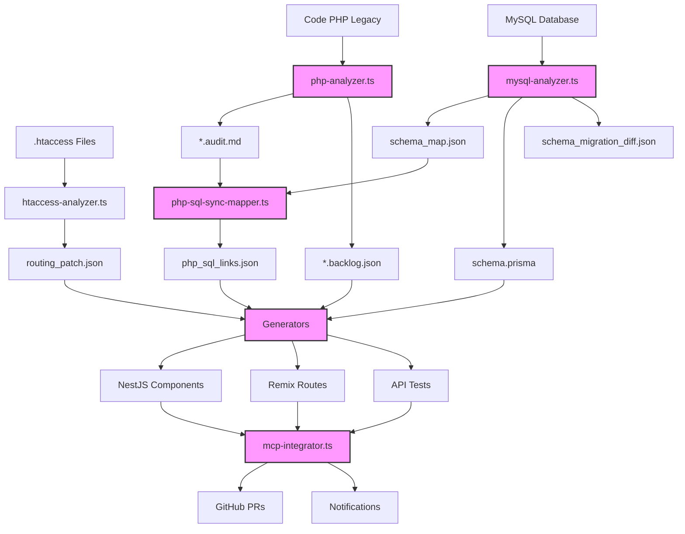

# 🏗️ Architecture Complète et Intelligente

## 🔄 Objectif

Assurer une synchronisation fiable, traçable et automatisée entre l'ancien code PHP, la base MySQL, le nouveau modèle Prisma et les agents de migration.

## 📊 Vue d'ensemble



## 📌 Composants Stratégiques

| Composant | Rôle | Généré par | Format |
|-----------|------|------------|--------|
| 🔍 mysql.sql | Dump de référence de la base MySQL | Export initial | SQL |
| 🧠 schema_map.json | Cartographie structurée des tables, relations, clés étrangères | mysql-analyzer.ts | JSON |
| 🔧 schema.prisma | Schéma cible PostgreSQL | mysql-analyzer+optimizer.ts | Prisma DSL |
| 📊 schema_migration_diff.json | Historique des écarts entre MySQL et Prisma | sql-analyzer.ts | JSON |
| 🧬 *.audit.md | Audit sémantique PHP par fichier | php-analyzer.ts | Markdown |
| 📋 *.backlog.json | Fiche de migration par composant | legacy-discovery.ts | JSON |
| 🔗 php_sql_links.json | Mapping champs PHP ↔ SQL ↔ Prisma | php-sql-sync-mapper.ts | JSON |
| 🧭 routing_patch.json | Correspondances de routes .htaccess vers Remix/NestJS | htaccess-analyzer.ts | JSON |
| 📢 Notifications | Push PR GitHub + alertes n8n | mcp-integrator.ts | GitHub/Slack/Email |

## 🔍 Détail des composants stratégiques

### 1. mysql.sql & schema_map.json

Le dump MySQL sert de référence pour l'ensemble du processus de migration. Il est analysé pour générer une représentation structurée des tables, relations et contraintes.

**Exemple de schema_map.json:**

```json
{
  "tables": [
    {
      "name": "products",
      "columns": [
        {
          "name": "id",
          "type": "int",
          "nullable": false,
          "primary": true,
          "autoIncrement": true
        },
        {
          "name": "name",
          "type": "varchar(255)",
          "nullable": false
        },
        {
          "name": "description",
          "type": "text",
          "nullable": true
        },
        {
          "name": "price",
          "type": "decimal(10,2)",
          "nullable": false
        },
        {
          "name": "category_id",
          "type": "int",
          "nullable": true,
          "references": {
            "table": "categories",
            "column": "id"
          }
        }
      ],
      "indexes": [
        {
          "name": "PRIMARY",
          "columns": ["id"],
          "unique": true
        },
        {
          "name": "idx_category",
          "columns": ["category_id"]
        }
      ],
      "foreignKeys": [
        {
          "name": "fk_product_category",
          "columns": ["category_id"],
          "referencedTable": "categories",
          "referencedColumns": ["id"],
          "onDelete": "SET NULL",
          "onUpdate": "CASCADE"
        }
      ]
    }
  ]
}
```

### 2. schema.prisma & schema_migration_diff.json

Le schéma Prisma est généré à partir de l'analyse du dump MySQL, avec optimisations pour PostgreSQL. Les différences sont tracées dans schema_migration_diff.json.

**Exemple de schema.prisma:**

```prisma
generator client {
  provider = "prisma-client-js"
}

datasource db {
  provider = "postgresql"
  url      = env("DATABASE_URL")
}

model Product {
  id          Int       @id @default(autoincrement())
  name        String
  description String?   @db.Text
  price       Decimal   @db.Decimal(10, 2)
  categoryId  Int?      @map("category_id")
  createdAt   DateTime  @default(now()) @map("created_at")
  updatedAt   DateTime  @updatedAt @map("updated_at")
  
  category    Category? @relation(fields: [categoryId], references: [id], onDelete: SetNull)
  orderItems  OrderItem[]
  
  @@index([categoryId])
  @@map("products")
}
```

**Exemple de schema_migration_diff.json:**

```json
{
  "changes": [
    {
      "type": "addColumn",
      "table": "products",
      "column": "created_at",
      "details": {
        "type": "TIMESTAMP",
        "nullable": false,
        "default": "NOW()"
      }
    },
    {
      "type": "addColumn",
      "table": "products",
      "column": "updated_at",
      "details": {
        "type": "TIMESTAMP",
        "nullable": false,
        "default": "NOW()"
      }
    },
    {
      "type": "modifyIndex",
      "table": "products",
      "index": "idx_category",
      "details": {
        "original": { "type": "BTREE" },
        "modified": { "type": "HASH" }
      }
    }
  ]
}
```

### 3. *.audit.md & php_sql_links.json

Les fichiers d'audit contiennent l'analyse sémantique du code PHP, tandis que php_sql_links.json établit la correspondance entre les champs PHP et SQL.

**Exemple d'extrait de product.php.audit.md:**

```markdown
# Audit: product.php

## SQL Queries

```php
$query = "SELECT p.*, c.name as category_name 
          FROM products p 
          LEFT JOIN categories c ON p.category_id = c.id 
          WHERE p.id = " . $productId;
```

## Fields Used:

- products.id
- products.name
- products.description
- products.price
- products.category_id
- categories.name (as category_name)

## Logic Blocks:

1. **Product Retrieval**: Lines 15-27
2. **Price Calculation**: Lines 30-42
3. **Stock Verification**: Lines 45-57
```

**Exemple de php_sql_links.json:**

```json
{
  "product.php": {
    "sqlQueries": [
      {
        "lineNumber": 18,
        "tables": ["products", "categories"],
        "fields": {
          "products": ["id", "name", "description", "price", "category_id"],
          "categories": ["name"]
        },
        "joins": [
          {
            "type": "LEFT",
            "table1": "products",
            "alias1": "p",
            "table2": "categories",
            "alias2": "c",
            "condition": "p.category_id = c.id"
          }
        ],
        "conditions": [
          {
            "field": "products.id",
            "operator": "=",
            "value": "variable:productId"
          }
        ]
      }
    ],
    "variableMappings": {
      "product": {
        "id": "products.id",
        "name": "products.name",
        "description": "products.description",
        "price": "products.price",
        "category_id": "products.category_id",
        "category_name": "categories.name"
      }
    }
  }
}
```

## 🚀 Améliorations Clés

### ✅ 1. Synchronisation Totale PHP ↔ SQL ↔ Prisma

- Automatisée avec sync-mapper.ts
- Génère des patchs JSON traçables
- Permet de maintenir les slugs SEO, identifiants legacy, et données critiques

La synchronisation est bidirectionnelle, permettant d'assurer que tous les champs utilisés dans le code PHP sont correctement mappés vers les modèles Prisma.

```json
// Exemple de patch généré par sync-mapper.ts
{
  "model": "Product",
  "changes": [
    {
      "type": "addField",
      "field": "legacyId",
      "definition": "String? @map(\"legacy_id\")",
      "reason": "Maintien de la compatibilité avec l'ancien système"
    },
    {
      "type": "addField",
      "field": "slug",
      "definition": "String @unique",
      "reason": "Préservation des URLs SEO existantes"
    }
  ]
}
```

### ✅ 2. Historisation et Contrôle Fin

- Chaque fichier .audit.md est versionné
- Tous les changements structuraux (SQL ou logique) sont comparés automatiquement
- Génération de changelog automatique sur chaque PR

Cela permet de suivre précisément l'évolution de la migration et de détecter rapidement les régressions ou les écarts.

```markdown
# Changelog automatique - Product Module

## Changements structurels
- ✅ Ajout de `created_at` et `updated_at` à la table products
- ✅ Optimisation de l'index `idx_category` (BTREE → HASH)
- ✅ Conversion des champs TEXT → VARCHAR(max) pour performance

## Logique métier
- ✅ Migration du calcul de prix avec remise → PricingService
- ✅ Conversion de la vérification de stock en middleware NestJS
- ⚠️ Modification du comportement de rupture de stock (exception vs retour null)
```

### ✅ 3. Suivi Centralisé Multi-Format

- Suivi GitHub (Pull Request, Commit, Branch par fichier)
- Suivi Dashboard Remix ou Notion avec status, erreurs, couverture
- Génération de fiche.final.md + confirmed_files.json pour archivage post-merge

Le suivi centralisé permet à chaque membre de l'équipe de comprendre l'état global de la migration à tout moment.

```json
// Exemple de confirmed_files.json
{
  "modules": [
    {
      "name": "products",
      "status": "completed",
      "completedAt": "2025-04-10T14:23:45Z",
      "files": [
        {
          "source": "product.php",
          "target": [
            "src/products/products.service.ts",
            "src/products/products.controller.ts",
            "app/routes/products.$id.tsx"
          ],
          "testCoverage": 92,
          "reviewedBy": "John Doe",
          "reviewDate": "2025-04-09T16:30:12Z"
        }
      ],
      "pullRequest": "https://github.com/org/repo/pull/123"
    }
  ]
}
```

### ✅ 4. Notifications et Automatisation

- Push vers GitHub orchestré par mcp-integrator.ts
- Notification via n8n à chaque étape critique:
  - Nouvelle analyse
  - Diff détecté
  - Code généré
  - PR ouverte ou fusionnée

Ces notifications maintiennent toute l'équipe informée de l'avancement et des potentiels blocages.

## 💡 Astuces Avancées

| Astuce | Bénéfice |
|--------|----------|
| 🧪 Intégrer prisma db pull + db push simulé | Comparaison live et simulation sans risque |
| 📁 Utiliser git worktree pour isoler les branches de migration | CI/CD stable et rollbackable |
| 🌐 Générer un dashboard HTML + JSON avec tous les liens (audit, PR, migration) | Lecture offline + archivage |
| 🛡️ Ajouter checksum MD5 sur chaque .prisma ou .tsx généré | Détection de modifications non trackées |

## 🔍 Exemple d'implémentation de checksum

```typescript
// Fonction d'ajout de checksum aux fichiers générés
import * as crypto from 'crypto';
import * as fs from 'fs';

function addChecksumToFile(filePath: string) {
  const content = fs.readFileSync(filePath, 'utf8');
  const checksum = crypto.createHash('md5').update(content).digest('hex');
  
  // Ajouter le checksum en commentaire selon le type de fichier
  const fileExtension = filePath.split('.').pop();
  let checksumComment = '';
  
  switch (fileExtension) {
    case 'tsx':
    case 'ts':
      checksumComment = `// @generated checksum: ${checksum}\n`;
      break;
    case 'prisma':
      checksumComment = `// @generated checksum: ${checksum}\n`;
      break;
    default:
      checksumComment = `<!-- @generated checksum: ${checksum} -->\n`;
  }
  
  // Écrire le contenu avec le checksum
  fs.writeFileSync(filePath, checksumComment + content);
  
  return checksum;
}
```

## 📋 Surveillance de modifications non trackées

```typescript
// Fonction de vérification d'intégrité des fichiers générés
function verifyFileIntegrity(filePath: string): boolean {
  const content = fs.readFileSync(filePath, 'utf8');
  
  // Extraire le checksum du fichier
  const checksumMatch = content.match(/@generated checksum: ([a-f0-9]{32})/);
  if (!checksumMatch) {
    console.error(`No checksum found in ${filePath}`);
    return false;
  }
  
  const storedChecksum = checksumMatch[1];
  
  // Calculer le checksum du contenu sans la ligne de checksum
  const contentWithoutChecksum = content.replace(/\/\/ @generated checksum: [a-f0-9]{32}\n/, '');
  const actualChecksum = crypto.createHash('md5').update(contentWithoutChecksum).digest('hex');
  
  if (storedChecksum !== actualChecksum) {
    console.error(`Checksum mismatch in ${filePath}:`);
    console.error(`  Stored:  ${storedChecksum}`);
    console.error(`  Actual:  ${actualChecksum}`);
    return false;
  }
  
  return true;
}
```

Cette architecture complète et intelligente forme un système robuste pour la migration, avec des vérifications automatisées à chaque étape, une traçabilité totale et une adaptabilité aux spécificités du projet.
