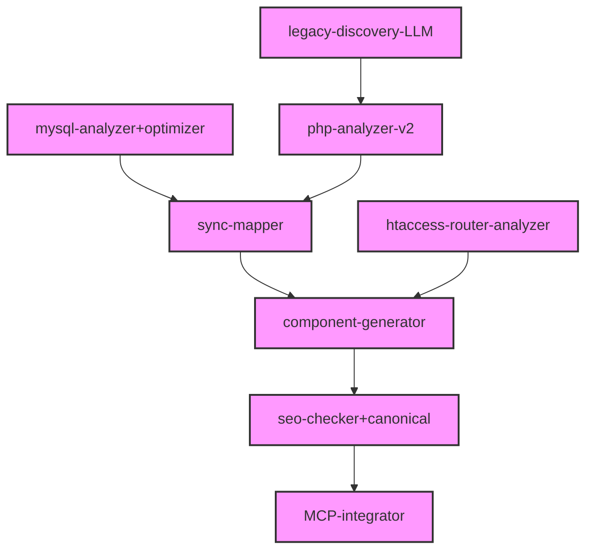
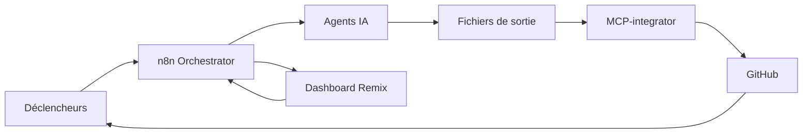
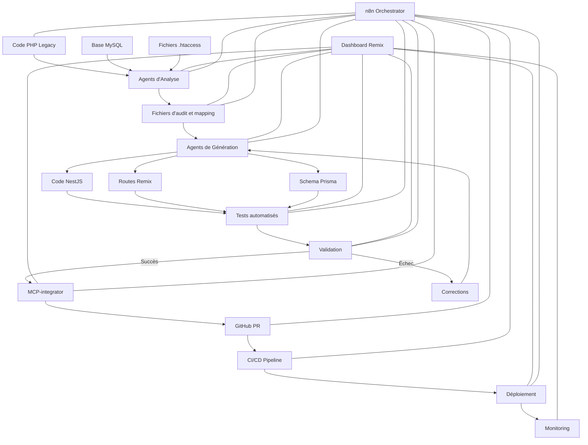

# 🚀 Synthèse Finale - Pipeline de Migration PHP → NestJS + Remix + PostgreSQL

Ce document présente la synthèse finale des améliorations apportées au pipeline de migration, offrant une vision complète, automatisée et pilotable via MCP, n8n et un dashboard Remix.

## ✅ 1. Architecture Intelligente et Traçable

L'architecture du pipeline repose sur un ensemble de fichiers stratégiques qui assurent la traçabilité et la cohérence tout au long du processus de migration :

| Élément | Description |
|---------|-------------|
| mysql.sql | Dump de référence de la base PHP |
| schema.prisma | Généré automatiquement à partir du SQL |
| schema_migration_diff.json | Historique détaillé des écarts SQL → Prisma |
| *.audit.md | Audit complet de chaque fichier PHP |
| fiche.backlog.json | Suivi des tâches de migration à l'échelle fichier |
| fiche.impact_graph.json | Dépendances métier-technique du fichier |
| migration_patch.json | Mapping dynamique SQL ↔ Prisma ↔ PHP |

Cette architecture assure une traçabilité complète depuis le code PHP original jusqu'aux composants NestJS et Remix générés, avec une documentation détaillée à chaque étape.

## 🔁 2. Synchronisation complète et versionnée

### Enrichissement de schema_migration_diff.json :

- Ajout des versions source/cible
- Horodatage, auteur (agent), motif du changement
- Champ : ancien nom → nouveau nom, typage modifié, contrainte ajoutée

```json
{
  "metadata": {
    "source": {
      "type": "MySQL",
      "dump_hash": "f5a2b7e...d9c",
      "extracted_at": "2025-04-17T10:30:00Z"
    },
    "target": {
      "type": "Prisma",
      "version": "v2.1.0",
      "generated_at": "2025-04-17T10:31:22Z"
    },
    "diff_id": "schema_diff_20250417_103000",
    "detected_by": "mysql-analyzer+optimizer",
    "confirmed_by": "ak125"
  },
  "tables": [
    {
      "name": "products",
      "columns": [
        {
          "column": "prix",
          "change": "renamed",
          "from": "prix",
          "to": "price",
          "reason": "standardisation anglais",
          "agent": "sync-mapper",
          "timestamp": "2025-04-17T10:30:45Z"
        }
      ]
    }
  ]
}
```

### Génération automatique de migration_patch.json :

Pour chaque fichier :
- Champs SQL touchés
- Actions à entreprendre (migration, test, révision)
- État (à valider, validé, en attente)
- Responsable assigné

```json
{
  "source_file": "src/products/view.php",
  "status": "validated",
  "reviewer": "jsmith",
  "last_update": "2025-04-17T14:25:00Z",
  "mappings": [
    {
      "sql_column": "prix",
      "legacy_php_var": "$product['prix']",
      "prisma_model": "Product",
      "prisma_field": "price",
      "change_type": "rename",
      "reason": "standardisation anglais",
      "confidence": 0.95,
      "verified": true
    }
  ]
}
```

## 🤖 3. Agents IA spécialisés (modularisés)

Le pipeline s'appuie sur un ensemble d'agents IA spécialisés, chacun ayant un rôle précis dans le processus de migration :

| Agent | Fonction |
|-------|----------|
| legacy-discovery-LLM | Détecte les fichiers critiques à migrer |
| php-analyzer-v2 | Analyse logique métier, dépendances, SQL |
| mysql-analyzer+optimizer | Génère Prisma et suggestions de normalisation |
| sync-mapper | Correspondance automatique entre champs |
| htaccess-router-analyzer | Conversion intelligente des routes Apache |
| component-generator | Génère tous les composants Remix/NestJS |
| seo-checker+canonical | Assure le SEO et les balises correctes |
| MCP-integrator | Automatisation PR, commit, suivi GitHub |

Ces agents communiquent entre eux via des fichiers JSON standardisés, permettant une chaîne de traitement cohérente et traçable.



## 📊 4. Orchestration avancée (n8n + MCP)

L'orchestration du pipeline est assurée par n8n en combinaison avec MCP (Model Context Protocol) :

- **Exécutions planifiées** : cron, push GitHub, run manuelle
- **Suivi des états** : pour chaque fichier, PR, audit, test
- **Reprise sur erreur automatique** (logs complets)
- **Dashboard Remix** : visualisation par module, table, route, SEO, tests

Cette orchestration permet un suivi précis de l'état de la migration, avec une visibilité complète sur chaque étape et la possibilité d'intervention manuelle si nécessaire.



## 📁 5. Dashboard et Visualisation

Le composant `dashboard.tsx` de Remix React permet de suivre :

- État des audits
- Statut de migration
- Résultat des tests (via qa-checklist.ts)
- Anomalies SEO détectées

Cette interface centralise toutes les informations essentielles pour le suivi du projet de migration et permet d'intervenir rapidement en cas de problème.

```tsx
// Exemple simplifié de dashboard.tsx
<div className="dashboard-container">
  <div className="stats-overview">
    <StatsCard title="Fichiers PHP" value={statsData.phpFiles} />
    <StatsCard title="Fichiers migrés" value={statsData.migratedFiles} />
    <StatsCard title="Tests réussis" value={`${statsData.passedTests}/${statsData.totalTests}`} />
    <StatsCard title="Score SEO" value={`${statsData.seoScore}/100`} />
  </div>
  
  <div className="migration-progress">
    <h2>Progression par module</h2>
    <ProgressBars data={moduleProgress} />
  </div>
  
  <div className="quality-metrics">
    <h2>Métriques de qualité</h2>
    <QualityGauges data={qualityMetrics} />
  </div>
  
  <div className="recent-activity">
    <h2>Activité récente</h2>
    <ActivityFeed activities={recentActivities} />
  </div>
</div>
```

## 🧠 Astuces avancées recommandées

| Sujet | Astuce |
|-------|--------|
| Prisma | Utiliser prisma db pull et prisma db diff pour validation |
| CI/CD | Activer ci-tester.ts pour chaque PR migrée |
| SEO | Valider avec Lighthouse (seo-checker+canonical) |
| Rétrocompatibilité | Intégrer les anciens slugs/urls dans les modèles Prisma (slug-preserver.ts) |
| Monitoring | Ajouter Prometheus + Grafana pour les routes critiques |

## 🔍 Schéma global du pipeline



Ce pipeline complet de migration offre une solution robuste, traçable et hautement automatisée pour migrer des applications PHP legacy vers une architecture moderne NestJS + Remix + PostgreSQL, tout en préservant les fonctionnalités métier, le SEO et l'expérience utilisateur.
